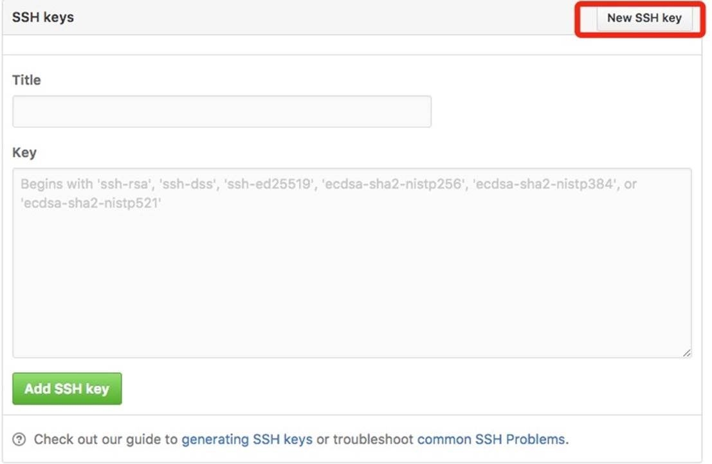
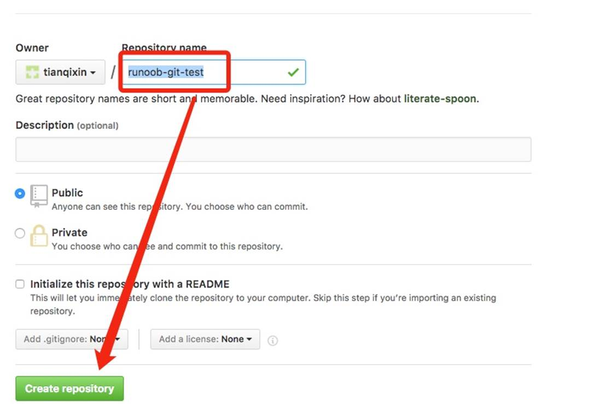
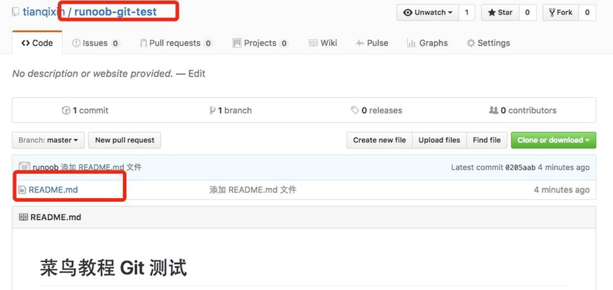

### 剪辑到菜鸟git

Git 并不像 SVN 那样有个中心服务器。 

目前我们使用到的 Git 命令都是在本地执行，如果你想通过 Git 分享你的代码或者与其他开发人员合作。 你就需要将数据放到一台其他开发人员能够连接的服务器上。

本例使用了 Github 作为远程仓库，你可以先阅读我们的 [Github 简明教程。](http://www.runoob.com/w3cnote/git-guide.html) 


**添加远程库**

要添加一个新的远程仓库，可以指定一个简单的名字，以便将来引用,命令格式如下：

```
git remote add [shortname] [url] 
```

本例以 Github 为例作为远程仓库，如果你没有 Github 可以在官网 https://github.com/注册。

由于你的本地 Git 仓库和 GitHub 仓库之间的传输是通过SSH加密的，所以我们需要配置验证信息：

使用以下命令生成 SSH Key：

$ ssh-keygen -t rsa -C "[youremail@example.com](mailto:youremail@example.com)" 

后面的 [**your_email@youremail.com**](mailto:your_email@youremail.com) 改为你在 Github 上注册的邮箱，之后会要求确认路径和输入密码，我们这使用默认的一路回车就行。

成功的话会在 **~/** 下生成 **.ssh** 文件夹，进去，打开 **id_rsa.pub**，复制里面的 **key**。

```
$ ssh-keygen -t rsa -C "[429240967@qq.com](mailto:429240967@qq.com)"
 Generating public/private rsa key pair.
 Enter file in which to save the key (/Users/tianqixin/.ssh/id_rsa): 
 Enter passphrase (empty for no passphrase):  # 直接回车
 Enter same passphrase again:          # 直接回车
 Your identification has been saved in /Users/tianqixin/.ssh/id_rsa.
 Your public key has been saved in /Users/tianqixin/.ssh/id_rsa.pub.
 The key fingerprint is:
 SHA256:MDKVidPTDXIQoJwoqUmI4LBAsg5XByBlrOEzkxrwARI [429240967@qq.com](mailto:429240967@qq.com)
 The key's randomart image is:
 +---[RSA 3072]----+
 |E*+.+=**oo    |
 |%Oo+oo=o. .   |
 |%**.o.o.     |
 |OO. o o     |
 |+o+   S    |
 |.        |
 |         |
 |         |
 |         |
 +----[SHA256]-----+ 
```

回到 github 上，进入 Account => Settings（账户配置）。

左边选择 **SSH and GPG keys**，然后点击 **New SSH key** 按钮,title 设置标题，可以随便填，粘贴在你电脑上生成的 key。



添加成功后界面如下所示 


为了验证是否成功，输入以下命令：

```
$ ssh -T [git@github.com](mailto:git@github.com)
 The authenticity of host 'github.com (52.74.223.119)' can't be established.
 RSA key fingerprint is SHA256:nThbg6kXUpJWGl7E1IGOCspRomTxdCARLviKw6E5SY8.
 Are you sure you want to continue connecting (yes/no/[fingerprint])? yes          # 输入 yes
 Warning: Permanently added 'github.com,52.74.223.119' (RSA) to the list of known hosts.
 Hi tianqixin! You've successfully authenticated, but GitHub does not provide shell access. # 成功信息 
```

以下命令说明我们已成功连上 Github。

之后登录后点击" New repository " 如下图所示：


之后在在Repository name 填入 runoob-git-test(远程仓库名) ，其他保持默认设置，点击"Create repository"按钮，就成功地创建了一个新的Git仓库：



创建成功后，显示如下信息：


以上信息告诉我们可以从这个仓库克隆出新的仓库，也可以把本地仓库的内容推送到GitHub仓库。

现在，我们根据 GitHub 的提示，在本地的仓库下运行命令：

```
$ mkdir runoob-git-test           # 创建测试目录
 $ cd runoob-git-test/            # 进入测试目录
 $ echo "# 菜鸟教程 Git 测试" >> README.md   # 创建 README.md 文件并写入内容
 $ ls                    # 查看目录下的文件
 README
 $ git init                 # 初始化
 $ git add README.md             # 添加文件
 $ git commit -m "添加 README.md 文件"    # 提交并备注信息
 [master (root-commit) 0205aab] 添加 README.md 文件
 1 file changed, 1 insertion(+)
 create mode 100644 README.md

 \# 提交到 Github
 $ git remote add origin [git@github.com:tianqixin/runoob-git-test.git](mailto:git@github.com:tianqixin/runoob-git-test.git)
 $ git push -u origin master 
```

以下命令请根据你在Github成功创建新仓库的地方复制，而不是根据我提供的命令，因为我们的Github用户名不一样，仓库名也不一样。

接下来我们返回 Github 创建的仓库，就可以看到文件已上传到 Github上：



**查看当前的远程库**

要查看当前配置有哪些远程仓库，可以用命令：

```
git remote 
```

**实例**

```
$ git remote
 origin
 $ git remote -v
 origin  [git@github.com:tianqixin/runoob-git-test.git](mailto:git@github.com:tianqixin/runoob-git-test.git) (fetch)
 origin  [git@github.com:tianqixin/runoob-git-test.git](mailto:git@github.com:tianqixin/runoob-git-test.git) (push) 
```

执行时加上 -v 参数，你还可以看到每个别名的实际链接地址。

**提取远程仓库**

Git 有两个命令用来提取远程仓库的更新。

1、从远程仓库下载新分支与数据：

```
git fetch 
```

该命令执行完后需要执行 git merge 远程分支到你所在的分支。

2、从远端仓库提取数据并尝试合并到当前分支：

```
git merge 
```

该命令就是在执行 **git fetch** 之后紧接着执行 **git merge** 远程分支到你所在的任意分支。


假设你配置好了一个远程仓库，并且你想要提取更新的数据，你可以首先执行 **git fetch [alias]** 告诉 Git 去获取它有你没有的数据，然后你可以执行 **git merge [alias]/[branch]** 以将服务器上的任何更新（假设有人这时候推送到服务器了）合并到你的当前分支。

接下来我们在 Github 上点击" README.md" 并在线修改它: 


然后我们在本地更新修改。

```
$ git fetch origin
 remote: Counting objects: 3, done.
 remote: Compressing objects: 100% (2/2), done.
 remote: Total 3 (delta 0), reused 0 (delta 0), pack-reused 0
 Unpacking objects: 100% (3/3), done.
 From github.com:tianqixin/runoob-git-test
  0205aab..febd8ed master   -> origin/master 

以上信息"0205aab..febd8ed master -> origin/master" 说明 master 分支已被更新，我们可以使用以下命令将更新同步到本地：

$ git merge origin/master
 Updating 0205aab..febd8ed
 Fast-forward
 README.md | 1 +
 1 file changed, 1 insertion(+) 

查看 README.md 文件内容：

$ cat README.md 
 \# 菜鸟教程 Git 测试
 \## 第一次修改内容 
```

**推送到远程仓库**

推送你的新分支与数据到某个远端仓库命令:

```
git push [alias] [branch] 

以上命令将你的 [branch] 分支推送成为 [alias] 远程仓库上的 [branch] 分支，实例如下。

$ touch runoob-test.txt   # 添加文件
 $ git add runoob-test.txt 
 $ git commit -m "添加到远程"
 master 69e702d] 添加到远程
 1 file changed, 0 insertions(+), 0 deletions(-)
 create mode 100644 runoob-test.txt

 $ git push origin master  # 推送到 Github 
```

重新回到我们的 Github 仓库，可以看到文件已经提交上来了：


**删除远程仓库**

**删除远程仓库你可以使用命令：**

```
git remote rm [别名] 
```

**实例**

```
$ git remote -v
 origin  [git@github.com:tianqixin/runoob-git-test.git](mailto:git@github.com:tianqixin/runoob-git-test.git) (fetch)
 origin  [git@github.com:tianqixin/runoob-git-test.git](mailto:git@github.com:tianqixin/runoob-git-test.git) (push)

 \# 添加仓库 origin2
 $ git remote add origin2 [git@github.com:tianqixin/runoob-git-test.git](mailto:git@github.com:tianqixin/runoob-git-test.git)

 $ git remote -v
 origin  [git@github.com:tianqixin/runoob-git-test.git](mailto:git@github.com:tianqixin/runoob-git-test.git) (fetch)
 origin  [git@github.com:tianqixin/runoob-git-test.git](mailto:git@github.com:tianqixin/runoob-git-test.git) (push)
 origin2  [git@github.com:tianqixin/runoob-git-test.git](mailto:git@github.com:tianqixin/runoob-git-test.git) (fetch)
 origin2  [git@github.com:tianqixin/runoob-git-test.git](mailto:git@github.com:tianqixin/runoob-git-test.git) (push)

 \# 删除仓库 origin2
 $ git remote rm origin2
 $ git remote -v
 origin  [git@github.com:tianqixin/runoob-git-test.git](mailto:git@github.com:tianqixin/runoob-git-test.git) (fetch)
 origin  [git@github.com:tianqixin/runoob-git-test.git](mailto:git@github.com:tianqixin/runoob-git-test.git) (push)  
```

