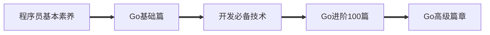

# 菜鸟的成长手册

## 🧭 导航

+ 🔍[**快速指南(wike) — 仓库总结**](https://github.com/3293172751/Block_Chain/wiki)

+ 🔗[**中国大陆加速地址（Gitee平台）**](https://gitee.com/xxw3293172751/Block_Chain)

+ 📵[**不限速在线个人云盘**](https://xxw.nsddd.top/s/wRSz)

  

  
  
  
  
  
  

	<a href = "https://github.com/3293172751/cs-awesome-Block_Chain">🅱️GitHub</a>
	&emsp;&emsp; | &emsp;&emsp;
	<a href="https://interview.huihut.com">📚DocCub</a>

	<a href = "readme_english.md">🔤English</a>
	&emsp;&emsp; | &emsp;&emsp;
	<a href = "README.md">🆑中文CN</a>

 

<b>💡 关于（先看❗）</b>

<a href='https://www.facebook.com/profile.php?id=100034435372354'>Facebook</a> | <a href='https://telsacoin.io/'>Website</a> | <a href='http://nsddd.top'>Blog</a> | <a href='https://t.me/smile3293172751'>Telegram</a> | <a href='https://twitter.com/xxw3293172751'>Twitter</a> | <a href='https://www.linkedin.cn/injobs/in/xiongxinwei-xiong-7606a0227'>Linkedin</a> | <a href='https://liberapay.com/xiongxinwei/donate'>Donate</a>

 ⚠️ 这是一个菜鸟的成长记录，如果你也想成为工程师，想从事后端的相关工作，或者想了解区块链的相关知识，那么它可以帮助到你😎 —>  <b>喜欢请给个⭐收藏~</b>

 🐧 喜欢*Go*语言的朋友欢迎加入*Go*语言自学群（*QQ*群号：[141984758](https://qm.qq.com/cgi-bin/qm/qr?k=ZZnzhuU8uGmIKT5btI9uiCRpasUeD8e2&jump_from=webapi&authKey=x1/NMrS1KpK7N8Rvj4IfLcKYSWnjtElgU6a3ubin1JmtReyuoIlyE/ZJ0VRlK25n)）

 ⛓️ <b>区块链技术（也称之为分布式账本技术）</b>，是一种互联网数据库技术，其特点是去中心化，公开透明，信息不可篡改性，隐私匿名性🤑<a href="https://github.com/C-UB">CUB链学社</a>致力打造<b>区块链自学教育平台。</b>

💡 侧边目录支持方式：[📚 DocCub 文档](https://go.nsddd.top)、🗃️[Github + TOC 导航](http://sm.nsddd.top/sm20221004130721.png?xxw@nsddd.top)， 😍 甚至你可以在这个界面按下`.` ➡️ [进入vscode编译环境](https://nsddd.top/archives/githubdev) 

👣 存在数学公式无法正常显示问题，强烈推荐[:triangular_ruler: MathJax Plugin for Github](https://chrome.google.com/webstore/detail/mathjax-plugin-for-github/ioemnmodlmafdkllaclgeombjnmnbima) 插件使用。

📄 保存为 PDF 方式：使用 Chrome 浏览器打开 <a href="https://go.nsddd.top">📚 DocCub 文档</a> 页面，缩起左侧目录-右键 - 打印 - 选择目标打印机是另存为PDF - 保存  —— [🖨️以Go语言第一节打印效果预览.pdf](./images/copy.pdf)）

🙏 仓库内容如有错误或改进欢迎 [issue](https://github.com/3293172751/cs-awesome-Block_Chain/issues) 或 pr，[🧷参与贡献](https://nsddd.top/archives/contributors)，建议或讨论可在 [#10](https://github.com/3293172751/cs-awesome-Block_Chain/issues/10) 提出。由于本人水平有限，仓库中的知识点有来自本人原创、读书笔记、书籍、博文等，非原创均已标明出处，如有遗漏，请 [issue](https://github.com/3293172751/cs-awesome-Block_Chain/issues/new/choose) 提出。本仓库遵循 [CC BY-NC-SA 4.0（署名 - 非商业性使用 - 相同方式共享）](https://github.com/huihut/interview/blob/master/LICENSE) 协议，转载请注明出处，不得用于商业目的。

 

## 🔥 CubDoc推出

🈺 存在`GitHub`上浏览效果不佳，[Cub链学社](https://github.com/C-UB)推出`CubDoc`文档形式，使用`vuejs`渲染 。使用国内的服务器搭建（速度嘎快:bullettrain_front:) 。目前支持以下的项目🗃️：

+ [x] [:speedboat: Go语言基础-进阶](https://go.nsddd.top)

+ [x] [:speedboat: docker & k8s & 云原生](https://docker.nsddd.top)

 

## 🗓️ Cub知乎精选

[][zhihu] 

[zhihu]: https://www.zhihu.com/people/3293172751

<b>📚 知乎专栏订阅（每周更新❗）</b>

 
🔥 知乎专栏<b>每个工作日11：59自动更新一次（actions部署）</b> ，喜欢文章关注点赞👍噢~

<!-- BLOG-POST-LIST:START -->
- [Go语言框架三件套（Web/RPC/GORM&rpar;](https://zhuanlan.zhihu.com/p/601286934)
- [GitHub CLI 命令行工具（gh&rpar;](https://zhuanlan.zhihu.com/p/601200139)
- [项目管理从理论到实践（含GitHub Projects）](https://zhuanlan.zhihu.com/p/598930020)
- [kubernetes 源码解析资源](https://zhuanlan.zhihu.com/p/597276550)
- [用于本地实验的小型 Kubernetes：k0s、MicroK8s、kind、k3s 和 Minikube](https://zhuanlan.zhihu.com/p/594206344)
- [Go genericity、Workspaces、Fuzz测试](https://zhuanlan.zhihu.com/p/586367554)
- [使用sealos搭建k8s](https://zhuanlan.zhihu.com/p/576388662)
- [常用命令行替代](https://zhuanlan.zhihu.com/p/576392923)
- [在线vscode完成贡献和阅读](https://zhuanlan.zhihu.com/p/576392446)
- [k8s集群搭建记录](https://zhuanlan.zhihu.com/p/576388231)
- [Cubos&lpar;幼兽os）开发准备~](https://zhuanlan.zhihu.com/p/574430945)
- [c-universal blockchain&lpar;链学社）白皮书](https://zhuanlan.zhihu.com/p/572220389)
- [计算机寒冬，选择考研？](https://zhuanlan.zhihu.com/p/569740306)
- [java位运算以及补码重点详解](https://zhuanlan.zhihu.com/p/568911111)
- [不一样的Linux（基础--&gt;超阶） -- 选自github](https://zhuanlan.zhihu.com/p/568581434)
- [Java笔记-基础到web、框架（选自github）](https://zhuanlan.zhihu.com/p/568570282)
- [使用hugo搭建个人博客](https://zhuanlan.zhihu.com/p/568561676)
- [强烈推荐GitHub学习仓库](https://zhuanlan.zhihu.com/p/566171053)
- [go语言入门到进阶](https://zhuanlan.zhihu.com/p/561969119)
<!-- BLOG-POST-LIST:END -->

 

## 📖 Go语言

#### 🏷️前言

`Go`语言的学习参考官网文档[go语言官方编程指南](https://golang.org/#)，如何找到合适的Go语言学习路线[Go语言路线](go-advancend/go_route.md)（🎈 含有大量的Go语言项目资源、线上资源收集）。

+ 🔱[go语言官方编程指南](https://golang.org/#)  

+ 🚧[Go语言路线和资源征集(update 2023)](go-advancend/go_route.md)

#### 🔖核心

**Go语言的核心编程篇，基础部分30天记录，100篇进阶，还有正在进展的高级篇~**

⚠️ 目前已全部迁移至 ➡️ [CubDoc🧷](https://go.nsddd.top/)

+ [x] [🖱️GO 基础部分🔥](TOC.md)
+ [x] [🖱️Go语言100篇进阶🔥](Gomd_super/README.md)
+ [x] [🖱️Go 高级篇](go-advancend/README.md)

#### 📝补充

`mod`包是`Go`语言2018年推出的包管理工具，并会一直延续下去。命名规范以及项目目录结构📇的设定对于一名合格的工程师来说也是非常重要的。下面是作为一名合格的开发者🤵，必须要会的基本素养。

+ [🖱️Go语言包管理工具 — mod包](Gomd_super/mod.md)

+ [🖱️Go-air实现热加载编译](Gomd_super/go-air.md)

+ [🖱️命名规则和代码规范](Gomd_super/name.md)

+ 🖱️[Go语言目录结构](Gomd_super/catalogue.md)

+ 🖱️[Go文件以及编码处理](Gomd_super/go_file.md)

+ 🖱️[正则表达式](Gomd_super/zhenze.md)

+ 🖱️[位运算技巧](Gomd_super/bitwise.md)

> Go语言一些其他的网站和博客，值得一看
>
> + [Go语言面试题](https://www.topgoer.cn/docs/gomianshiti/mianshiti)
> + [Go语言中文官方文档](http://word.topgoer.com/)
> + [Go语言专家编程地址](http://wen.topgoer.com/docs/gozhuanjia/gogfjhk)

 

## 📚 CS系列

CS 系列选自[🎉awesome-cs-course](https://github.com/3293172751/awesome-cs-course)，内容涵盖 计算机操作系统、csapp系列、算法和数据结构、计算机网络、`linux`、`java`、`python`、`C/C++`、`vuepress`、`gitbook`、`nodejs`、`vuejs`、`halo`、`redis`、`hugo`、`nginx`、`nosql`、`mysql`、`JavaScript`、`git`、`markdown`、`web`前端等笔记，更多移步到[AWESOME系列CS仓库地址](https://github.com/3293172751/CS_COURSE)

+ [x] [Java全册☕](https://github.com/3293172751/awesome-cs-course/blob/master/java/README.md)

+ [x] [汇编学习🔥](汇编/README.md)

+ [x] [软件工程](./软件工程&系统设计和架构/README.md)

+ [x] [算法与数据结构（LeetCode刷题记录）🔥](https://github.com/3293172751/LeetCode/)

+ [x] [计算机网络🔥](./web/README.md)

+ [x] [操作系统 — OS🔥](https://github.com/3293172751/os)

+ [x] [CS必须要会的技术🔥](cs/README.md)

 

## 📘 开发必备技术

🧋参与普通程序的开发或者是区块链⛓️开发必须[熟悉Linux指令](https://github.com/3293172751/CS_COURSE/blob/master/linux/README.md)，熟悉[git团队开发](https://github.com/3293172751/CS_COURSE/blob/master/Git/README.md)，基于[docker容器](docker/README.md)会让我门快速的搭建工具和环境，更好的迁移开发环境和迁移链码（blockcode)，[密码学和信息安全](cryptology/README.md)不仅仅是区块链工程师必须要学习的技术，更是IT从业者未来不可或缺的技术。我们都渴望系统能更加的安全不是吗📵。

⚠️ `Docker` 、`K8s`、`sealos`、`云原生` 已全部迁移至 ➡️ [CubDoc🧷](https://docker.nsddd.top/)

+ [x] 🖱️ [linux从入门到精通🔥](https://github.com/3293172751/CS_COURSE/blob/master/linux/README.md)

+ [x] 🖱️ [Git—必备神器🔥](https://github.com/3293172751/CS_COURSE/blob/master/Git/README.md)

+ [x] [🖱️ Docker/k8s/云原生🔥](docker/README.md) 

+ [x] [🖱️ 密码学和信息安全🔥](cryptology/README.md)

 

## 📔 区块链导航

我认为世界历史可以用两句话来描述：分久必合，合久必分。区块链将是催化下一个‘合久必分’时代的新技术。区块链的产生铸就了一个新的时代，我们的信念是建筑在一个数学的算法上面，In math we trust。	——张首晟

:spider_web: 这是一个web2的世界，或者很快整个互联网行业都会改革，是的，都会迈入web3的世界

> 🔥 我深以为然：区块链或许不能让这个世界分布化，但是它可以让世界不再有中介。不在会因为你所玩游戏崩溃你就失去了这个游戏~

从事区块链，需要哪些基础知识，看下[区块链开发需要什么](C_Universal_Brockchain\chain.md) ，你需要一份[区块链工程师路线](./blockchain/route.md)，或许你可以在一些区块链项目中找到灵感[🔗区块链公益项目（NFT+私链/联盟链/私链）](blockchain/区块链公益项目/README.md)。区块链的[共识算法](blockchain/README.md)是怎么实现的呢?

+ [x] [🔗区块链工程师路线](./blockchain/route.md)

+ [x] [🔗区块链开发需要什么❓](C_Universal_Brockchain\chain.md)

+ [x] [🔗区块链公益项目（NFT+私链/联盟链/私链）](blockchain/区块链公益项目/README.md)
+ [x] [🔗共识算法——Go语言实现](./blockchain/README.md)

 

## :b: 区块链教程

💱 区块链系列包含了区块链教程，主要是`eth`、`btc`还有联盟链`fabric`超级账本组织的教程，基于这些教程扩展新的技术：`git`、`ipfs`、密码学、共识算法。

📮 这个也是我们`C-UB`社区的最终目的，我们要打造出一个不一样的全民学习平台，将会融合一切新型技术（`ipfs`、`git`、`k8s`、`Kafka`)，基于web3的c-ub社区，属于我们每一个人！或许这将会有能力成为下一个时代的先驱，完全改变人类的协同方式。当人与人之间更信任，效率就会更高。

🚸 以及链学项目[C-Universal Blockchain](https://github.com/c-ub)

> 以太坊和比特币一样，底层框架都是区块链协议，区块链本质上是一个应用了密码学技术的分布式数据库系统。建议看一下 **[以太坊白皮书](https://github.com/ethereum/wiki/wiki/%5B%E4%B8%AD%E6%96%87%5D-%E4%BB%A5%E5%A4%AA%E5%9D%8A%E7%99%BD%E7%9A%AE%E4%B9%A6)（需要有golang编程基础）**
>
> 

> <a href="eth/TOC.md">
> 	
> </a>

+ [x] [🖱️区块链教程🔥](C_Universal_Brockchain/README.md)

+ [x] [🖱️web3，智能合约](eth/README.md)

+ [x] [🖱️区块链技术指南](chainbrock-learning/SUMMARY.md)

> 企业级[区块链实战教程](https://learnblockchain.cn/books/enterprise/)

 

## 🗃️ 项目

⚡[cubgo-os](https://github.com/3293172751/cubgo-os)（幼兽操作系统）由Go语言开发，可以运行基础应用，使用的是热门的命令工具 ~

> 

>   <b>c-universal blockchain（CUB-链学）</b>    
> 

>
> 

> <a href="https://github.com/C-UB">
> 	
> </a>

>
> 基于区块链的全民学习平台`C-Universal Blockchain`在保障用户安全，信息的完整性同时为大众带来更多的选择，笔记分享，视频分享，版权保护，以及其他的关于学信数据、电子证书、荣誉证明、成绩证明、信息授权的相关工具。

+ [ ]  [🧷sealos](https://github.com/3293172751/sealos) 
+ [ ] [ 🧷cubgo-os(未开始)](https://github.com/3293172751/cubgo-os)
+ [x] [ 🧷C-Universal Brockchain（链学）组织地址](https://github.com/C-UB)  |  [ 🧷C-Universal Brockchain](C_Universal_Brockchain/README.md)

 

## ✨ 参与贡献💕

 **[🫵 参与贡献💖❤️‍🩹💓💞](https://nsddd.top/archives/contributors)** 

**[😍 甚至你可以在这个界面按下`.`进入vscode编译环境](https://nsddd.top/archives/githubdev)** 

**要求：**

+ [你需要学会使用markdown🖱️](https://github.com/3293172751/CS_COURSE/blob/master/markdown/README.md)
+ [符合Google代码规范](https://zh-google-styleguide.readthedocs.io/en/latest/google-cpp-styleguide/)

<b>🫡 克隆此仓库到本地</b>

<pre><code>git clone https://ghproxy.com/https://github.com/3293172751/Block_Chain.git 菜鸟的成长手册
</code></pre>
<pre><code>wget -c -d -O gitsync.sh https://sm.nsddd.top/uploads/2022/10/27/Y0iHb6ix_gitsync.sh?attname=gitsync.sh && echo "gitsync.sh" >> .gitignore && sh gitsync.sh 这里写提交信息~ && chmod 777 gitsync.sh
</code></pre>

 

如果你也想对本项目做出贡献，那么你可以先把该项目进行 [fork](https://github.com/3293172751/cs-awesome-Block_Chain/fork)或者 `git clone` 到本地（推荐先用 [fock](https://github.com/3293172751/cs-awesome-Block_Chain/fork)到自己仓库，然后再clone到本地，对本地进行操作，最后从自己仓库贡献，然后自己建立一个分支 `your-branch`，然后上传资料到 对应目录 下，图片信息可以上传到` /images`，然后更新 `README`。 

##  / Recent activity 

 

## 💡 版权声明 &copy;

本书所有内容遵循[CC-BY-SA 3.0协议（署名-相同方式共享）&copy;](http://zh.wikipedia.org/wiki/Wikipedia:CC-by-sa-3.0协议文本) 

## License
