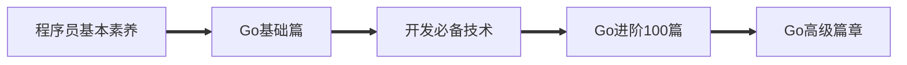

# 菜鸟的成长手册

## 🧭 导航

+ 🔍[**快速指南(wike) — 仓库总结**](https://github.com/cubxxw/Block_Chain/wiki)

+ 🔗[**中国大陆加速地址（Gitee平台）**](https://gitee.com/xxw3293172751/Block_Chain)

+ 📵[**不限速在线个人云盘**](https://xxw.nsddd.top/s/wRSz)

  

  
  
  
  
  
  

	<a href = "https://github.com/cubxxw/cs-awesome-Block_Chain">🅱️GitHub</a>
	&emsp;&emsp; | &emsp;&emsp;
	<a href="https://interview.huihut.com">📚DocCub</a>

	<a href = "readme_english.md">🔤English</a>
	&emsp;&emsp; | &emsp;&emsp;
	<a href = "README.md">🆑中文CN</a>

 

<b>💡 关于</b>

<a href='https://www.facebook.com/profile.php?id=100034435372354'>Facebook</a> | <a href='https://telsacoin.io/'>Website</a> | <a href='http://nsddd.top'>Blog</a> | <a href='https://t.me/smile3293172751'>Telegram</a> | <a href='https://twitter.com/xxw3293172751'>Twitter</a> | <a href='https://www.linkedin.cn/injobs/in/xiongxinwei-xiong-7606a0227'>Linkedin</a> | <a href='https://liberapay.com/xiongxinwei/donate'>Donate</a>

 ⚠️ 这是一个菜鸟的成长记录，如果你也想成为工程师，想从事后端的相关工作，或者想了解区块链的相关知识，那么它可以帮助到你😎 —>  <b>喜欢请给个⭐收藏~</b>

 🐧 喜欢*Go*语言的朋友欢迎加入*Go*语言自学群（*QQ*群号：[141984758](https://qm.qq.com/cgi-bin/qm/qr?k=ZZnzhuU8uGmIKT5btI9uiCRpasUeD8e2&jump_from=webapi&authKey=x1/NMrS1KpK7N8Rvj4IfLcKYSWnjtElgU6a3ubin1JmtReyuoIlyE/ZJ0VRlK25n)）

 ⛓️ <b>区块链技术（也称之为分布式账本技术）</b>，是一种互联网数据库技术，其特点是去中心化，公开透明，信息不可篡改性，隐私匿名性🤑<a href="https://github.com/C-UB">CUB链学社</a>致力打造<b>区块链自学教育平台。</b>

💡 侧边目录支持方式：[📚 DocCub 文档](https://go.nsddd.top)、🗃️[Github + TOC 导航](http://sm.nsddd.top/sm20221004130721.png?xxw@nsddd.top)， 😍 甚至你可以在这个界面按下`.` ➡️ [进入vscode编译环境](https://nsddd.top/archives/githubdev) 

👣 存在数学公式无法正常显示问题，强烈推荐[:triangular_ruler: MathJax Plugin for Github](https://chrome.google.com/webstore/detail/mathjax-plugin-for-github/ioemnmodlmafdkllaclgeombjnmnbima) 插件使用。

📄 保存为 PDF 方式：使用 Chrome 浏览器打开 <a href="https://go.nsddd.top">📚 DocCub 文档</a> 页面，缩起左侧目录-右键 - 打印 - 选择目标打印机是另存为PDF - 保存  —— [🖨️以Go语言第一节打印效果预览.pdf](./images/copy.pdf)）

🙏 仓库内容如有错误或改进欢迎 [issue](https://github.com/cubxxw/cs-awesome-Block_Chain/issues) 或 pr，[🧷参与贡献](https://nsddd.top/archives/contributors)，建议或讨论可在 [#10](https://github.com/cubxxw/cs-awesome-Block_Chain/issues/10) 提出。由于本人水平有限，仓库中的知识点有来自本人原创、读书笔记、书籍、博文等，非原创均已标明出处，如有遗漏，请 [issue](https://github.com/cubxxw/cs-awesome-Block_Chain/issues/new/choose) 提出。本仓库遵循 [CC BY-NC-SA 4.0（署名 - 非商业性使用 - 相同方式共享）](https://github.com/huihut/interview/blob/master/LICENSE) 协议，转载请注明出处，不得用于商业目的。

 

## 🔥 CubDoc推出

🈺 存在`GitHub`上浏览效果不佳，[Cub链学社](https://github.com/C-UB)推出`CubDoc`文档形式，使用`vuejs`渲染 。使用国内的服务器搭建（速度嘎快:bullettrain_front:) 。目前支持以下的项目🗃️：

+ [x] [:speedboat: Go语言基础-进阶](https://go.nsddd.top)

+ [x] [:speedboat: docker & k8s & 云原生](https://docker.nsddd.top)

 

## 🗓️ My 订阅精选

#### 博客专栏

博客上面发表的文章具有独立性，是我参与开源项目以来，所见所得所学，希望这种模式可以成功并且得以模仿。[👀 我的博客](https://nsddd.top/) 记录着很多优质的内容值得一看，如果希望订阅 SSR ➡️[点这里]([https://nsddd.top/rss.xml](https://nsddd.top/posts/index.xml))

[][zhihu] 

[zhihu]: https://www.zhihu.com/people/3293172751

<b>📚 我的博客订阅（每周更新❗）</b>

 
🔥 博客专栏<b>每个工作日11：59自动更新一次（actions部署）</b> ，喜欢文章关注点赞👍噢~

<!-- My-Blog:START -->
- [塑造职业道路：开源简历生成器与专业简历技巧指南](https://nsddd.top/zh/posts/crafting-your-career-pathway-a-guide-to-open-source-resume-builders-and-expert-resume-tips/)
- [OpenIM 故障排查指南](https://nsddd.top/zh/posts/troubleshooting-guide-for-openim/)
- [探索开源以及商业模式研究](https://nsddd.top/zh/posts/navigating-the-open-source-landscape/)
- [Sora Ease 指南：开发者掌握 Sora AI 的全面指南](https://nsddd.top/zh/posts/sora-ease-guide-mastering-sora-ai-for-developers/)
- [2023年，我的旅行起点 - 2023年的我漫步在世界边缘](https://nsddd.top/zh/posts/in-2023-i-was-wandering-at-the-edge-of-the-world/)
- [Sora 技术讨论以及普通人和开发者如何利用 Sora 改变世界](https://nsddd.top/zh/posts/exploring-sora-technology-for-enthusiasts-and-developers/)
- [双剑合璧：结合GitHub与Google Workspace的项目管理艺术](https://nsddd.top/zh/posts/combining-github-and-google-workspace-for-project-management/)
- [脑友好型英语学习策略：工具与技巧解析](https://nsddd.top/zh/posts/brain-friendly-english-learning-strategies-tools-and-techniques-explained/)
- [心流状态的魔力：专注与幸福感提升指南](https://nsddd.top/zh/posts/flow-state/)
- [GTD与四象限法则实践](https://nsddd.top/zh/posts/gtd-and-the-four-quadrant-rule-practice/)
- [参与这个项目](https://nsddd.top/zh/posts/participating-in-this-project/)
- [Go 源码里的这些 go: 指令 && go 自动化工具](https://nsddd.top/zh/posts/directives-and-the-use-of-automation-tools/)
- [Go 语言中的并发类型检查与跨平台开发](https://nsddd.top/zh/posts/concurrent-type-checking-and-cross-platform-development-in-go/)
- [向量数据库的学习](https://nsddd.top/zh/posts/vector-database-learning/)
- [OpenIM：构建高效的版本控制和测试工作流程](https://nsddd.top/zh/posts/openim-building-an-efficient-version-control-and-testing-workflow/)
- [2024年的新兴挑战与趋势](https://nsddd.top/zh/posts/emerging-challenges-and-trends-in-2024/)
- [2023年度总结：反思与展望](https://nsddd.top/zh/posts/2023-annual-summary-reflections-and-aspirations/)
- [对开源商业化的思考 & 全球流量大会（GTC）学习以及总结](https://nsddd.top/zh/posts/openim-open-source-business-journey/)
- [GitOps 实践理论：Kubernetes 部署策略深入解析](https://nsddd.top/zh/posts/gitops-practice-theory-part/)
- [管理后台和监控的部署与设计](https://nsddd.top/zh/posts/deployment-and-design-of-management-backend-and-monitoring/)
- [Hugo 的高级教程](https://nsddd.top/zh/posts/hugo-advanced-tutorial/)
- [Kubernetes Kustomize 学习指南](https://nsddd.top/zh/posts/kubernetes-for-kustomize-learning/)
- [OpenIM 使用 Harbor 构建企业镜像仓库](https://nsddd.top/zh/posts/openim-use-harbor-build-enterprise-mirror-repositories/)
- [自动化测试的学习(一)](https://nsddd.top/zh/posts/learn-about-automated-testing/)
- [Kubernetes 控制平面 - Kubectl](https://nsddd.top/zh/posts/deep-dive-into-the-components-of-kubernetes-kubectl/)
- [Kubernetes 控制平面 - 调度器](https://nsddd.top/zh/posts/deep-dive-into-the-components-of-kubernetes-scheduler/)
- [Kubernetes 的 CNI，CRI，CSI 详解](https://nsddd.top/zh/posts/deep-dive-into-the-components-of-kubernetes-cni-csi-cri/)
- [深入了解Kubernetes Kube apisserver的组件](https://nsddd.top/zh/posts/deep-dive-into-the-components-of-kubernetes-kube-apiserver/)
- [深入了解Kubernetes等组件之ETCD](https://nsddd.top/zh/posts/deep-dive-into-the-components-of-kubernetes-etcd/)
- [设计建议:通过配置文件简化Kubernetes部署的端口配置](https://nsddd.top/zh/posts/openim-cluster-deployment-parameter-passing-policy/)
- [OpenIM 的集群化设计 | Kubernetes 部署 | 方案讨论 | 总结](https://nsddd.top/zh/posts/openim-cluster-deployment-scheme-of/)
- [在开源社区中学会如何提问](https://nsddd.top/zh/posts/the-art-of-asking-questions-in-open-source-communities/)
- [Prow 是什么？kubernetes 为什么需要它](https://nsddd.top/zh/posts/prow-ecological-learning/)
- [一份完整的开源贡献指南（第一次踏入开源）](https://nsddd.top/zh/posts/open-source-contribution-guidelines/)
- [开源社区的规范设计思路](https://nsddd.top/zh/posts/advanced-githook-design/)
- [GoReleaser：自动化你的软件发布](https://nsddd.top/zh/posts/go-release-tools/)
- [我的第一个博客](https://nsddd.top/zh/posts/my-first-blog/)
- [关于我的 Hugo (教程)](https://nsddd.top/zh/posts/my-hugo/)
- [速读开源项目 Sealos 的源码](https://nsddd.top/zh/posts/read-openim-project-sealos-openim-source-code/)
- [DevOps OpenIM 的标准设计](https://nsddd.top/zh/posts/openim-devops-design/)
- [OpenIM 多进程管理](https://nsddd.top/zh/posts/openim-multi-process-management/)
- [如何安装和使用自主人工智能工具Auto-GPT](https://nsddd.top/zh/posts/use-auto-gpt/)
- [go 调试 测试 以及调试工具 dlv 学习](https://nsddd.top/zh/posts/use-go-tools-dlv/)
- [Github Actions 的高级使用技巧](https://nsddd.top/zh/posts/github-actions-advanced-techniques/)
- [开源的阶段性成长指南](https://nsddd.top/zh/posts/stage-growth-of-open-source/)
- [从理论到实践的项目管理打通](https://nsddd.top/zh/posts/project-management-from-theory-to-practice/)
- [Openkf 多架构镜像的构建策略设计](https://nsddd.top/zh/posts/openkf-multi-architecture-image/)
- [OpenIM 远程工作团队协作协议 v1.3](https://nsddd.top/zh/posts/openim-remote-work-culture/)
- [跨平台以及多架构编译设计](https://nsddd.top/zh/posts/cross-platform-compilation/)
- [Kubernetes一篇快速入门的文章](https://nsddd.top/zh/posts/kubernetes-an-article-to-get-started-quickly/)
- [Openim离线部署设计](https://nsddd.top/zh/posts/openim-offline-deployment-design/)
<!-- My-Blog:END -->

 

#### 知乎专栏

🥰 订阅了我的 [知乎账户](https://www.zhihu.com/people/3293172751) 里面的 [云原生精选文章专栏](https://www.zhihu.com/column/c_1496496113348206594)。

 

<b>📚 我的知乎文章订阅（每周更新❗）</b>

 
🔥 知乎专栏<b>每个工作日11：59自动更新一次（actions部署）</b> ，喜欢文章关注点赞👍噢~

<!-- ZHIHU:START -->
- [云原生领域中GitHub开源Go项目的自动化测试实践与策略](https://zhuanlan.zhihu.com/p/664338584)
- [OpenIM 使用 Harbor 搭建企业级镜像仓库](https://zhuanlan.zhihu.com/p/662935033)
- [OpenIM 多进程管理策略](https://zhuanlan.zhihu.com/p/652047787)
- [OpenIM 离线部署](https://zhuanlan.zhihu.com/p/651917752)
- [git cherry-pick cource](https://zhuanlan.zhihu.com/p/649283181)
- [DevOps OpenIM 的标准设计](https://zhuanlan.zhihu.com/p/648188241)
- [GO Gorelease](https://zhuanlan.zhihu.com/p/648187762)
- [OpenIM standardization](https://zhuanlan.zhihu.com/p/645182674)
- [一篇学会 github actions](https://zhuanlan.zhihu.com/p/643085910)
- [kubecub - 帮助萌新打造开源项目](https://zhuanlan.zhihu.com/p/634020346)
- [go 语言工具包](https://zhuanlan.zhihu.com/p/631662028)
- [K8s 深入理解 Operator-client 详解](https://zhuanlan.zhihu.com/p/629622839)
- [Kubernetes 社区规范](https://zhuanlan.zhihu.com/p/629622183)
- [高级的 Githook 设计](https://zhuanlan.zhihu.com/p/629617458)
- [CloudNative / Kubernetes 学习资源整理](https://zhuanlan.zhihu.com/p/614921043)
- [Istio 高级流量管理](https://zhuanlan.zhihu.com/p/614775174)
- [Kubernetes 概念以及架构](https://zhuanlan.zhihu.com/p/611169064)
- [深入剖析 Docker 底层（全）](https://zhuanlan.zhihu.com/p/610939386)
- [Go 语言的 Makefile 指南](https://zhuanlan.zhihu.com/p/607940899)
- [Go语言项目设计和开发流程](https://zhuanlan.zhihu.com/p/607192022)
<!-- ZHIHU:END -->

 

## 📖 Go语言

#### 🏷️前言

`Go`语言的学习参考官网文档[go语言官方编程指南](https://golang.org/#)，如何找到合适的Go语言学习路线[Go语言路线](go-advancend/go_route.md)（🎈 含有大量的Go语言项目资源、线上资源收集）。

+ 🔱[go语言官方编程指南](https://golang.org/#)  

+ 🚧[Go语言路线和资源征集(update 2023)](go-advancend/go_route.md)

#### 🔖核心

**Go语言的核心编程篇，基础部分30天记录，100篇进阶，高级篇包括Go语言底层的实现，runtime、调度器的原理以及Go语言设计模式~**

⚠️ 目前已全部迁移至 ➡️ [CubDoc🧷](https://go.nsddd.top/)

+ [x] [🖱️GO 基础部分🔥](awesome-golang/README.md)
+ [x] [🖱️Go语言100篇进阶🔥](awesome-golang/Gomd_super/README.md)
+ [x] [🖱️Go 高级篇](awesome-golang/go-advancend/README.md)
+ [ ] [🖱️Mit 6.824 笔记](awesome-golang/mit-6-824/README.md)

#### 📝补充

学习开源项目对于我们的成长非常大，我结合我自己的开源经历写了[这篇🎯开源之路：跨越八个阶段，成就行业佼佼者](https://nsddd.notion.site/f8854a0f60d346d98b9eb2ccb6eaef8f)。同[🧋 学习 Kubernetes 的成长轨迹](https://nsddd.notion.site/CloudNative-Kubernetes-2f278e98ed274999829333272415c72d)一样，这篇文章将会长期更新，也可以参与贡献 ，补全更新~。[k8s-iam](https://github.com/cubxxw/k8s-iam) 项目就是我结合Kubernetes 和 iam 这两个极为优秀的项目联合打造的k8s-iam 项目，对 [企业级 iam 项目](https://github.com/marmotedu/iam/) 进行学习和仿写，以及对开源文档和技术细节的输出。iam 技术栈涵盖了开发环境配置、代码设计、常用包使用、HTTP、客户端CLI、RESTful设计、数据库操作、Swagger文档、Cache机制、业务逻辑处理、开发规范、API调试、部署方式和云原生架构设计等方面。有兴趣的可以一起阅读学习。

🥇 命名规范以及项目目录结构📇的设定对于一名合格的工程师来说也是非常重要的。下面是作为一名合格的开发者🤵，必须要会的基本素养。

+ [🖱️Go语言包管理工具 — mod包](Gomd_super/mod.md)

+ [🖱️Go-air实现热加载编译](Gomd_super/go-air.md)

+ [🖱️命名规则和代码规范](Gomd_super/name.md)

+ 🖱️[Go语言目录结构](Gomd_super/catalogue.md)

+ 🖱️[Go文件以及编码处理](Gomd_super/go_file.md)

+ 🖱️[正则表达式](Gomd_super/zhenze.md)

+ 🖱️[位运算技巧](Gomd_super/bitwise.md)

> Go语言一些其他的网站和博客，值得一看
>
> + [Go语言面试题](https://www.topgoer.cn/docs/gomianshiti/mianshiti)
> + [Go语言中文官方文档](http://word.topgoer.com/)
> + [Go语言专家编程地址](http://wen.topgoer.com/docs/gozhuanjia/gogfjhk)

 

##  👀 云原生 Cloud Native

💡 这是一个关于云原生领域的仓库，涉及到 docker、Kubernetes、cloud native 知识，包括 docker 架构和底层实现，包括Kubernetes的架构、原理、生态以及源码阅读。还有  Cloud Native 其他领域知识，以及各个 CNCF 开源社区项目学习。

+ [x] [docker](awesome-docker-kubernetes/README.md)
+ [x] [Kubernetes](awesome-docker-kubernetes/Cloud-Native-k8s/README.md) 
+ [x] [CloudNative](awesome-docker-kubernetes/Cloud-Native/README.md)

## 📚 CS系列

CS 系列选自[🎉awesome-cs-course](https://github.com/cubxxw/awesome-cs-course)，内容涵盖 计算机操作系统、csapp系列、算法和数据结构、计算机网络、`linux`、`java`、`python`、`C/C++`、`vuepress`、`gitbook`、`nodejs`、`vuejs`、`halo`、`redis`、`hugo`、`nginx`、`nosql`、`mysql`、`JavaScript`、`git`、`markdown`、`web`前端等笔记，更多移步到[AWESOME系列CS仓库地址](https://github.com/cubxxw/awesome-cs-course/)

+ [x] [Java全册☕](https://github.com/cubxxw/awesome-cs-course/blob/master/java/README.md)

+ [x] [汇编学习🔥](汇编/README.md)

+ [x] [软件工程](./软件工程&系统设计和架构/README.md)

+ [x] [算法与数据结构（LeetCode刷题记录）](https://github.com/cubxxw/LeetCode/)

+ [x] [计算机网络🔥](./web/README.md)

+ [x] [操作系统 — OS🔥](https://github.com/cubxxw/os)

+ [x] [CS必须要会的技术🔥](cs/README.md)

 

## 📘 开发必备技术

🧋参与普通程序的开发或者是区块链⛓️开发必须[熟悉Linux指令](https://github.com/cubxxw/awesome-cs-course/blob/master/linux/README.md)，熟悉[git团队开发](https://github.com/cubxxw/awesome-cs-course/blob/master/Git/README.md)，基于[docker容器](docker/README.md)会让我门快速的搭建工具和环境，更好的迁移开发环境和迁移链码（blockcode)，[密码学和信息安全](cryptology/README.md)不仅仅是区块链工程师必须要学习的技术，更是IT从业者未来不可或缺的技术。我们都渴望系统能更加的安全不是吗📵。

⚠️ `Docker` 、`K8s`、`sealos`、`云原生` 已全部迁移至 ➡️ [CubDoc🧷](https://docker.nsddd.top/)

+ [x] 🖱️ [linux从入门到精通🔥](https://github.com/cubxxw/awesome-cs-course/blob/master/linux/README.md)

+ [x] 🖱️ [Git—必备神器🔥](https://github.com/cubxxw/awesome-cs-course/blob/master/Git/README.md)

+ [x] [🖱️ Docker/k8s/云原生🔥](docker/README.md) 

+ [x] [🖱️ 密码学和信息安全🔥](cryptology/README.md)

 

## 📔 区块链导航

我认为世界历史可以用两句话来描述：分久必合，合久必分。区块链将是催化下一个‘合久必分’时代的新技术。区块链的产生铸就了一个新的时代，我们的信念是建筑在一个数学的算法上面，In math we trust。	——张首晟

:spider_web: 这是一个web2的世界，或者很快整个互联网行业都会改革，是的，都会迈入web3的世界

> 🔥 我深以为然：区块链或许不能让这个世界分布化，但是它可以让世界不再有中介。不在会因为你所玩游戏崩溃你就失去了这个游戏~

从事区块链，需要哪些基础知识，看下[区块链开发需要什么](C_Universal_Brockchain\chain.md) ，你需要一份[区块链工程师路线](./blockchain/route.md)，或许你可以在一些区块链项目中找到灵感[🔗区块链公益项目（NFT+私链/联盟链/私链）](blockchain/区块链公益项目/README.md)。区块链的[共识算法](blockchain/README.md)是怎么实现的呢?

+ [x] [🔗区块链工程师路线](./blockchain/route.md)

+ [x] [🔗区块链开发需要什么❓](C_Universal_Brockchain\chain.md)

+ [x] [🔗区块链公益项目（NFT+私链/联盟链/私链）](blockchain/区块链公益项目/README.md)
+ [x] [🔗共识算法——Go语言实现](./blockchain/README.md)

 

## :b: 区块链教程

💱 区块链系列包含了区块链教程，主要是`eth`、`btc`还有联盟链`fabric`超级账本组织的教程，基于这些教程扩展新的技术：`git`、`ipfs`、密码学、共识算法。

📮 这个也是我们`C-UB`社区的最终目的，我们要打造出一个不一样的全民学习平台，将会融合一切新型技术（`ipfs`、`git`、`k8s`、`Kafka`)，基于web3的c-ub社区，属于我们每一个人！或许这将会有能力成为下一个时代的先驱，完全改变人类的协同方式。当人与人之间更信任，效率就会更高。

🚸 以及链学项目[C-Universal Blockchain](https://github.com/c-ub)

> 以太坊和比特币一样，底层框架都是区块链协议，区块链本质上是一个应用了密码学技术的分布式数据库系统。建议看一下 **[以太坊白皮书](https://github.com/ethereum/wiki/wiki/%5B%E4%B8%AD%E6%96%87%5D-%E4%BB%A5%E5%A4%AA%E5%9D%8A%E7%99%BD%E7%9A%AE%E4%B9%A6)（需要有golang编程基础）**
>
> 

> <a href="eth/TOC.md">
> 	
> </a>

+ [x] [🖱️区块链教程🔥](C_Universal_Brockchain/README.md)

+ [x] [🖱️web3，智能合约](eth/README.md)

+ [x] [🖱️区块链技术指南](chainbrock-learning/SUMMARY.md)

> 企业级[区块链实战教程](https://learnblockchain.cn/books/enterprise/)

 

<!--

## AI 教程
-->

## 🗃️ 项目

为了方便管理，我将所有的知识仓库以及贡献开源项目所克隆的仓库放在了我的个人账户 [cubxxw](https://github.com) 中，将所有的项目和规范有关的仓库都放在了自己创建的社区 [kubecub](https://github.com/kubecub) 中方便所有人加入并且学习，并且将所有自动化相关的账户都使用了 [robot(kubbot)](https://github.com/kubbot) 机器人来进行自动化和控制。 

我参与过很多顶级开源社区，包括 [sealer](https://github.com/sealerio/sealer)、[sealos](https://github.com/labring/sealos)、[Kubernetes](https://github.com/kubernetes/kubernetes/)、[OpenIM](https://github.com/OpenIMSDK)、[K8sgpt](https://github.com/k8sgpt-ai/k8sgpt)、[Horizon](https://github.com/horizoncd/horizon/) 以及 我自己打造的 开源社区 [Kubecub](https://github.com/kubecub)。kubecub 中有很多我沉淀下来的开源规范以及代码、项目规范都总结在各个仓库中。并且，Kubecub 和 OpenIM 使用了我创造的 [🤖 robot(kubbot)](https://github.com/kubbot) 来对 PR 和 Issue 高度自动化。kubecub 宗旨是面向所有的开发者进行学习和创造的，你可以在里面利用我们的自动化工具和模板打造自己的开源项目，并且让更多的人来帮助你协同、review 代码。

在里面积累了很多的开源经验，并且记录在我的 [博客](https://nsddd.top) 中，其中，很多的提案和在贡献的成长笔记，所学习到的知识都在 [CloudNative](https://docker.nsddd.top/Cloud-Native/) 这篇知识库中有所记录。

> 

> <b> kubecub（kubecub-开源社区）</b>    
> 

>
> 

> <a href="https://github.com/kubecub">
> 	
> </a>

>
> 欢迎加入 kubecub 社区一起学习、为开源做贡献 ! 为了方便每一位开源爱好者交流和学习，我们在 slack 中集成了 很多自动化工具以及 AI，欢迎大家 [🔥加入 Slack](https://join.slack.com/t/kubecub/shared_invite/zt-1se0k2bae-lkYzz0_T~BYh3rjkvlcUqQ)。

## ✨ 参与贡献💕

 **[🫵 参与贡献💖❤️‍🩹💓💞](https://nsddd.top/archives/contributors)** 

**[😍 甚至你可以在这个界面按下`.`进入vscode编译环境](https://nsddd.top/archives/githubdev)** 

**要求：**

+ [你需要学会使用markdown🖱️](https://github.com/cubxxw/awesome-cs-course/blob/master/markdown/README.md)
+ [符合Google代码规范](https://zh-google-styleguide.readthedocs.io/en/latest/google-cpp-styleguide/)

<b>🫡 克隆此仓库到本地</b>

<pre><code>git clone https://ghproxy.com/https://github.com/cubxxw/Block_Chain.git 菜鸟的成长手册
</code></pre>
<pre><code>wget -c -d -O gitsync.sh https://sm.nsddd.top/uploads/2022/10/27/Y0iHb6ix_gitsync.sh?attname=gitsync.sh && echo "gitsync.sh" >> .gitignore && sh gitsync.sh 这里写提交信息~ && chmod 777 gitsync.sh
</code></pre>

 

🎯 如果你也想对本项目做出贡献，那么你可以先把该项目进行 [fork](https://github.com/cubxxw/cs-awesome-Block_Chain/fork)或者 `git clone` 到本地（推荐先用 [fock](https://github.com/cubxxw/cs-awesome-Block_Chain/fork)到自己仓库，然后再clone到本地，对本地进行操作，最后从自己仓库贡献，然后自己建立一个分支 `your-branch`，然后上传资料到 对应目录 下，图片信息可以上传到` /images`，然后更新 `README`。 

##  / Recent activity 

 

## 💡 版权声明 &copy;

***License**:* 本书所有内容遵循[CC-BY-SA 3.0协议（署名-相同方式共享）&copy;](http://zh.wikipedia.org/wiki/Wikipedia:CC-by-sa-3.0协议文本) 

 
