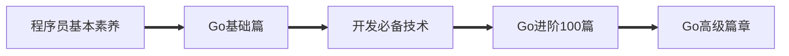

# 菜鸟的成长手册（最全）

----

[Facebook](https://www.facebook.com/profile.php?id=100034435372354) | [Website](https://telsacoin.io/) | [Blog](http://nsddd.top) | [Telegram](https://t.me/smile3293172751) | [Twitter](https://twitter.com/xxw3293172751) | [Linkedin](https://www.linkedin.cn/injobs/in/xiongxinwei-xiong-7606a0227) | [Donate](https://liberapay.com/xiongxinwei/donate)

**[English](else/readme_english.md) | [中文](README.md)**

---

+ [**中国大陆加速地址（Gitee平台）**](https://gitee.com/xxw3293172751/Block_Chain)
+ [**快速指南(wike)**](https://github.com/3293172751/Block_Chain/wiki)

  

  
  
  

---

这是一个菜鸟的成长记录，如果你也想成为工程师，想从事后端的相关工作，或者想了解区块链的相关知识，那么它可以帮助到你。

**区块链技术（也称之为分布式账本技术）**，是一种互联网数据库技术，其特点是去中心化，公开透明，信息不可篡改性，隐私匿名性

>   ❤️💕💕关于区块链技术，可以关注我，共同学习更多的区块链技术。博客[http://nsddd.top](http://nsddd.top)
>

---

⏬⏬⏬

## 导航

+ [x] [🖱️参与CUB开发指南](C_Universal_Brockchain/README.md)

 [1. Go语言学习](TOC.md)

+ [Go语言面试题](https://www.topgoer.cn/docs/gomianshiti/mianshiti)
+ [Go语言中文官方文档](http://word.topgoer.com/)
+ [Go语言专家编程地址](http://wen.topgoer.com/docs/gozhuanjia/gogfjhk)

 [2. 以太坊学习](eth/TOC.md)

 [3. 区块链路线](route.md)

+ [区块链公益项目（NFT+私链/联盟链/私链）](区块链公益项目/README.md)
+ [共识算法以及代码实现(Go)](blockchain/README.md)
+ [区块链技术指南](chainbrock-learning/SUMMARY.md)
+ [区块链实战教程](https://learnblockchain.cn/books/enterprise/)

## Go语言

😶‍🌫️[go语言官方编程指南](https://golang.org/#)  

+ [x] [🖱️Go语言路线](go-advancend/go_route.md)

>   go语言的官方文档学习笔记很全，推荐可以去官网学习–了解
>
>   下面介绍的有Go语言路线，Go语言学习笔记，Go语言高级进阶教程，还在更新……

> *⏬⏬⏬理解一个事物最好的方式就是把问题当作机器来层层解析⏬⏬⏬*

+ [x] [🖱️GO 基础部分🔥](TOC.md)

+ [ ] [🖱️GO web框架](go-web/)

+ [x] [🖱️Go语言100篇进阶🔥](Gomd_super/README.md)

+ [ ] [🖱️Go 高级篇](go-advancend/README.md)

---

### Go程序员基本素养

> 作为一名合格的开发者，必须要会的基本素养。

+ **[🖱️Go语言包管理工具mod](Gomd_super/mod.md)**
+ **[🖱️命名规范](Gomd_super/name.md)**
+ **🖱️[Go语言目录结构](Gomd_super/catalogue.md)**
+ **🖱️[Go文件以及编码处理](Gomd_super/go_file.md)**
+ **🖱️[正则表达式](Gomd_super/zhenze.md)**
+ **🖱️[Go-mod包](Gomd_super/go_mod.md)**

----

## CS系列课程

> ## About
>
> 包含Linux，计算机操作系统，组成原理，算法，计算机网络，数据结合，python，C/C++，Go,区块链，git,markdown,html等笔记

+ [ ] [计算机科学速成课](./cs/cs.md)
+ [x] [CS教程仓库地址🔥](https://github.com/3293172751/CS_COURSE)
+ [x] [汇编学习](汇编/README.md)
+ [ ] [软件工程](cs/software-engineering.md)
+ [x] [网络](./web/README.md)
+ [x] [OS🔥](https://github.com/3293172751/os)

+ [x] [CS必须要会的技术🔥](cs/README.md)

+ [x] [最全的程序员秘密知识仓库🔥](else/uuu.md)

---

## 开发必备技术

> 参与区块链CUB项目开发必须熟悉Linux指令，熟悉git团队开发，还有是基于docker的容器，更好的迁移开发环境和迁移链码（blockcode)

+ [x] 🖱️ [linux从入门到精通🔥](https://github.com/3293172751/CS_COURSE/blob/master/linux/README.md)

+ [x] 🖱️ [Git—必备神器](https://github.com/3293172751/CS_COURSE/blob/master/Git/README.md)

+ [x] [🖱️ Docker入门到进阶🔥](docker/README.md)

+ [x] [🖱️ 密码学](cryptology/README.md)

---

## 区块链学习

> 我认为世界历史可以用两句话来描述：分久必合，合久必分。区块链将是催化下一个‘合久必分’时代的新技术。区块链的产生铸就了一个新的时代，我们的信念是建筑在一个数学的算法上面，In math we trust。	——张首晟

### [🖱️区块链工程师路线](route.md)

+ [区块链开发需要什么](C_Universal_Brockchain\chain.md)

+ [区块链公益项目（NFT+私链/联盟链/私链）](blockchain/区块链公益项目/README.md)
+ [共识算法——Go语言实现](blockchain/README.md)

### ETH和BTC

> 以太坊和比特币一样，底层框架都是区块链协议，区块链本质上是一个应用了密码学技术的分布式数据库系统。建议看一下**以太坊白皮书（需要有golang编程基础）**

+ [🖱️点击进入ETH学习](eth/TOC.md)

+ [🖱️点击进入BTC学习](btc/TOC.md)

+ [🖱️点击进入Hyperledger Fabric学习](C_Universal_Brockchain/README.md)

+ [🖱️区块链技术指南](chainbrock-learning/SUMMARY.md)

---

### 项目

+ [ ] [ 🖱️GLinux内核(未开始)]()

+ [x] [ 🖱️C-Universal Brockchain](C_Universal_Brockchain/README.md)

+ [x] [ 🖱️C-Universal Brockchain（链学）组织地址](https://github.com/C-UB)

---

## 参与贡献

 **[🫵参与贡献❤️❤️💕💕](https://nsddd.top/archives/contributors)** 

**要求：**

+ [**你需要学会使用markdown🖱️**](https://github.com/3293172751/CS_COURSE/blob/master/markdown/README.md)
+ [**符合Google代码规范**](https://zh-google-styleguide.readthedocs.io/en/latest/google-cpp-styleguide/)

如果你也想对本项目做出贡献，那么你可以先把该项目进行 `fork` 或者 `git clone` 到本地，然后自己建立一个分支 `your-branch`，然后上传资料到 对应目录 下，图片信息可以上传到` /images`，然后更新 `README`。 

##  / Recent activity 

 

##  / Structure

## 版权声明 &copy;

本书所有内容遵循[CC-BY-SA 3.0协议（署名-相同方式共享）&copy;](http://zh.wikipedia.org/wiki/Wikipedia:CC-by-sa-3.0协议文本) 
