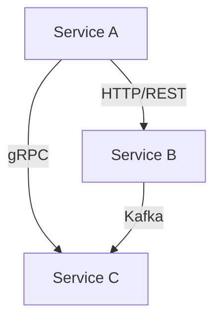
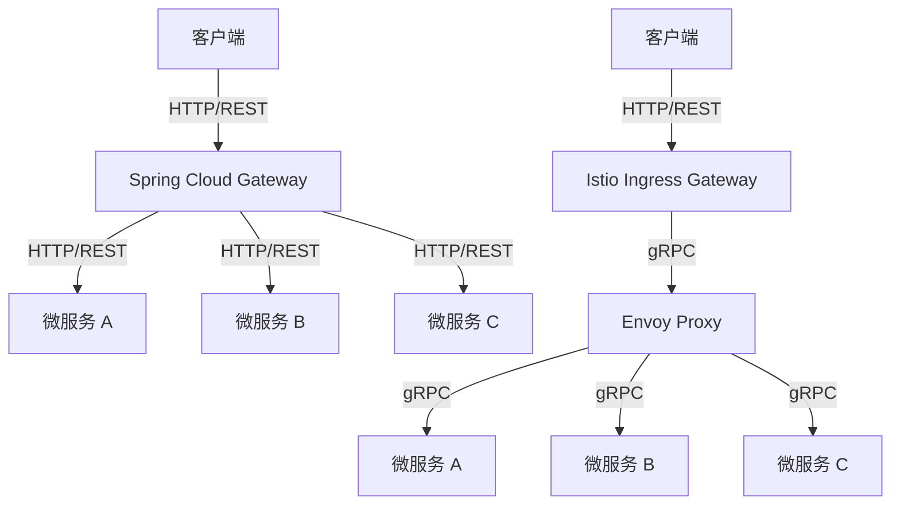
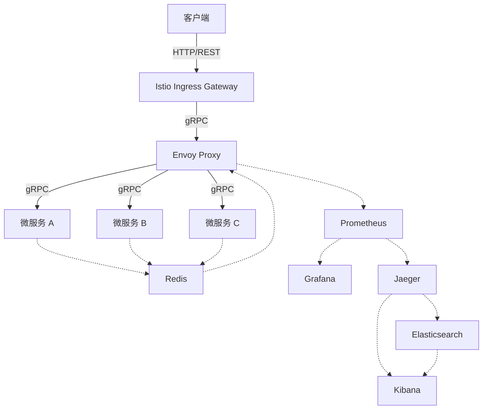
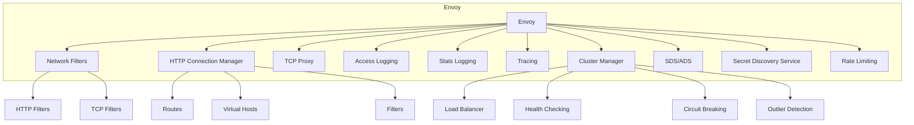
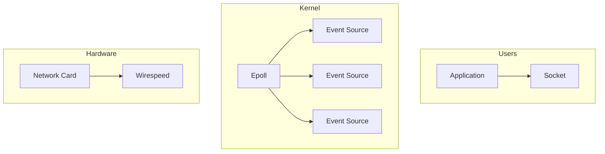
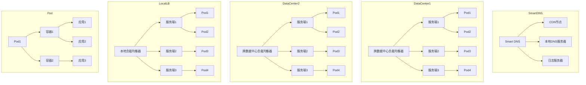
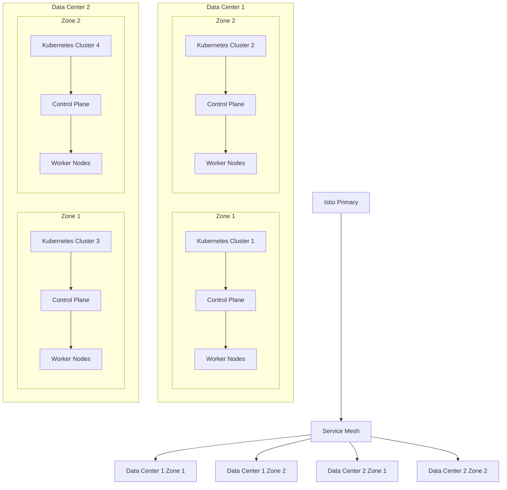

+ [author](http://nsddd.top)

# 第62节 Istio 高级流量管理

<div><a href = '61.md' style='float:left'>⬆️上一节🔗  </a><a href = '63.md' style='float: right'>  ⬇️下一节🔗</a></div>
<br>

> ❤️💕💕新时代拥抱云原生，云原生具有环境统一、按需付费、即开即用、稳定性强特点。Myblog:[http://nsddd.top](http://nsddd.top/)

---
[TOC]

**Andress：**

1. [https://github.com/istio/istio](https://github.com/istio/istio)
2. [Istio](https://istio.io/)

## Istio 高级流量管理

Kubernetes是一个强大的容器编排平台，但是其自带的服务治理功能较为基础，只能实现基本的负载均衡和服务发现功能。而Istio则是一个专注于服务网格的开源项目，提供了强大的高级流量管理，可观察性和安全性功能，能够帮助企业快速构建高可用，高性能，高安全性的微服务架构。使用Istio可以实现更加灵活和高效的服务管理和治理。

**要想知道为什么需要 Istio，我们需要知道微服务 ~**

### 微服务架构的演变

微服务架构的演变包括单体应用、SOA架构、微服务架构等，随着业务的增长，单体应用和SOA架构逐渐暴露出诸多问题，如可扩展性、可维护性、服务间耦合度等，而微服务架构则以其松耦合、高内聚、可扩展等特点逐渐成为业界关注的重点。Istio是一个专注于服务网格的开源项目，提供了强大的高级流量管理、可观察性和安全性功能，帮助企业快速构建高可用、高性能、高安全性的微服务架构，是当前最流行的服务网格之一。

微服务架构是分布式架构的一种具体实现。在微服务架构中，系统被拆分为多个服务，每个服务都是独立的、可替换的、可扩展的。每个服务都有自己的业务逻辑和数据库，服务之间通过轻量级的通信机制进行交互，如REST API或消息队列。微服务架构可以帮助企业快速构建高可用、高性能、高安全性的系统，具有更好的可维护性和可扩展性。

服务网格则是分布式架构中的一种基础设施层，主要用于管理服务之间的通信。Istio是一种服务网格，提供了强大的高级流量管理、可观察性和安全性功能，可以帮助企业快速构建高可用、高性能、高安全性的微服务架构。Istio的流量管理功能可以实现灰度发布、流量控制、故障注入、流量镜像等高级流量管理功能；Istio的可观察性功能可以实现对服务的流量监控、日志收集、分布式追踪等功能；Istio的安全性功能可以实现服务间的认证、授权、加密等功能。

因此，微服务架构和服务网格是分布式架构中的两个重要概念，可以帮助企业构建高可用、高性能、高安全性的系统。

| 架构             | 优点                             | 缺点                   | 适用场景                       | 案例                  |
| ---------------- | -------------------------------- | ---------------------- | ------------------------------ | --------------------- |
| 单体应用         | 简单易懂，易于开发               | 可扩展性和可维护性差   | 小型项目，小团队               | 单体应用的Web应用程序 |
| SOA架构          | 松耦合，分布式                   | 复杂性高，学习曲线陡峭 | 大规模项目，大团队             | Amazon，eBay          |
| 微服务架构       | 松耦合，可扩展，模块化，易于维护 | 部署和运维复杂         | 大规模项目，大团队             | Netflix，Uber         |
| 无服务器架构     | 高度灵活，无需管理服务器         | 可能存在性能问题       | 适用于短期、低流量的任务       | AWS Lambda            |
| 事件驱动架构     | 异步处理，可扩展性强             | 处理复杂性高           | 高并发，大数据量、实时性要求高 | Apache Kafka          |
| CQRS架构         | 读写分离，可扩展                 | 增加开发复杂性         | 大型复杂系统，高并发读写场景   | Microsoft             |
| 服务器端渲染架构 | 首屏加载快，SEO友好              | 代码复杂度高           | 对首屏加载速度和SEO要求高      | Airbnb                |

除了单体应用、SOA架构和微服务架构之外，还有无服务器架构，事件驱动架构，CQRS架构和服务器端渲染架构等。

无服务器架构是一种新兴的架构，可以实现高度灵活和无需管理服务器的目标，适用于短期、低流量的任务。事件驱动架构通过异步处理和可扩展性强，适用于高并发、大数据量、实时性要求高的场景。CQRS架构通过读写分离和可扩展性，适用于大型复杂系统、高并发读写场景。服务器端渲染架构通过首屏加载快和SEO友好特点，适用于对首屏加载速度和SEO要求高的场景。

每种架构都有其优点和缺点，选择适合自己业务场景的架构是非常重要的。

<aside>
    💡 微服务架构适用于大规模项目和大团队，具有以下典型业务场景：</aside>


- 高可用性要求：微服务架构可以将系统拆分为多个服务，每个服务都是独立的、可替换的、可扩展的，可以实现服务的高可用性。
- 高性能要求：微服务架构可以将系统拆分为多个服务，每个服务都有自己的业务逻辑和数据库，服务之间通过轻量级的通信机制进行交互，如REST API或消息队列，可以实现高性能的服务调用。
- 高可扩展性要求：微服务架构可以将系统拆分为多个服务，每个服务都是独立的、可替换的、可扩展的，可以实现服务的高可扩展性。
- 多团队协作开发：微服务架构可以将系统拆分为多个服务，每个服务都有自己的业务逻辑和数据库，不同的团队可以分别开发和维护不同的服务，可以实现多团队协作开发。
- 持续交付和部署：微服务架构可以将系统拆分为多个服务，每个服务都是独立的、可替换的、可扩展的，可以实现服务的独立部署和持续交付。

### 思维导图



> 上面的图是一个简单的服务网格的示例。它包含三个服务：A，B和C。服务A通过HTTP/REST协议与服务B通信，服务A通过gRPC协议与服务C通信，服务B通过Kafka与服务C通信。服务网格通过代理模式实现对服务的流量管理和安全管理，同时提供对服务的可观察性监控。在上面的图中，服务网格通过 `Envoy` 代理实现对服务的流量管理和安全管理。服务A的请求通过 `Envoy` 代理路由到服务B或服务C，服务B的响应通过Envoy代理返回给服务A。服务C的响应也通过Envoy代理返回给服务A。服务网格通过Envoy代理实现对服务的流量路由和流量控制，以便对服务进行灰度发布、流量控制、故障注入等高级流量管理功能。

### SpringCloud和Istio的区别

SpringCloud是一组用于构建企业级应用程序的框架和工具。它提供了很多解决方案，如服务发现、配置管理、负载均衡、断路器、网关等，通过这些解决方案可以快速构建微服务应用程序。SpringCloud是一个基于Java的框架，它使用Spring Boot来简化微服务开发流程。

Istio是一个开源服务网格平台，它提供了流量管理、安全性和可观察性功能。Istio使用Envoy代理来管理网络流量，并通过控制Envoy的流量路由规则来实现灰度发布、流量控制、故障注入等高级流量管理功能。Istio是与Kubernetes集成的，因此可以很容易地部署和管理在Kubernetes上运行的微服务应用程序。

SpringCloud和Istio都用于构建微服务应用程序，但是它们在实现微服务治理方面有些许不同。SpringCloud是一组基于Java的框架和工具，适用于构建Java应用程序。它的优势在于开发人员可以使用熟悉的Java技术栈来构建微服务应用程序，这意味着开发人员可以更快地上手。而Istio是一个基于Envoy代理的服务网格平台，适用于构建任何语言的应用程序，但是在部署和管理方面需要对Kubernetes有一定的了解。Istio的优势在于它提供了很多高级的流量管理和安全性功能，这些功能在SpringCloud中可能需要开发人员自己来实现。


### 为什么不选择SpringCloud

尽管SpringCloud是一个优秀的微服务框架，但是它也存在一些问题。首先，SpringCloud是一个基于Java的框架，因此只适用于构建Java应用程序。如果你的团队使用的是其他语言，那么SpringCloud可能不是最佳选择。其次，SpringCloud的学习曲线相对较陡峭，需要开发人员掌握很多概念和技术。最后，SpringCloud的性能可能比Istio略差，因为它使用了更多的Java代码来实现微服务治理功能。



上面的图分别体现了 Spring Cloud 和 Istio 的架构图。在 Spring Cloud 架构中，客户端通过 HTTP/REST 协议与 Spring Cloud Gateway 通信，Spring Cloud Gateway 负责路由请求并将请求发送到对应的微服务上。在 Istio 架构中，客户端通过 HTTP/REST 协议与 Istio Ingress Gateway 通信，Istio Ingress Gateway 负责路由请求并将请求发送到 Envoy Proxy，Envoy Proxy 负责将请求转发到对应的微服务上。

在 Spring Cloud 架构中，Spring Cloud Gateway 是一个独立的组件，需要自己部署和运维；而在 Istio 架构中，Istio Ingress Gateway 是 Istio 的一部分，由 Istio 自动部署和运维。此外，在 Istio 架构中，Envoy Proxy 代理可以实现更多的流量管理和安全性功能，例如灰度发布、流量控制、故障注入等高级流量管理功能。因此，在流量管理和安全性方面，Istio 比 Spring Cloud 更加强大和灵活。

然而，Spring Cloud 作为一个基于 Java 的微服务框架，可以轻松地与 Spring Boot 框架集成，因此可以快速构建 Java 微服务应用程序。而 Istio 可以支持多种语言，但需要对 Kubernetes 有一定的了解，因此在部署和管理方面需要一定的学习成本。

## **什么是 Service Mesh（服务网格）？**

服务网格（Service Mesh）是一种基础设施层，用于管理服务之间的通信。它通过在服务之间插入代理来实现流量管理、安全性和可观察性。服务网格通常由一个控制平面和一个数据平面组成，其中控制平面负责配置和管理代理，数据平面负责处理流量。服务网格可以提供很多高级功能，例如流量路由、故障注入、流量控制、灰度发布、可观察性等。Istio是一个开源的服务网格平台，它使用Envoy代理来实现流量管理、安全性和可观察性功能。

| 功能         | 适应性                       | 服务发现             | 安全和访问控制                                    | 可观测性                                       | 部署和通讯                                    |
| ------------ | ---------------------------- | -------------------- | ------------------------------------------------- | ---------------------------------------------- | --------------------------------------------- |
| Spring Cloud | 适用于构建Java应用程序       | 支持多种服务发现方式 | 可以使用Spring Security等框架实现安全性和访问控制 | 提供了Spring Boot Actuator等工具来实现可观测性 | 可以使用HTTP/REST协议或其他协议进行通讯       |
| Istio        | 适用于构建任何语言的应用程序 | 支持多种服务发现方式 | 使用Envoy代理实现安全性和访问控制                 | 提供了Istio Mixer等组件来实现可观测性          | 可以使用HTTP/REST协议、gRPC协议等协议进行通讯 |

当前说的 Service Mesh 一般就是指 Istio。

- HTTP、gRPC、WebSocket 和TCP流量的自动负载均衡。
- 通过丰富的路由规则、重试、故障转移和故障注入，可以对流量行为进行细粒度控制。
- 可插入的策略层和配置API，支持访问控制、速率限制和配额。
- 对出入集群入口和出口中所有流量的自动度量指标、日志记录和跟踪。
- 通过强大的基于身份的验证和授权，在集群中实现安全的服务间通信。

逻辑图：



上面的图展示了 Service Mesh 的架构，其中客户端通过 HTTP/REST 协议与 Istio Ingress Gateway 通信，Istio Ingress Gateway 负责路由请求并将请求发送到 Envoy Proxy，Envoy Proxy 负责将请求转发到对应的微服务上。同时，Envoy Proxy 通过 Sidecar 模式与 Jaeger、Prometheus、Grafana 等监控工具进行通信，实现对服务的可观察性监控。此外，微服务 A、B、C 还通过 Redis 进行数据共享，Envoy Proxy 可以通过 Redis 进行流量控制和故障注入等高级流量管理功能。

<aside>
💡 Sidecar
Sidecar 是一个模式，它将一个辅助容器作为主容器的一个辅助进程来运行。在微服务架构中，使用 Sidecar 模式可以将代理作为辅助容器与每个微服务实例一起运行，以便实现流量管理、安全管理和可观察性等功能。Sidecar 模式还可以将监控、日志记录和跟踪工具作为辅助容器与主容器一起运行，以便对微服务进行可观察性监控。Istio 服务网格使用 Sidecar 模式来管理网络流量，并使用 Envoy 代理作为辅助容器进行流量管理和安全管理。</aside>


Service Mesh 把认证鉴权、服务发现、负载均衡、熔断等通用能力整合到 Sidecar 里，让业务专注于业务本身。


### 服务网格可选方案

在 Istio 之前，已经有了一些服务网格的解决方案。下面是一些可选方案：

- **Linkerd**：Linkerd 是一个开源的服务网格，它使用代理模式来实现流量管理和安全管理。Linkerd 使用 Finagle 作为代理，可以支持多种语言的应用程序。
- **Consul Connect**：Consul Connect 是 HashiCorp 公司开发的服务网格解决方案。它使用 Envoy 代理来实现流量管理和安全管理，同时提供了服务发现、配置管理等功能。
- **AWS App Mesh**：AWS App Mesh 是 Amazon Web Services 公司开发的服务网格解决方案。它使用 Envoy 代理来实现流量管理和安全管理，同时提供了服务发现、配置管理等功能。AWS App Mesh 可以与 AWS 上的其他服务集成，例如 Amazon ECS 和 Amazon EKS。
- **Kuma**：Kuma 是一个开源的服务网格，它使用 Envoy 代理来实现流量管理和安全管理。Kuma 支持多种数据平面和控制平面，可以灵活地适应不同的应用场景。

<aside>
💡 我们最后在描述一下 Service Mesh：
服务网格（Service Mesh）这个术语通常用来描述构成这些应用程序的微服务网格以及应用之间的交互。随着规模和复杂性的增长，服务网格越来越难以理解和管理。</aside>

## 流量管理

Istio通过Envoy代理实现流量管理，通过控制Envoy的流量路由规则，可以实现灰度发布，流量控制，故障注入等高级流量管理功能。


上面的图展示了Istio的完整架构，其中客户端通过HTTP/REST协议与Istio Ingress Gateway通信，Istio Ingress Gateway负责路由请求并将请求发送到Envoy Proxy，Envoy Proxy负责将请求转发到对应的微服务上。同时，Envoy Proxy通过sidecar模式与Jaeger、Prometheus、Grafana等监控工具进行通信，实现对服务的可观察性监控。此外，微服务A、B、C还通过Redis进行数据共享，Envoy Proxy可以通过Redis进行流量控制和故障注入等高级流量管理功能。

### 灰度发布

灰度发布是一种逐步将新版本服务引入生产环境的方式。在灰度发布中，可以将部分流量引导到新版本服务，逐步验证新版本的稳定性和可用性。最终实现全量升级。Istio支持基于用户ID，源IP，HTTP头等多种方式进行流量路由。这些流量规则可以通过Istio的流量管理功能进行配置和管理。

### 流量控制

Istio支持对服务的流量进行控制，包括限流，超时控制，重试等功能。可以通过Istio的流量规则，对不同的服务进行不同的流量控制策略，以保障服务的稳定性和可用性。通过Istio的流量控制功能，可以帮助企业快速构建高可用，高性能的微服务架构。

### 故障注入

Istio可以通过流量规则，模拟服务故障，以便测试服务的容错性和可用性。例如，可以通过Istio将一定比例的流量引导到故障服务上，验证服务的降级和自愈能力。这些流量规则可以通过Istio的流量管理功能进行配置和管理。

### 流量镜像

Istio支持流量镜像功能，将一部分流量镜像到另一个服务中，以便测试新服务的性能和可用性。例如，可以将一定比例的流量镜像到新服务中，对新服务进行验证和测试。这些流量镜像规则也可以通过Istio的流量管理功能进行配置和管理。

## 可观察性

Istio通过Envoy代理实现对服务的流量监控，可以实时收集服务的流量数据，包括请求量，成功率，响应时间等指标，以便进行性能和容量规划。同时，Istio支持对服务的请求进行追踪和分析，以便快速定位和解决问题。这些监控和诊断功能可以通过Istio的可观察性管理功能进行配置和管理。

谈论到可观察性，永远都是这么几个，监控指标、日志以及分布式追踪。

### 监控指标

lstio 基于4个监控的黄金标识(延迟、流量、错误、饱和)生成了一系列服务指标。Istio还为网格控制平面提供了更详细的指标。除此以外还提供了- -组默认的基于这些指标的网格监控仪表板 

Istio通过Prometheus实现对服务的监控，可以实时收集服务的流量数据，包括请求量，成功率，响应时间等指标。可以通过Istio的监控管理功能进行配置和管理。

### 日志

Istio通过Envoy代理实现对服务的日志收集，可以收集服务的请求和响应信息，以便进行追踪和分析。可以通过Istio的日志管理功能进行配置和管理。

当流量流入网格中的服务时，Istio 可以生成每个请求的完整记录,包括源和目标的元数据。此信息使运维人员能够将服务行为的审查控制到单个工作负载实例的级别。

### 分布式追踪

Istio 为每个服务生成分布式追踪span,运维人员可以理解网格内服务的依赖和调用流程。

Istio通过Jaeger实现对服务的分布式追踪，可以追踪服务的请求链路，以便快速定位和解决问题。可以通过Istio的追踪管理功能进行配置和管理。

## Istio 架构演进

数据平面:

- 由一组以Sidecar方式部署的智能代理(Envoy) 组成。这些代理可以调节和控制微服务及Mixer之间所有的网络通信。

控制平面:

- 负责管理和配置代理来路由流量。此外控制平面配置Mixer以实施策略和收集遥测数据。

架构演进:

- 从微服务回归单体


Istio有三个控制平面组件：Pilot、Mixer和Citadel。

- **Pilot**：负责流量管理，包括流量路由、流量转移、请求重试、故障注入、流量镜像等功能。Pilot将流量管理规则下发到Envoy代理，控制流量的转发和策略的执行。
- **Mixer**：负责策略和遥测数据收集。Mixer提供了一个插件框架，可以使用插件来实现策略功能，如请求认证、访问控制、配额管理等。同时，Mixer还负责收集服务的遥测数据，如请求量、错误率、延迟等指标。
- **Citadel**：负责服务之间的认证和授权。Citadel为每个服务生成证书，并将证书下发到服务的Sidecar代理中。Sidecar代理使用证书来进行服务之间的安全通信，同时Citadel还提供了一个API，用于管理证书和密钥。

以上三个控制平面组件协同工作，实现了Istio的高级流量管理和安全功能。

<aside>
💡 所以我们在做架构演进的时候，可能经常需要去复盘这个架构到底是不是和，经常反思。
最开始可能野心很大，后面希望做更可控的事情。</aside>


## 设计目标

Istio 的设计理念是将服务网格从应用程序中解耦出来，以便将流量管理、策略执行、安全性和可观察性与应用程序代码分离。这种解耦允许开发人员专注于应用程序的核心业务逻辑，而不是流量管理和安全性。Istio 的设计目标是提供一种灵活的、可扩展的、易于部署和维护的服务网格解决方案，可以适应各种不同的应用场景。Istio 还提供了丰富的流量管理和安全功能，包括流量路由、流量控制、故障注入、灰度发布、流量镜像、认证和授权等功能。同时，Istio 还提供了强大的监控和诊断功能，可以帮助企业快速发现和解决问题，提高服务的可用性和可靠性。

### 策略一致性

Istio 的策略一致性指的是，一旦制定了策略，就会在整个服务网格中得到强制执行，无论在哪个数据平面中运行。这种一致性可以确保服务网格中的所有服务都遵循相同的策略，从而提高服务的安全性和可靠性。Istio 通过控制平面中的 Mixer 组件来实现策略一致性，Mixer 负责收集遥测数据和实施策略，可以为整个服务网格提供一致的策略执行。

### 可移植性

Istio 的可移植性指的是，可以在不同的数据平面上运行 Istio，而不需要重新编写或修改应用程序代码。这种可移植性可以帮助企业快速部署和扩展服务网格，同时降低维护成本。Istio 使用 Envoy 作为数据平面，Envoy 是一个通用的代理，可以与多种语言和框架进行交互，从而实现 Istio 的可移植性。此外，Istio 还提供了丰富的 API 和插件，可以与不同的数据平面集成，从而实现 Istio 的可扩展性和可定制性。

## 安全性

Istio通过Envoy代理实现对服务的安全性管理，包括服务间的认证，授权，加密等功能。可以通过Istio的安全规则，对不同的服务进行不同的安全策略，以保障服务的安全性。Istio的安全性管理功能可以帮助企业快速构建高安全性的微服务架构。

<aside>
💡 Istio支持服务间的认证功能，可以对服务进行身份验证，以保障服务间的安全性。可以通过Istio的认证管理功能进行配置和管理。</aside>
<aside>
💡 Istio支持对服务的授权功能，可以控制服务的访问权限，以保障服务的安全性。可以通过Istio的授权管理功能进行配置和管理。</aside>
<aside>
💡 Istio支持对服务的加密功能，可以对服务间的通信进行加密，以保障服务间的数据安全性。可以通过Istio的加密管理功能进行配置和管理。</aside>
## 数据平面 Envoy

| 代理名称 | 开发语言 | 功能特点                                       | 支持的特性                                  | GitHub地址                          |
| -------- | -------- | ---------------------------------------------- | ------------------------------------------- | ----------------------------------- |
| HAProxy  | C        | 高性能、稳定性好                               | HTTP2、Rate Limit、ACL、Connection draining | https://github.com/haproxy/haproxy  |
| Nginx    | C        | 高性能、支持反向代理和负载均衡                 | HTTP2、Rate Limit、ACL、Connection draining | https://github.com/nginx/nginx      |
| Apache   | C        | 支持多种代理模式，如正向代理、反向代理等       | HTTP2、Rate Limit、ACL                      | https://github.com/apache/httpd     |
| Envoy    | C++      | 支持多种协议、多种语言，可扩展、易于管理       | HTTP2、Rate Limit、ACL、Connection draining | https://github.com/envoyproxy/envoy |
| Traefik  | Go       | 支持多种后端服务、自动发现、动态配置           | HTTP2、Rate Limit、ACL、Connection draining | https://github.com/traefik/traefik  |
| Linkerd  | Scala    | 面向服务网格，支持多种协议、负载均衡、流量控制 | HTTP2、Rate Limit、ACL、Connection draining | https://github.com/linkerd/linkerd  |
| Kong     | Lua      | 基于Nginx，支持多种协议、插件可扩展            | HTTP2、Rate Limit、ACL、Connection draining | https://github.com/Kong/kong        |

各自优势和缺点：

- HAProxy：高性能、低延迟、支持多种负载均衡算法，但缺乏流量控制功能。
- Nginx：高性能、稳定性好、支持反向代理和负载均衡，但缺乏流量控制功能。
- Apache：支持多种代理模式，如正向代理、反向代理等，但不适合高并发场景。
- Envoy：支持多种协议、多种语言，可扩展、易于管理，支持流量控制、故障注入、灰度发布等高级功能。
- Traefik：支持多种后端服务、自动发现、动态配置，易于使用，但缺乏灵活性。
- Linkerd：面向服务网格，支持多种协议、负载均衡、流量控制，具有良好的可观察性，但性能可能不如其他代理。
- Kong：基于Nginx，支持多种协议、插件可扩展，具有良好的可扩展性和可配置性，但不太适合大规模部署。

| Envoy               | Ngnix                                                        | HA Proxy                                                     |
| ------------------- | ------------------------------------------------------------ | ------------------------------------------------------------ |
| HTTP/2              | 对HTTP/2有最完整的支持，同时upstream和downstream HTTP/2      | 从1.9.5开始有限支持HTTP/2，只在 upstream 支持 HTTP/2,downstream 依然是 HTTP/1.1 |
| Rate Limit          | 通过插件支持限流                                             | 支持基于配置的限流，只支持基于源IP的限流                     |
| ACL                 | 基于插件实现四层ACL                                          | 基于源/目标地址实现ACL                                       |
| Connection draining | 支持 hot reload,并且通过 share memory 实现 connection draining 的功能 | Nginx Plus收费版支持connection draining                      |

### Envoy 的优势

- https://github.com/envoyproxy/envoy

Envoy 作为 Istio 的数据平面代理，具有以下优势：

- 高性能：Envoy 采用了多种技术，如异步 I/O、线程池和内存池等技术，可以处理高并发的请求，同时减少 CPU 和内存的使用。
- 可扩展性：Envoy 支持多种协议、多种语言和可扩展的插件机制，可以满足不同服务的需求，从而实现 Istio 的高级流量管理和安全功能。
- API 可配置性：Envoy 提供了丰富的 API 和配置选项，可以根据业务需求进行灵活的配置和管理，例如可以进行流量控制、故障注入、安全策略等。

除此之外，Envoy 还具有易于管理、可移植性强等优势，可以与多种语言和框架进行交互，从而实现 Istio 的可移植性和可扩展性。企业可以通过 Istio 的管理平台配置和管理 Envoy 的这些优势，使得企业能够更加灵活和高效地管理自己的微服务架构。随着企业对微服务架构的需求不断增长，Envoy 的优势将成为企业构建微服务架构的重要选择之一。



### Envoy 的线程模式

Envoy 采用了 **单进程多线程** 的设计，可以充分利用现代 CPU 的多核优势，同时避免了单线程的性能瓶颈。Envoy 的线程模式包括以下几种：

- Main 线程：负责 Envoy 的启动和配置，以及管理其他线程的生命周期。
- Listener 线程：负责处理网络连接的 I/O 操作，包括监听端口、接收连接、读写数据等。
- Worker 线程：负责处理具体的请求和响应，包括路由、过滤器、负载均衡等功能。
- File 线程：负责处理文件 I/O 操作，如日志写入、TLS 证书加载等。
- Admin 线程：负责处理 Envoy 的管理命令，如查看状态、修改配置等。

Envoy 的线程模式可以根据业务需求进行灵活的配置和调整，从而实现更好的性能和资源利用率。同时，Envoy 还提供了丰富的 API 和插件机制，可以扩展线程模式，实现更复杂的功能和场景。企业可以通过 Istio 的管理平台配置和管理 Envoy 的线程模式，使得企业能够更加灵活和高效地管理自己的微服务架构。

当某个连接被监控器接收，那么该连接的全部生命周期会与某线程绑定。

### Envoy 基于非阻塞模式 （Epoll)

Epoll 是一种高性能的 I/O 多路复用机制，用于处理大量连接的高并发场景。在传统的 select 和 poll 机制中，每次需要遍历整个文件描述符集合来寻找有事件发生的描述符，这样会造成效率低下和资源浪费。而 Epoll 采用了事件通知的方式，只有在有事件发生时才会通知用户程序，从而大大提高了效率和性能。

Epoll 的核心是一个事件表，用于存放所有要监控的文件描述符和对应的事件类型。它包括三个 API 函数：epoll_create、epoll_ctl 和 epoll_wait。其中，epoll_create 用于创建一个新的 epoll 实例，epoll_ctl 用于添加/修改/删除一个文件描述符到 epoll 实例中，epoll_wait 用于等待文件描述符上的 I/O 事件，并返回就绪的文件描述符列表。

**与传统的 select 和 poll 相比，Epoll 具有以下优势：**

1. 高效性：Epoll 采用了事件通知的方式，只有在有事件发生时才会通知用户程序，从而避免了轮询整个文件描述符集合的开销，同时也减少了内核和用户程序之间的上下文切换次数，从而提高了效率和性能。
2. 可扩展性：Epoll 可以支持数十万个连接并发处理，通过修改事件表的大小和调整内部数据结构可以实现更高的扩展性和灵活性。
3. 更加灵活：Epoll 支持多种事件类型，包括读、写、异常和优先级事件等，可以满足不同的应用场景和需求。
4. 良好的兼容性：Epoll 是 Linux 内核中实现的一种 I/O 多路复用机制，可以与其他 Linux 系统调用和库函数进行兼容。

Epoll 在高并发场景下具有重要的应用价值，可以用于优化 Web 服务器、消息队列、数据库等应用程序的性能和效率。在现代的网络应用中，Epoll 已经成为了一种不可或缺的技术，值得我们深入学习和研究。



## Istio 多集群

架构师要学会做取舍，选择合适的，符合场景的方案。



该架构图包括以下要素：

- SmartDNS：智能 DNS 服务器，用于解析域名和地址映射。
- CDN节点：内容分发网络节点，用于加速数据传输。
- 本地DNS服务器：本地 DNS 服务器，用于缓存 DNS 解析结果。
- 日志服务器：用于收集和存储系统日志和统计数据。
- 跨数据中心负载均衡器：用于跨数据中心的负载均衡和流量控制。
- 服务端：用于处理业务逻辑和提供服务的服务器。
- Pod：Kubernetes 中最小的可部署的计算单元，包含一个或多个容器。
- 容器：用于封装应用程序和其依赖项的轻量级运行环境。
- 应用程序：运行在容器内部的业务逻辑，提供服务和处理请求。
- 本地负载均衡器：用于本地的负载均衡和流量控制。

在该架构中，SmartDNS、CDN节点和本地DNS服务器协同工作，通过缓存、负载均衡和智能路由等技术，实现了高效的域名解析和地址映射。跨数据中心负载均衡器、本地负载均衡器和 Pod 之间的协作，可以实现跨数据中心和本地的负载均衡、流量控制和服务发现，从而提高了系统的可用性、可伸缩性和性能。同时，日志服务器可以收集和存储系统的日志和统计数据，帮助管理员和开发人员监控和调试系统，提高系统的可管理性和可维护性。

## 集群联邦

[集群联邦（Cluster Federation） · Kubernetes 中文指南——云原生应用架构实战手册](https://jimmysong.io/kubernetes-handbook/practice/federation.html)

> Kubernetes 从 1.8 版本起就声称单集群最多可支持 5000 个节点和 15 万个 Pod，我相信很少有公司会部署如此庞大的一个单集群，总有很多情况下因为各种各样的原因我们可能会部署多个集群，但是有时候有想将他们统一起来管理，这时候就需要用到集群联邦（Federation）。

集群联邦（Cluster Federation）是一种将多个 Kubernetes 集群连接起来，实现跨集群资源管理和服务发现的技术。通过集群联邦，企业可以实现跨数据中心、跨可用区的资源管理和负载均衡，从而提高系统的可用性、可伸缩性和性能。

[Kubernetes 官方博客的文章](https://kubernetes.io/blog/2018/12/12/kubernetes-federation-evolution/)中介绍了 Kubernetes 集群联邦的演进，该项目是在 SIG Multicluster 中进行的，Federation 是 Kubernetes 的一个子项目，社区对这个项目的兴趣很浓，该项目最初重用 Kubernetes API，以消除现有 Kubernetes 用户的任何附加使用复杂性。但由于以下原因，此方式行不通：

- 在集群层面重新实施 Kubernetes API 的困难，因为 Federation 的特定扩展存储在注释中。
- 由于 Kubernetes API 的1:1仿真，Federation 类型、放置（placement）和调节（reconciliation）的灵活性有限。
- 没有固定的 GA 路径，API 成熟度普遍混乱；例如，Deployment 在Kubernetes 中是 GA，但在 Federation v1 中甚至不是Beta。

随着 Federation 特定的 API 架构和社区的努力，这些想法有了进一步的发展，改进为 Federation v2。请注意，Federation V1 版本已经归档不再维护和更新，且官方也不再推荐继续使用。如果需要了解更多的 Federation 资料，请参考：[Kubernetes Federation v2](https://github.com/kubernetes-sigs/kubefed)。

**集群联邦包括以下要素：**

- Kubernetes 集群：分布在不同数据中心或可用区中的 Kubernetes 集群，可以使用不同的云服务提供商或私有数据中心。
- 集群联邦控制平面：用于管理和控制集群联邦的核心组件，包括 API Server、Controller Manager、Scheduler 等。
- 集群联邦 API：用于定义和管理跨集群的资源和服务，包括 Endpoint、Service、Namespace 等。
- 集群联邦 DNS：用于解析跨集群的服务和域名，包括 External DNS 和 CoreDNS 等。
- 集群联邦 Ingress：用于管理和配置跨集群的 Ingress 路由和负载均衡，包括 Istio Gateway 和 Traefik 等。
- 集群联邦网络：用于实现跨集群的网络互通和安全隔离，包括 Calico、Flannel、Weave Net 等。

在集群联邦中，Istio 作为一种服务网格技术，可以为跨集群的服务提供流量管理、安全策略、可观测性等功能。通过 Istio 中的集群联邦支持，企业可以实现跨数据中心、跨可用区的服务发现和流量管理，从而提高系统的可用性和性能。



以上是集群联邦的架构图，包括两个数据中心、四个可用区和一个 Istio Primary。在每个可用区中，都有一个 Kubernetes 集群和一个 Istio Service Mesh。Istio Primary 作为集群联邦的核心组件，可以管理和控制所有的 Istio Service Mesh，实现跨数据中心和可用区的流量管理、安全策略和可观测性等功能。

在该架构中，Kubernetes 集群可以使用不同的云服务提供商或私有数据中心，从而实现跨平台的资源管理和负载均衡。集群联邦控制平面可以管理和控制所有的 Kubernetes 集群和 Istio Service Mesh，实现跨集群的资源调度和服务发现。集群联邦 DNS 和 Ingress 可以解析和负载均衡跨集群的服务和域名，从而实现跨数据中心和可用区的流量管理和安全策略。集群联邦网络可以实现跨集群的网络互通和安全隔离，从而保障系统的可用性和安全性。

### 集群联邦管理的对象

成员集群是联邦的基本管理单位，所有待管理集群均需要注册到集群联邦。

集群联邦 V2 提供了统一的工具集 `kubefedctl` ，允许用户对单个对象动态的创建联邦对象。

动态对象生成基于 CRD。

| 特征                 | Kubernetes 集群                        | Kubernetes 集群联邦                                |
| -------------------- | -------------------------------------- | -------------------------------------------------- |
| 计算资源             | 可以独立管理和调度，但是无法跨集群调度 | 可以通过联邦控制平面进行跨集群调度和资源管理       |
| 部署                 | 独立部署，需要单独管理                 | 集群联邦控制平面可以管理和控制所有的成员集群       |
| 配置                 | 每个集群需要单独配置和管理             | 可以通过集群联邦 API 统一管理和调度                |
| 密钥                 | 每个集群需要单独管理和分发             | 可以通过集群联邦控制平面进行跨集群的密钥管理和分发 |
| 其他 Kubernetes 对象 | 每个集群需要单独配置和管理             | 可以通过集群联邦 API 统一管理和调度                |
| 优点                 | 独立性强，可以根据需求进行灵活配置     | 可以实现跨数据中心和可用区的负载均衡和服务发现     |
| 缺点                 | 无法实现跨集群的负载均衡和服务发现     | 需要额外的管理和配置工作，可能会增加复杂性和风险   |

Kubernetes Cluster Federation 又名 KubeFed 或 Federation v2，v2 架构在 Federation v1 基础之上，简化扩展 Federated API 过程，并加强跨集群服务发现与编排的功能。另外 KubeFed 在设计之初，有两个最重要核心理念是 KubeFed 希望实现的，分别为 Modularization（模块化）与 Customizable (定制化)，这两个理念大概是希望 KubeFed 能够跟随着 Kubernetes 生态发展，并持续保持相容性与扩展性。

由于 Federation 试图解决一系列复杂的问题，因此需要将这些问题的不同部分分解开来。Federation 中涉及的概念和架构图如下所示。


### 集群的注册中心

集群注册中心 （ClusterRegistry) 提供了所有联邦下的集群清单，以及每一个集群的认证信息、状态信息。

## Kind 搭建集群联邦

在本教程中，我们将使用 kind（Kubernetes IN Docker）搭建一个简单的集群联邦，包括安装集群联邦。该联邦将包括两个 Kubernetes 集群和一个 Istio Service Mesh。每个 Kubernetes 集群将包含一个控制平面节点和一个工作节点。

> 我们在之前学习 Kind 的时候，知道了 Kind 特别适合 集群联邦的搭建。

### 安装集群联邦

下载代码：

```yaml
git clone https://github.com/kubernetes-sigs/kubefed.git
```

make:

```yaml
make deploy.kind
kubectl -n kube-federation-system get kubefedcluster -oyaml
```

### 步骤 1：安装 kind

要使用 kind 搭建集群联邦，我们需要先安装 kind。可以按照以下步骤在 Linux 或 macOS 系统上安装 kind。

```bash
# 下载 kind
curl -Lo ./kind <https://kind.sigs.k8s.io/dl/v0.10.0/kind-$(uname)-amd64>
chmod +x ./kind

# 将 kind 可执行文件移动到 PATH 中
sudo mv ./kind /usr/local/bin/kind

# 验证 kind 是否安装成功
kind version

```

### 步骤 2：创建 Kubernetes 集群

使用 kind 命令创建 Kubernetes 集群。在本教程中，我们将创建两个 Kubernetes 集群，分别代表两个数据中心。

```bash
# 创建第一个 Kubernetes 集群
kind create cluster --name=dc1 --config=./dc1-config.yaml

# 创建第二个 Kubernetes 集群
kind create cluster --name=dc2 --config=./dc2-config.yaml
```

以下是 `dc1-config.yaml` 的示例文件内容：

```
kind: Cluster
apiVersion: kind.x-k8s.io/v1alpha4
nodes:
- role: control-plane
- role: worker

```

以下是 `dc2-config.yaml` 的示例文件内容：

```
kind: Cluster
apiVersion: kind.x-k8s.io/v1alpha4
nodes:
- role: control-plane
- role: worker
```

Kubectl 可以通过 `kubectl config use-context [context-name]` 命令来选择当前要使用的集群。在 kind 集群联邦中，每个 Kubernetes 集群都有一个唯一的 context 名称，格式为 `kind-[cluster-name]`。例如，要使用名为 `dc1` 的 Kubernetes 集群，可以执行以下命令：

```
kubectl config use-context kind-dc1
```

然后，您就可以在 `dc1` 集群上运行 `kubectl` 命令了。

### 步骤 3：安装 Istio

[Getting Started](https://istio.io/latest/docs/setup/getting-started/)

在本教程中，我们将使用 Istio 作为服务网格技术。可以按照以下步骤安装 Istio。

```yaml
# 下载 Istio
curl -L https://istio.io/downloadIstio | sh -

# 将 Istio 可执行文件移动到 PATH 中
cd istio-1.17.1
export PATH=$PWD/bin:$PATH

# 安装 Istio
istioctl install --set profile=default -y

# 验证 Istio 是否安装成功
kubectl get pods -n istio-system
```

**安装目录包含：**

- **`samples/` 中的示例应用程序**
- **`bin/` 目录中的 `istioctl` 客户端二进制文件**

还可以选择：

**添加命名空间标签以指示Istio在您稍后部署应用时自动注入Envoy sidecar代理：**

```yaml
kubectl label namespace default istio-injection=enabled
```

### 步骤 4：配置集群联邦

在本教程中，我们将使用 Istio 作为集群联邦的核心组件。可以按照以下步骤配置集群联邦。

```yaml
# 创建 Istio Primary
kind create cluster --name=istio-primary --config=./istio-primary-config.yaml

# 部署 Istio
istioctl manifest generate --set profile=default | kubectl apply -f -

# 创建 Istio Service Mesh
istioctl mesh create --config=./istio-primary.yaml --name=istio-primary

# 将 Istio Service Mesh 注册到集群联邦
kubefedctl join istio-primary --cluster-context=istio-primary --v=2

```

在本教程中，我们使用了三个不同的配置文件来创建 Istio Primary 和 Istio Service Mesh。你可以根据自己的需要自定义配置文件。以下是一个简单的配置文件示例，用于创建 `Istio Primary`。

```
kind: Cluster
apiVersion: kind.x-k8s.io/v1alpha4
nodes:
- role: control-plane

```

以下是一个简单的配置文件示例，用于创建 `Istio Service Mesh`。

```
apiVersion: install.istio.io/v1alpha1
kind: IstioOperator
spec:
  profile: default
  components:
    ingressGateways:
    - name: istio-ingressgateway
      enabled: true

```

在集群联邦中，Istio Service Mesh 将充当跨集群的流量管理和安全策略的核心组件。通过 Istio 中的集群联邦支持，企业可以实现跨数据中心、跨可用区的服务发现和流量管理，从而提高系统的可用性和性能。

### 步骤 5：验证集群联邦

在完成集群联邦的配置后，可以使用 kubefedctl 命令验证集群联邦是否正常工作。

```bash
# 查看成员集群
kubefedctl get clusters

# 查看跨集群的 Service
kubefedctl get services --all-namespaces

# 查看跨集群的 Deployment
kubefedctl get deployments --all-namespaces

```

在我们使用了 kubefedctl 命令来管理集群联邦。你可以根据自己的需要使用其他工具来管理集群联邦。

如果没有 `kubefedctl` 命令，您可以通过以下步骤安装它：

1. 下载最新的 kubefedctl 发布包：

```
curl -LO <https://github.com/kubernetes-sigs/kubefed/releases/latest/download/kubefedctl-$(uname)-$(arch)>
chmod +x kubefedctl-$(uname)-$(arch)
```

1. 移动 kubefedctl 可执行文件到 PATH 中。

```
sudo mv kubefedctl-$(uname)-$(arch) /usr/local/bin/kubefedctl
```

1. 验证 kubefedctl 是否已安装成功。

```
kubefedctl version
```

### 联邦对象的组成

联邦对象包括 template、placement、overrides 三个部分。下面是一些更详细的解释。

- **Template**: 是联邦对象的模板，用于定义联邦对象的规范。任何创建的联邦对象都必须符合此模板。模板包括 API 版本、Kind、metadata 等信息。通过模板，我们可以定义联邦对象的类型和属性，并确保所有的联邦对象都具有相同的属性和行为。
- **Placement**: 是联邦对象的放置规则，用于指定联邦对象在哪些成员集群中创建。通过放置规则，我们可以控制联邦对象的副本数量、分布情况和优先级等属性。放置规则可以基于标签、名称、命名空间等条件进行定义，也可以使用自定义的选择器进行定义。
- **Overrides**: 是联邦对象的覆盖规则，用于覆盖联邦对象在成员集群中的属性和行为。通过覆盖规则，我们可以根据需要修改联邦对象的属性和行为，从而实现更灵活和个性化的管理。覆盖规则可以针对不同的成员集群进行定义，也可以使用自定义的选择器进行定义。

## 结论

Istio提供了强大的高级流量管理，可观察性和安全性功能，可以帮助企业快速构建高可用，高性能，高安全性的微服务架构，是当前最流行的服务网格之一。Istio的流量管理，可观察性和安全性功能均可通过Istio的管理平台进行配置和管理，使得企业能够更加灵活和高效地管理自己的微服务架构。随着企业对微服务架构的需求不断增长，Istio的服务网格将成为企业构建微服务架构的重要选择。


## END 链接
<ul><li><div><a href = '61.md' style='float:left'>⬆️上一节🔗  </a><a href = '63.md' style='float: right'>  ️下一节🔗</a></div></li></ul>

+ [Ⓜ️回到目录🏠](../README.md)

+ [**🫵参与贡献💞❤️‍🔥💖**](https://nsddd.top/archives/contributors))

+ ✴️版权声明 &copy; ：本书所有内容遵循[CC-BY-SA 3.0协议（署名-相同方式共享）&copy;](http://zh.wikipedia.org/wiki/Wikipedia:CC-by-sa-3.0协议文本) 

