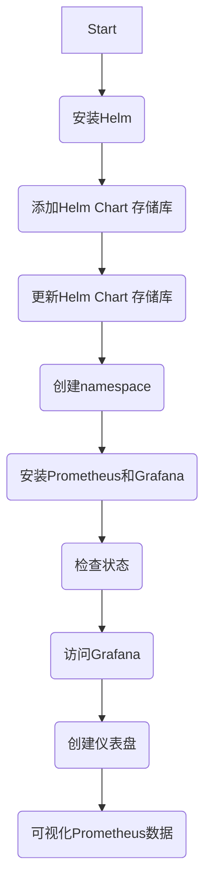

+ [author](http://nsddd.top)

# 第63节 Prometheus 和 Grafana 日志收集方案

<div><a href = '62.md' style='float:left'>⬆️上一节🔗  </a><a href = '64.md' style='float: right'>  ⬇️下一节🔗</a></div>
<br>

> ❤️💕💕新时代拥抱云原生，云原生具有环境统一、按需付费、即开即用、稳定性强特点。Myblog:[http://nsddd.top](http://nsddd.top/)

---
[TOC]


## Prometheus 和 Grafana 日志收集方案

如果你是一个 DevOps 工程师，那么 Prometheus 和 Grafana 这两个名字肯定不会陌生。它们是目前最受欢迎的开源监控解决方案之一。但是你知道吗？它们不仅仅可以用于监控应用程序的性能，还可以用于收集和可视化日志数据。在本文中，我们将重点介绍 Prometheus 和 Grafana 的日志收集方案，帮助你更好地理解如何利用它们来管理和分析应用程序的日志数据。

Prometheus 和 Grafana 是 Kubernetes 监控方案中最知名的两个。

+ Prometheus 负责收集、存储、查询数据
+ Grafana 负责将 Prometheus 中的数据可观化展示

### 使用 Helm 一键安装 Prometheus 和 Grafana

使用 Helm 一键安装 Prometheus 和 Grafana非常容易。Helm 是 Kubernetes 的一个包管理器，可以帮助我们轻松部署和管理应用程序。如果你还没有安装 Helm，请先按照官方文档进行安装。然后，只需要执行以下命令即可：

```bash
❯ helm repo add promethues-community <https://prometheus-community.github.io/helm-charts>
"promethues-community" has been added to your repositories
```

查看当前添加的所有 repo 列表：

```bash
❯ helm repo list
NAME                    URL
horizon                 <https://horizoncd.github.io/helm-charts>
azure                   <http://mirror.azure.cn/kubernetes/charts/>
promethues-community    <https://prometheus-community.github.io/helm-charts>
```

<aside> 💡 在Kubernetes中，Helm是一种包管理器，可以帮助我们轻松部署和管理应用程序。Helm可以通过从不同的存储库中安装软件包（称为charts）来扩展其功能。charts包含了一个应用程序的所有 Kubernetes 配置资源，以及应用程序的依赖关系。Kubernetes社区维护了一个官方chart存储库，称为Helm Hub。除此之外，还有第三方的chart库，可以根据实际情况进行选择安装。</aside>


使用 Helm 更新 Helm Chart 存储库的信息非常简单。只需要使用以下命令：

```
❯ helm repo update
```

这将更新所有已添加的 Helm Chart 存储库的信息。如果有新的 Chart 发布，你就可以使用 Helm 安装它们了。

创建一个单独的 namespace：

```bash
❯ kubectl create ns monitor
namespace/monitor created
```

用来区分、隔离和管理

```bash
❯ helm install prometheus-stack prometheus-community/kube-prometheus-stack -n monitor
NAME: prometheus-stack
LAST DEPLOYED: Fri Mar 17 17:09:02 2023
NAMESPACE: monitor
STATUS: deployed
REVISION: 1
NOTES:
kube-prometheus-stack has been installed. Check its status by running:
  kubectl --namespace monitor get pods -l "release=prometheus-stack"

Visit <https://github.com/prometheus-operator/kube-prometheus> for instructions on how to create & configure Alertmanager and Prometheus instances using the Operator.
```

这将安装 Prometheus 运算符和 Grafana。在安装过程中，Helm 会自动创建 Kubernetes 资源并将它们配置为 Prometheus 和 Grafana 需要的样子。一旦安装完成，你可以使用以下命令检查 Prometheus 和 Grafana 的状态：

```
❯ kubectl --namespace monitor get pods -l "release=prometheus-stack"
NAME                                                   READY   STATUS    RESTARTS   AGE
prometheus-stack-kube-prom-operator-55db9ff59f-vkb7r   1/1     Running   0          2m11s
prometheus-stack-kube-state-metrics-69f68c59bf-75jmk   1/1     Running   0          2m11s
prometheus-stack-prometheus-node-exporter-27hxm        1/1     Running   0          2m11s
```

这将列出所有正在运行的 Pod。你应该能够看到 Prometheus 和 Grafana 的 Pod。现在，你可以通过浏览器访问 Grafana，开始创建仪表盘并可视化 Prometheus 的数据了。



### 查看命名空间中其他依赖组件的状态

```bash
❯ kubectl get all -n monitor
```


<aside> 💡 接下来可以本地访问 Prometueus 了
    ,你可以通过以下步骤本地访问 Prometheus：</aside>


1. 确保已经安装了 kubectl 命令行工具。

2. 在命令行中执行以下命令：

   ```
   kubectl --namespace monitor port-forward svc/prometheus-stack-kube-prom-prometheus 9090:9090
   ```

   这将在本地主机的 9090 端口上启动一个代理服务，将请求转发到 Prometheus 服务。

3. 现在你可以在浏览器中访问 `http://localhost:9090` 来访问 Prometheus 的 Web UI 了。

注意：这个代理服务只在当前命令行窗口有效。如果你关闭了该窗口，则代理服务也会停止工作。


## 可观测性

我们及时知道了管理 kubernetes, 但是对于调用 pod 和集群管理，或许我们还缺少一个更重要的指标，那就是监控~

在昨天和 opentelemtry 的 FB 交流中， 我了解、关注到了 opentelemtry  可观测的方向，opentelemtry 已经从 CNCF 毕业了， 有望成为续 kubernetes 后最火的项目，或许现在他的知名度并不是很让人满意。

opentelemtry  已经是 可观测方向不争的标准了

> 关于 APM trace metrics logs 三个维度

### 可观测性

集群的可观测性，我们希望给集群也安装上 “检查探针”，观察到集群的资源利用率和其他指标，让集群的整体运行状况对我们 “透明可见”，这样才能更精确的更多的做好集群的运维工作。

对于集群的可观测性，我们还可以使用 Prometheus 和 Grafana 进行监控和可视化。这些工具可以帮助我们更好地了解集群的运行状况和资源使用情况，并帮助我们快速诊断和解决问题。

除了 Metrics Server 和 opentelemetry，我们还可以考虑使用其他可观测性工具，如 Jaeger 和 Fluentd。这些工具可以帮助我们更好地了解应用程序的性能和行为，以及诊断和解决问题。

在实际使用中，我们需要根据自己的需求和情况选择合适的可观测性工具，并合理配置和使用它们，以便更好地监控和管理我们的集群和应用程序。

### Metrics Server

Metrics Server 是 Kubernetes 中的一个核心组件，它可以收集和聚合关于 pod 和节点资源使用情况的指标数据。使用 Metrics Server，您可以监控和调整您的集群资源，以确保您的应用程序始终具有最佳的性能和可用性。

opentelemetry 是一个可观测性工具，它可以帮助您获得更全面的监控指标。通过使用 opentelemetry，您可以收集更多的数据，包括跟踪、日志和度量。这些数据可以帮助您更好地了解应用程序的性能和行为，并帮助您解决潜在的问题。

opentelemetry 已经成为可观测方向的标准，它是跨语言、跨系统和跨服务的数据收集和分析工具。您可以轻松地集成 opentelemetry 到您的应用程序中，从而获得更完整的监控数据。

如果您想了解更多关于 opentelemetry 的信息，可以访问官方文档，了解如何使用 opentelemetry 来监控您的应用程序。同时，您也可以查看 Metrics Server 的文档，了解如何使用它来监控您的 Kubernetes 集群。

### opentelemtry

[Documentation](https://opentelemetry.io/docs)

opentelemetry 是一个开源项目，它提供了一组工具和库，用于生成、收集和暴露跨语言、跨系统和跨服务的数据。通过使用 opentelemetry，您可以轻松地监控和调试您的应用程序，以及了解其性能和行为。此外，opentelemetry 还支持多种语言和平台，包括 Java、Go 和 Python。


## END 链接
<ul><li><div><a href = '62.md' style='float:left'>⬆️上一节🔗  </a><a href = '64.md' style='float: right'>  ️下一节🔗</a></div></li></ul>

+ [Ⓜ️回到目录🏠](../README.md)

+ [**🫵参与贡献💞❤️‍🔥💖**](https://nsddd.top/archives/contributors))

+ ✴️版权声明 &copy; ：本书所有内容遵循[CC-BY-SA 3.0协议（署名-相同方式共享）&copy;](http://zh.wikipedia.org/wiki/Wikipedia:CC-by-sa-3.0协议文本) 

