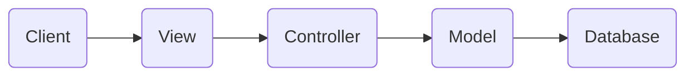

+ [author](http://nsddd.top)

# 第67节 深入学习 beego 源码

<div><a href = '66.md' style='float:left'>⬆️上一节🔗  </a><a href = '68.md' style='float: right'>  ⬇️下一节🔗</a></div>
<br>

> ❤️💕💕记录[sealos](https://github.com/cubxxw/sealos)开源项目的学习过程。[k8s，docker和云原生的学习](https://github.com/cubxxw/sealos)。Myblog:[http://nsddd.top](http://nsddd.top/)

---
[TOC]

## 介绍

Beego 用于快速开发 Go 中的企业应用程序，包括 RESTful API、Web 应用程序和后端服务。

**GitHub地址：**

+ [https://github.com/beego/beego/](https://github.com/beego/beego/)

---


**Beego由四个部分组成：**

1. 基础模块：包括日志模块、配置模块、调速器模块;
2. 任务：用于运行定时任务或周期性任务;
3. 客户端：包括ORM模块、httplib模块、缓存模块;
4. 服务器：包括网络模块。我们将来支持 gRPC;

Beego 就相当于是一个 **积木式集合**，将每一个模块都集成在项目中，比如说 cache 的缓存模块。


### MVC 架构

这里使用markdown Draw.io的mermaid扩展来画MVC架构图:



这个图展示了一个基本的MVC架构:- 客户端(Client)调用View层

- 客户端(Client)调用View层
- View层接收客户端请求，委托给Controller层
- Controller层调用Model层获取数据或业务逻辑
- Model层将请求转发给数据库
- 数据库查询响应，Model层将结果返回给Controller
- Controller层将Model层结果返回给View层
- View层将结果呈现给客户端

beego 使用的架构是 MVC 架构：


 流程图说明：

1. http请求从左侧main入口函数开始进入框架
2. UrL路由解析然后确定执行那个控制器(controller)
3. 执行请求前的过滤器 （过滤器一般用来拦截请求，例如做api签名校验，session处理，安全验证等等）
4. 执行控制器 （控制器根据需要调用model，session, 日志等模块）
5. 执行请求后的过滤器
6. 视图输出返回给用户


## 目录结构

beego 是一个 Go 语言开发的 Web 框架，它的目录结构如下:

- `app`: 用于放置应用程序的控制器、模型、视图等。

- `conf`: 用于放置配置文件，如 app.conf。

- `controllers`: 用于放置控制器代码，控制器负责解析用户的输入，处理后返回相应的结果。

- `models`: 用于放置模型代码，模型是与数据库交互的部分。

- `routers`: 用于设置 URL 路由映射，比如将 /user 映射到 controllers/user.go。

- `static`: 用于放置静态资源，如 JS、CSS、图片等。

- `tests`: 用于放置测试代码。

- `views`: 用于放置模板文件，beego 支持多种模板，如 goTemplate、fastTemplate 等。

- `main.go`: 程序入口文件，用于初始化 Beego。

- `conf/`: 用于存放配置文件

- `logs/`: 用于存放日志文件

除此之外，还有:

- `cache`: 用于设置缓存，如 redis、memcached 等。
- `toolbox`: 用于放置工具函数。
- `docs`: 用于放置文档。
- `plugins`: beego 的插件机制允许开发者扩展更多功能。


### Beego 安装

```bash
go get github.com/beego/beego/v2@latest
```

**命令：**

+ new：基于网站开发
+ api：手机接口开发
+ run：运行


## Beego 使用

### new

`new`: 用于创建一个 beego 项目的脚手架

```bash
beego new PROJECT_NAME
```

这个命令会创建一个文件夹 PROJECT_NAME,并在里面初始化 beego 项目的基本目录结构和文件。


### api

 `api`:用于快速创建 RESTful API 服务。格式为:

```bash
beego api [name] 
```

这个命令会自动在 controllers 目录下创建名为 name 的 API 控制器,并在 `conf/app.conf` 里注册该 API。


### run

`run`: 用于运行和编译 beego 项目。

```bash
beego run   # 运行项目
beego build # 编译项目
```

run 命令会监听文件变化并自动编译和重载,方便开发调试。build 命令会编译生成可执行文件,用于部署上线。

所以,如果你要开发一个 beego Web应用,通常的流程是:

1. 使用 beego new myproject 初始化项目

2. 编写代码(控制器、模型、路由等)

3. 使用 beego run 运行项目进行开发调试

4. 使用 beego build 编译发布可执行文件

5. 部署可执行文件到生产环境


## 使用

### 控制器的逻辑

```go
package controllers

import (
	beego "github.com/beego/beego/v2/server/web"
)

// 定义一个控制器结构体
// 我们一般一个模块定义一个控制器
type MainController struct {
    // 嵌套beego基础控制器，在go语言中嵌套struct，就类似继承的概念。
    // 这里就相当于，继承了beego.Controller的方法和属性。
	beego.Controller 
}

// 覆盖beego.Controller的Get方法，用于处理RESTful请求中的get请求
// beego.Controller默认支持多种RESTful方法，例如：Post、Put、Delete等等
func (c *MainController) Get() {
    // Data是继承过来的属性，是map类型，可以保存任意类型数据，主要用于保存请求响应数据
    // 我们可以通过Data将参数，传入视图模板文件。
	// 这里设置了两个参数
	c.Data["Website"] = "nsddd.com"
	c.Data["Email"] = "nsddd@demo.com"
	
	// 设置需要渲染的模板文件，框架会去views目录查找这个模板文件
	c.TplName = "index.tpl"
}
```


### 设置Url路由

```go
package routers

import (
	"nsddd/controllers"
	beego "github.com/beego/beego/v2/server/web"
)

// go 包初始化函数，go语言中在导入一个包的时候，如果被导入包存在init函数，会执行init函数
// 因此这里可以使用init函数初始化路由设置
func init() {
    // 使用beego.Router函数，注册路由规则。
    // 第一个参数是url路由，第二个参数是控制器
    // 这里的意思就是将访问 / 这个url的请求，交给controllers.MainController控制器处理。
    beego.Router("/", &controllers.MainController{})
}
```

如果我们增加下面路由设置:

```go
beego.Router("/nsddd", &controllers.MainController{})
```

访问:http://localhost:8080/nsddd 和 http://localhost:8080/ 得到的结果一样，因为这两个url地址都是由同一个控制器处理。

`beego RESTful`路由规则，默认是通过 **请求方法** 确认由那个控制器方法执行，例如get请求，由Get方法执行，POST请求由Post方法执行。


### 编写model逻辑

这里我们看一个mysql数据库操作的例子。

*定义表的结构：*

```mysql
CREATE TABLE `users` (
  `id` int(10) unsigned NOT NULL AUTO_INCREMENT COMMENT '自增ID',
  `username` varchar(30) NOT NULL COMMENT '账号',
  `password` varchar(100) NOT NULL COMMENT '密码',
   PRIMARY KEY (`id`)
  ) ENGINE=InnoDB DEFAULT CHARSET=utf8
```


### 初始化数据库连接

一般初始化数据库连接都是在main.go入口的地方设置一次就行，下面看下main.go文件改成什么样了。

```go
package main

import (
	beego "github.com/beego/beego/v2/server/web"
	"github.com/beego/beego/v2/client/orm"
	_ "nsddd/routers"
	//导入mysql驱动，这是必须的
	_ "github.com/go-sql-driver/mysql"
)

//初始化应用设置， 我们通过init函数初始化数据库连接，go语言中这个函数会优先执行
func init() {
    // 这里注册一个default默认数据库，数据库驱动是mysql.
    // 第三个参数是数据库dsn, 配置数据库的账号密码，数据库名等参数
    //  dsn参数说明：
    //      username    - mysql账号
    //      password    - mysql密码
    //      db_name     - 数据库名
    //      127.0.0.1:3306 - 数据库的地址和端口
	orm.RegisterDataBase("default", "mysql", "username:password@tcp(127.0.0.1:3306)/db_name?charset=utf8")
}

func main() {
	beego.Run()
}
```


### 初始化数据库连接

> 一般初始化数据库连接都是在main.go入口的地方设置一次就行，下面看下main.go文件改成什么样了。

```go
package main

import (
	beego "github.com/beego/beego/v2/server/web"
	"github.com/beego/beego/v2/client/orm"
	_ "nsddd/routers"
	//导入mysql驱动，这是必须的
	_ "github.com/go-sql-driver/mysql"
)

//初始化应用设置， 我们通过init函数初始化数据库连接，go语言中这个函数会优先执行
func init() {
    // 这里注册一个default默认数据库，数据库驱动是mysql.
    // 第三个参数是数据库dsn, 配置数据库的账号密码，数据库名等参数
    //  dsn参数说明：
    //      username    - mysql账号
    //      password    - mysql密码
    //      db_name     - 数据库名
    //      127.0.0.1:3306 - 数据库的地址和端口
	orm.RegisterDataBase("default", "mysql", "username:password@tcp(127.0.0.1:3306)/db_name?charset=utf8")
}

func main() {
	beego.Run()
}
```

为了初始化mysql连接，在入口main.go文件，增加init函数初始化数据库设置。


### 创建model

然后创建一个user model, 文件路径：nsddd/models/user.go , 代码如下

```go
package models

import (
	"github.com/beego/beego/v2/client/orm"
)

// 定义User模型，绑定users表结构, 其实就是用来保存sql查询结果。
type User struct {
	Id int
	Username string
	Password string
}

// 定义User 模型绑定那个表？
func (u *User) TableName() string {
    // 返回mysql表名
	return "users"
}

//初始化函数，可以用来向orm注册model
func init() {
    // 向orm注册user模型
	orm.RegisterModel(&User{})
}

// 根据id查询用户信息
func GetUserById(id int) *User {
	if  id == 0 {
		return  nil
	}
    
    // 创建orm对象, 后面都是通过orm对象操作数据库
	o := orm.NewOrm()
	
	// 初始化一个User模型对象
	user := User{}
	// 设置查询参数
	user.Id = id
	
	// 调用Read方法，根据user设置的参数，查询一条记录，结果保存到user结构体变量中
	// 默认是根据主键进行查询
	// 等价sql： SELECT `id`, `username`, `password` FROM `users` WHERE `id` = 1
	err := o.Read(&user)
	
	// 检测查询结果，
	if err == orm.ErrNoRows {
		// 找不到记录
		return nil
	} else if err == orm.ErrMissPK {
		// 找不到住建
		return nil
	}
	
	return &user
}
```


### 通过控制器调用model

修改 控制器的代码，事实上 控制器也是最后去操作的，我们第一步应该处理数据库的一些操作。

```go
func (c *MainController) Get() {
	c.Data["Website"] = "nsddd.com"
	c.Data["Email"] = "nsddd@demo.com"
	
	// 调用model，查询用户id为1 的用户信息
    user := models.GetUserById(1)
	
	// 然后将user数据保存到Data中, 将参数传给后面的views视图模板处理
	c.Data["user"] = user
	
	// 使用新的视图模板user.tpl
	c.TplName = "user.tpl"
}
```


### 编写view视图逻辑

这里编写一个新的视图模板, 代码如下:

```go
<!DOCTYPE html>
<html lang="zh-CN">
<head>
	<title>Demo</title>
	<meta charset="utf-8">
</head>
<body>
<h1>网站: {{.Website}}</h1>
{{ if .user }}
用户名: {{.user.Username}}
{{else}}
查找不到用户
{{ end }}
</body>
</html>
```

访问url: [http://localhost:8080](http://localhost:8080/), 如果查询的用户存在，则显示用户名，否则显示查找不到用户。


### 项目打包

项目完成后需要将代码打包发布到线上，这里依然推荐使用bee工具打包，bee工具可以一键将项目需要的相关文件一起打包成一个压缩包，只需要到线上解压即可。

下面是bee打包的例子， 首先将命令窗口的目录切换到 "项目根目录", 然后执行下面命令

```go
bee pack
```

打包成功后再项目根目录下生成一个 `nsddd.tar.gz` 的压缩包，命名格式: `${项目名}.tar.gz`

我们可以解压缩，看看压缩包包含什么内容：

```
nsddd.tar.gz
├── conf            - 配置文件存放目录,这里包含我们的配置文件
├── static          - 静态资源目录，包含我们静态资源文件
├── views           - 视图模板目录，包含模板文件
└── nsddd         - 这个就是我们的项目打包后的可执行程序，按我们项目命名
```


## beego 源码

官方提供的示例非常简单：

```go
package main

import "github.com/astaxie/beego"

func main() {
    beego.Run()
}
```

那么，从`Run()`方法开始，在[beego.go#179](https://github.com/astaxie/beego/blob/master/beego.go#L179)：

```go
func Run() {
    initBeforeHTTPRun()

    if EnableAdmin {
        go beeAdminApp.Run()
    }

    BeeApp.Run()
}
```

在最里面的看看 `initBeforeHTTPRun()`

```go
// TODO move to module init function
func initBeforeHTTPRun() {
	initHttpOnce.Do(func() {
		// init hooks
		AddAPPStartHook(
			registerMime,
			registerDefaultErrorHandler,
			registerSession,
			registerTemplate,
			registerAdmin,
			registerGzip,
			// registerCommentRouter,
		)

		for _, hk := range hooks {
			if err := hk(); err != nil {
				panic(err)
			}
		}
	})
}
```

从代码看到在`Run()`的第一步，初始化`AppConfig`，调用`hooks`，初始化`GlobalSessions`，编译模板`BuildTemplate()`，和加载中间件`middleware.RegisterErrorHandler()`，分别简单叙述。


### 加载配置

加载配置的代码是：

```go
if AppConfigPath != filepath.Join(AppPath, "conf", "app.conf") {
    err := ParseConfig()
    if err != nil && AppConfigPath != filepath.Join(workPath, "conf", "app.conf") {
        // configuration is critical to app, panic here if parse failed
        panic(err)
    }
}
```

判断配置文件是不是`AppPath/conf/app.conf`，如果不是就`ParseConfig()`。显然他之前就已经加载过一次了。找了一下，在[config.go#L152](https://github.com/astaxie/beego/blob/master/config.go#L152)，具体加载什么就不说明了。需要说明的是`AppPath`和`workPath`这俩变量。找到定义[config.go#72](https://github.com/astaxie/beego/blob/master/config.go#L72)：

```go
workPath, _ = os.Getwd()
workPath, _ = filepath.Abs(workPath)
// initialize default configurations
AppPath, _ = filepath.Abs(filepath.Dir(os.Args[0]))

AppConfigPath = filepath.Join(AppPath, "conf", "app.conf")

if workPath != AppPath {
    if utils.FileExists(AppConfigPath) {
        os.Chdir(AppPath)
    } else {
        AppConfigPath = filepath.Join(workPath, "conf", "app.conf")
    }
}
```

`workPath`是`os.Getwd()`，即当前的目录；`AppPath`是`os.Args[0]`，即二进制文件所在目录。有些情况下这两个是不同的。比如把命令加到`PATH`中，然后cd到别的目录执行。`beego`以二进制文件所在目录为优先。如果二进制文件所在目录没有发现`conf/app.conf`，再去`workPath`里找。


### Hooks

`hooks`就是钩子，在加载配置后就执行，这是要做啥呢？在 [beego.go#L173](https://github.com/astaxie/beego/blob/master/beego.go#L173) 添加新的hook：

```go
// The hookfunc will run in beego.Run()
// such as sessionInit, middlerware start, buildtemplate, admin start
func AddAPPStartHook(hf hookfunc) {
    hooks = append(hooks, hf)
}
```

`hooks`的定义在[beego.go#L19](https://github.com/astaxie/beego/blob/master/beego.go#L19)：

```go
type hookfunc func() error //hook function to run
var hooks []hookfunc       //hook function slice to store the hookfunc
```

`hook`就是`func() error`类型的函数。那么为什么调用`hooks`可以实现代码注释中的如`middleware start, build template`呢？因为`beego`使用的是单实例的模式。


### 单实例

`beego`的核心结构是`beego.APP`，保存路由调度结构`*beego.ControllerRegistor`。从`beego.Run()`方法的代码`BeeApp.Run()`发现，`beego`有一个全局变量`BeeApp`是实际调用的`*beego.APP`实例。也就是说整个`beego`就是一个实例，不需要类似`NewApp()`这样的写法。

因此，很多结构都作为全局变量如`beego.BeeApp`暴露在外。详细的定义在 [config.go#L18](https://github.com/astaxie/beego/blob/master/config.go#L18)，特别注意一下`SessionProvider(string)`，马上就要提到。


### 会话 `GlobalSessions`

继续`beego.Run()`的阅读，`hooks`调用完毕后，初始化会话`GlobalSessions`：

```
if SessionOn {
    var err error
    sessionConfig := AppConfig.String("sessionConfig")
    if sessionConfig == "" {
        sessionConfig = `{"cookieName":"` + SessionName + `",` +
            `"gclifetime":` + strconv.FormatInt(SessionGCMaxLifetime, 10) + `,` +
            `"providerConfig":"` + SessionSavePath + `",` +
            `"secure":` + strconv.FormatBool(HttpTLS) + `,` +
            `"sessionIDHashFunc":"` + SessionHashFunc + `",` +
            `"sessionIDHashKey":"` + SessionHashKey + `",` +
            `"enableSetCookie":` + strconv.FormatBool(SessionAutoSetCookie) + `,` +
            `"cookieLifeTime":` + strconv.Itoa(SessionCookieLifeTime) + `}`
    }
    GlobalSessions, err = session.NewManager(SessionProvider,
        sessionConfig)
    if err != nil {
        panic(err)
    }
    go GlobalSessions.GC()
}
```

`beego.SessionOn`定义是否启动Session功能，然后`sessionConfig`是Session的配置，如果配置为空，就使用拼接的默认配置。`sessionConfig`是json格式。

`session.NewManager()`返回`*session.Manager`，session的数据存储引擎是`beego.SessionProvider`定义，比如"file”，文件存储。

`go GlobalSessions.GC()`开启一个goroutine来处理session的回收。阅读一下`GC()`的代码，在 [session/session.go#L183](https://github.com/astaxie/beego/blob/master/session/session.go#L183)：

```
func (manager *Manager) GC() {
    manager.provider.SessionGC()
    time.AfterFunc(time.Duration(manager.config.Gclifetime)*time.Second, func() { manager.GC() })
}
```

这是个**无限循环**。`time.AfterFunc()`在经过一段时间间隔`time.Duration(...)`之后，又调用自己，相当于又开始启动`time.AfterFunc()`等待下一次到期。`manager.provider.SessionGC()`是不同session存储引擎的回收方法（其实是`session.Provider`接口的）。


###  模板构建

继续`beego.Run()`，session初始化后，构建模板：

```
err := BuildTemplate(ViewsPath)
```

`beego.ViewsPath`是模板的目录啦，不多说。仔细来看看`BuildTemplate()`函数，[template.goL#114](https://github.com/astaxie/beego/blob/master/template.go#L114)：

```
// build all template files in a directory.
// it makes beego can render any template file in view directory.
func BuildTemplate(dir string) error {
    if _, err := os.Stat(dir); err != nil {
        if os.IsNotExist(err) {
            return nil
        } else {
            return errors.New("dir open err")
        }
    }
    self := &templatefile{
        root:  dir,
        files: make(map[string][]string),
    }
    err := filepath.Walk(dir, func(path string, f os.FileInfo, err error) error {
        return self.visit(path, f, err)
    })
    if err != nil {
        fmt.Printf("filepath.Walk() returned %v\n", err)
        return err
    }
    for _, v := range self.files {
        for _, file := range v {
            t, err := getTemplate(self.root, file, v...)
            if err != nil {
                Trace("parse template err:", file, err)
            } else {
                BeeTemplates[file] = t
            }
        }
    }
    return nil
}
```

比较复杂。一点点来看，`os.Stat(dir)`判断目录是否存在。`filepath.Walk()`走一边目录里的文件，记录在`self.files`里面。循环`self.files`中的`file`（map[dir][]file])，用`getTemplate`获取`*template.Template`实例，保存在`beego.BeeTemplates`（map[string]*template.Template）。

为什么要**预先编译**模板？想像一下，如果每次请求，都去寻找模板再编译一遍。这显然是个浪费的。而且如果模板复杂，嵌套众多，编译速度会是很大的问题。因此存下编译好的`*template.Template`是必然的选择。但是，编译后模板的修改不能立即响应了，怎么办呢？先继续看下去。


### 中间件

`middleware`包目前似乎只有错误处理的功能。

```
middleware.RegisterErrorHandler()
```

只是注册默认的错误处理方法 `middleware.NotFound` 等几个。


### beeAdminApp

```
if EnableAdmin {
    go beeAdminApp.Run()
}
```

`beeAdminApp`也是一个`*beego.adminApp`，负责系统监控、性能检测、访问统计和健康检查等。具体的介绍和使用可以访问[文档](http://www.oschina.net/#)。


## HTTP服务

写了这么多，终于要开始讲核心结构`beego.BeeApp`的启动：

```
BeeApp.Run()
```

`Run()`的实现代码在[app.go#L29](https://github.com/astaxie/beego/blob/master/app.go#L29)。代码较长，看看最重要的一段：

```
if UseFcgi {
    if HttpPort == 0 {
        l, err = net.Listen("unix", addr)
    } else {
        l, err = net.Listen("tcp", addr)
    }
    if err != nil {
        BeeLogger.Critical("Listen: ", err)
    }
    err = fcgi.Serve(l, app.Handlers)
} else {
    if EnableHotUpdate {
        server := &http.Server{
            Handler:      app.Handlers,
            ReadTimeout:  time.Duration(HttpServerTimeOut) * time.Second,
            WriteTimeout: time.Duration(HttpServerTimeOut) * time.Second,
        }
        laddr, err := net.ResolveTCPAddr("tcp", addr)
        if nil != err {
            BeeLogger.Critical("ResolveTCPAddr:", err)
        }
        l, err = GetInitListener(laddr)
        theStoppable = newStoppable(l)
        err = server.Serve(theStoppable)
        theStoppable.wg.Wait()
        CloseSelf()
    } else {
        s := &http.Server{
            Addr:         addr,
            Handler:      app.Handlers,
            ReadTimeout:  time.Duration(HttpServerTimeOut) * time.Second,
            WriteTimeout: time.Duration(HttpServerTimeOut) * time.Second,
        }
        if HttpTLS {
            err = s.ListenAndServeTLS(HttpCertFile, HttpKeyFile)
        } else {
            err = s.ListenAndServe()
        }
    }
}
```

`beego.UseFcgi`定义是否使用`fast-cgi`服务，而不是HTTP。另一部分是启动HTTP。里面有个重要功能`EnableHotUpdate`————**热更新**。对他的描述，可以看看官方[文档](http://beego.me/docs/advantage/reload.md)。


### 2.1 HTTP过程总览

上面的代码看得到`*http.Server.Handler`是`app.Handlers`，即`*beego.ControllerRegistor`，`ServeHTTP`就定义在代码[router.go#L431](https://github.com/astaxie/beego/blob/master/router.go#L431)。非常长，我们检出重要的部分来说说。

首先是要创建当前请求的上下文：

```
// init context
context := &beecontext.Context{
    ResponseWriter: w,
    Request:        r,
    Input:          beecontext.NewInput(r),
    Output:         beecontext.NewOutput(),
}
context.Output.Context = context
context.Output.EnableGzip = EnableGzip
```

`context`的类型是`*context.Context`，把当前的`w(http.ResponseWriter)`和`r(*http.Request)`写在`context`的字段中。

然后，定义了过滤器`filter`的调用方法，把`context`传递给过滤器操作：

```
do_filter := func(pos int) (started bool) {
    if p.enableFilter {
        if l, ok := p.filters[pos]; ok {
            for _, filterR := range l {
                if ok, p := filterR.ValidRouter(r.URL.Path); ok {
                    context.Input.Params = p
                    filterR.filterFunc(context)
                    if w.started {
                        return true
                    }
                }
            }
        }
    }
    return false
}
```

然后，加载Session：

```
if SessionOn {
    context.Input.CruSession = GlobalSessions.SessionStart(w, r)
    defer func() {
        context.Input.CruSession.SessionRelease(w)
    }()
}
```

`defer`中的`SessionRelease()`是将session持久化到存储引擎中，比如写入文件保存。

然后，判断请求方式是否支持：

```
if !utils.InSlice(strings.ToLower(r.Method), HTTPMETHOD) {
    http.Error(w, "Method Not Allowed", 405)
    goto Admin
}
```

这里看一看到 `goto Admin`，就是执行`AdminApp`的监控操作，记录这次请求的相关信息。`Admin`定义在整个HTTP执行的最后：

```
Admin:
    //admin module record QPS
    if EnableAdmin {
        timeend := time.Since(starttime)
        if FilterMonitorFunc(r.Method, requestPath, timeend) {
            if runrouter != nil {
                go toolbox.StatisticsMap.AddStatistics(r.Method, requestPath, runrouter.Name(), timeend)
            } else {
                go toolbox.StatisticsMap.AddStatistics(r.Method, requestPath, "", timeend)
            }
        }
    }
```

所以`goto Admin`直接就跳过中间过程，走到HTTP执行的最后了。显然，当请求方式不支持的时候，直接跳到HTTP执行最后。如果不启用`AdminApp`，那就是HTTP执行过程结束。

继续阅读，开始处理静态文件了：

```
if serverStaticRouter(context) {
    goto Admin
}
```

然后处理POST请求的内容体：

```
if context.Input.IsPost() {
    if CopyRequestBody && !context.Input.IsUpload() {
        context.Input.CopyBody()
    }
    context.Input.ParseFormOrMulitForm(MaxMemory)
}
```

执行两个前置的过滤器：

```
if do_filter(BeforeRouter) {
    goto Admin
}

if do_filter(AfterStatic) {
    goto Admin
}
```

不过我觉得这俩顺序怪怪的，应该先`AfterStatic`后`BeforeRouter`。需要注意，过滤器如果返回`false`，整个执行就结束（跳到最后）。

继续阅读，然后判断有没有指定执行的控制器和方法：

```
if context.Input.RunController != nil && context.Input.RunMethod != "" {
    findrouter = true
    runMethod = context.Input.RunMethod
    runrouter = context.Input.RunController
}
```

如果过滤器执行后，对`context`指定了执行的控制器和方法，就用指定的。

继续，路由的寻找开始，有三种路由：

```
if !findrouter {
    for _, route := range p.fixrouters {
        n := len(requestPath)
        if requestPath == route.pattern {
            runMethod = p.getRunMethod(r.Method, context, route)
            if runMethod != "" {
                runrouter = route.controllerType
                findrouter = true
                break
            }
        }
        //......
    }
}
```

`p.fixrouters`就是不带正则的路由，比如`/user`。`route.controllerType`的类型是`reflect.Type`，后面会用来创建控制器实例。`p.getRunMethod()`获取实际请求方式。为了满足浏览器无法发送表单`PUT`和`DELETE`方法，可以用表单域`_method`值代替。（注明一下`p`就是`*beego.ControllerRegistor`。

接下来当然是正则的路由：

```
if !findrouter {
    //find a matching Route
    for _, route := range p.routers {

        //check if Route pattern matches url
        if !route.regex.MatchString(requestPath) {
            continue
        }
        // ......
        runMethod = p.getRunMethod(r.Method, context, route)
        if runMethod != "" {
            runrouter = route.controllerType
            context.Input.Params = params
            findrouter = true
            break
        }
    }
}
```

正则路由比如`/user/:id:int`，这种带参数的。匹配后的参数会记录在`context.Input.Params`中。

还没找到，就看看是否需要自动路由：

```
if !findrouter && p.enableAuto {
    // ......
    for cName, methodmap := range p.autoRouter {
        // ......
    }
}
```

把所有路由规则走完，还是没有找到匹配的规则：

```
if !findrouter {
    middleware.Exception("404", rw, r, "")
    goto Admin
}
```

另一种情况就是找到路由规则咯，且看下文。


### 2.2 路由调用

上面的代码发现路由的调用依赖`runrouter`和`runmethod`变量。他们值觉得了到底调用什么控制器和方法。来看看具体实现：

```
if findrouter {
    //execute middleware filters
    if do_filter(BeforeExec) {
        goto Admin
    }

    //Invoke the request handler
    vc := reflect.New(runrouter)
    execController, ok := vc.Interface().(ControllerInterface)
    if !ok {
        panic("controller is not ControllerInterface")
    }

    //call the controller init function
    execController.Init(context, runrouter.Name(), runMethod, vc.Interface())

    //if XSRF is Enable then check cookie where there has any cookie in the  request's cookie _csrf
    if EnableXSRF {
        execController.XsrfToken()
        if r.Method == "POST" || r.Method == "DELETE" || r.Method == "PUT" ||
            (r.Method == "POST" && (r.Form.Get("_method") == "delete" || r.Form.Get("_method") == "put")) {
            execController.CheckXsrfCookie()
        }
    }

    //call prepare function
    execController.Prepare()

    if !w.started {
        //exec main logic
        switch runMethod {
        case "Get":
            execController.Get()
        case "Post":
            execController.Post()
        case "Delete":
            execController.Delete()
        case "Put":
            execController.Put()
        case "Head":
            execController.Head()
        case "Patch":
            execController.Patch()
        case "Options":
            execController.Options()
        default:
            in := make([]reflect.Value, 0)
            method := vc.MethodByName(runMethod)
            method.Call(in)
        }

        //render template
        if !w.started && !context.Input.IsWebsocket() {
            if AutoRender {
                if err := execController.Render(); err != nil {
                    panic(err)
                }

            }
        }
    }

    // finish all runrouter. release resource
    execController.Finish()

    //execute middleware filters
    if do_filter(AfterExec) {
        goto Admin
    }
}
```

研读一下，最开始的又是过滤器：

```
if do_filter(BeforeExec) {
    goto Admin
}
```

`BeforeExec`执行控制器方法前的过滤。

然后，创建一个新的控制器实例：

```
vc := reflect.New(runrouter)
execController, ok := vc.Interface().(ControllerInterface)
if !ok {
    panic("controller is not ControllerInterface")
}

//call the controller init function
execController.Init(context, runrouter.Name(), runMethod, vc.Interface())
```

`reflect.New()`创建新的实例，用`vc.Interface().(ControllerInterface)`取出，调用接口的`Init`方法，将请求的上下文等传递进去。
这里就说明为什么不能存下控制器实例给每次请求使用，因为每次请求的上下文是**不同的**。

```
execController.Prepare()
```

控制器的准备工作，这里可以写用户登录验证等。

然后根据`runmethod`执行控制器对应的方法，非接口定义的方法，用`reflect.Call`调用。

```
if !w.started && !context.Input.IsWebsocket() {
    if AutoRender {
        if err := execController.Render(); err != nil {
            panic(err)
        }
    }
}
```

如果自动渲染`AutoRender`，就调用`Render()`方法渲染页面。

```
execController.Finish()

//execute middleware filters
if do_filter(AfterExec) {
    goto Admin
}
```

控制器最后一刀`Finish`搞定，然后过滤器`AfterExec`使用。

总结起来，`beego.ControllerInterface`接口方法的`Init`,`Prepare`,`Render`和`Finish`发挥很大作用。那就来研究一下。


##  控制器和视图


###  控制器接口

控制器接口`beego.ControllerInterface`的定义在[controller.go#L47](https://github.com/astaxie/beego/blob/master/controller.go#L47)：

```
type ControllerInterface interface {
    Init(ct *context.Context, controllerName, actionName string, app interface{})
    Prepare()
    Get()
    Post()
    Delete()
    Put()
    Head()
    Patch()
    Options()
    Finish()
    Render() error
    XsrfToken() string
    CheckXsrfCookie() bool
}
```

官方的实现`beego.Controller`定义在[controller.go#L29](https://github.com/astaxie/beego/blob/master/controller.go#L29)：

```
type Controller struct {
    Ctx            *context.Context
    Data           map[interface{}]interface{}
    controllerName string
    actionName     string
    TplNames       string
    Layout         string
    LayoutSections map[string]string // the key is the section name and the value is the template name
    TplExt         string
    _xsrf_token    string
    gotofunc       string
    CruSession     session.SessionStore
    XSRFExpire     int
    AppController  interface{}
    EnableReander  bool
}
```

内容好多，没必要全部都看看，重点在`Init`,`Prepare`,`Render`和`Finish`这四个。


###  控制器的实

`Init`方法：

```
// Init generates default values of controller operations.
func (c *Controller) Init(ctx *context.Context, controllerName, actionName string, app interface{}) {
    c.Layout = ""
    c.TplNames = ""
    c.controllerName = controllerName
    c.actionName = actionName
    c.Ctx = ctx
    c.TplExt = "tpl"
    c.AppController = app
    c.EnableReander = true
    c.Data = ctx.Input.Data
}
```

没什么话说，一堆赋值。唯一要谈的是`c.EnableReander`，这种拼写错误实在是，掉阴沟里。实际的意思是`EnableRender`。

`Prepare`和`Finish`方法：

```
// Prepare runs after Init before request function execution.
func (c *Controller) Prepare() {

}

// Finish runs after request function execution.
func (c *Controller) Finish() {

}
```

空的！原来我要自己填内容啊。

`Render`方法：

```
// Render sends the response with rendered template bytes as text/html type.
func (c *Controller) Render() error {
    if !c.EnableReander {
        return nil
    }
    rb, err := c.RenderBytes()

    if err != nil {
        return err
    } else {
        c.Ctx.Output.Header("Content-Type", "text/html; charset=utf-8")
        c.Ctx.Output.Body(rb)
    }
    return nil
}
```


### 视图渲染

渲染的核心方法是`c.RenderBytes()`:

```
// RenderBytes returns the bytes of rendered template string. Do not send out response.
func (c *Controller) RenderBytes() ([]byte, error) {
    //if the controller has set layout, then first get the tplname's content set the content to the layout
    if c.Layout != "" {
        if c.TplNames == "" {
            c.TplNames = strings.ToLower(c.controllerName) + "/" + strings.ToLower(c.actionName) + "." + c.TplExt
        }
        if RunMode == "dev" {
            BuildTemplate(ViewsPath)
        }
        newbytes := bytes.NewBufferString("")
        if _, ok := BeeTemplates[c.TplNames]; !ok {
            panic("can't find templatefile in the path:" + c.TplNames)
            return []byte{}, errors.New("can't find templatefile in the path:" + c.TplNames)
        }
        err := BeeTemplates[c.TplNames].ExecuteTemplate(newbytes, c.TplNames, c.Data)
        if err != nil {
            Trace("template Execute err:", err)
            return nil, err
        }
        tplcontent, _ := ioutil.ReadAll(newbytes)
        c.Data["LayoutContent"] = template.HTML(string(tplcontent))

        if c.LayoutSections != nil {
            for sectionName, sectionTpl := range c.LayoutSections {
                if sectionTpl == "" {
                    c.Data[sectionName] = ""
                    continue
                }

                sectionBytes := bytes.NewBufferString("")
                err = BeeTemplates[sectionTpl].ExecuteTemplate(sectionBytes, sectionTpl, c.Data)
                if err != nil {
                    Trace("template Execute err:", err)
                    return nil, err
                }
                sectionContent, _ := ioutil.ReadAll(sectionBytes)
                c.Data[sectionName] = template.HTML(string(sectionContent))
            }
        }

        ibytes := bytes.NewBufferString("")
        err = BeeTemplates[c.Layout].ExecuteTemplate(ibytes, c.Layout, c.Data)
        if err != nil {
            Trace("template Execute err:", err)
            return nil, err
        }
        icontent, _ := ioutil.ReadAll(ibytes)
        return icontent, nil
    } else {
        //......
    }
    return []byte{}, nil
}
```

看起来很复杂，主要是两种情况，有没有Layout。如果有Layout：

```
err := BeeTemplates[c.TplNames].ExecuteTemplate(newbytes, c.TplNames, c.Data)
// ......
tplcontent, _ := ioutil.ReadAll(newbytes)
c.Data["LayoutContent"] = template.HTML(string(tplcontent))
```

渲染模板文件，就是布局的主内容。

```
for sectionName, sectionTpl := range c.LayoutSections {
    if sectionTpl == "" {
        c.Data[sectionName] = ""
        continue
    }

    sectionBytes := bytes.NewBufferString("")
    err = BeeTemplates[sectionTpl].ExecuteTemplate(sectionBytes, sectionTpl, c.Data)
    // ......
    sectionContent, _ := ioutil.ReadAll(sectionBytes)
    c.Data[sectionName] = template.HTML(string(sectionContent))
}
```

渲染布局里的别的区块`c.LayoutSections`。

```
ibytes := bytes.NewBufferString("")
err = BeeTemplates[c.Layout].ExecuteTemplate(ibytes, c.Layout, c.Data)
// ......
icontent, _ := ioutil.ReadAll(ibytes)
return icontent, nil
```

最后是渲染布局文件，`c.Data`里带有所有布局的主内容和区块，可以直接赋值在布局里。

渲染过程有趣的代码：

```
if RunMode == "dev" {
    BuildTemplate(ViewsPath)
}
```

开发状态下，每次渲染都会重新`BuildTemplate()`。这样就可以理解，最初渲染模板并存下`*template.Template`，生产模式下，是不会响应即时的模版修改。


## END 链接

<ul><li><div><a href = '66.md' style='float:left'>⬆️上一节🔗  </a><a href = '68.md' style='float: right'>  ️下一节🔗</a></div></li></ul>

+ [Ⓜ️回到目录🏠](../README.md)

+ [**🫵参与贡献💞❤️‍🔥💖**](https://nsddd.top/archives/contributors))

+ ✴️版权声明 &copy; ：本书所有内容遵循[CC-BY-SA 3.0协议（署名-相同方式共享）&copy;](http://zh.wikipedia.org/wiki/Wikipedia:CC-by-sa-3.0协议文本) 
