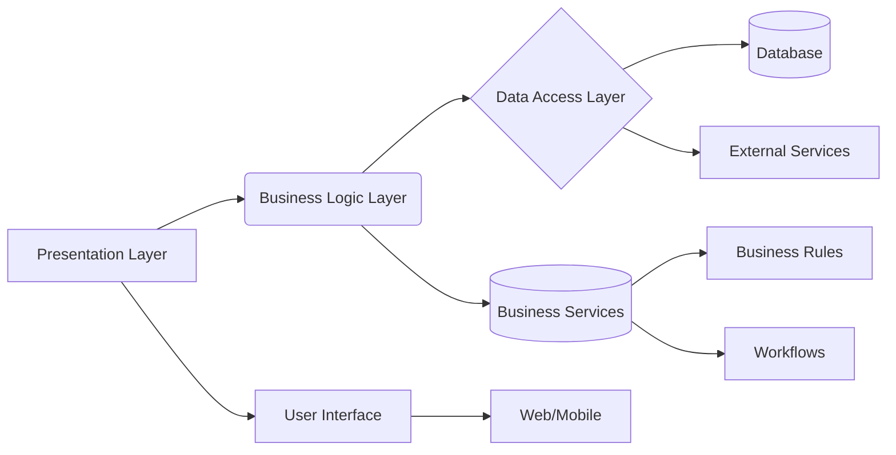
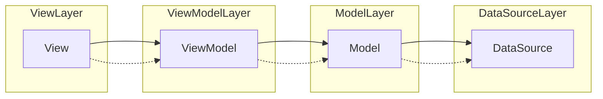
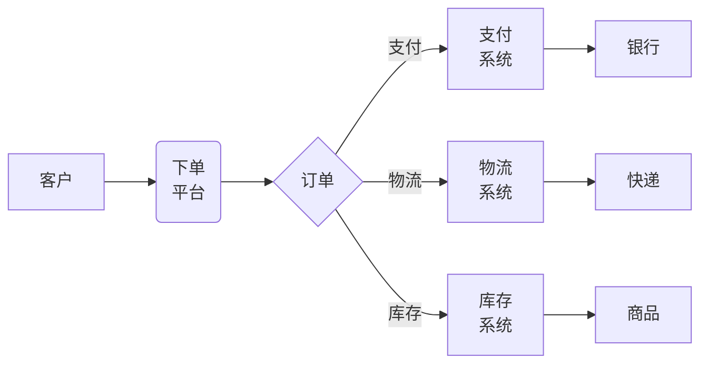
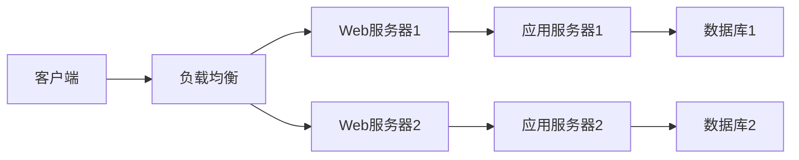
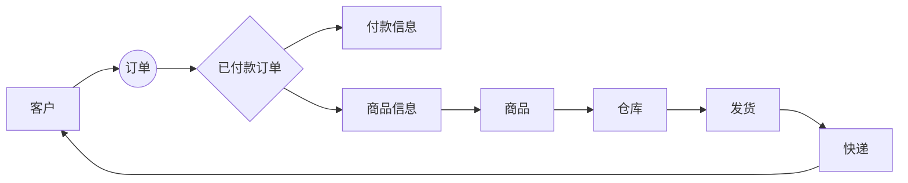

+ [author](http://nsddd.top)

# 第70节 架构设计

<div><a href = '69.md' style='float:left'>⬆️上一节🔗  </a><a href = '71.md' style='float: right'>  ⬇️下一节🔗</a></div>
<br>

> ❤️💕💕记录[sealos](https://github.com/cubxxw/sealos)开源项目的学习过程。[k8s,docker和云原生的学习](https://github.com/cubxxw/sealos)。Myblog:[http://nsddd.top](http://nsddd.top/)

---
[TOC]

## 什么是架构设计

首先，我们从架构层面大致可以分为：系统架构和应用架构。

+ **系统架构：** 系统架构通常来指的是 **网络架构**
+ **应用架构：** 应用架构通常来指的是 **代码架构**

架构，又名软件架构，是有关软件整体结构与组件的抽象描述，用于指导大型软件系统各个方面的设计。

> **Note**
>
> 这里是不严谨的，在软件设计中架构域是如何划分的，架构域包括：**业务架构、数据架构、产品架构、应用架构、技术架构**。首先需要熟悉业务，形成业务架构，根据业务架构，做出相应的数据架构和应用架构，最后通过技术架构落地实施。业务架构是战略，应用架构是承上启下，一方面承接业务架构的落地，另一方面影响技术架构的选型。如何针对当前需求，选择合适的架构，如何面向未来，保证架构平滑过渡，这个是软件开发者，特别是架构师，都需要深入思考的问题。


**为什么需要架构设计？**

以前系统简单，一个应用部署在一台服务器上，且大部分开发工作是CRUD，应用结构简单，且易于维护。随着系统业务复杂度越来越高，功能模块越来越庞大，耦合度也越来越高，导致系统的复杂度越来越不可控。

为了更好的降低应用及模块间的耦合度，于是，诞生了一些我们熟知的网络架构（分布式微服务）和应用架构（三层架构、MVC架构，在此架构上又出现了一些框架，如 **SSM框架**、SSH框架等，使用框架的好处就是结构清晰易于维护）。

+ 对于系统的架构，它的本质是什么，它对产品有何影响？
+ 架构分为哪几类？
+ 为什么要画架构图，可以不画架构图吗？
+ 架构图该怎么画，怎么让画架构图不那么痛苦？

 

## MVC 架构

**MVC 架构包含以下三个组件:**

- Model(模型):用于处理应用程序数据逻辑的对象。它负责在持久层与领域层之间进行数据交换。

- View(视图):用于展示模型/领域中的数据。通常处理数据显示与用户交互。

- Controller(控制器):用于处理业务逻辑和指导模型与视图之间的数据流向。它接收来自视图的输入,并调用模型和视图来返回结果。

**这三个组件之间通过松耦合的方式相互作用:**

- Controller 与 Model 之间通过接口相连
- Controller 与 View 之间通过接口相连
- Model 与 View 之间没有直接的联系,都通过 Controller 进行通信

```
┌─────────────────────────┐   
│            │            │   
│   View     │   Model    │
│            │            │
│  显示数据    │  数据模型   │  
│            │            │   
└──────────┬──────────────┘
           │      
┌──────────▼───────────┐
│   Controller         │  
│                      │  
│  控制数据流向          │      
│  处理用户输入          │
│  返回结果给 View      │      
└─────────────────────┘
```


### 占主导地位的控制器

MVC 架构模式的三个组成部分：Model、View 和 Controller 中最重要的就是控制器，它承担了整个架构中的大部分业务逻辑，同时在用户请求到达或者事件发生时都会首先通知控制器并由它来决定如何响应这次请求或者事件。


在 MVC 中，所有的用户请求都会首先交给控制器，再由控制器来决定如何响应用户的输入，无论是更新模型中的信息还是渲染相应的视图，都是通过控制器来决定的；也就是说，在 MVC 中，控制器占据主导地位，它决定用户的输入是如何被处理的。


### 被动的模型

在绝大多数的 MVC 架构模式中，模型都不会主动向视图或者控制器推送消息；模型都是被动的，它只存储整个应用中的数据，而信息的获取和更新都是由控制器来驱动的。


但是当模型中的数据发生变化时，却需要通过一些方式通知对应的视图进行更新，在这种情况下其实也不需要模型**主动**将数据变化的消息推送给视图；因为所有对于模型层的改变都是**由用户的操作导致的**，而用户的操作都是通过控制器来处理的，所以只需要在控制器改变模型时，将更新的信息发送给视图就可以了；当然，我们也可以通过**观察者模式**向未知的观察者发送通知，以保证状态在不同模块之间能够保持同步。


## 三层架构

三层架构就是为了符合“高内聚，低耦合”思想，把各个功能模块划分为表示层（UI）、业务逻辑层（BLL）和数据访问层（DAL）三层架构。

+ 表示层（UI）：位于三层构架的最上层，与用户直接接触，表示层就是实现用户的界面功能，也是系统数据的输入与输出，是为用户传达和反馈信息的。
+ 业务逻辑层（BLL）：是针对具体的问题的操作，也可以理解成对数据层的操作，对数据业务逻辑处理。同时也是表示层与数据层的桥梁，实现三层之间的数据连接和指令传达。
+ 数据访问层（DAL）：有时候也称为是持久层，主要功能是对原始数据(数据库或者文本文件等存放数据的形式)的操作（实现数据的增加、删除、修改、查询等）。具体为业务逻辑层或表示层提供数据服务。




## MVC 架构和 三层架构对比

在实际开发中很多人将 MVC 当成三层架构在用，比如说，很多人喜欢把软件的业务逻辑放在 Controller 层里，将数据库访问操作的代码放在 Model 层里，软件最终的代码放在 View 层里，就这样硬生生将 MVC 架构变成了伪三层架构。

这种代码不仅不伦不类，同时也失去了三层架构和 MVC 架构的核心优势，也就是：**通过 Controller 层将 Model 层和 View 层解耦，从而使代码更容易维护和扩展。** 因此在实际开发中，我们也要注意遵循 MVC 架构的开发规范，发挥 MVC 的核心价值。

无论是MVC架构还是三层架构，都是一种规范，都是奔着"**高耦合，低内聚**"的思想来设计的。

MVC架构主要是为了解决应用程序用户界面的样式替换问题，把视图层尽可能的和业务代码分离。


以下是MVC架构图：

     ┌──────────┐               ┌────────────┐
     │  Model   │               │   View     │
     ├──────────┤               ├────────────┤
     │          ├─ ─ ─ 数据 ─ ─> │            │
     │          │               │            │
     └──────────┘               │            │
                                │            │
     ┌──────────┐               ├────────────┤
     │Controller│               │            │
     ├──────────┤               │            │
     │          ├─ ─ ─ 操作 ─ ─> │            │
     │          │               └────────────┘
     └──────────┘


以下是三层架构图：

     ┌──────────┐               ┌────────────┐
     │  表示层   │               │   数据层    │
     ├──────────┤               ├────────────┤
     │          ├─ ─ ─ 数据 ─ ─> │            │
     │          │               │            │
     └──────────┘               │            │
                                │            │
     ┌──────────┐               ├────────────┤
     │  业务层   │               │            │
     ├──────────┤               │            │
     │          ├─ ─ ─ 逻辑 ─ ─> │            │
     │          │               └────────────┘
     └──────────┘               ┌────────────┐
                                │   存储层    │
                                ├────────────┤
                                │            │
                                │            │
                                └────────────┘


MVC架构和三层架构的区别：

- MVC架构是将整个应用分为三个部分：模型、视图和控制器，以实现更好的代码重用和可维护性。而三层架构是将整个应用分为三个层次：表示层、业务层和数据层，以实现更好的分层和松耦合。
- 在MVC架构中，控制器负责处理用户请求并更新模型和视图。模型代表了应用程序中的业务逻辑和数据。视图显示模型中的数据并允许用户与之交互。在三层架构中，表示层负责显示用户界面和接收用户输入。业务层包含应用程序的业务逻辑。数据层处理与数据存储和访问相关的问题。
- MVC架构更适合Web应用程序，因为Web应用程序通常具有明确的用户界面和业务逻辑。三层架构更适合大型企业应用程序，因为这些应用程序可能需要处理复杂的业务逻辑和多种数据源。

使用场景：

- MVC架构适合Web应用程序，尤其是需要良好可维护性和可扩展性的应用程序。
- 三层架构适合大型企业应用程序，特别是需要处理复杂业务逻辑和多种数据源的应用程序。


## MVP 架构

在整个 GUI 编程领域，MVC 已经拥有将近 50 年的历史了。早在几十年前，Smalltalk-76 就对 MVC 架构模式进行了实现，在随后的几十年历史中，MVC 产生了很多的变种，例如：HMVC、MVA、MVP、MVVM 和其它将 MVC 运用于其它不同领域的模式。

**那么后面的 MVA、MVP 和 MVVM 架构是什么样子的？**

MVP 架构模式是 MVC 的一个变种，很多框架都自称遵循 MVC 架构模式，但是它们实际上却实现了 MVP 模式；MVC 与 MVP 之间的区别其实并不明显，作者认为两者之间最大的区别就是 MVP 中使用 Presenter 对视图和模型进行了解耦，它们彼此都对对方一无所知，沟通都通过 Presenter 进行。

MVP 作为一个比较有争议的架构模式，在维基百科的 [Model-view-presenter](https://en.wikipedia.org/wiki/Model–view–presenter) 词条中被描述为 MVC 设计模式的变种（derivation），自上个世纪 90 年代出现在 IBM 之后，随着不断的演化，虽然有着很多分支，不过 Martin Fowler 对 MVP 架构模式的定义最终被广泛接受和讨论。


在 MVP 中，`Presenter` 可以理解为松散的控制器，其中包含了视图的 UI 业务逻辑，所有从视图发出的事件，都会通过代理给 Presenter 进行处理；同时，Presenter 也通过视图暴露的接口与其进行通信。

目前常见的 MVP 架构模式其实都是它的变种：[Passive View](https://www.martinfowler.com/eaaDev/PassiveScreen.html) 和 [Supervising Controller](https://www.martinfowler.com/eaaDev/SupervisingPresenter.html)，接下来的内容也是围绕这两种变种进行展开的。


### 被动视图

MVP 的第一个主要变种就是被动视图（Passive View）；顾名思义，在该变种的架构模式中，视图层是被动的，它本身不会改变自己的任何的状态，所有的状态都是通过 Presenter 来间接改变的。


被动的视图层就像前端中的 HTML 和 CSS 代码，只负责展示视图的结构和内容，本身不具有任何的逻辑：


### 依赖关系

视图成为了完全被动的并且不再根据模型来更新视图本身的内容，也就是说，不同于 MVC 中的依赖关系；在被动视图中，视图层对于模型层没有任何的依赖：


因为视图层不依赖与其他任何层级也就最大化了视图层的可测试性，同时也将视图层和模型层进行了合理的分离，两者不再相互依赖。


### 通信方式

被动视图的示意图中一共有四条线，用于表示 Model、View 和 Presenter 之间的通信：


1. 当视图接收到来自用户的事件时，会将事件转交给 Presenter 进行处理；
2. 被动的视图向外界暴露接口，当需要更新视图时 Presenter 通过视图暴露的接口更新视图的内容；
3. Presenter 负责对模型进行操作和更新，在需要时取出其中存储的信息；
4. 当模型层改变时，可以将改变的信息发送给**观察者** Presenter；

在 MVP 的变种被动视图中，模型的操作以及视图的更新都仅通过 Presenter 作为中间人进行。


另一个 MVP 与 MVC 之间的重大区别就是，MVP（Passive View）中的视图和模型是完全解耦的，它们对于对方的存在完全不知情，这也是区分 MVP 和 MVC 的一个比较容易的方法。


## MVVM

相较于 MVC 和 MVP 模式，MVVM 在定义上就明确得多，同时，维基百科上对于 [Model-View-ViewModel](https://en.wikipedia.org/wiki/Model–view–viewmodel) 的词条也没有歧义；不过，在谈 MVVM 架构模式之前，我们需要先了解它是如何发展和演变的。


### 演变

早在 2004 年，Martin Fowler 发表了一篇名为 [Presentation Model](https://www.martinfowler.com/eaaDev/PresentationModel.html) （以下简称为 PM 模式）的文章，PM 模式与 MVP 比较相似，它从视图层中分离了行为和状态；PM 模式中创建了一个视图的抽象，叫做 Presentation Model，而视图也成为了这个模型的『渲染』结果。


既然 MVVM 是展示模型 [Presentation Model](https://www.martinfowler.com/eaaDev/PresentationModel.html) 的一个实现，那么在介绍 Model-View-ViewModel 之前，我们就需要了解 PM 模式到底是什么。

在 MVC 一节中曾经有过对展示层和领域层进行分离的讨论，而 PM 模式就与分离展示层 [Separated Presentation](https://www.martinfowler.com/eaaDev/SeparatedPresentation.html) 有一定的关系。

在监督控制器中，视图层与模型层中的一些简单属性进行绑定，在模型属性变化时直接更新视图，而 PM 通过引入展示模型将**模型层中的数据与复杂的业务逻辑封装成属性与简单的数据同时暴露给视图，让视图和展示模型中的属性进行同步**。


展示模型中包含所有的视图渲染需要的动态信息，包括视图的内容（text、color）、组件是否启用（enable），除此之外还会将一些方法暴露给视图用于某些事件的响应。


### MVVM 与 WPF

MVVM 架构模式是微软在 2005 年诞生的，从诞生一开始就与 WPF 框架的联系非常紧密，在这一节中，我们将介绍 MVVM 模式是如何遵循 PM 模式实现的，WPF 作为微软用于处理 GUI 软件的框架，提供了一套非常优雅的解决方案。


从 Model-View-ViewModel 这个名字来看，它由三个部分组成，也就是 Model、View 和 ViewModel；其中视图模型（ViewModel）其实就是 PM 模式中的展示模型，在 MVVM 中叫做视图模型。

除了我们非常熟悉的 Model、View 和 ViewModel 这三个部分，在 MVVM 的实现中，还引入了**隐式的**一个 Binder 层，而声明式的数据和命令的绑定在 MVVM 模式中就是通过它完成的。


在实现 PM 模式时，我们需要处理视图和展示模型之间状态的同步，也就是 MVVM 中的视图和视图模型，我们使用隐式的 Binder 和 XAML 文件来完成视图和视图模型两者之间的双向绑定：

```html
<Window x:Class ="WPFDataBinding.MainWindow" Title="MainWindow" Height="350" Width="604">
   <Grid>
      <Label Name="nameLabel" Margin="2">_Name:</Label>
      <TextBox Name="nameText" Grid.Column="1" Margin="2"
         Text="{Binding Name}"/>
      <Label Name="ageLabel" Margin="2" Grid.Row ="1">_Age:</Label>
      <TextBox Name="ageText" Grid.Column="1" Grid.Row ="1" Margin ="2"
         Text="{Binding Age}"/>
   </Grid>
</Window>
```

在 WPF 中我们可以使用 Binding 关键字在 XAML 中完成双向绑定，当 `TextBox` 中的文字更新时，Binder 也会更新 ViewModel 中对应属性 `Name` 或者 `Age` 的值。

我们可以说 MVVM 将视图和展示模型之间的同步代码放到了视图层（XAML）中，也可以说通过隐式的方法实现了状态的同步。

无论是 MVVM 还是 Presentation Model，其中最重要的不是如何同步视图和展示模型/视图模型之间的状态，是使用观察者模式、双向绑定还是其它的机制都不是整个模式中最重要的部分，最为关键的是**展示模型/视图模型创建了一个视图的抽象，将视图中的状态和行为抽离出一个新的抽象**，这才是 MVVM 和 PM 中需要注意的。



> Vue.js 使用的是 MVVM(Model-View-ViewModel)架构。MVVM架构分为三层:- Model:数据模型,用于存储数据。
> \- View:视图,页面渲染结果。
> \- ViewModel:连接Model和View,监听Model数据的改变,并通知更新到View。


## 业务架构

在需求初期，业务的需求描述往往比较模糊，可能只是一句话。他们可能来自老板、运营或者用户。直接把这句话作为核心产品功能是不恰当的，合理的做法是先把这个产品所有的问题域列清楚。

问题域，是指自己的产品能够解决的所有问题的空间集合。从核心需求出发，将所有当前需要解决、未来可能要解决的问题放入产品框架的范围。能够帮助我们的产品拥有更高的可拓展性，在后续具备迭代和优化的空间。

业务架构就是在业务需求初期，将模糊的需求描述转变成清晰的问题域，梳理出清晰的业务流程。为产品架构提供输入。

经过业务架构阶段之后，需要输出的产物包括：企业战略方向图、问题域列表、业务流程图。






## 数据架构

企业架构由业务架构驱动，从业务架构分析业务流程、定义数据架构，流程和数据结合定义产品架构。这中间，数据架构起着至关重要的作用。企业 IT 系统的价值并不在于选取的技术有多先进，使用的硬件有多强大。而是企业业务数据的处理和存储。一家公司最宝贵的资产无疑就是–数据。毫无疑问，在当今大数据的时代背景下，缺少数据资产的建设和使用，就失去与同行业争夺竞争的机会。



这个图展示了一个简单的电商业务的数据流和架构:

- 客户下单后产生订单
- 付款的订单会关联付款信息和商品信息
- 商品信息对应实物商品,存储在仓库
- 从仓库发货,通过快递公司送到客户手中


## 如何画架构图

在架构设计过程中，架构分解是必不可少的关键步骤。如何进行架构分解，从哪里入手开始进行分解？这些需要一套架构分解的过程模型和过程方法来指导分解。

从架构域的分类：业务架构、数据架构、产品架构、应用架构、技术架构这 5 个域，依次需要进行架构分解。每个结构域的分解过程，都是一个迭代过程。从无到有、从粗到细、从模糊到清晰，一步步精细化、丰富架构。迭代的过程就是一个否定之否定的过程，随着分解的逐步推进或系统的架构演化，后面的分解除了会识别出新的架构元素，也可能会对先前识别出的架构作出调整。整个架构分解的迭代过程，通过画架构图的方式是种非常直观的表现形式。


## 学习架构资源

**GitHub：**

+ [架构师技术图谱，助你早日成为架构师](https://github.com/toutiaoio/awesome-architecture)
+ [后端架构师图谱](https://github.com/xingshaocheng/architect-awesome)


## Reference

+ [MVC Index](http://heim.ifi.uio.no/~trygver/themes/mvc/mvc-index.html)
+ [The Model-View-Controller (MVC) Its Past and Present](http://heim.ifi.uio.no/~trygver/2003/javazone-jaoo/MVC_pattern.pdf)
+ [The evolution of the Dolphin Smalltalk MVP application framework](http://www.object-arts.com/downloads/papers/TwistingTheTriad.PDF)
+ [MVP: Model-View-Presenter · The Taligent Programming Model for C++ and Java](http://www.wildcrest.com/Potel/Portfolio/mvp.pdf)
+ [Implementing the Model-View-ViewModel Pattern · MSDN](https://msdn.microsoft.com/en-us/library/ff798384.aspx)
+ [GUI Architectures · Martin Fowler](https://martinfowler.com/eaaDev/uiArchs.html)
+ [GUI 应用程序架构的十年变迁](https://zhuanlan.zhihu.com/p/26799645)
+ [Elm Architecture Tutorial · GitHub](https://github.com/evancz/elm-architecture-tutorial/)
+ [Presentation Model · Martin Fowler](https://martinfowler.com/eaaDev/PresentationModel.html)
+ [Model-view-controller · Wikipedia](https://en.wikipedia.org/wiki/Model–view–controller)
+ [Model-view-presenter · Wikipedia](https://en.wikipedia.org/wiki/Model–view–presenter)
+ [Model-view-viewmodel · Wikipedia](https://en.wikipedia.org/wiki/Model–view–viewmodel)
+ [Thing-Model-View-Editor](http://heim.ifi.uio.no/~trygver/1979/mvc-1/1979-05-MVC.pdf)
+ [ASP.NET MVC Overview · MSDN](https://msdn.microsoft.com/en-us/library/dd381412(v=vs.108).aspx)
+ [Intermediate Rails: Understanding Models, Views and Controllers](https://betterexplained.com/articles/intermediate-rails-understanding-models-views-and-controllers/)
+ [Passive View · Martin Fowler](https://www.martinfowler.com/eaaDev/PassiveScreen.html)
+ [Supervising Controller · Martin Fowler](https://www.martinfowler.com/eaaDev/SupervisingPresenter.html)
+ [Applications Programming in Smalltalk-80: How to use Model-View-Controller (MVC)](http://www.dgp.toronto.edu/~dwigdor/teaching/csc2524/2012_F/papers/mvc.pdf)
+ [What are MVP and MVC and what is the difference? · Stack Overflow](https://stackoverflow.com/questions/2056/what-are-mvp-and-mvc-and-what-is-the-difference)
+ [Model-View-Presenter Pattern](http://webclientguidance.codeplex.com/wikipage?title=ModelViewPresenterPatternDescription&referringTitle=MVPDocumentation)
+ [Patterns - WPF Apps With The Model-View-ViewModel Design Pattern · MSDN](https://msdn.microsoft.com/en-us/magazine/dd419663.aspx)
+ [Introduction to Model/View/ViewModel pattern for building WPF apps](https://blogs.msdn.microsoft.com/johngossman/2005/10/08/introduction-to-modelviewviewmodel-pattern-for-building-wpf-apps/ · MSDN)
+ [设计模式](https://en.wikipedia.org/wiki/Design_Patterns)


## END 链接

<ul><li><div><a href = '69.md' style='float:left'>⬆️上一节🔗  </a><a href = '71.md' style='float: right'>  ️下一节🔗</a></div></li></ul>

+ [Ⓜ️回到目录🏠](../README.md)

+ [**🫵参与贡献💞❤️‍🔥💖**](https://nsddd.top/archives/contributors))

+ ✴️版权声明 &copy; ：本书所有内容遵循[CC-BY-SA 3.0协议（署名-相同方式共享）&copy;](http://zh.wikipedia.org/wiki/Wikipedia:CC-by-sa-3.0协议文本) 
