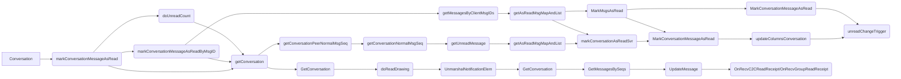

+ [author](http://nsddd.top)

# 第81节 kafka 服务器教程

<div><a href = '80.md' style='float:left'>⬆️上一节🔗  </a><a href = '82.md' style='float: right'>  ⬇️下一节🔗</a></div>
<br>

> ❤️💕💕记录[sealos](https://github.com/cubxxw/sealos)开源项目的学习过程。[k8s,docker和云原生的学习](https://github.com/cubxxw/sealos)。Myblog:[http://nsddd.top](http://nsddd.top/)

---
[TOC]



下面是拉取信息列表的逻辑：

```
func (c *Conversation) pullMessageAndReGetHistoryMessages(ctx context.Context, conversationID string, seqList []int64, notStartTime,
	isReverse bool, count, sessionType int, startTime int64, list *[]*model_struct.LocalChatLog, messageListCallback *sdk.GetAdvancedHistoryMessageListCallback) {
	existedSeqList, err := c.db.SuperGroupGetAlreadyExistSeqList(ctx, conversationID, seqList)
	if err != nil {
		// log.Error(operationID, "SuperGroupGetAlreadyExistSeqList err", err.Error(), sourceID, seqList)
		return
	}
	if len(existedSeqList) == len(seqList) {
		// log.Debug(operationID, "do not pull message")
		return
	}
	newSeqList := utils.DifferenceSubset(seqList, existedSeqList)
	if len(newSeqList) == 0 {
		// log.Debug(operationID, "do not pull message")
		return
	}
	var pullMsgResp sdkws.PullMessageBySeqsResp
	var pullMsgReq sdkws.PullMessageBySeqsReq
	pullMsgReq.UserID = c.loginUserID
	var seqRange sdkws.SeqRange
	seqRange.ConversationID = conversationID
	seqRange.Begin = newSeqList[0]
	seqRange.End = newSeqList[len(newSeqList)-1]
	seqRange.Num = int64(len(newSeqList))
	pullMsgReq.SeqRanges = append(pullMsgReq.SeqRanges, &seqRange)
	log.ZDebug(ctx, "read diffusion group pull message,  ", "req", pullMsgReq)
	if notStartTime && !c.LongConnMgr.IsConnected() {
		return
	}
	err = c.SendReqWaitResp(ctx, &pullMsgReq, constant.PullMsgBySeqList, &pullMsgResp)
	if err != nil {
		errHandle(newSeqList, list, err, messageListCallback)
		log.ZDebug(ctx, "pullmsg SendReqWaitResp failed", err, "req")
	} else {
		log.ZDebug(ctx, "syncMsgFromServerSplit pull msg", "resp", pullMsgResp)
		if v, ok := pullMsgResp.Msgs[conversationID]; ok {
			c.pullMessageIntoTable(ctx, pullMsgResp.Msgs, conversationID)
			messageListCallback.IsEnd = v.IsEnd

			if notStartTime {
				*list, err = c.db.GetMessageListNoTime(ctx, conversationID, count, isReverse)
			} else {
				*list, err = c.db.GetMessageList(ctx, conversationID, count, startTime, isReverse)
			}
		}

	}
}
```

仿照上面的逻辑写出已读信息的逻辑，修改下面代码：

```
func (c *Conversation) markMsgAsRead2Svr(ctx context.Context, conversationID string, seqs []int64) error {

}

func (c *Conversation) markConversationAsReadSvr(ctx context.Context, conversationID string, hasReadSeq int64) error {

}

func (c *Conversation) setConversationHasReadSeq(ctx context.Context, conversationID string, hasReadSeq int64) error {

}

```

**很高兴你成为了 Kubecub member 的一员，接下来我们将会共同打造顶级的开源社区 \*kubecub\***。 💪

我们有两个很特殊的仓库，分别定义了私有规则和公共规则，其中私有规则对应私有仓库和 member。

+ https://github.com/kubecub/.github-private
+ https://github.com/kubecub/.github

## 需要的步骤 ✏️

我们推荐你将 kubecub 加入到自己 GitHub 主页上面，点击 [people](https://github.com/orgs/kubecub/people) 改变 Private 为 Public. 👍

一定要知道 [community](https://github.com/kubecub/community) 仓库是记录这更多贡献者需要的帮助文档，包括贡献者文档，RFC。

## .github 🐙

`.github/workflows/` 目录:包含几个 GitHub Actions 工作流程模板

```bash
- dependabot.yml # 启用 Dependabot,自动监视依赖更新 👀
- license-checker.yml # 运行许可证检查,确保包含开源许可证 🛡️
- superlinter.yml # 运行 Super Linter,检查代码样式和格式 🔍
- security.yml # 启用安全警报,检测敏感数据泄露 🚨
```

`.github/CODEOWNERS`:定义仓库的代码所有者规则 👪

`.github/dependabot.yml`:Dependabot 配置文件,定义要监视的依赖项和更新频率 👀

`.github/no-response.yml`:定义"没有回应"警报的配置 ⚠️

`.github/config.yml`:启用 CodeQL 代码扫描,定期扫描代码漏洞和错误 🔒

`.github/ISSUE_TEMPLATE/`:Issue 模板目录,包含 Bug 报告、功能请求等 Issue 默认模板 📑

`.gitignore`:Git 忽略规则模板 🚫

`LICENSE`:MIT 许可证模板 📜

`.editorconfig`:编辑器配置文件,定义代码风格规则 ✏️

[README.md](http://readme.md/):自述文件模板 📃

## Why Choose Kubecub? 🤔

Kubecub 帮助更多的开发者和学生快速加入开源并且学习开源，提供了成熟的各个语言手脚架和模板，以及一个成熟的项目规范、社区规范、以及运营规范，通过 Kubecub，你能找到更多有共同目标和愿望的开发者、朋友，我们相互之间 review 代码，分享创意，并且实现自己的创意。👨‍💻 👩‍💻

你可以通过以下方式加入 Kubecub 社区：

+ 参与 Kubecub 已有的任意一个项目和功能模块进行开发。
+ 抱着创造价值的形式，[创建一个新的存储库](https://github.com/organizations/kubecub/repositories/new) 并且公开它，使用我们手脚架和模板、以及 robot 更好的开发体验。 🤖

Kubecub 旨在为 Kubernetes 用户和开发者提供一个中心位置，以分享他们的经验并相互学习。我们的社区提供各种资源，创建各种有意思的小项目和工具。包括：

+ **教程：** Kubecub 提供了整套的文档、社区管理、项目管理、社区治理体系文章，在 [community](https://github.com/kubecub/community) 社区存储库中有成熟的治理体系。📖
+ **文档：** 访问我们的 [综合文档](https://github.com/kubecub/docs)，对整个 Kubecub 的仓库通过 actions 自动化同步和管理，除此之外，我们提供了很多学习文档，包括 [Kubecub 社区学习文档](javascript:void(0))，还提供了 [Go语言](javascript:void(0)) 和 [Kubernetes](javascript:void(0)) 的教程文档。📑
+ **论坛：** 加入我们的 [Slack](https://join.slack.com/t/kubecub/shared_invite/zt-1se0k2bae-lkYzz0_T~BYh3rjkvlcUqQ)，向我们的社区提问并获得帮助。 💬
+ **活动：** 参加我们的 [活动](https://github.com/orgs/kubecub/discussions)，与其他 Kubecub 的用户和开发者联系并从经验丰富的开发人员学习。 👥

一起加入 Kubecub，开启你的开源之旅！🎉

## What can you find？ 🚀

您可以参与每个模块。这是一个完全开源的社区，具有区块链安全性，可以帮助您加入开源，帮助您学习，并允许您成为贡献者。

不管您学习的是 Java、Python、Go、Rust、C/C++、JavaScript、HTML、CSS，甚至是写出优秀文档的能力，您都始终受到 kubecub 的欢迎。即使您认为自己不是一个伟大的 kubecub，我们也希望您成为一个 kubecub。 😄

如果您想加入我们，请发送电子邮件到 [cub@nsddd.top](mailto:cub@nsddd.top)，包括您的 GitHub 地址。 📧

## Contact Us 👋

我们在 kubecub 这里非常重视与我们的用户、开发人员和贡献者之间的紧密联系。凭借庞大的社区和维护人员团队，我们始终在这里为您提供帮助和支持。无论您是想加入我们的社区还是有任何问题或建议，我们都欢迎您与我们联系。

我们最推荐的联系方式是通过 [Slack](https://join.slack.com/t/c-ub/shared_invite/zt-1se0k2bae-lkYzz0_T~BYh3rjkvlcUqQ)。即使您在中国，Slack 通常不会被防火墙屏蔽，这使得与我们联系变得很容易。我们的 Slack 社区是与 kubecub 的其他用户和开发人员讨论和分享想法和建议的理想场所。您可以询问技术问题，寻求帮助，或与 kubecub 的其他用户分享您的经验。

除了 Slack，我们还提供以下联系方式：

+ <a href="https://join.slack.com/t/kubecub/shared_invite/zt-1se0k2bae-lkYzz0_T~BYh3rjkvlcUqQ" target="_blank"></a> 我们还有 Slack 频道供您交流和讨论。访问 https://slack.com/ 并加入我们的 [👀 kubecub slack](https://join.slack.com/t/kubecub/shared_invite/zt-1se0k2bae-lkYzz0_T~BYh3rjkvlcUqQ) 团队频道。
+ <a href="https://mail.google.com/mail/u/0/?fs=1&tf=cm&to=3293172751nss@gmail.com" target="_blank"></a> 通过电子邮件与我们联系 [📨Gmail: 3293172751nss@gmail.com](mailto:3293172751nss@gmail.com)。如果您有任何需要解决的问题或问题，或者对我们的开源项目有任何建议和反馈，请随时通过电子邮件与我们联系。
+ <a href="https://nsddd.top" target="_blank"></a> 阅读我们的 [🤖kubecub](https://nsddd.top/)。我们的 kubecub 是了解 kubecub 项目和趋势的绝佳场所。在 kubecub 上，我们分享我们的最新发展、技术趋势和其他有趣信息。
+ <a href="https://twitter.com/xxw3293172751" target="_blank"></a> 添加 [🕊️Twitter](https://twitter.com/xxw3293172751) 。如果您喜欢社交媒体，我们的 Twitter 帐户是了解 kubecub 项目新闻和趋势的好方法。在 Twitter 上，我们分享我们的最新技术和趋势，以及相关新闻和活动。
+ <a href="http://sm.nsddd.top/sm0d220ad72063197b9875379403f6c88.jpg" target="_blank"></a> 添加 [📲Wechat](https://img.shields.io/badge/微信-smile-brightgreen?kubecubo=wechat&style=flat-square) 并指出您是 kubecub 的用户或开发人员。我们会尽快处理您的请求。

无论您是想加入我们的社区还是有任何问题或建议，我们都欢迎您与我们联系。 👋

> Note 📝
> 这不是一个私有存储库，kubecub 的目的是帮助更多的人学习和进步。kubecub 的赞助和贡献将是公开透明的，所有赞助收益将用于善良的事业。 ❤️

## Backers

Thank you to all our backers! 🙏 [[Become a backer](https://opencollective.com/kubecub#backer)]

We want anyone to get involved in our community, we offer gifts and rewards, and we welcome you to join us every Thursday night.

We take notes of each [biweekly meeting](https://github.com/OpenIMSDK/Open-IM-Server/issues/381) in [GitHub discussions](https://github.com/OpenIMSDK/Open-IM-Server/discussions/categories/meeting), and our minutes are written in [Google Docs](https://docs.google.com/document/d/1nx8MDpuG74NASx081JcCpxPgDITNTpIIos0DS6Vr9GU/edit?usp=sharing).


## END 链接
<ul><li><div><a href = '80.md' style='float:left'>⬆️上一节🔗  </a><a href = '82.md' style='float: right'>  ️下一节🔗</a></div></li></ul>

+ [Ⓜ️回到目录🏠](../README.md)

+ [**🫵参与贡献💞❤️‍🔥💖**](https://nsddd.top/archives/contributors))

+ ✴️版权声明 &copy; ：本书所有内容遵循[CC-BY-SA 3.0协议（署名-相同方式共享）&copy;](http://zh.wikipedia.org/wiki/Wikipedia:CC-by-sa-3.0协议文本) 
