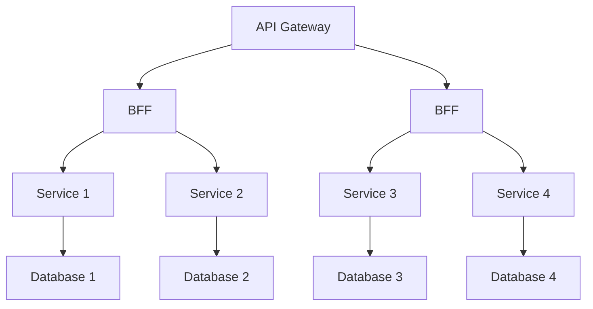
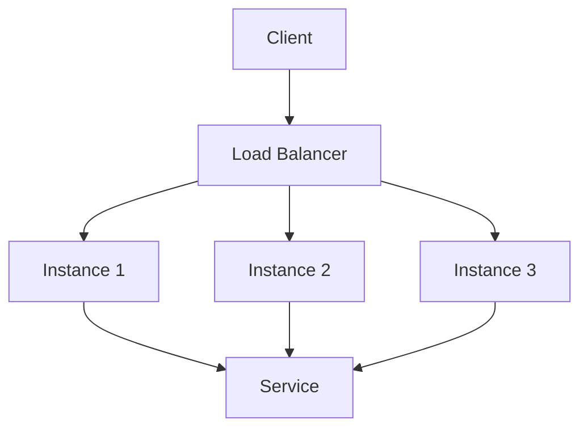
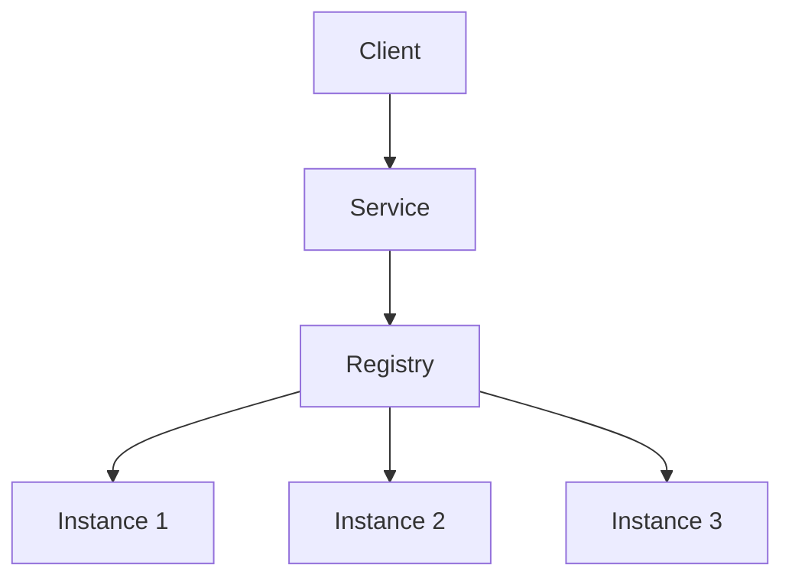

+ [author](https://github.com/3293172751)

# 第41节 微服务篇 - 微服务概览与治理

+ [回到目录](../README.md)
+ [上一节](40.md)
> ❤️💕💕Go语言高级篇章,在此之前建议您先了解基础和进阶篇。Myblog:[http://nsddd.top](http://nsddd.top/)
###  **[Go语言基础篇](https://github.com/cubxxw/awesome-cs-cloudnative-blockchain/blob/master/TOC.md)**
###  **[Go语言100篇进阶](https://github.com/cubxxw/awesome-cs-cloudnative-blockchain/blob/master/Gomd_super/README.md)**
---
[TOC]

## 微服务概念

Fred Brooks 在30年前写道，“there are no silver bullets” 。 但凡是都是有利有弊，微服务也不是万能的。

**微服务架构虽然具有很多优点，但是也有一些缺点和不足，包括：**

+ **分布式系统的复杂性**：微服务架构意味着应用程序会被拆分成多个小型服务，这些服务之间需要相互通信。这就增加了分布式系统的复杂性，包括网络延迟、数据一致性和错误处理等方面的问题。
+ **运维难度增加**：由于微服务架构涉及到多个服务的部署和管理，因此对运维人员的技能和经验要求更高。此外，由于服务数量增加，监控和故障排除也变得更加困难。
+ **服务间的依赖关系**：微服务架构中的服务通常都是相互依赖的，因此一个服务的变更很可能会影响到其他服务。这就需要进行复杂的版本控制和协调工作，才能保证系统的稳定性。
+ **测试复杂度增加**：由于微服务架构中的服务数量增加，测试的复杂度也会相应增加。此外，由于服务之间的依赖关系，测试也需要涉及到多个服务。
+ **开发复杂度增加**：由于微服务架构需要将应用程序拆分成多个小型服务，因此开发人员需要花费更多的时间来进行服务之间的协调和通信。此外，由于服务数量增加，也需要进行更多的版本控制和协调工作。

对于使用微服务建议:

| 适合使用微服务                           | 不适合使用微服务                 |
| ---------------------------------------- | -------------------------------- |
| 需要快速迭代和部署的应用程序             | 应用程序较简单，无需进行拆分     |
| 需要高度可扩展性和弹性                   | 应用程序需要高度一致性和可靠性   |
| 应用程序需要高度灵活性和可定制性         | 应用程序的规模较小，无需进行拆分 |
| 应用程序需要具有多个语言和技术栈的支持   | 应用程序需要高度集成性和低延迟性 |
| 应用程序需要具有良好的可维护性和可测试性 | 应用程序的数据模型较为简单       |

### 组件服务化

组件服务化是微服务架构的一种实践。它将应用程序拆分成多个小型服务，每个服务都是独立的组件，可以独立部署和运行。每个组件都提供一个特定的功能，并可以被其他服务调用，从而实现了服务之间的解耦。通过服务之间的解耦，组件服务化可以提供更高的可重用性、更高的灵活性和更高的可扩展性。

组件服务化的优点不仅在于其提供了更好的可重用性、灵活性和可扩展性，而且还可以提供更好的可维护性。由于每个组件都是独立的，可以独立进行部署、升级和维护。这使得开发人员可以更加专注于自己的组件，而不需要考虑整个应用程序的架构和细节。同时，由于组件之间的解耦，开发人员可以更快地定位和修复问题，从而提高了系统的可维护性。

然而，组件服务化也带来了一些挑战。首先，由于每个组件都是独立的，需要进行更好的版本控制和协调工作，以确保整个系统的稳定性。其次，由于组件之间的解耦，需要更好的文档和测试来确保组件之间的交互和依赖关系。最后，由于每个组件都是独立运行的，需要更好的监控和故障排除机制，以确保整个系统的可靠性。

**我们用 Go 实施一个微服务：**

+ Kit：一个微服务的基础库（框架）
+ service：业务代码 + Kit 依赖 + 第三方依赖组成的业务微服务
+ rpc + message queue：轻量级通讯

<aside> 
🔥 本质上等同于，多个微服务组合（compase) 完成一个完整的用户场景（usecase）    
</aside>

### 基础措施自动化

无自动化不微服务，自动化包括测试和部署。

自动化测试是微服务架构的基础，需要建立完善的测试框架和流程。同时，部署自动化也是必不可少的，需要使用自动化工具来完成持续集成和持续部署。这些措施可以减少人工干预，提高系统的可靠性和稳定性。

+ CICD：Gitlab + Gitlab Hooks + kubernetes
+ Testing: 测试环境、单元测试、API 自动化测试
+ 在线运行时：Kubernetes，以及一系列 Prometheus、ELK、Conrtol Panle

### 可用性 & 兼容性设计

在微服务架构中，可用性和兼容性设计是非常重要的。由于微服务架构涉及到多个小型服务的协同工作，因此必须确保每个服务的可用性和兼容性。为了实现这一点，可以采用以下措施：

+ 设计弹性系统：系统应该具有弹性，能够在出现故障或问题时自动适应变化。
+ 设计容错系统：系统应该具有容错机制，能够在出现故障或问题时继续提供服务。
+ 设计监控和日志系统：系统应该具有监控和日志系统，能够及时发现和解决问题。
+ 采用标准化的接口和协议：系统应该采用标准化的接口和协议，以确保不同服务之间的兼容性。

通过这些措施，可以确保微服务架构的可用性和兼容性，从而提高整个系统的稳定性和可靠性。

## 微服务设计

在微服务架构中，服务的设计非常重要。服务的设计应该基于以下原则：

+ 单一职责原则：每个服务都应该只有一个职责。
+ 接口隔离原则：服务之间的接口应该尽可能简单和独立。
+ 依赖倒置原则：高层次的服务不应该依赖于低层次的服务。
+ 开闭原则：服务应该对扩展开放，对修改关闭。
+ 可复用性原则：服务应该尽可能地可复用和可组合。

同时，服务的设计也应该考虑到以下方面：

+ 服务的功能和业务需求。
+ 服务的性能和可扩展性。
+ 服务的安全性和可靠性。
+ 服务的可测试性和可维护性。

通过遵循这些原则和考虑这些方面，可以设计出高效、可靠且易于维护的微服务架构。

<aside> 
🔥 所以对于微服务的设计，也是符合设计模式的~    
</aside>

### API Gateway

API 网关是微服务架构的一个重要组成部分。它可以将多个微服务的 API 集中在一起，提供统一的入口点。通过 API 网关，可以实现以下目标：

+ 统一访问接口：API 网关可以将多个微服务的 API 集中在一起，提供统一的访问接口。
+ 降低客户端复杂度：客户端可以直接通过 API 网关访问微服务，而无需知道每个微服务的具体位置和实现细节。
+ 实现安全性和可靠性：API 网关可以提供身份验证、授权和安全性检查等功能，从而实现安全性和可靠性。

同时，API 网关也可以实现以下功能：

+ 负载均衡：API 网关可以根据负载情况自动将请求路由到不同的微服务上，从而实现负载均衡。
+ 缓存：API 网关可以缓存响应数据，从而减少对后端微服务的请求。
+ 监控和日志：API 网关可以提供监控和日志功能，从而帮助开发人员更好地了解系统的运行情况。

------

我们可以新增一个 app-interface 用于统一的协议出口，在服务内进行大量的dataset join，按照业务场景来设计粗粒度的 API ，给后续服务的演进带来很多优势：

+ 轻量交互：协议精简、聚合
+ 差异服务：数据裁剪以及聚合、针对终端定制化 API
+ 动态升级：原有系统兼容性升级，更新后服务而非协议
+ 沟通效率提升，协同模式演进为移动业务 + 网关小组。

BFF 可以认为是一种适配服务，将后端的微服务进行适配（主要包括聚合裁剪和格式适配等逻辑），向无线端设备暴露友好和统一的 API ，方便无线设备接入访问后端服务。

但是这里有一个问题，API composer 从架构上是一个单点，容易产生单点故障，那么我们可以拆分了。这个模块需要处理很多不同业务场景，此时按照业务场景拆分：

+ 核心功能按照功能性拆分
+ 按照业务拆分

### 跨横切面

跨横切面的功能，需要协调更新框架升级发版（路由、认证、限流、安全），因此全部上沉，引入 API Gateway，把业务集成度高的 BFF 层和通用功能服务层 API Gateway 进行了分层处理。

<aside> 🔥 新的架构中，网关承担着重要的角色，它是解耦拆分和后续升级迁移的利器。在网关的配合下，单块 BFF 实现了解耦拆分，各业务线团队可以独立开发和交付各自的微服务，研发效率大大提升。</aside>

<aside> 
    ✨ BFF 可以采用 Go语言 的并发编程，甚至可以用 nodejs 做服务端渲染。
</aside>

### Mircoservice 划分

微服务架构中遇到的第一个问题就是如何划分服务的边界。在实际项目中会采用两种不同的方式划分服务边界，即通过业务职能（Business Capability) 或者是 DDD 的限界上下文（Bounded Context）

+ 业务职能（Business Capability) 是指将相似功能或具有相似业务目标的功能分组，以便更好地管理和协调它们。通过将相似的功能分组，可以更好地识别微服务的边界，并简化微服务之间的通信和数据处理。例如，将所有与用户相关的功能组合在一起，可以创建一个用户服务，而将所有与订单相关的功能组合在一起，可以创建一个订单服务。
+ DDD 的限界上下文（Bounded Context）是指将与特定业务领域相关的功能分组。限界上下文通常由一组紧密相关的问题和解决方案组成，这些问题和解决方案是在特定的业务领域中发现的。通过将业务领域内的功能划分为限界上下文，可以更好地识别微服务的边界，并确保每个微服务都专注于特定的业务领域。例如，将所有与用户注册和身份验证相关的功能组合在一起，可以创建一个身份验证服务，而将所有与库存管理相关的功能组合在一起，可以创建一个库存管理服务。

CWRS，将应用划分为两个部分：命令端和查询端。

### 命令端

命令端是应用的一部分，它用于处理写操作。命令端通常包含以下组件：

+ API Gateway：提供命令端的入口点，可以将多个微服务的 API 集中在一起。
+ 服务网关：用于处理命令端的请求，将请求路由到相应的微服务。
+ 微服务：处理命令端的请求，执行相应的业务逻辑。

命令端的主要目标是处理数据的写入操作。它通常采用同步的方式进行数据更新，以确保数据的一致性。命令端通常要满足以下要求：

+ 可靠性：命令端必须保证数据的可靠性，确保数据不会丢失或损坏。
+ 可扩展性：命令端必须具有良好的可扩展性，能够处理高并发的写操作。
+ 安全性：命令端必须具有良好的安全性，能够保护数据的机密性和完整性。
+ 可测试性：命令端必须具有良好的可测试性，能够进行单元测试和集成测试。

### 查询端

查询端是应用的另一部分，它用于处理读操作。查询端通常包含以下组件：

+ API Gateway：提供查询端的入口点，可以将多个微服务的 API 集中在一起。
+ 服务网关：用于处理查询端的请求，将请求路由到相应的微服务。
+ 微服务：处理查询端的请求，返回相应的查询结果。

查询端的主要目标是处理数据的读取操作。它通常采用异步的方式进行数据更新，以提高查询性能。查询端通常要满足以下要求：

+ 可靠性：查询端必须保证数据的可靠性，确保数据的准确性和一致性。
+ 可扩展性：查询端必须具有良好的可扩展性，能够处理高并发的读操作。
+ 安全性：查询端必须具有良好的安全性，能够保护数据的机密性和完整性。
+ 可测试性：查询端必须具有良好的可测试性，能够进行单元测试和集成测试。

在实际应用中，命令端和查询端通常会分别部署在不同的服务器上，以提高系统的性能和可靠性。同时，命令端和查询端也可以采用不同的技术栈，以满足不同的需求和要求。

## gRPC 和 服务发现

gRPC 是一种高性能、开源和通用的 RPC 框架，它可以在任何地方运行，连接任何类型的应用程序。gRPC 基于 Protocol Buffers 和 HTTP/2，可以在多种语言中使用，包括 C++、Java、Go、Python、Ruby、C# 和 Node.js 等。gRPC 还提供了服务发现的功能，可以帮助开发人员更好地管理和协调分布式应用程序中的微服务。服务发现可以自动将客户端请求路由到可用的微服务实例，并提供负载均衡、故障转移和自动扩展等功能，以提高系统的性能和可靠性。

### 服务发现

客户端通过负载均衡器向服务端发起一个请求，这个负载均衡器会查询服务注册表，并且将请求路由到可用的服务实列上。

服务发现的工作流程如下：

1. 服务注册：微服务启动时，会向服务注册中心注册自己的实例信息，包括 IP 地址、端口号、服务名、协议等。
2. 服务发现：客户端向服务注册中心查询可用的服务实例，并通过负载均衡算法选择一个实例。
3. 服务调用：客户端向选择的服务实例发起请求，并将请求转发给对应的微服务。
4. 服务治理：服务注册中心可以监控微服务的运行状态，并提供故障转移、自动扩展等功能，以提高系统的可用性和可靠性。

使用服务发现可以帮助开发人员更好地管理和协调分布式应用程序中的微服务，提高系统的性能和可靠性。

服务实例在服务注册表上被注册或者注销（ConsulTemplate + Nginx, Kubernetes + ETCD）

服务发现有两种模式：客户端发现和服务端发现。

+ 在客户端发现模式中，客户端负责查询服务注册表，选择可用的服务实例，并通过负载均衡算法选择一个实例来处理请求。客户端需要实现服务发现、负载均衡和故障转移等功能，这样会增加客户端的复杂性和维护成本，但是可以提高系统的灵活性和可伸缩性。
+ 在服务端发现模式中，客户端向服务端发起请求，服务端负责查询服务注册表，选择可用的服务实例，并将请求转发给对应的微服务。服务端需要实现服务发现、负载均衡和故障转移等功能，这样会增加服务端的复杂性和维护成本，但是可以降低客户端的复杂性和维护成本，提高系统的可靠性和安全性。

一般来说，客户端发现模式适用于轻量级应用，服务端发现模式适用于重量级应用。同时，也可以结合使用两种模式，以满足不同的需求和要求。

**而微服务的核心是去中心化，我们使用的是客户端发现模式。**

### 客户端发现架构图

### 服务端发现架构图

## 多集群

LO 服务，类似于我们的账户，之前是一套大集群，一旦故障影响返回巨大，所以我们从几个角度多集群的必要性：

+ 从单一集群故障，多个节点保证可用性，我们通常使用 N+2 的方式来冗余节点
+ 从单一集群故障带来的影响面角度考虑冗余多套集群
+ 单个机房内的机房故障的问题。

我们可以在 PaaS 平台上，为特定的 appid 服务建立多个集群，以提高系统的可用性和可靠性。通过在不同的地理位置和数据中心部署多个集群，可以降低单点故障和地理位置故障的风险，并提高系统的容错能力和恢复能力。同时，可以使用负载均衡和故障转移等技术，以确保用户的请求能够得到及时响应和处理。

统一为一套逻辑集群（物理上多套资源池），即 gRPC 客户端默认忽略服务发现中的cluster，在多集群的环境下，我们通常需要使用服务网格来实现微服务的通信和管理。服务网格是一种专门设计用于管理和协调微服务的基础设施，它可以提供服务发现、负载均衡、故障转移、流量控制、安全性等功能，以提高系统的可靠性和安全性。常见的服务网格包括 Istio、Linkerd、Consul 等。服务网格通常使用 sidecar 模式，在每个微服务实例中部署一个 sidecar 代理，以实现流量控制和安全性等功能。同时，服务网格也可以使用虚拟网格和控制平面等技术，以实现高效的管理和协调。在多集群的环境下，服务网格可以帮助开发人员更好地管理和协调分布式应用程序中的微服务，提高系统的可靠性和安全性。

另外，多集群的环境下，我们还需要考虑如何实现数据的一致性和同步。常见的解决方案包括使用分布式数据库、缓存、消息队列等技术。分布式数据库可以将数据分散在多个节点上，以提高系统的可用性和可伸缩性。缓存可以帮助我们提高读取性能，减少对数据库的压力。消息队列可以实现异步通信和解耦，以提高系统的可靠性和可扩展性。在设计多集群的系统时，我们需要根据具体的业务需求和技术架构，选择适合的解决方案，以实现数据的一致性和同步。

综上所述，多集群的环境下，我们需要使用服务网格、分布式数据库、缓存、消息队列等技术，以实现微服务的通信、管理、数据一致性和同步等功能，以提高系统的可靠性和安全性。同时，我们还需要考虑如何实现高效的流量控制、安全性、负载均衡和故障转移等功能，以保证系统的稳定性和可扩展性。

## 多租户

在微服务架构中，我们允许多个系统共存，这意味着每个服务可能有多个版本。每个版本可能会针对不同的客户或用户进行优化，或者可能会添加新功能或修复错误。

我们一般把这种允许多系统共存的方式称之为 多租户（multitenancy) 。租户可以是测试、金丝雀发布、也可以是影子系统、甚至是服务层或者业务线，使其租户能够保证代码的隔离性，并且能够基于流量租户做路由决策。

多租户（Multi-Tenancy）是一种软件架构模式，它允许单个应用程序实例为多个客户或租户提供服务。每个租户都具有自己的数据和配置，但它们共享相同的应用程序实例和基础设施。多租户架构通常用于软件即服务（SaaS）应用程序中，以实现高度可伸缩性和资源共享。多租户架构有许多优点，包括：

+ **资源共享**：多租户架构允许多个租户共享相同的应用程序实例和基础设施，从而节省了成本和资源。
+ **灵活性**：多租户架构允许每个租户自定义其数据和配置，从而提供了更大的灵活性和可定制性。
+ **易于维护**：多租户架构使维护和升级应用程序变得更加容易。因为所有租户共享相同的应用程序实例和基础设施，所以升级和维护只需要在一个地方进行。
+ **可伸缩性**：多租户架构允许应用程序在不同的租户之间进行水平扩展，从而实现高度可伸缩性。

总的来说，多租户架构是一种非常有用的软件架构模式，特别是对于需要为多个客户或租户提供服务的 SaaS 应用程序来说。

在多租户环境下，我们需要考虑如何管理多个版本的服务，并确保它们之间的相互兼容性。为此，我们可以使用 API 网关、服务注册表、版本控制和服务发现等技术来管理和协调多个版本的服务。API 网关可以帮助我们管理和发布多个版本的服务，并提供统一的访问接口和协议。服务注册表可以帮助我们管理和发现多个版本的服务，并提供负载均衡和故障转移等功能。版本控制可以帮助我们管理和追踪多个版本的服务，并提供版本回退和回滚等功能。服务发现可以帮助我们管理和协调多个版本的服务，并提供流量控制和安全性等功能。在多租户环境下，我们需要根据具体的业务需求和技术架构，选择适合的技术和方案，以实现多个版本的服务的协同工作和管理。

### 染色发布

染色发布是一种将不同版本的代码部署到不同的环境中测试的技术，常用于灰度测试和 A/B 测试中。在染色发布中，我们使用一个或多个特殊的标识符（例如 HTTP 标头、查询字符串参数、Cookie 等）来标识不同的版本，并将请求路由到相应的版本。染色发布可以帮助我们逐步推出新版本，减少生产环境中的故障和风险。同时，染色发布也可以帮助我们评估新版本的性能和可靠性，以便更好地了解其影响和优化方向。

多租户内部叫染色发布 ~

### 多租户本质描述

<aside>
     ✨ 多租户本质上描述为：跨服务传递请求携带上下文（context)，数据隔离的流量路由方案。
</aside>

## END 链接
+ [回到目录](../README.md)
+ [上一节](40.md)
+ [下一节](42.md)
---
+ [参与贡献❤️💕💕](https://github.com/cubxxw/awesome-cs-cloudnative-blockchain/blob/master/Git/git-contributor.md)