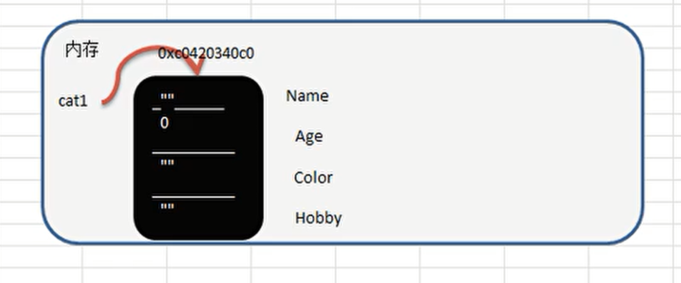
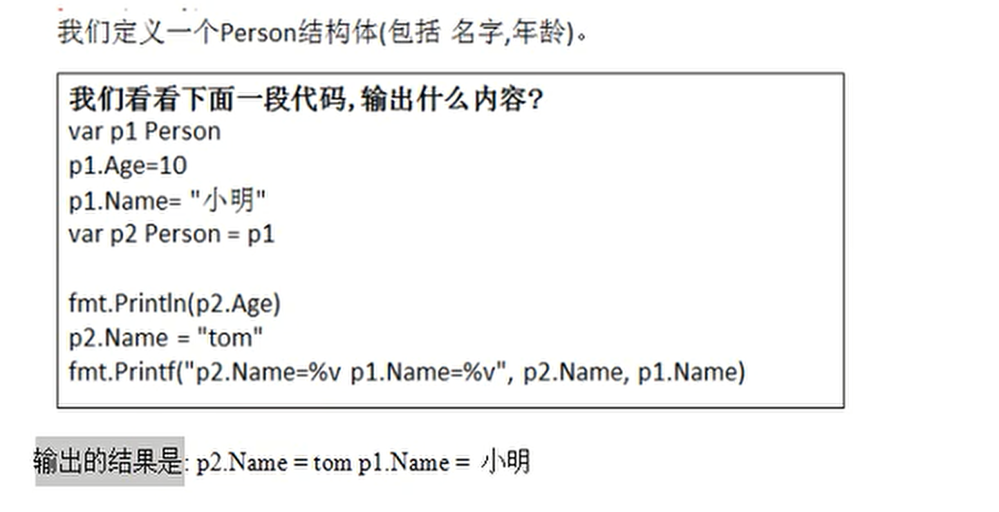
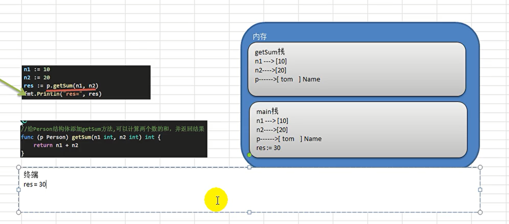
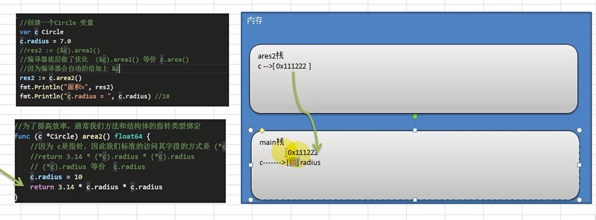

# Go语言结构体和方法

[[toc]]

[toc]

😶‍🌫️go语言官方编程指南：[https://pkg.go.dev/std](https://pkg.go.dev/std)

>   go语言的官方文档学习笔记很全，推荐去官网学习

😶‍🌫️我的学习笔记：github: [https://github.com/3293172751/golang-rearn](https://github.com/3293172751/golang-rearn)

---

**区块链技术（也称之为分布式账本技术）**，是一种互联网数据库技术，其特点是去中心化，公开透明，让每一个人均可参与的数据库记录

>   ❤️💕💕关于区块链技术，可以关注我，共同学习更多的区块链技术。博客[http://cubxxw.com](http://cubxxw.com)

## 1. 结构体

::: warning Go语言面对对象特性
Golang在面对对象编程中并不是**存粹的面对对象编程**，但是也支持OOP，Golang支持面对对象特性是比较准确的。

:::

::: warning Go语言没有class
Go语言中没有class，Go语言的struct和其他编程语言的class有相同地位，所以可以理解Golang是基于struct实现OOP特性

:::

::: warning Go语言继承
但是Golang任然有面对对象的**继承、封装和多态**的特性，**Golang面对接口编程是非常重要的，耦合度非常低**

:::


> 🐶 我觉得面对对象是一种思想，而不是某些模式化的定义，但是Golang是有面对对象思想的。

```go
/************************************************************************* 
    > File Name: lisa.go
    > Author: smile
    > Mail: 3293172751nss@gmail.com 
    > Created Time: Thu 13 Jan 2022 11:18:19 AM CST
 ************************************************************************/
package main
import "fmt"
type Cat struct{
    Name string
    Age int
    Color string
    Hobby string
}
func main(){
    var cat1 Cat   //用cat定义一个变量
    fmt.Println("初始化cat1=",cat1)    // { 0 }
    cat1.Name = "Lisa"
    cat1.Age = 19
    cat1.Color = "白人"
    fmt.Println("初始化cat1=",cat1)    // { 0 }
}
```

```
[root@mail golang]# go run  lisa.go
初始化cat1= { 0 }
初始化cat1= {Lisa 19 白人}
```

**首字母是大写，说明是公有的成员**

>   1.   结构体是**自定义的数据类型**，代表的是一类事务  -- Cat
>   2.   结构体变量是具体的、实际的，代表的是一个具体的变量  -- cat1.Name
>   3.   在创建一个结构体变量，如果没有赋值，则默认是默认值


### 访问结构体成员

如果要访问结构体成员，需要使用点号 **.** 操作符，格式为：

```go
结构体.成员名
```


### 结构体在内存中的布局

```q
type Cat struct{
    Name string
    Age int
    Color string
    Hobby string
}
```

**结构体Cat本身也是有地址的，`fmt.Println(&cat1)`**



**刚开始的时候都是默认值（0或空字符串），后面定义后在内存中赋值**

**所以：✍️结构体是值类型 ，默认是值拷贝，改变一个结构体的值，不影响**


### 声明结构体

```go
type 结构体名称 struct{
	field1 type
	field2 type
}
```

**✍️ 结构体名称如果首字母如果是大写，那么可以在其他包引用结构体**

::: warning
不是大写也可以通过**工厂模式**来调用，就类似于面对对象语言的构造函数
:::


### 字段/属性

::: tip 结构体字段
**从概念上看，结构体字段 = 属性 = field**

:::

>   后面默认是字段

**结构体中的变量如果没有被使用，不会报错（和普通变量不一样）**

**指针,slice和map的零值都是nil，还没有分配可见，如果要使用，要make后才能使用**

```go
package main
import "fmt"
type Cat struct{
    Name string
    Age int
    Scores [5]float64   //数组
 /*---上面是值类型 ，下面是引用类型 ---*/
    ptr *int       //指针
    slice []int     //切片
    map1 map[string]string   //map - key:string ,value:string
}

func main(){
    var p Cat   
    fmt.Println("初始化:",p)
    if p.ptr == nil{
        fmt.Println("指针初始为nil")
    }
    if p.slice == nil{
        fmt.Println("切片初始为nil")
    }
    if p.map1 == nil{
        fmt.Println("map初始为nil")
    }
    
    /* 使用slice */
    /* p.slict[0] = 100 会报错 */
    p.slice = make([]int,10)  
    p.slice[0] = 100
    fmt.Println(p.slice)
   
    /*使用map */
    p.map1 = make(map[string]string)  //不需要分配空间
    p.map1["b"] = "100"
    p.map1["a"] = "200"                                       
    fmt.Println(p.map1)
}                                                      
```

🚀 编译结果如下：

```
[root@mail golang]# go build -o lisa lisa.go
[root@mail golang]# ./lisa
初始化: { 0 [0 0 0 0 0] <nil> [] map[]}
指针初始为nil
切片初始为nil
map初始为nil
[100 0 0 0 0 0 0 0 0 0]
map[a:200 b:100]
```


**不同结构体变量的字段是独立的，互不影响**

```go
package main
import "fmt"
type Cat struct{
    Name string
    Age int
    Color string
    Hobby string
}
type Cat2 struct{
	Name string
    Age int
}
func mian(){
    var Cat cat1
    var Cat2 cat2
    cat1.Name = "lisa"
    cat1.Age = 19
    
    cat2 := cat1   //将cat1赋值为cat2
    cat2.Name = "ber"   //修改cat2的name
    fmt.Println("cat1 = ",cat1)
    fmt.Println("cat2 = ",cat2)
}
```

```
[root@mail golang]# go build -o a lisa.go 
[root@mail golang]# ./a
{ 0}
cat1 =  {lisa 19}
cat2 =  {ber 19}
```

**✍️如果希望能够改变，可以使用`&`后面讲**


### 创建结构体变量和访问结构体字段

```go
type Person struct{
	Name string
	Age int
}
```

**方式一：直接声明**

```go
var person Person
```


**方式二(最方便)-{}**

```go
person := Person{}
person.Name = "lisa"
person.Age = 18
```

*或:*

```go
person := Person{"lisa,18"}
```


**方式三：用new**

```go
var person *Person = new(Pereson)
/*--------或-------*/
person := new(Person)

/*person是一个指针，赋值： */
(*person).Name = "lisa"
(*person).Age = 18

/*简化赋值 -- Go特性，在底层会对其处理*/
person.Name = "lisa"
person.Age = 18
fmt.Println(*person) /*或
fmt.Println(person) */
```

**注意：使用new省略`*`只是Golang特性，其他语言需要加上，不可以省略**


**方式四：**

```go
var person *Person = &Person{"lisa,18"}
//  person.Name = "lisa"
//  person.Age = 18 
/* --------------------------*/
//  (*person).Name = "lisa"
//  (*person).Age = 18 
fmt.Println(*person)
```

1.  **和方法三一样，在Golang中可以省略`*`,底层会对其处理，会自动加上 * **
2.  **同时和方法二一样，在{}中可以直接赋值**


### struct类型的内存分配机制



**变量总是在内存中，结构体中变量在内存中也是**

```go
fmt.Println(*person.Age)   //不正确
```

🤖 **这样的运算是错误的，`.`的运算符级别是要比`*`要高的，这样写的话报错**


✍️ **==结构体的所有字段在内存中是连续分布的，这样的话，我们可以通过地址的加减来快速找到下一个数字==**

```go
package main
import "fmt"
type Point struct{
    x,y int
}
type Rect struct{
	a,b Point
}
func main(){
    r := Rect{Point{1,2},Point{3,4}}
    //r有4个int整数，在内存中连续分布
    fmt.Printf("r.a.x的地址%p \n r.a.y的地址%p \n",&r.a.x,&r.a.y)
    fmt.Printf("r.b.x的地址%p \n r.b.y的地址%p \n",&r.b.x,&r.b.y)
    fmt.Println("r.a.x+1的地址为：",&(r.a.x+1))	
}
```

```shell
[root@mail golang]# go run main.go 
r.a.x的地址0xc00001c0a0 
r.a.y的地址0xc00001c0a8 
r.b.x的地址0xc00001c0b0 
r.b.y的地址0xc00001c0b8 
```

**由此可见，结构体变量在内存中也是连续分布的**


**✍️如果是指针类型，那么对指针来说，指针本身有个地址，同时也指向一块地址，那么此时指向的地址不一定是连续的，他们本身的地址是连续的**

```go
package main
import "fmt"
type Point struct{
    x,y int
}
type Rect struct{
	a,b *Point
}
func main(){
    r := Rect{&Point{1,2},&Point{3,4}}
    //r有4个int整数，在内存中连续分布
    fmt.Printf("r.a本身的地址%p \n r.a本身的地址%p \n",&r.a,&r.b)
    fmt.Printf("r.b指向的地址%p \n r.b指向的地址%p \n",r.a,r.b)
    fmt.Printf("r.a指向的值%p \n r.b指向的值%p \n",r.a,r.b)
}
```

```
[root@mail ~]# go run main.go 
r.a本身的地址0xc000010240 
r.a本身的地址0xc000010248 
r.b指向的地址0xc0000160b0 
r.b指向的地址0xc0000160c0 
r.a指向的值%!p(main.Point={1 2}) 
r.b指向的值%!p(main.Point={3 4}) 
```

**😂 好像是有点关系，但是确实关系不大**


### 结构体转换

**结果体是用户单独定义的类型，和其他类型进行转换的时候需要有==完全相同==的字段（名字，个数和类型）**

```go
var a A
var b B
a = A(b)    //可以强制转换   -- 需要完全相同的字段
fmt.Println(a,b)
```


✍️ **即使使用type给数据类型起别名，Golang也是认为两个数据类型不同**

```go
/*************************************************************************
    > File Name: type.go
    > Author: smile
    > Mail: 3293172751nss@gmail.com 
    > Created Time: Thu 13 Jan 2022 02:31:17 PM CST
 ************************************************************************/

package main
import(
    "fmt"
)
type integer int
func main(){
    var i integer = 10
    var j int = 20   //需要转化
    j = int(i)                                                              
    fmt.Println(i,j)
}
```


### struct -- tag

**struct的每一个字段上，都可以写上一个tag，该tag可以通过==反射机制==获取，常见的使用场景就是和反序列化**

>   有这么一个问题，就是首字母大写可以被其他包访问，但是很多人不习惯大写，那么此时就需要用上**tag**

```go
package main
import (
    "fmt"
    "encoding/json"
)
type Cat struct{
    Name string  
    Age int	
    Color string 
    Hobby string 
}
func main(){
    /*创建变量*/
    cat := Cat{"张三",20,"红色","hanhan"}
    //将cat变量序列化为json格式字串
    jsoncat,err := json.Marshal(cat)
    if err != nil{
        fmt.Println("json处理错误",err)
    }
    fmt.Println("jsoncat = ",string(jsoncat))
}
```

**此时我们返回的是Name，而且变量首字母只能大写**

```
[root@mail ~]# go run  type.go
jsoncat =  {"Name":"张三","Age":20,"Color":"红色","Hobby":"hanhan"}
```

**我们使用`tag`**

```go
package main
import (
    "fmt"
    "encoding/json"
)
type Cat struct{
    Name string  `json:"姓名"`
    Age int	`json:"年龄"`
    Color string `json:"颜色"`
    Hobby string `json:"hobby"`
}
func main(){
    /*创建变量*/
    cat := Cat{"张三",20,"红色","hanhan"}
    //将cat变量序列化为json格式字串
    jsoncat,err := json.Marshal(cat)
    if err != nil{
        fmt.Println("json处理错误",err)
    }
    fmt.Println("jsoncat = ",string(jsoncat))
}
```

🚀 编译结果如下：

```
[root@mail golang]# go build -o a main.go 
[root@mail golang]# ./a
jsoncat =  {"姓名":"张三","年龄":20,"颜色":"红色","hobby":"hanhan"}
```


## 2. 方法

::: warging golang方法
**Golang中方法的作用是在指定的数据类型上的（和指定的数据类型绑定），==因此自定义类型，都可以有方法，而不仅仅是struct==**

 :::

### 方法声明与调用

```go
type A struct{
    Age int
}
func (a A)test(){
    fmt.Println(a.Age)
}
```

>   1.   `func (A a)test()`表示A结构体有一个方法，方法名为test
>   2.   `(a A)`表示test方法(形参，可以随意，可用可不用）和A类型绑定的

**举例说明：**

```go
package main
import (
    "fmt"
)
type A struct{
    Age int
}
func (a A)test(){  //注意顺序，结构体在后面顺序不能颠倒
    fmt.Println("test()",a.Age)
}
func main(){
    var a A 
    a.Age = 19
    a.test()    //调用方法
}
```

🚀 编译结果如下：

```
[root@mail ~]# go build -o a main.go 
[root@mail ~]# ./a
test() 19
```

**注意，方法函数里面的是值拷贝，所以方法里面的变量并改变不会影响变量的值**


### 方法的调用和传参机制

方法的调用和传参机制和函数基本一样，不一样的地方是**方法调用时，会将调用方法的变量，当作实参也传递给方法**

``` go
type Person struct{
    Name string
}
func (p Person) getSum(n1 int,n2 int)int{
    return n1 + n2
}
func main(){
    var p Person    //p是结构体
    p.Name = "tom"
    n1 = 10
    n2 = 20
    res := p.getSum(n1,n2)
    fmt.Println("res= ",res)
}
```

🚀 编译结果如下：

```
res = 30
```

📜 对上面的解释：



**在调用方法中，是值类型，所以被被拷贝，和函数不同的是：变量调用方法时，该变量也会作为一个参数传递到方法（如果是引用类型，则进行地址拷贝）**

**案例：**

>    1)声明一个结构体Circle, 字段为 radius
>    2)声明一个方法area和Circle绑定，可以返回面积。
>    3)提示：画出area执行过程+说明

```go
package main

import (
	"fmt"	
)

type Circle struct {
	radius float64   //定义半径
}

//2)声明一个方法area和Circle绑定，可以返回面积。

func (c Circle) area() float64 {
	return 3.14 * c.radius * c.radius
}

//为了提高效率，通常我们方法和结构体的指针类型绑定
func (c *Circle) area2() float64 {
	//因为 c是指针，因此我们标准的访问其字段的方式是 (*c).radius
	//return 3.14 * (*c).radius * (*c).radius
	// (*c).radius 等价  c.radius 
	fmt.Printf("c 是  *Circle 指向的地址=%p", c)
	c.radius = 10
	return 3.14 * c.radius * c.radius
}
 
func main() {
	//创建一个Circle 变量
	var c Circle 
	fmt.Printf("main c 结构体变量地址 =%p\n", &c)
	c.radius = 7.0
	//res2 := (&c).area2()
	//编译器底层做了优化  (&c).area2() 等价 c.area()
	//因为编译器会自动的给加上 &c
	res2 := c.area2()
	fmt.Println("面积=", res2)
	fmt.Println("c.radius = ", c.radius) //10

}
```

🚀 编译结果如下：

```
[root@mail ~]# vim main.go 
[root@mail ~]# go build -o main main.go 
[root@mail ~]# ./main
main c 结构体变量地址 =0xc0000160a8
c 是  *Circle 指向的地址=0xc0000160a8面积= 314
c.radius =  10
```

📜 对上面的解释：


wanging 注意⚡ 
**注意：area栈中c和main栈是不一样的，进行的值拷贝。如果是指针的话，那么是一样的，在更多情况下使用的是`*`，效率更高**

```go
func (c *Circle) area() float64 {
	return 3.14 * c.radius * c.radius
}
```

**这两种情况底层是有本质去别的，使用指针下面函数体的指针可以省略**

:::


### 方法声明（定义）

>   方法声明和定义是一样的

```go
func (variable_name variable_data_type) function_name(参数列表) (int,int){
/* 函数体*/
}
```

+   (int,int) 返回值类型，和函数中返回值类型使用相同，可以进行绑定
+   return和返回值列表是相对应的
+   参数列表：表示方法的输入
+   variable_data_type不一定要和结构体绑定，可以是自定义类型，都可以有方法

```go
package main

import "fmt"

type Circle struct {
    radius float64
}

func main() {
    var c Circle
    c.radius = 10
    fmt.Println("圆的面积 = ", (&c).getArea())
    fmt.Println("圆的面积 = ", c.getArea())
    /* 注意应用类型的调用方式，要用（&），可以省略*/
}

func (c *Circle) getArea() float64 {
    return 3.14 * c.radius * c.radius
} 
```

🚀 编译结果如下：

```
[root@mail ~]# go run  main.go 
圆的面积 =  314
圆的面积 =  314
```

 ✍️**注意：`*`指向的是结构体Circle，而不是c，因为传的是c地址到结构体**

**因为编译器的优化，同时（&c）可以写成c，编译器会自动加上**




**实现了student类型的string方法，就会自动调用**

```go
type Student struct{
	Name string
	Age int
}

func(stu *Student) String() string{
    str := fmt.Sprintf("Name = [%v]\nName = [%v]",stu.Name,stu.Age)
    return str
}
```


**案例**

>   1.   编写一个方法算该矩形的面积(可以接收长len，和宽width)， 
>        将其作为方法返回值。在main方法中调用该方法，接收返回的面积值并打印
>   2.   编写方法：判断一个数是奇数还是偶数
>   3.   根据行、列、字符打印 对应行数和列数的字符，
>        比如：行：3，列：2，字符*,则打印相应的效果
>   4.   定义小小计算器结构体(Calcuator)，
>        实现加减乘除四个功能
>        实现形式1：分四个方法完成: , 分别计算 + - * /
>        实现形式2：用一个方法搞定, 需要接收两个数，还有一个运算符 

```go
package main

import (
	"fmt"	
)

type MethodUtils struct {
	//字段...空字段
}

func main() {
	/*
	1)编写结构体(MethodUtils)，编程一个方法，方法不需要参数，
	在方法中打印一个10*8 的矩形，在main方法中调用该方法。
	*/
	var mu MethodUtils
	mu.Print()
	fmt.Println()
	mu.Print2(5, 20)

	areaRes := mu.area(2.5, 8.7)  //求面积传长宽
	fmt.Println()
	fmt.Println("面积为=", areaRes)

	mu.JudgeNum(11)

	mu.Print3(7, 20, "@")
/*打印@,7行20列*/

	//测试一下:
	var calcuator Calcuator
	calcuator.Num1 = 1.2
	calcuator.Num2 = 2.2
	fmt.Printf("sum=%v\n", fmt.Sprintf("%.2f",calcuator.getSum()))
	fmt.Printf("sub=%v\n",fmt.Sprintf("%.2f",calcuator.getSub()))

	res := calcuator.getRes('*')
	fmt.Println("res=", res)

}
//给MethodUtils编写方法
func (mu MethodUtils) Print() {
	for i := 1; i <= 10; i++ {
		for j := 1; j <= 8; j++ {
			fmt.Print("*")
		}
		fmt.Println()
	}
}

//2)编写一个方法，提供m和n两个参数，方法中打印一个m*n的矩形
func (mu MethodUtils) Print2(m int, n int) {
	for i := 1; i <= m; i++ {
		for j := 1; j <= n; j++ {
			fmt.Print("*")
		}
		fmt.Println()
	}
}

/*
编写一个方法算该矩形的面积(可以接收长len，和宽width)， 
将其作为方法返回值。在main方法中调用该方法，接收返回的面积值并打印
*/

func (mu MethodUtils) area(len float64, width float64) (float64) {
	return len * width
}

/*
编写方法：判断一个数是奇数还是偶数

*/

func (mu *MethodUtils) JudgeNum(num int)  {
	if num % 2 == 0 {
		fmt.Println(num, "是偶数..")	
	} else {
		fmt.Println(num, "是奇数..")	
	}
}
/*
根据行、列、字符打印 对应行数和列数的字符，
比如：行：3，列：2，字符*,则打印相应的效果

*/

func (mu *MethodUtils) Print3(n int, m int, key string)  {
	
	for i := 1; i <= n ; i++ {
		for j := 1; j <= m; j++ {
			fmt.Print(key)
		}
		fmt.Println()
	}
}

/*
定义小小计算器结构体(Calcuator)，
实现加减乘除四个功能
实现形式1：分四个方法完成: , 分别计算 + - * /
实现形式2：用一个方法搞定, 需要接收两个数，还有一个运算符 

*/
//实现形式1

type Calcuator struct{
	Num1 float64
	Num2 float64
}

func (calcuator *Calcuator) getSum() float64 {

	return calcuator.Num1 + calcuator.Num2
}

func (calcuator *Calcuator) getSub() float64 {

	return calcuator.Num1 - calcuator.Num2
}

//..

//实现形式2

func (calcuator *Calcuator) getRes(operator byte) float64 {
	res := 0.0
	switch operator {
	case '+':
			res = calcuator.Num1 + calcuator.Num2
	case '-':
			res = calcuator.Num1 - calcuator.Num2
	case '*':
			res = calcuator.Num1 * calcuator.Num2
	case '/':
			res = calcuator.Num1 / calcuator.Num2
	default:
			fmt.Println("运算符输入有误...")
			
	}
	return res
}
```

**编译：**

```
[root@mail ~]# go build -o main main.go
[root@mail ~]# ./main 
********
********
********
********
********
********
********
********
********
********

********************
********************
********************
********************
********************

面积为= 21.75
11 是奇数..
@@@@@@@@@@@@@@@@@@@@
@@@@@@@@@@@@@@@@@@@@
@@@@@@@@@@@@@@@@@@@@
@@@@@@@@@@@@@@@@@@@@
@@@@@@@@@@@@@@@@@@@@
@@@@@@@@@@@@@@@@@@@@
@@@@@@@@@@@@@@@@@@@@
sum=3.40
sub=-1.00
res= 2.64
```


## 3. 🤺方法和函数的区别

1.   调用方式不一样
     1.   **函数:函数名(实参列表)**
     2.   **方法:变量.方法名(实参列表)**
2.   对于普通函数,接收者为值类型时,不能将指针类型的数据直接传递,反之亦然
     +   传递的时候`&`不可以省略,接受的时候`&`可以省略
3.   对于方法(如strucr的方法),接收者为值类型时候,可以直接用指针的变量调用方法,反过来同样可以

```go
package main

import (
	"fmt"	
)

type Person struct {
	Name string
} 

//函数
//对于普通函数，接收者为值类型时，不能将指针类型的数据直接传递，反之亦然
func test01(p Person) {
	fmt.Println(p.Name)   //tom
}

func test02(p *Person) {
	fmt.Println(p.Name)	  //tom
}

//对于方法（如struct的方法），
//接收者为值类型时，可以直接用指针类型的变量调用方法，反过来同样也可以
func (p Person) test03() {
	p.Name = "jack"  //值拷贝,不影响主函数Name
	fmt.Println("test03() =", p.Name) // jack
}

func (p *Person) test04() {
	p.Name = "mary"   //引用传递~影响
	fmt.Println("test04() =", p.Name) // mary
}

func main() {

	p := Person{"tom"}
	test01(p)
	test02(&p)

	p.test03()
	fmt.Println("main() p.name=", p.Name) // tom
	
    (&p).test03() // 注意:从形式上是传入地址，但是本质仍然是值拷贝,容易出错
    /*编译器默认是把你&去掉了*/
	fmt.Println("main() p.name=", p.Name) // tom

	(&p).test04()
	fmt.Println("main() p.name=", p.Name) // mary
	p.test04() // 等价 (&p).test04 , 从形式上是传入值类型，但是本质仍然是地址拷贝
    fmt.Println("main() p.name=", p.Name) // mary
}
```

🚀 编译结果如下：

```
[root@mail ~]# go build -o main main.go
[root@mail ~]# ./main
tom
tom
test03() = jack
main() p.name= tom
test03() = jack
main() p.name= tom
test04() = mary
main() p.name= mary
test04() = mary
main() p.name= mary
```

::: danger 📜 对上面的解释
✍️✍️✍️ **即关键是在`func (p *Person) test04()`中的person是值类型还是引用类型,而不在于`(&p).test04()`是否为值拷贝**

 **1. (&p).test03() // 注意:从形式上是传入地址，但是本质仍然是值拷贝**

 **2. p.test04()     // 等价 (&p).test04 , 从形式上是传入值类型，但是本质仍然是地址拷贝**

:::


## END 链接

<ul><li><div><a href = '9.md' style='float:left'>⬆️上一节🔗</a><a href = '11.md' style='float: right'>⬇️下一节🔗</a></div></li></ul>

+ [Ⓜ️回到目录🏠](../README.md)

+ [**🫵参与贡献💞❤️‍🔥💖**](https://cubxxw.com/archives/contributors))

+ ✴️版权声明 &copy; :本书所有内容遵循[CC-BY-SA 3.0协议（署名-相同方式共享）&copy;](http://zh.wikipedia.org/wiki/Wikipedia:CC-by-sa-3.0协议文本) 

