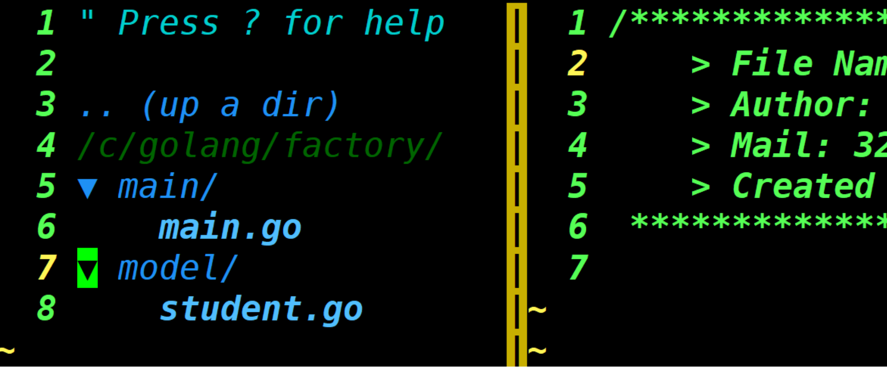
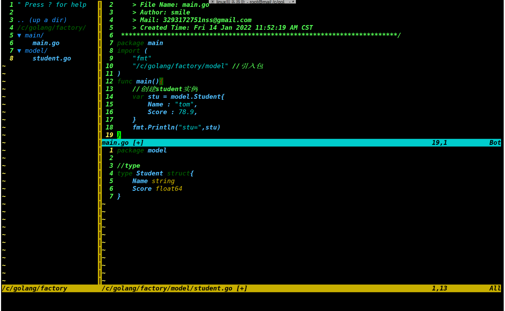
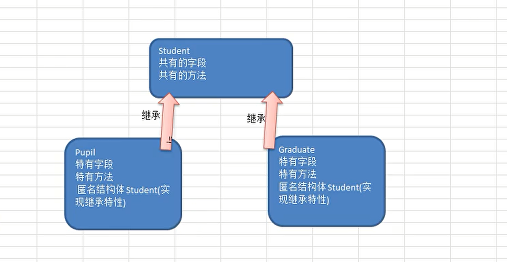

# 结构体、工厂模式、继承封装

[[toc]]

[toc]

😶‍🌫️go语言官方编程指南：[https://pkg.go.dev/std](https://pkg.go.dev/std)

>   go语言的官方文档学习笔记很全，推荐去官网学习

😶‍🌫️我的学习笔记：github: [https://github.com/3293172751/golang-rearn](https://github.com/3293172751/golang-rearn)

---

**区块链技术（也称之为分布式账本技术）**，是一种互联网数据库技术，其特点是去中心化，公开透明，让每一个人均可参与的数据库记录

>   ❤️💕💕关于区块链技术，可以关注我，共同学习更多的区块链技术。博客[http://cubxxw.com](http://cubxxw.com)

---

## 面对对象编程

>   面对对象的编程步骤：
>
>   1.   声明结构体，确定结构体名
>   2.   编写结构体字段
>   3.   编写结构体方法

## 结构体

::: details 结构体创建💡简单的一个案例如下：

```go
/*
 * @Description:结构体
 * @Author: xiongxinwei 3293172751nss@gmail.com
 * @Date: 2022-10-04 21:37:41
 * @LastEditTime: 2022-10-24 18:44:31
 * @FilePath: \code\go-super\20-main.go
 * @Github_Address: https://github.com/cubxxw/awesome-cs-cloudnative-blockchain
 * Copyright (c) 2022 by xiongxinwei 3293172751nss@gmail.com, All Rights Reserved. @blog: http://cubxxw.com
 */
package main

import (
	"fmt"
)

type Person struct {
	Name  string
	Age   int
	Email string
}

func main() {
	var p1 Person
	p1.Name = "Tom"
	p1.Age = 20
	p1.Email = "3293172751@qq.com"
	fmt.Println("p1=", p1)

	p2 := Person{"Jack", 30, "xiongxinwei@mail.com"}
	fmt.Println("p2=", p2)

	p3 := &Person{Name: "Mary", Age: 40, Email: "cub@cubxxw.com"}
	fmt.Println("p3=", p3)

	p4 := new(Person)
	p4.Name = "Mike"
	p4.Age = 50
	p4.Email = "xxw@cubxxw.com"
	fmt.Println("p4=", p4)

	fmt.Println("p1.Email =", p1.Email)
	fmt.Println("p2.Email =", p2.Email)
	fmt.Println("p3.Email =", p3.Email)
	fmt.Println("p4.Email =", p4.Email)
}

```

🚀 编译结果如下：

```bash
[Running] go run "d:\文档\最近的\awesome-golang\docs\code\go-super\20-main.go"
p1= {Tom 20 3293172751@qq.com}
p2= {Jack 30 xiongxinwei@mail.com}
p3= &{Mary 40 cub@cubxxw.com}
p4= &{Mike 50 xxw@cubxxw.com}
p1.Email = 3293172751@qq.com
p2.Email = xiongxinwei@mail.com
p3.Email = cub@cubxxw.com
p4.Email = xxw@cubxxw.com
```


**结构体的值改变：**

```go
	p1.Email = "x@cubxxw.com" //修改 p1 的 Email
	fmt.Println("p1.Email =", p1.Email) //p1.Email = x@cubxxw.com
```

:::


**案例联系：**

```go
package main

import (
	"fmt"	
)

/*
学生案例：
编写一个Student结构体，包含name、gender、age、id、score字段，分别为string、string、int、int、float64类型。
结构体中声明一个say方法，返回string类型，方法返回信息中包含所有字段值。
在main方法中，创建Student结构体实例(变量)，并访问say方法，并将调用结果打印输出。
*/
type Student struct {
	name string
	gender string
	age int
	id int
	score float64
}

func (student *Student) say()  string {

	infoStr := fmt.Sprintf("student的信息 name=[%v] gender=[%v], age=[%v] id=[%v] score=[%v]",
		student.name, student.gender, student.age, student.id, student.score)

	return infoStr
}

/*
1)编程创建一个Box结构体，在其中声明三个字段表示一个立方体的长、宽和高，长宽高要从终端获取
2)声明一个方法获取立方体的体积。
3)创建一个Box结构体变量，打印给定尺寸的立方体的体积
*/
type Box struct {
	len float64
	width float64
	height float64
}

//声明一个方法获取立方体的体积
func (box *Box) getVolumn() float64 {
	return box.len * box.width * box.height
}


// 景区门票案例
// 一个景区根据游人的年龄收取不同价格的门票，比如年龄大于18，收费20元，其它情况门票免费.
// 请编写Visitor结构体，根据年龄段决定能够购买的门票价格并输出

type Visitor struct {
	Name string
	Age int
}

func (visitor *Visitor) showPrice() {
	if visitor.Age >= 90 || visitor.Age <=8 {
		fmt.Println("考虑到安全，就不要玩了")
		return 
	}
	if visitor.Age > 18 {
		fmt.Printf("游客的名字为 %v 年龄为 %v 收费20元 \n", visitor.Name, visitor.Age)
	} else {
		fmt.Printf("游客的名字为 %v 年龄为 %v 免费 \n", visitor.Name, visitor.Age)
	}
}


func main() {
	//测试
	//创建一个Student实例变量
	var stu = Student{
		name : "tom",
		gender : "male",
		age : 18,
		id : 1000,
		score : 99.98,
	}
	fmt.Println(stu.say())

	//测试代码
	var box Box
	box.len = 1.1
	box.width = 2.0
	box.height = 3.0
	volumn := box.getVolumn()
	fmt.Printf("体积为=%.2f\n", volumn)
    /*格式化输出，保留两位小数点*/

	//测试
	var v Visitor
	for {
		fmt.Println("请输入你的名字")
		fmt.Scanln(&v.Name)
		if v.Name == "n" {
			fmt.Println("退出程序....")
			break
		}
		fmt.Println("请输入你的年龄")
		fmt.Scanln(&v.Age)
		v.showPrice()

	}
}
```

🚀 编译结果如下：

```shell
[root@mail golang]# go build -o main main.go 
[root@mail golang]# ./main
student的信息 name=[tom] gender=[male], age=[18] id=[1000] score=[99.98]
体积为=6.60请输入你的名字
张三
请输入你的年龄
19
游客的名字为 张三 年龄为 19 收费20元 
请输入你的名字
李四
请输入你的年龄
8
考虑到安全，就不要玩了
请输入你的名字
n
退出程序....
```


## 指定变量值

**Golang在创建结构体时候，可以直接指定字段值**

```go
package main

import (
	"fmt"	
)
type Stu struct {
	Name string
	Age int
}
func main() {
    /* 方法 */
}
```


**1. 在创建结构体变量时，把字段名和字段值写在一起, 这种写法，就不依赖字段的定义顺序**

```go
var stu3 = Stu{
		Name :"jack",
		Age : 20,
	}
stu4 := Stu{
	Age : 30,
	Name : "mary",
}
fmt.Println(stu1, stu2, stu3, stu4)
```


**2. 在创建结构体变量时，就直接指定字段的值，顺序不可颠倒**

```go
var stu1 = Stu{"小明", 19} // stu1---> 结构体数据空间
stu2 := Stu{"小明~", 20}
```


✍️ **可以使用结构体指针（重要）**

>   返回的是一种指针类型

**3. 返回结构体的指针类型(!!!)**

```go
var stu5 *Stu = &Stu{"小王", 29}  
/*或*/
stu6 := &Stu{"小王~", 39}
```

>   **在结构体中 stu5--> 地址 ---> 结构体数据[xxxx,xxx]**


**4. 创建结构体指针变量时，把字段名和字段值写在一起, 这种写法，就不依赖字段的定义顺序**

```go
var stu7 = &Stu{
	Name : "小李",
	Age :49,
}
stu8 := &Stu{
	Age :59,
	Name : "小李~",
}
```

🚀 编译结果如下：

```go
fmt.Println(*stu5, *stu6, *stu7, *stu8)   //取值
fmt.Println(stu5, stu6, stu7, stu8)   //取地址
```


## 结构体方法

::: danger 结构体是值类型
💡简单的一个案例如下：

```go
/*
 * @Description:结构体的使用
 * @Author: xiongxinwei 3293172751nss@gmail.com
 * @Date: 2022-10-04 21:37:41
 * @LastEditTime: 2022-10-24 18:53:16
 * @FilePath: \code\go-super\21-main.go
 * @Github_Address: https://github.com/cubxxw/awesome-cs-cloudnative-blockchain
 * Copyright (c) 2022 by xiongxinwei 3293172751nss@gmail.com, All Rights Reserved. @blog: http://cubxxw.com
 */
package main

import "fmt"

type Person struct {
	Name string
	Age  int
}

type PersonList struct {
	Persons []Person
}

func main() {
	person := Person{
		Name: "Tom",
		Age:  20,
	}
	fmt.Println("person=", person)
	persone2 := person
	persone2.Name = "Jack"
	fmt.Println("person=", persone2)
}
```

🚀 编译结果如下：

```
[Running] go run "d:\文档\最近的\awesome-golang\docs\code\go-super\21-main.go"
person= {Tom 20}
person= {Jack 20}
```

:::


## 工厂模式

**Golang中没有构造函数，通常可以用工厂模式来解决问题**

>   当我们的结构体首字母是大写的可以在其他包使用这个结构体,**那么如果我们希望小写的也能在其他包使用,此时就需要工厂模式来解决,使用工厂模式实现挎包访问结构体实例**

**我先使用vim查看下文件路径**




**使用大写字母直接访问包中的结构体**




**如果student结构体首字母是小写的,只能在model中使用,此时通过工厂模式解决**

在model包中创建一个方法,返回指针类型

```go
func NewStudent(n string,s float64) *student{
	return &student{
        Name : n,
        Score : s,
     }
}
```


**在main包中使用**

```go
func main(){
	//首字母小写使用方法
	var stu = model.NewStudent("tom",88.8)
    /*stu是指向结构体的指针*/
	fmt.Println(*stu)
    fmt.Println("name=",stu.Name,"Score=",stu.Score)
}
```


**这种方法就被称为工厂模式**

>   如果 `score` 是一个小写的,在其他包不可以直接访问,怎么样访问它呢?
>
>   我们可以再加入提供一个方法

```go
func (s *student) GetScore() float64{
    return (*s.score)   //ok,*可以省略
}
/*main访问*/
fmt.Println(stu.GetScore())
```


## 抽象

>   面对对象的思想可以简化为一种抽象的模型,把一类事物的共有属性(字段)和方法提取出来,形成一个物理模型(模板),这种研究问题的方法称之为**抽象**

>   银行存取款

```go
package main

import (
	"fmt"
)
//定义一个结构体Account
type Account struct {
	AccountNo string
	Pwd string
	Balance float64
}

//1. 方法 == 存款
func (account *Account) Deposite(money float64, pwd string)  {
	//看下输入的密码是否正确
	if pwd != account.Pwd {
		fmt.Println("你输入的密码不正确")
		return 
	}

	//看看存款金额是否正确
    if money <= 0 {
		fmt.Println("你输入的金额不正确")
		return 
	}
	account.Balance += money
	fmt.Println("存款成功~~")
}

//取款
func (account *Account) WithDraw(money float64, pwd string)  {
	//看下输入的密码是否正确
	if pwd != account.Pwd {
		fmt.Println("你输入的密码不正确")
		return 
	}
	//看看取款金额是否正确
	if money <= 0  || money > account.Balance {
        /* 或者money大于你的余额,,没办法取出*/
		fmt.Println("你输入的金额不正确")
		return 
	}
	account.Balance -= money
	fmt.Println("取款成功~~")
}

//查询余额query
func (account *Account) Query(pwd string)  {
	//看下输入的密码是否正确
	if pwd != account.Pwd {
		fmt.Println("你输入的密码不正确")
		return 
	}
	fmt.Printf("你的账号为=%v 余额=%v \n", account.AccountNo, account.Balance)

}
func main() {
	account := Account{
		AccountNo : "gs1111111",
		Pwd : "666666",
		Balance : 100.0,
	}
	//这里可以做的更加灵活，就是让用户通过控制台来输入命令...
	//菜单....
	account.Query("666666")
	account.Deposite(200.0, "666666")
	account.Query("666666")
	account.WithDraw(150.0, "666666")
	account.Query("666666")
}
```

🚀 编译结果如下：

```
[root@mail golang]# go run Account.go 
你的账号为=gs1111111 余额=100 
存款成功~~
你的账号为=gs1111111 余额=300 
取款成功~~
你的账号为=gs1111111 余额=150 

```


## 面对对象特征

**封装:把抽象出的字段和对字段的操作,封装在一起,数据保存在内部**

比如说上面取款过程,保证了数据合理性:

```go
func (account *Account) WithDraw(money float64, pwd string)  {

	//看下输入的密码是否正确
	if pwd != account.Pwd {
		fmt.Println("你输入的密码不正确")
		return 
	}
	//看看取款金额是否正确
	if money <= 0  || money > account.Balance {
        /* 或者money大于你的余额,,没办法取出*/
		fmt.Println("你输入的金额不正确")
		return 
	}
	account.Balance -= money
	fmt.Println("取款成功~~")
}
```


## 封装

**main包**

```go
package main
import (
	"fmt"
	"/c/golang/chapter11/encapsulate/model"
)

func main() {
	p := model.NewPerson("smith")   //工厂模式
	p.SetAge(18)    //年龄方法
	p.SetSal(5000)  //薪水
	fmt.Println(p)   
	fmt.Println(p.Name, " age =", p.GetAge(), " sal = ", p.GetSal()) //年龄需要用到方法
}
```

**madel包**

```go
package model
import "fmt"

type person struct {     //小写,不能访问person
	Name string
	age int   			//其它包不能直接访问..
	sal float64
}

//写一个工厂模式的函数，相当于构造函数  -- 访问person
func NewPerson(name string) *person {
    /*if....*/
	return &person{
		Name : name,
	}
}

//为了访问age 和 sal 我们编写一对SetXxx的方法和GetXxx的方法
func (p *person) SetAge(age int) {
	if age >0 && age <150 {
		p.age = age
	} else {
		fmt.Println("年龄范围不正确..")
		//给程序员给一个默认值
	}
}

func (p *person) GetAge() int {
	return p.age
}


func (p *person) SetSal(sal float64) {
	if sal >= 3000 && sal <= 30000 {
		p.sal = sal
	} else {
		fmt.Println("薪水范围不正确..")	
	}
}

func (p *person) GetSal() float64 {
	return p.sal
}
```

::: tip
可以看到Go语言的工厂模式和get、set方法和Java的面对对象很接近

:::


## 继承

**面对对象的特性可以解决代码的复用**

>   对小学生考试成绩的设置

```go
package main
import "fmt"
type Pupil struct{
    Name string
    Age int
    Score int
}

/*显示成绩  - - 方法*/
func(p *Pupil) showInfo(){
    fmt.Printf("学生名 = %v, 年龄 = %v 成绩 = %v",p.Name,p.Age,p.Score)
}

/*录入分数*/
func(p *Pupil) SetScore(score int){
    if score > 100 ||score < 10{
        fmt.Println("请输入正确的范围")
    	return
    }
    p.Score = score
}

/*显示状态*/
func (p *Pupil) tesing(){
    fmt.Println("小学生正在考试")
}

func main(){
    p := Pupil{
        Name : "tom",
        Age : 10,
    }
    p.tesing()
    p.SetScore(100)
    p.showInfo()
}
```

🚀 编译结果如下：

```
[root@mail golang]# go run Account.go 
小学生正在考试
请输入小学生成绩:
102
请输入正确的范围
学生名 = tom, 年龄 = 10 成绩 = 0小学生正在考试
```

**此时如果还有大学生的话,我们需要再创建一个结构体Graduate,复制一份方法出来,就会出现大量的代码冗余,此时需要用到继承。**

>   继承可以解决代码复用问题,使编程更加靠近人类的思考思维。

>   在Golang中通过了**匿名结构体来实现了继承特性。**



**也就是说,在Golang中,如果一个struct嵌套了另一个匿名结构体,那么这个结构体可以直接访问你们结构体的字段和方法,从而实现了继承特性**

```go
type Good struct{
	Name string
	Price int
}
type Book struct{
	Goods //这里就是嵌套匿名结构体Goods
	Writer string
}
```

**我们对上面学生的案例进行继承改进**

```go
package main
import "fmt"

//改写共有的结构体
type Student struct{
    Name string
    Age int
    Score int
}

//将Pupil和Graduate方法绑定到*student
func (stu *Student) ShowInfo{
     fmt.Printf("学生名 = %v, 年龄 = %v 成绩 = %v",stu.Name,stu.Age,stu.Score)
}

/*录入分数*/
func(p *Student) SetScore(score int){
    if score > 100 ||score < 10{
        fmt.Println("请输入正确的范围")
    	return
    }
    p.Score = score
}

/*显示状态   --  大学生和小学生不一样 -- 保留  -- 大学生*/
func (p *Graduate) testing(){
    fmt.Println("小学生正在考试")
}

type Pupil struct{
	Student       //嵌入了student的匿名结构体   - -  继承
}

type Graduate struct{
	Student       //嵌入了student的匿名结构体   - -  继承
}
/*显示状态*/
func (p *Pupil) tesing(){
    fmt.Println("小学生正在考试")
}

func main(){
    p := &Pupil{}
    P.Student.Name  = "lihua"
	p.Student.Age = 8
    p.testing()
    p.Student.SetScore(100)
    p.Student.showInfo()
}
```


## 继承的深入讨论

::: tip
因为在Golang中是没有多态的，Java中的多态恰好是非常难的，在Golang中也是可以很好的实现

:::

💡简单的一个案例如下：

```go
package main
import "fmt"
type A struct{
	Name string
	age int
}
func (a *A) Sayok(){   //大写方法
     fmt.Println("A Sayok",a.Name)
}
func (a *A) hello(){   //小写方法
    fmt.Println("A hello",a.Name)
}
type B struct{
    A
}
func main(){
    var b B
    b.A.Name = "tom"
    //b.Name = "tom"  -- 不可以
    b.A.age = 19
    b.A.Sayok()
    b.Sayok()
    b.A.hello()
    fmt.Println(b)
}
```

🚀 编译结果如下：

```
[root@mail golang]# go run Account.go 
A Sayok tom
A hello tom
{{tom 19}}
```

**由此可见,私有的可以继承使用，而且方法hello和Sayok方法无论是私有的还是公有的都可以直接使用，首字母大写或者小写均可以 **

**在编译的时候可以把A去掉,进行简化,编译器也可以识别(编译器会自己找)**

```go
    var b B
    b.Name = "tom"
    b.age = 19
    b.Sayok()
    b.hello()
```


**当匿名结构体和结构体中的变量重复时候,编译器会采用就近原则**

```go
type A struct{
	Name string
	age int
}
type B struct{
    A
    Name string
}

func main(){
	b.Name = "jack"   //此时找的是自身的
    /* 如果要给A的Name赋值,就必须要使用*/
    b.A.Name = "lisa"
    b.age = 20      //找的是A
    b.Sayok()      //找的是自身的Name和A的Age
}
```


**结构体嵌入了两个或者多个匿名结构体,如果两个匿名结构体有相同的字段和方法(同时结构体本身没有相同的字段和方法),在访问时,就必须要指定匿名结构体的名字,否则编译会报错**

```go
type A struct{
	Name string    //相同字段
	age int
}
type B struct{
    Name string    //相同字段
    score int
}
type C struct{
	A
	B
/*如果本身有Name则不会报错,就近原则*/
}
func main(){
    var c C
    c.Name = "tom"      //会报错!!!!!
    c.A.Name = "lisa"   //指定A
    c.B.Name = "jack"   //指定B   
}
```

>   这种情况也被称为**多重继承**,为了保证代码简洁性,建议尽量不使用多重继承。


**嵌套匿名结构体后,可以在创建结构变量时,直接指定各个匿名结构体字段的值**

```go
func main(){
	c := C{
        B{"张三",1000},
        A{"李四",19},
    }
}
```

>   注意后面需要有`,`


**结构体中可以只写类型**

```go
package main
import "fmt"
type A struct{
	Name string    //相同字段
	age int
}
type C struct{
	A
	int   //表示的是匿名字段
}
/*使用int方法*/
func main(){
    var c C
    c.Name = "lihua"
    c.age = 100
    c.int = 20
    fmt.Println("int=",c.int)
    fmt.Println("c= ",c)
}
```

🚀 编译结果如下：

```
[root@mail golang]# go run main.go 
int= 20
c= {{lihua 100} 20}
```


## END 链接

<ul><li><div><a href = '10.md' style='float:left'>⬆️上一节🔗</a><a href = '12.md' style='float: right'>⬇️下一节🔗</a></div></li></ul>

+ [Ⓜ️回到目录🏠](../README.md)

+ [**🫵参与贡献💞❤️‍🔥💖**](https://cubxxw.com/archives/contributors))

+ ✴️版权声明 &copy; :本书所有内容遵循[CC-BY-SA 3.0协议（署名-相同方式共享）&copy;](http://zh.wikipedia.org/wiki/Wikipedia:CC-by-sa-3.0协议文本) 
