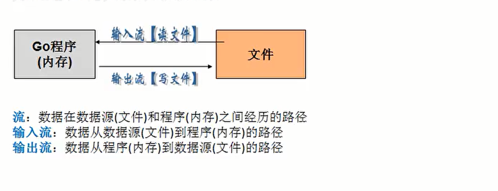

# 文件的一系列操作

[[toc]]

[toc]

😶‍🌫️go语言官方编程指南：[https://golang.org/#](https://golang.org/#)  

>   go语言的官方文档学习笔记很全，推荐去官网学习

😶‍🌫️我的学习笔记：github: [https://github.com/3293172751/golang-rearn](https://github.com/3293172751/golang-rearn)

---

**区块链技术（也称之为分布式账本技术）**，是一种互联网数据库技术，其特点是去中心化，公开透明，让每一个人均可参与的数据库记录

>   ❤️💕💕关于区块链技术，可以关注我，共同学习更多的区块链技术。博客[http://cubxxw.com](http://cubxxw.com)

---

## 文件操作速查

::: details 读取文件操作 方法一
**读取文件的方法一：注意一次只能读取`128`个字节，可以循环读取**

1. 打开文件 `fileObj, err := os.Open("文件路径")`
2. 读取文件内容 `reader := bufio.NewReader(fileObj)`
3. 循环读取文件内容
	
	```go
	for {
	    str, err := reader.ReadString('')
		if err == io.EOF {  // `EOF`是文件读取结束的标志，当读取到文件末尾时，会返回`EOF`
			break
		}
		fmt.Print(str)
	}
	```
4. 关闭文件 `fileObj.Close()`		

💡简单的一个案例如下：

```go
func main() {
	file, err := os.Open("./51-main.go")
	defer file.Close()
	if err != nil {
		fmt.Println("文件打开失败", err)
		return
	}
	fmt.Println("文件打开成功")

	//创建一个切片 用来存储读取的内容
	buf := make([]byte, 1024*2)
	//循环读取文件内容
	for {
		n, err := file.Read(buf)
		if err != nil {
			fmt.Println("文件读取失败", err)
			return
		}
		//如果读取的内容小于1024字节，就结束循环
		if n < 1024*2 {
			break
		}
		fmt.Println(string(buf[:n]))
	}
}
```

🚀 编译结果如下：

```bash
D:\文档\最近的\awesome-golang\docs\code\go-super>go build 52-main.go

D:\文档\最近的\awesome-golang\docs\code\go-super>52-main.exe
文件打开成功
```

📜 对上面的解释：

> **后面读取内容太长，但是内容是没有读取完整的，只读取到一部分，最后一个不满1024字节就去掉了，如果想要读取完整，改for循环：~**
>
> +  `EOF`是文件读取结束的标志，当读取到文件末尾时，会返回`EOF`
>
> ```go
> for {
> 	n, err := file.Read(buf)
> 	if err == io.EOF {  // `EOF`是文件读取结束的标志，当读取到文件末尾时，会返回`EOF`·
> 		break
> 	}
> 	if err != nil {
> 		fmt.Println("文件读取失败", err)
> 		return   
> 	}
> 	// //如果读取的内容小于1024字节，就结束循环
> 	// if n < 1024*2 {
> 	// 	break
> 	// }
> 	fmt.Println(string(buf[:n]))
> }
> ```

:::


::: details 读取文件的方法二： bufio包的ReadFile()函数
**读取文件的方法二： bufio包的ReadFile()函数**

1. 读取文件内容 `content, err := ioutil.ReadFile("文件路径")`
2. 打印文件内容 `fmt.Println(string(content))`

💡简单的一个案例如下：

```go
/*
 * @Description: bufio按行读取文件
 * @Author: xiongxinwei 3293172751nss@gmail.com
 * @Date: 2022-10-04 21:37:41
 * @LastEditTime: 2022-10-26 17:55:39
 * @FilePath: \code\go-super\53-main.go
 * @Github_Address: https://github.com/cubxxw/awesome-cs-cloudnative-blockchain
 * Copyright (c) 2022 by xiongxinwei 3293172751nss@gmail.com, All Rights Reserved. @blog: http://cubxxw.com
 */
package main

import (
	"fmt"
	"io/ioutil"
)

func main() {
	//bufio按行读取文件  如果文件太大，会导致内存溢出
	byteString, err := ioutil.ReadFile("./51-main.go") //返回的是一个字节切片
	if err != nil {
		fmt.Println("文件读取失败", err)
		return
	}
	fmt.Println(string(byteString))
}

```

编译结果和上面一样

:::


::: details 读取文件的方法二： bufio读取文件
**bufio读取文件**

1. 只读方式打开文件 `file, err := os.Open("test.txt")`
2. 创建一个 `*Reader` 是带缓冲的 `reader := bufio.NewReader(file)`
3. 循环的调用 `reader.ReadString('\n')` 读取文件的内容 
4. 关闭文件 `defer file.Close()`

:::


## 文件

> 文件，我们并不陌生，**文件就是数据源（保存数据的地方）的一种**，文件最主要的作用是**保存数据**,它既可以是保存一张图片，也可以是声音和视频

**文件在程序中是以流的形式来操作的**



**os.file**封装所有文件相关操作，file是一个结构体

**文件是一个指针类型**

```go
/*************************************************************************
    > File Name: file.go
    > Author: smile
    > Mail: 3293172751nss@gmail.com 
    > Created Time: Sat 12 Mar 2022 01:45:24 PM CST
 ************************************************************************/
package main
import (
    "fmt"
    "os"
)
func main(){
    file , err := os.Open("/c/golang/fun.go")
    if err != nil{
        fmt.Println("open file = ",err)
    }   
    fmt.Printf("file= %v",file)
    //关闭文件
    err = file.Close()                                                                            
    if err!=nil{
        fmt.Println("打开文件错误",err)
    }   
}

```

**编译**

```shell
[rroot@mail golang]# go build -o a file.go 
[rroot@mail golang]# ./a
fifile= &{0xc0000a6120vim file.goo build -o a file.go 
```

**由此可见，文件就是一个指针**


## OPenFile函数

Go语言的 os 包下有一个 OpenFile 函数，其原型如下所示：

func OpenFile(name string, flag int, perm FileMode) (file *File, err error)

其中 name 是文件的文件名，如果不是在当前路径下运行需要加上具体路径；flag 是文件的处理参数，为 int 类型，根据系统的不同具体值可能有所不同，但是作用是相同的。

下面列举了一些常用的 flag 文件处理参数：

- O_RDONLY：只读模式打开文件；
- O_WRONLY：只写模式打开文件；
- O_RDWR：读写模式打开文件；
- O_APPEND：写操作时将数据附加到文件尾部（追加）；
- O_CREATE：如果不存在将创建一个新文件；
- O_EXCL：和 O_CREATE 配合使用，文件必须不存在，否则返回一个错误；
- O_SYNC：当进行一系列写操作时，每次都要等待上次的 I/O 操作完成再进行；
- O_TRUNC：如果可能，在打开时清空文件。

创建一个新文件 golang.txt，并在其中写入 5 句“http://cubxxw.com”。

```go
package main

import (
    "bufio"
    "fmt"
    "os"
)

func main() {
    //创建一个新文件，写入内容 5 句 “http://c.biancheng.net/golang/”
    filePath := "e:/code/golang.txt"
    file, err := os.OpenFile(filePath, os.O_WRONLY|os.O_CREATE, 0666)
    if err != nil {
        fmt.Println("文件打开失败", err)
    }
    //及时关闭file句柄
    defer file.Close()

    //写入文件时，使用带缓存的 *Writer
    write := bufio.NewWriter(file)
    for i := 0; i < 5; i++ {
        write.WriteString("http://cubxxw.com\n")
    }
    //Flush将缓存的文件真正写入到文件中
    write.Flush()
}
```


## 读取文件内容显示在终端方法

```go
package main
import (
    "fmt"
    "os"
    "io"
    "reader"
)
func main(){
    file, err := os.Open("/c/golang/fun.go")
    if err != nil{
        fmt.Println("open file = ",err)
    } 
    
    //及时关闭文件
    defer file.Close()
    reader := bufio.NewReader(file)
    
    //循环的读取文件的内容
    for{
        str,err := reader.ReadString('\n')
        //读取到一行就结束,err 错误信息提示
        if err != io.EOF{
            //io.EOF表示文件的末尾，此时结束读取
            break
        }
        fmt.Println(str)
    }
    fmt.Println("文件读取结束...")
}
```

**编译读取：**

```shell
[root@mail golang]# go run file.go 
package main

import "fmt"

func main() {
   /* 定义局部变量 */
   var a int = 100
   var b int = 200
   var ret int

   /* 调用函数并返回最大值 */
   ret = max(a, b)

   fmt.Printf( "最大值是 : %!d(MISSING)\n", ret )
}

/* 函数返回两个数的最大值 */
func max(num1, num2 int) int {
   /* 定义局部变量 */

   if (num1 > num2) {
       return unm1
   } else {
      return num2
}
}
文件读取结束...
```

**读取文件内容并且显示在终端（使用ioutil==一次将文件读取到内存中==),这种方式适用于文件不大的情况，相关方法和函数(ioutil.ReadFile)**

```
func ReadFile
```

```go
/*************************************************************************
    > File Name: iouit.go
    > Author: smile
    > Mail: 3293172751nss@gmail.com 
    > Created Time: Sat 12 Mar 2022 02:48:32 PM CST
 ************************************************************************/
package main
import (
    "fmt"
    "io/ioutil"
)
func main(){
    //使用ioutil一次性将函数读取到为
    file := "/c/golang/aa.go"
    content, err := ioutil.ReadFile(file)
    //文件的打开和关闭都被隐藏起来了。所以不需要写打开和关闭
    if err != nil{
        fmt.Printf("file open err= %v",err)
    }   
    //把读取到的内容显示到终端
    //fmt.Printf("%v",content)  //[]bype
    fmt.Printf("%v",string(content))  //需要转换为string  
}
```

**编译**

```shell
[root@mail golang]# go run iouit.go 
package main
import "fmt"
func main() {
   var a int = 21
   var c int
   c =  a
```


## 写文件的操作

[🖱️ 请去官网点击os包](https://studygolang.com/pkgdoc)

## Constants

```go
const (
    O_RDONLY int = syscall.O_RDONLY    // 只读模式打开文件
    O_WRONLY int = syscall.O_WRONLY    // 只写模式打开文件
    O_RDWR   int = syscall.O_RDWR      // 读写模式打开文件
    O_APPEND int = syscall.O_APPEND    // 写操作时将数据附加到文件尾部
    O_CREATE int = syscall.O_CREAT     // 如果不存在将创建一个新文件
    O_EXCL   int = syscall.O_EXCL      // 和O_CREATE配合使用，文件必须不存在
    O_SYNC   int = syscall.O_SYNC      // 打开文件用于同步I/O
    O_TRUNC  int = syscall.O_TRUNC     // 如果可能，打开时清空文件
)
```

**我们通常把 O_CREATE和O_WRONLY组合使用（写文件如果文件不存在那么创建一个文件）**


**使用os.OpenFile(),budio.NewWriter()，**Writer的方法完成下面案例

**案例一**

> 创建一个新文件，写入内容5句”hello word”

```go
package main                                                                                                  
import (
    "fmt"
    "bufio"
    "os"
)
func main(){
    //1. 打开文件
    filePath := "c/golang/hello.go"
    file,err := os.OpenFile(filePath,os.O_WRONLY | os.O_CREATE,0666)
    if err != nil{
        fmt.Printf("open file err=%v\n",err)
        return
    }   
    defer file.Close()
    //写入
    str := "hello word\n"  //\n表示换行
    writer := bufio.NewWriter(file)
    //writer 是带缓存的
    for i:=0;i<5;i++{
        writer.WriterString(str)
    }   
    writer.Flush()
}
```


**在原来基础上读写和追加**

```
 file,err := os.OpenFile(filePath,os.O_O_RDWR | os.O_APPEND,0666)
```


## golang判断文件或者文件夹是否存在

**golang判断文件或者文件夹是否存在的方法为使用os.Stat()函数返回的错误值进行判断**

1. 如果返回的错误为nil,说明文件或文件夹不存在
2. 如果返回的错误类型为os.lsNotExist()判断为true,说明文件或者文件夹不存在
3. 如果返回值的错误类型为其他类型，则不确定是否存在


> 自己写了一个函数   –  可以直接用

```go
func PathExists(path string)(bool,error){  //传送路径path
	_,err := os.Stat(path)
	if err == nil {
	//文件或者目录存在
		return true,nil
	}
	if os.lsNotExist(err){
		return false,nil
	}
	return false,err    //可能有其他的错误信息
}
```


## 拷贝（复制）文件

::: det复制文件可以用写入方式
复制文件方法：
1. 打开源文件 srcFile, err := os.Open("test.txt")
2. 创建目标文件 dstFile, err := os.Create("test_copy.txt")
3. 创建一个 *Reader 是带缓冲的 reader := bufio.NewReader(srcFile)
4. 创建一个 *Writer 是带缓冲的 writer := bufio.NewWriter(dstFile)
5. 循环的调用 reader.ReadString('\n') 读取文件的内容
6. 调用 writer.WriteString(str) 将读取到的内容写入到目标文件中
7. 调用 writer.Flush() 将缓冲区的内容写入到目标文件中
8. 关闭文件 defer srcFile.Close()

:::


**目标文件dst，原文件src**

```go
func Copy(dst Writer,src Reader) (written int64,err error)
```

**Copy函数是io包提供的**

```go
package main
import (
	"fmt"
	"os"
	"io"
	"bufio" 
)

//自己编写一个函数，接收两个文件路径 srcFileName dstFileName
func CopyFile(dstFileName string, srcFileName string) (written int64, err error) {
	srcFile, err := os.Open(srcFileName)
	if err != nil {
		fmt.Printf("open file err=%v\n", err)
	}
	defer srcFile.Close()
	//通过srcfile ,获取到 Reader
	reader := bufio.NewReader(srcFile)

	//打开dstFileName
	dstFile, err := os.OpenFile(dstFileName, os.O_WRONLY | os.O_CREATE, 0666)
	if err != nil {
		fmt.Printf("open file err=%v\n", err)
		return 
	}

	//通过dstFile, 获取到 Writer
	writer := bufio.NewWriter(dstFile)
	defer dstFile.Close()
	return io.Copy(writer, reader)
}

func main() {

	//将d:/flower.jpg 文件拷贝到 e:/abc.jpg

	//调用CopyFile 完成文件拷贝
	srcFile := "d:/flower.jpg"
	dstFile := "e:/abc.jpg"
	_, err := CopyFile(dstFile, srcFile)
	if err == nil {
		fmt.Printf("拷贝完成\n")
	} else {
		fmt.Printf("拷贝错误 err=%v\n", err)
	}
	
}
```


## 统计英文、数字、空格和其他字符数量

```go
package main
import (
	"fmt"
	"os"
	"io"
	"bufio" 
)

//定义一个结构体，用于保存统计结果
type CharCount struct {
	ChCount int // 记录英文个数
	NumCount int // 记录数字的个数
	SpaceCount int // 记录空格的个数
	OtherCount int // 记录其它字符的个数
}

func main() {

	//思路: 打开一个文件, 创一个Reader
	//每读取一行，就去统计该行有多少个 英文、数字、空格和其他字符
	//然后将结果保存到一个结构体
	fileName := "c/golang/hello.go"
	file, err := os.Open(fileName)
	if err != nil {
		fmt.Printf("open file err=%v\n", err)
		return
	}
	defer file.Close()
	//定义个CharCount 实例
	var count CharCount
	//创建一个Reader
	reader := bufio.NewReader(file)

	//开始循环的读取fileName的内容
	for {
		str, err := reader.ReadString('\n')
		if err == io.EOF { //读到文件末尾就退出
			break
		}
		//遍历 str ，进行统计
		for _, v := range str {
			
			switch {  //无项目，相当于分支结构
				case v >= 'a' && v <= 'z':
						fallthrough         //穿透
				case v >= 'A' && v <= 'Z':
						count.ChCount++
				case v == ' ' || v == '\t':
						count.SpaceCount++
				case v >= '0' && v <= '9':
						count.NumCount++
				default :
						count.OtherCount++
			}
		}
	}

	//输出统计的结果看看是否正确
	fmt.Printf("字符的个数为=%v 数字的个数为=%v 空格的个数为=%v 其它字符个数=%v", 
		count.ChCount, count.NumCount, count.SpaceCount, count.OtherCount)
}
```


**编译**

```shell
[root@mail golang]# go run iouit.go 
字符的个数为=199 数字的个数为=18 空格的个数为=73 其它字符个数=108
```

[回到上面](# 45天学会go --第十五天   文件)


## python中的文件操作

使用open函数，可以打开一个已经存在的文件，或者创建一个新文件

**f=open("new.py","w")**

**r:  以只读方式打开文件。文件的指针将会放在文件的开头。这是\**默认模式\**。**

rb: 以二进制格式打开一个文件用于只读。文件指针将会放在文件的开头。这是默认模式。

r+: 打开一个文件用于读写。文件指针将会放在文件的开头。

rb+:以二进制格式打开一个文件用于读写。文件指针将会放在文件的开头。

**w:  打开一个文件只用于写入。如果该文件已存在则将其覆盖。如果该文件不存在，创建新文件。**

wb:  以二进制格式打开一个文件只用于写入。如果该文件已存在则将其覆盖。如果该文件不存在，创建新文件。

w+:  打开一个文件用于读写。如果该文件已存在则将其覆盖。如果该文件不存在，创建新文件。

wb+:以二进制格式打开一个文件用于读写。如果该文件已存在则将其覆盖。如果该文件不存在，创建新文件。

a:  打开一个文件用于追加。如果该文件已存在，文件指针将会放在文件的结尾。也就是说，新的内容将会被写入到已有内容之后。如果该文件不存在，创建新文件进行写入。

ab:  以二进制格式打开一个文件用于追加。如果该文件已存在，文件指针将会放在文件的结尾。也就是说，新的内容将会被写入到已有内容之后。如果该文件不存在，创建新文件进行写入。

a+:  打开一个文件用于读写。如果该文件已存在，文件指针将会放在文件的结尾。文件打开时会是追加模式。如果该文件不存在，创建新文件用于读写。

ab+:以二进制格式打开一个文件用于追加。如果该文件已存在，文件指针将会放在文件的结尾。如果该文件不存在，创建新文件用于读写。


**将hello word ,I am here写入到zidian.py中**

**f.write :写入**

**content=f.read(5)**   **读取5个字符，开始的时候定义在文件头部**

**content=f.read(5)**   接着上一次继续读取5个

**f.close :** **关闭文件**

rename()完成文件的重命名

 

```python
In [9]: f=open("zz.go","r")                                    

In [10]: r=f.readlines()                                       

In [11]: i=1                                                   

In [12]: for temp in r: 
    ...:     print("%d:%s"%(i,temp)) 
    ...:     i+=1 
    ...:                                                       

In [13]: !vim zz.go                                            

In [14]: f=open("a.go","r")                                    

In [15]: r=f.readlines()                                       

In [16]: for temp in r: 
    ...:     print("%d:%s"%(i,temp)) 
    ...:     i+=1 
    ...:                                                       
1:package main

2:

3:import (

4:    "fmt"

5:    "time"

6:)

```


## END 链接

<ul><li><div><a href = '14.md' style='float:left'>⬆️上一节🔗</a><a href = '16.md' style='float: right'>⬇️下一节🔗</a></div></li></ul>

+ [Ⓜ️回到目录🏠](../README.md)

+ [**🫵参与贡献💞❤️‍🔥💖**](https://cubxxw.com/archives/contributors))

+ ✴️版权声明 &copy; :本书所有内容遵循[CC-BY-SA 3.0协议（署名-相同方式共享）&copy;](http://zh.wikipedia.org/wiki/Wikipedia:CC-by-sa-3.0协议文本) 
