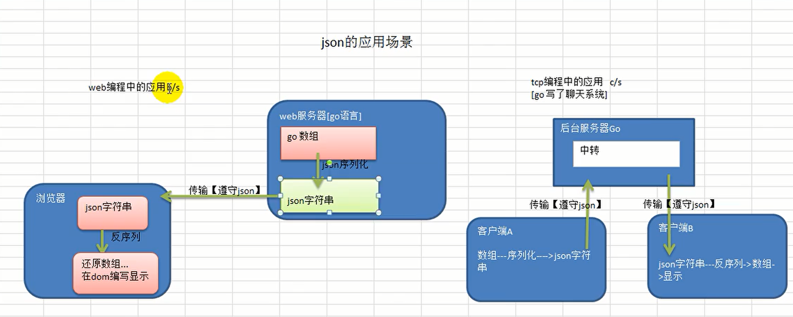

#  JSON序列化

[[toc]]

[toc]

😶‍🌫️go语言官方编程指南：[https://golang.org/#](https://golang.org/#)  

>   go语言的官方文档学习笔记很全，推荐去官网学习

😶‍🌫️我的学习笔记：github: [https://github.com/3293172751/golang-rearn](https://github.com/3293172751/golang-rearn)

---

**区块链技术（也称之为分布式账本技术）**，是一种互联网数据库技术，其特点是去中心化，公开透明，让每一个人均可参与的数据库记录

>   ❤️💕💕关于区块链技术，可以关注我，共同学习更多的区块链技术。博客[http://cubxxw.com](http://cubxxw.com)

---

## JSON

::: danger JSON🚸 
**JSON: JavaScript Object Notation（JavaScript 对象标记法）。**

**JSON 是一种存储和交换数据的语法。**

**JSON 是通过 JavaScript 对象标记法书写的文本。**
:::

## 交换数据

当数据在浏览器与服务器之间进行交换时，这些数据只能是文本。

JSON 属于文本，并且我们能够把任何 JavaScript 对象转换为 JSON，然后将 JSON 发送到服务器。

我们也能把从服务器接收到的任何 JSON 转换为 JavaScript 对象。

以这样的方式，我们能够把数据作为 JavaScript 对象来处理，无需复杂的解析和转译。 

> json从2001开始推广使用，目前已经成为主流的数据格式 




## 发送数据

如果您的数据存储在 JavaScript 对象中，您可以把该对象转换为 JSON，然后将其发送到服务器。

```json
var myObj = { name:"Bill Gates",  age:62, city:"Seattle" };
var myJSON =  JSON.stringify(myObj);
window.location = "demo_json.php?x=" + myJSON;
```


## 接收数据

如果您以 JSON 格式接收到数据，您能够将其转换为 JavaScript 对象：

```json
var myJSON = '{ "name":"Bill Gates",  "age":62, "city":"Seattle" }';
var myObj = JSON.parse(myJSON);
document.getElementById("demo").innerHTML = myObj.name;
```


## 存储数据

在存储数据时，数据必须是某种具体的格式，并且无论您选择在何处存储它，文本永远是合法格式之一。

JSON 让 JavaScript 对象存储为文本成为可能。

把数据存储在本地存储中

```json
//存储数据：
myObj = { name:"Bill Gates",  age:62, city:"Seattle" };
myJSON =  JSON.stringify(myObj);
localStorage.setItem("testJSON", myJSON);

//接收数据：
text = localStorage.getItem("testJSON");
obj =  JSON.parse(text);
document.getElementById("demo").innerHTML = obj.name;
```


## 总结

1. **在js中，一切都是对象，因此任何的数据类型都可以用json来表示**

2. **js中可以通过键值对来表示数据**
3. js扩展性特别好


## JSON数据在线解析

::: details JSON在线解析
**在我们做复杂的数据的时候可以选择**

[🖱️解析网址地址](http://www.json.cn)


:::


## JSON序列化

### 结构体序列化

> jaon序列化是指将现有的key-value结构的数据结构（结构体，map，切片）序列化为json字符串

```go
/*************************************************************************
    > File Name: json.go                                                                                                                               
    > Author: smile
    > Mail: 3293172751nss@gmail.com 
    > Created Time: Sun 13 Mar 2022 01:48:07 PM CST
 ************************************************************************/
package main
import(
    "fmt"
    "encoding/json"
)
type M struct{
    Name string 
    Age int
    Birthday string
    sal float64
    skill string
}

func test(){
    m := M{
        Name:"牛魔王",
        Age:20,
        Birthday:"2011-11-11",
        Sal:800000.00,
        Skill:"牛魔权",
    }     //一定要是大写
    //将M序列化
    data ,err := json.Marshal(&m)  //使用json中的Marshal方法
    if err != nil{
        fmt.Printf("序列化失败:err:%v\n",err)
    }
    //输出序列化后的结果
    fmt.Printf("序列化后的结果:%v",string(data))         //字符串需要转化
}

func main(){
    test()    
}

```

**编译：**

```shell
[root@mail golang]# go run json.go 
序列化后的结果:{"Name":"牛魔王","Age":20,"Birthday":"2011-11-11","Sal":800000,"Skill":"牛魔权"}
```

在www.json.cn上验证

```json
{
    "Name":"牛魔王",
    "Age":20,
    "Birthday":"2011-11-11",
    "Sal":800000,
    "Skill":"牛魔权"
}
```


### 将map进行序列化

```go
func testMap(){
	var a map[string]inferface{}
    //key为字符串，值为任意类型
    //使用map先make
    a = make(map[string]interface{})
    a["name"]="红孩儿"
    a["age"]=19
    a["adress"]="wuhan"
    
    data ,err := json.Marshal(a)  //使用json中的Marshal方法
    //map是引用传递，所以不需要取地址符号
    if err != nil{
    	fmt.Printf("序列化失败:err:%v\n",err)
    }
    //输出序列化后的结果
    fmt.Printf("序列化后的结果:%v",string(data))         //字符串需要转化
}
```

**编译和序列化**

```json
序列化后的结果:{"adress":"wuhan","age":19,"name":"红孩儿"}
{
    "adress":"wuhan",
    "age":19,
    "name":"红孩儿"
}
```


### 对切片序列化

```go
funcSlice(){
//复杂化，一个切片中有很多map
    var slice  []map[string]interface{}
    var s map[string]interface{}
    //使用map先make
    s = make(map[string]interface{})
    s["name"]="张三"
    s["age"]=3
    s["adress"]="wuhan"
    slice = append(slice,s)
    s = make(map[string]interface{})
    
    var u map[string]interface{}
    u = make(map[string]interface{})
    u["name"]="张三"
    u["age"]=3
    u["adress"]="wuhan"
    slice = append(slice,u)
    
    data ,err := json.Marshal(slice)  //使用json中的Marshal方法
    //map是引用传递，所以不需要取地址符号
    if err != nil{
    	fmt.Printf("序列化失败:err:%v\n",err)
    }
    //输出序列化后的结果
    fmt.Printf("序列化后的结果:%v\n",string(data))         //字符串需要转化    
}
```


### 普通类型序列化

```go
func testnum(){
	ver num float64 = 12313.122
    data ,err := json.Marshal(num)  //使用json中的Marshal方法
    if err != nil{
    	fmt.Printf("序列化失败:err:%v\n",err)
    }    
}
```


### 序列化代码

```go
/*************************************************************************
    > File Name: json.go
    > Author: smile
    > Mail: 3293172751nss@gmail.com 
    > Created Time: Sun 13 Mar 2022 01:48:07 PM CST
 ************************************************************************/
package main
import(
    "fmt"
    "encoding/json"
)
type M struct{
    Name string 
    Age int 
    Birthday string
    Sal float64
    Skill string
}

func test(){
    m := M{
        Name:"牛魔王",
        Age:20,
        Birthday:"2011-11-11",
        Sal:800000.00,
        Skill:"牛魔权",
    }   
    //将M序列化
    data ,err := json.Marshal(&m)  //使用json中的Marshal方法
    if err != nil{
        fmt.Printf("序列化失败:err:%v\n",err)
    }   
    //输出序列化后的结果
    fmt.Printf("结构体序列化后的结果:%v\n",string(data))         //字符串需要转化
    fmt.Println()
}
func testMap(){
    var a map[string]interface{}
    //key为字符串，值为任意类型
    //使用map先make
    a = make(map[string]interface{})
    a["name"]="红孩儿"
    a["age"]=19
    a["adress"]="wuhan"
    
    data ,err := json.Marshal(a)  //使用json中的Marshal方法
    //map是引用传递，所以不需要取地址符号
    if err != nil{
        fmt.Printf("序列化失败:err:%v\n",err)
    }   
    //输出序列化后的结果
    fmt.Printf("map序列化后的结果:%v\n",string(data))         //字符串需要转化
    fmt.Println()
}
func testSlice(){
//复杂化，一个切片中有很多map
    var slice []map[string]interface{}
    var s map[string]interface{}
    //使用map先make
    s = make(map[string]interface{})
    s["name"]="张三"
    s["age"]=3
    s["adress"]="wuhan"
    slice = append(slice,s)

    var u map[string]interface{}
    u = make(map[string]interface{})
    u["name"]="张三"
    u["age"]=3
    u["adress"]="wuhan"
    slice = append(slice,u)

    data ,err := json.Marshal(slice)  //使用json中的Marshal方法
    //map是引用传递，所以不需要取地址符号
    if err != nil{
        fmt.Printf("序列化失败:err:%v\n",err)
    }   
    //输出序列化后的结果
    fmt.Printf("slice切片序列化后的结果:%v\n",string(data))         //字符串需要转化
    fmt.Println()
}
func testNum(){
    var num float64 = 12313.122
    data ,err := json.Marshal(num)  //使用json中的Marshal方法
    if err != nil{
        fmt.Printf("序列化失败:err:%v\n",err)
    }   
    fmt.Printf("普通数字序列化后的结果:%v\n",string(data))         //字符串需要转化
    fmt.Println()                                                                                                  
}
func main(){
    test()    
    testMap()
    testSlice()
    testNum()
}
```

**编译**

```go
[root@mail golang]# go run json.go 
结构体序列化后的结果:[{"Name":"牛魔王","Age":20,"Birthday":"2011-11-11","Sal":800000,"Skill":"牛魔权"}

map序列化后的结果:{"adress":"wuhan","age":19,"name":"红孩儿"}

slice切片序列化后的结果:[[{"adress":"wuhan","age":3,"name":"张三"},{"adress":"wuhan","age":3,"name":"张三"}]

普通数字序列化后的结果:12313.122
```


**www.json.cn序列化：**

```json
[
    {
        "Name":"牛魔王",
        "Age":20,
        "Birthday":"2011-11-11",
        "Sal":800000,
        "Skill":"牛魔权"
    },
    {
        "adress":"wuhan",
        "age":19,
        "name":"红孩儿"
    },
    [
        {
            "adress":"wuhan",
            "age":3,
            "name":"张三"
        },
        {
            "adress":"wuhan",
            "age":3,
            "name":"张三"
        }
    ],
    12313.122
]
```


## json的反序列化

```go
type M struct{
    Name string `json: "姓名"` 
    Age int   `json : "年龄"`
    Birthday string   `json : "出生`
    Sal float64		`json : "战斗力"`
    Skill string	`json : "绝招"`
}
```

**效果**

```shell
结构体序列化后的结果:{"姓名":"牛魔王","年龄":20,"Birthday":"2011-11-11","战斗力":800000,"绝招":"牛魔权"}
```

**因为在type中的字段需要首字母大写，否则挎包调用无法调用**

```
json.Unmarshal([]byte(str),&monster)       //反序列化
```


**案例**

```go
package main
import (
	"fmt"
	"encoding/json"
)

//定义一个结构体
type Monster struct {
	Name string  
	Age int 
	Birthday string //....
	Sal float64
	Skill string
}


//演示将json字符串，反序列化成struct
func unmarshalStruct() {
	//说明str 在项目开发中，是通过网络传输获取到.. 或者是读取文件获取到
	str := "{\"Name\":\"牛魔王~~~\",\"Age\":500,\"Birthday\":\"2011-11-11\",\"Sal\":8000,\"Skill\":\"牛魔拳\"}"

	//定义一个Monster实例
	var monster Monster

	err := json.Unmarshal([]byte(str), &monster)       
    //必须要使用引用传递才可以改变函数外面的值
	if err != nil {
		fmt.Printf("unmarshal err=%v\n", err)
	}
	fmt.Printf("反序列化后 monster=%v monster.Name=%v \n", monster, monster.Name)

}
//将map进行序列化
func testMap() string {
	//定义一个map
	var a map[string]interface{}
    
	//使用map,需要make
	a = make(map[string]interface{})
	a["name"] = "红孩儿~~~~~~"
	a["age"] = 30
	a["address"] = "洪崖洞"

	//将a这个map进行序列化
	//将monster 序列化
	data, err := json.Marshal(a)
	if err != nil {
		fmt.Printf("序列化错误 err=%v\n", err)
	}
	//输出序列化后的结果
	//fmt.Printf("a map 序列化后=%v\n", string(data))
	return string(data)

}

//演示将json字符串，反序列化成map
func unmarshalMap() {
	//str := "{\"address\":\"洪崖洞\",\"age\":30,\"name\":\"红孩儿\"}"
	str := testMap()
	//定义一个map
	var a map[string]interface{} 

	//反序列化
	//注意：反序列化map,不需要make,因为make操作被封装到 Unmarshal函数
	err := json.Unmarshal([]byte(str), &a)
	if err != nil {
		fmt.Printf("unmarshal err=%v\n", err)
	}
	fmt.Printf("反序列化后 a=%v\n", a)

}

//演示将json字符串，反序列化成切片
func unmarshalSlice() {
	str := "[{\"address\":\"北京\",\"age\":\"7\",\"name\":\"jack\"}," + 
		"{\"address\":[\"墨西哥\",\"夏威夷\"],\"age\":\"20\",\"name\":\"tom\"}]"
	//当一个字符串很长的时候，换行可以使用`+`进行字符串的拼接
	//定义一个slice
	var slice []map[string]interface{}
	//反序列化，不需要make,因为make操作被封装到 Unmarshal函数
	err := json.Unmarshal([]byte(str), &slice)
	if err != nil {
		fmt.Printf("unmarshal err=%v\n", err)
	}
	fmt.Printf("反序列化后 slice=%v\n", slice)
}

func main() ·{
	unmarshalStruct()
	unmarshalMap()
	unmarshalSlice()
}
```


::: warning 注意以下四点：

+ 反序列化map,不需要make,因为make操作被封装到 Unmarshal函数

- 如果是程序中读取的字符串，是不需要加`\`转移字符的
- 当一个字符串很长的时候，换行可以使用`+`进行字符串的拼接
- **反序列化和序列化的类型应该保持一致，不能篡改**

:::


## END 链接

<ul><li><div><a href = '15.md' style='float:left'>⬆️上一节🔗</a><a href = '17.md' style='float: right'>⬇️下一节🔗</a></div></li></ul>

+ [Ⓜ️回到目录🏠](../README.md)

+ [**🫵参与贡献💞❤️‍🔥💖**](https://cubxxw.com/archives/contributors))

+ ✴️版权声明 &copy; :本书所有内容遵循[CC-BY-SA 3.0协议（署名-相同方式共享）&copy;](http://zh.wikipedia.org/wiki/Wikipedia:CC-by-sa-3.0协议文本) 

