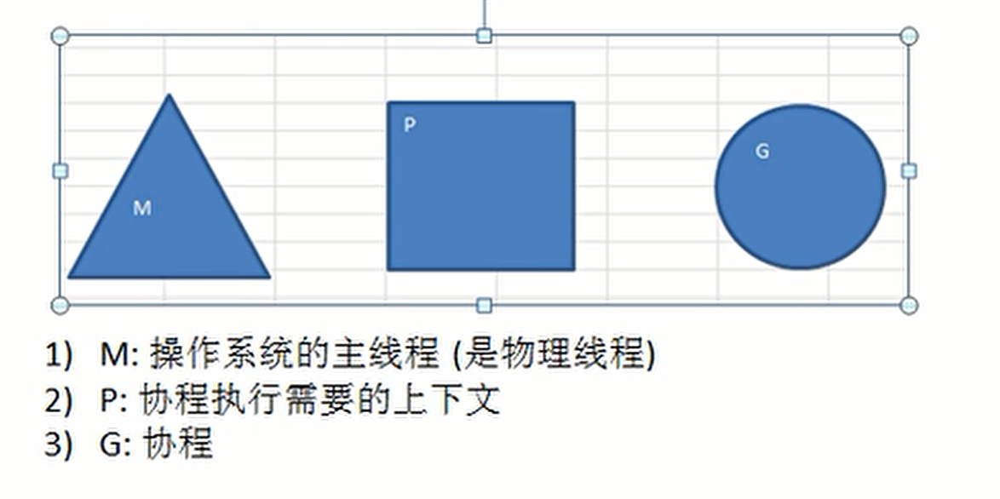

# goroutine(协程)以及一系列操作

[[toc]]

[toc]

😶‍🌫️go语言官方编程指南：[https://golang.org/#](https://golang.org/#)  

>   go语言的官方文档学习笔记很全，推荐去官网学习

😶‍🌫️我的学习笔记：github: [https://github.com/3293172751/golang-rearn](https://github.com/3293172751/golang-rearn)

---

**区块链技术（也称之为分布式账本技术）**，是一种互联网数据库技术，其特点是去中心化，公开透明，让每一个人均可参与的数据库记录

>   ❤️💕💕关于区块链技术，可以关注我，共同学习更多的区块链技术。博客[http://nsddd.top](http://nsddd.top)

## 协程和管道

> 先看一个需求,统计1~900000000000中有哪些素数

**传统方法：使用一个循环，判断哪些数是素数**

**使用并发或并行的方式，==将统计素数的任务分配个多个goroution完成==(速度最少提高四倍，分配给四个CPU)**


### 进程

> 在学习goroutine中我们需要熟悉下操作系统的进程

**1. 进程：进程就是程序在操作系统中的一次执行过程，是系统进行资源调度和分配的基本单位**

**2. 线程：线程是进程的一个执行实例，是程序执行的一个最小单位，它是比进程跟小能够独立完成的基本单位。**

> 比如打开网盘，此时打开网盘是一个进程，如果我们在网盘中下载多个视频，此时下载就叫做线程，线程吃的资源更小

**一个进程可以创建或者销毁多个线程，同一个进程中的多个线程可以==并发==进行**

**一个程序至少有一个进程，一个进程至少有一个线程**

🖱️[点击进入操作系统的并发学习](并发.md)

::: details Go语言协程和线程区别
协程的开销要远远比线程开销要小

Golang的多协程有点类似于其他语言多线程

协程挂载在主线程下面

**开启方式：**

```go
go 协程
```

:::


### Go语言协程和Go主线程

Go语言主线程（也称为线程，也可以理解为进程），一个Go语言线程上可以起多个协程，**协程是轻量级的线程**

> 编译器优化

**Go语言协程特点（重要）：**

+ 有独立的栈空间
+ 共享程序堆空间
+ 调度由用户控制
+ 协程是轻量级的线程


**案例**

```go
/*************************************************************************
    > File Name: goroutine.go
    > Author: smile
    > Mail: 3293172751nss@gmail.com 
    > Created Time: Sat 19 Mar 2022 02:09:15 PM CST
 ************************************************************************/

package main
import(
    "fmt"
    "strconv"
    "time"
)
//func
func test(){
    for i := 1;i<=10;i++{
        fmt.Println("test hello word"+strconv.Itoa(i))
        time.Sleep(time.Second)
    }
}
func main(){
    //每隔一秒输出一个hello word,输出十次，使用goroutine
    test()   //调用
    /*线程 Go
    go test()   //同时执行
    */
    fmt.Println(" ")
    for i := 1;i<=10;i++{
        fmt.Println("main hello word"+strconv.Itoa(i))
        time.Sleep(time.Second)
}
}
```

**编译**

```shell
[root@mail golang]# go run goroutine.go
test hello word1
test hello word2
test hello word3
test hello word4
test hello word5
test hello word6
test hello word7
test hello word8
test hello word9
test hello word10

main hello word1
main hello word2
main hello word3
main hello word4
main hello word5
main hello word6
main hello word7
main hello word8
main hello word9
main hello word10
```

**由此可见，必须要把test函数中打完后才进行下面的,那么此时我们如何开启一个线程**

```
go test() //开启一个线程
```

::: details 编译
🚀 编译结果如下：

```shell
[root@mail golang]# go run goroutine.go
main hello word1
test hello word1
test hello word2
main hello word2
main hello word3
test hello word3
test hello word4
main hello word4
main hello word5
test hello word5
test hello word6
main hello word6
main hello word7
test hello word7
test hello word8
main hello word8
main hello word9
test hello word9
test hello word10
main hello word10
```

:::


::: warning  **由此可见，线程为我们开启了一个新的分支**
我们引出协程概念

**1. 主线程是一个物理线程，是直接作用在cup上的，非常消耗cpu资源**

**2. 协程是从主线程开启的，是轻量级线程，是逻辑态，对资源的消耗比较少**

**3. Golang的协程机制特别重要，可以同时开启上万个协程**

:::


### sync.WaitGroup实现主线程等待协程执行完毕

::: tip sync.WaitGroup
可以监听协程何时执行完毕，执行完毕后通知主线程开始

> **以为我们的问题就是，主线程可能退出的很快，当协程没有退出的时候主线程退出了，然后就….所以我们需要用到这个**

```
import "strconv"

```

:::

::: details 案例演示 – 使用和不使用的区别：
没有用waitgroup💡简单的一个案例如下：

```go
/*
 * @Description:goruntine
 * @Author: xiongxinwei 3293172751nss@gmail.com
 * @Date: 2022-10-04 21:37:41
 * @LastEditTime: 2022-10-25 11:25:21
 * @FilePath: \code\go-super\33-main.go
 * @Github_Address: https://github.com/cubxxw/awesome-cs-cloudnative-blockchain
 * Copyright (c) 2022 by xiongxinwei 3293172751nss@gmail.com, All Rights Reserved. @blog: http://nsddd.top
 */
package main

import (
	"fmt"
	"time"
)

func main() {
	//交叉打印两个数组
	//1.定义两个数组
	var a = [5]int{1, 2, 3, 4, 5}
	var b = [5]int{6, 7, 8, 9, 10}

	//2.定义一个函数，实现两个数组的交叉打印
	go func() {
		for i := 0; i < len(a); i++ {
			fmt.Println("a=", a[i])
			time.Sleep(1 * time.Second)
		}
	}()
	go func() {
		for i := 0; i < len(b); i++ {
			fmt.Println("b=", b[i])
			time.Sleep(1 * time.Second)
		}
	}()
}

```

🚀 编译结果如下：


📜 对上面的解释：

> Go协程还没开始主线程就退出

使用💡简单的一个案例如下（交叉打印两个数组）：

```go
/*
 * @Description:goruntine
 * @Author: xiongxinwei 3293172751nss@gmail.com
 * @Date: 2022-10-04 21:37:41
 * @LastEditTime: 2022-10-25 12:04:16
 * @FilePath: \code\go-super\33-main.go
 * @Github_Address: https://github.com/cubxxw/awesome-cs-cloudnative-blockchain
 * Copyright (c) 2022 by xiongxinwei 3293172751nss@gmail.com, All Rights Reserved. @blog: http://nsddd.top
 */
package main

import (
	"fmt"
	"sync"
	"time"
)

var wg sync.WaitGroup

func main() {
	//交叉打印两个数组
	//1.定义两个数组
	var a = []int{1, 2, 3, 4, 5, 6, 7, 8, 9, 10, 11}
	var b = []int{6, 7, 8, 9, 10, 11, 12, 13, 14, 15, 16}

	var c = []interface{}{"a", "b", "c", 12, 32, "d", "e", "f", "g", "h", "i", "j", "k", "l", "m", "n", "o", "p", "q", "r", "s", "t", "u", "v", "w", "x", "y", "z"}
	//2.定义一个函数，实现两个数组的交叉打印
	wg.Add(1) //等待组计数器+1
	go func() {
		for i := 0; i < len(a); i++ {
			fmt.Println("a=", a[i])
			time.Sleep(1 * time.Second)
		}
		wg.Done() //等待组计数器-1
	}()

	wg.Add(1) //等待组计数器+1
	go func() {
		for i := 0; i < len(b); i++ {
			fmt.Println("b=", b[i])
			time.Sleep(1 * time.Second)
		}
		wg.Done() //等待组计数器-1
	}()

	wg.Add(1) //等待组计数器+1
	go func() {
		for i := 0; i < len(c); i++ {
			fmt.Println("c=", c[i])
			time.Sleep(1 * time.Second)
		}
		wg.Done() //等待组计数器-1
	}()

	wg.Wait()
	fmt.Println("主线程退出")
}

```

🚀 编译结果如下：

```bash
[Running] go run "d:\文档\最近的\awesome-golang\docs\code\go-super\33-main.go"
c= a
b= 6
a= 1
a= 2
b= 7
c= b
c= c
a= 3
b= 8
b= 9
c= 12
a= 4
c= 32
b= 10
a= 5
b= 11
c= d
a= 6
c= e
a= 7
b= 12
b= 13
a= 8
c= f
b= 14
c= g
a= 9
a= 10
b= 15
c= h
c= i
a= 11
b= 16
c= j
c= k
c= l
c= m
c= n
c= o
c= p
c= q
c= r
c= s
c= t
c= u
c= v
c= w
c= x
c= y
c= z
主线程退出
```

📜 对上面的解释：

**对于Go语言的协程来说，我们使用交叉打印，同样的还有使用`interface`接口类型**

:::


### goroutine的调度模型

**MPG模式基本介绍**



**M物理线程比较消耗资源，P上下文环境是指需要的资源和操作系统的状态**


### 设置CPU

::: tip
1.5版本后可以设置CPU个数

:::


>  那么在Golang中如何设置运行的CPU数目呢？

  **可以设置最大的CPU数目 **

```go
func GOMAXPROCS(n int)int
```


**获取cpu的数目**

```go
func NumCPU() int
```

💡简单的一个案例如下：

```go
  /************************************************************************
	 > File Name: cpu.go
     > Author: smile
     > Mail: 3293172751nss@gmail.com 
     > Created Time: Sat 19 Mar 2022 03:07:47 PM CST
  ************************************************************************/
 package main
 import(
     "fmt"
     "runtime"
 )
 func main(){
 
     cpuNum := runtime.NumCPU()
     num := runtime.NumCPU()                                                          
     fmt.Println("cpuNum = ",cpuNum)
 
     //设置
     runtime.GOMAXPROCS(num)
     fmt.Println("num = ",num)
 }
```


## channle(管道)

::: details 问题引出 — 为什么需要管道？
💡简单的一个案例如下：

```go
package main

import (
	"fmt"
	"sync"
	"time"
)

var wg sync.WaitGroup

func text(n int) {
	//统计素数
	for num := (n-1)*30000 + 1; num <= n*30000; num++ {
		flag := true
		for i := 2; i < num; i++ {
			if num%i == 0 {
				flag = false
				break
			}
		}
		if flag {
			fmt.Printf("%d是素数", num)
		}
	}
	wg.Done()
}

func main() {
	// 统计代码执行时间
	start := time.Now().Unix()
	for i := 1; i <= 4; i++ {
		wg.Add(1)
		go text(i)
	}
	wg.Wait()
	// 代码执行
	end := time.Now().Unix()
	fmt.Println("程序执行时间：", end-start) // 程序执行时间： 1.0000001s
}

```

🚀 编译结果如下：

```go
........
.......
119981是素数119983是素数119993是素数程序执行时间： 2

[Done] exited with code=0 in 3.067 seconds
```

📜 对上面的解释：

> **我们可以看出统计计算素数`30000×4 = 120000`个数，那么有个问题，如果个数不是这个的话就很麻烦，我们就能提出管道这个特殊的类型**

:::


> 计算1~200每一个数的阶乘，并放入到map中，map做一个全程的

```go
 package main
 import(
     "fmt"
 )
var (
    myMap = make(map[int]int,10)
)
//test函数就是计算n!
func test(n int){
    res := 1
    for i := 1;i<=n;i++{
        res = res * i
        //我们将res放入到myMap
        myMap[n] = res 
    }
}

func main(){
         for i := 1;i<=200;i++{
            go test(i)     //使用协程完成
        }
        //使用range输出
        for i,v := range myMap{
            fmt.Printf("map[%d]=%d\n",i,v)
        }
    }
 }
```

**此时编译出来没有结果，一个都没有，主线程还没有结束**

**注意：写入的时候不能并发，不能同时写入，而读取数据可以用并发**

> 在运行某一种程序的时候如何知道是否存在资源竞争的问题。方法很简单，在编译的时候加入一个参数 `-race`即可

```
go build -race test test.go
```


## END 链接

<ul><li><div><a href = '17.md' style='float:left'>⬆️上一节🔗</a><a href = '19.md' style='float: right'>⬇️下一节🔗</a></div></li></ul>

+ [Ⓜ️回到目录🏠](../README.md)

+ [**🫵参与贡献💞❤️‍🔥💖**](https://nsddd.top/archives/contributors))

+ ✴️版权声明 &copy; :本书所有内容遵循[CC-BY-SA 3.0协议（署名-相同方式共享）&copy;](http://zh.wikipedia.org/wiki/Wikipedia:CC-by-sa-3.0协议文本) 
