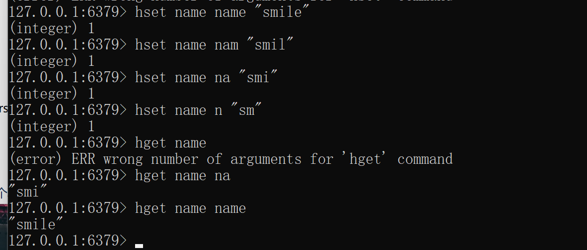
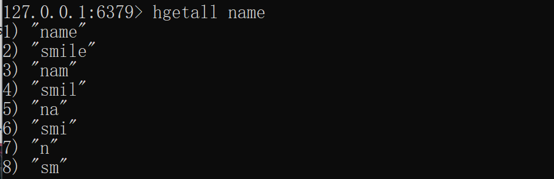

# Redis进阶

[[toc]]

[toc]

😶‍🌫️go语言官方编程指南：[https://golang.org/#](https://golang.org/#)  

>   go语言的官方文档学习笔记很全，推荐去官网学习

😶‍🌫️我的学习笔记：github: [https://github.com/3293172751/golang-rearn](https://github.com/3293172751/golang-rearn)

---

**区块链技术（也称之为分布式账本技术）**，是一种互联网数据库技术，其特点是去中心化，公开透明，让每一个人均可参与的数据库记录

>   ❤️💕💕关于区块链技术，可以关注我，共同学习更多的区块链技术。博客[http://cubxxw.com](http://cubxxw.com)

---

# Redis进阶

::: tip 官方地址
[指令：https://redisdoc.com](http://redisdoc.com)

[官网：https://redis.io](https://redis.io)和http://redis.cn
:::

## Redis 哈希(Hash)

**Redis hash 是一个 string 类型的 field（字段） 和 value（值） 的映射表，hash 特别适合用于存储对象。**

Redis 中每个 hash 可以存储 232 - 1 键值对（40多亿）。

### 实例

```
127.0.0.1:6379>  HMSET key_one name "redis tutorial" description "redis basic commands for caching" likes 20 visitors 23000
OK
127.0.0.1:6379>  HGETALL key_one
1) "name"
2) "redis tutorial"
3) "description"
4) "redis basic commands for caching"
5) "likes"
6) "20"
7) "visitors"
8) "23000"
```

在以上实例中，我们设置了 redis 的一些描述信息(name, description, likes, visitors) 到哈希表的 **key_one** 中。

------

## Redis hash 命令

下表列出了 redis hash 基本的相关命令：

| 序号 | 命令及描述                                                   |
| :--- | :----------------------------------------------------------- |
| 1    | [HDEL key field1 [field2\]](https://www.runoob.com/redis/hashes-hdel.html) 删除一个或多个哈希表字段 |
| 2    | [HEXISTS key field](https://www.runoob.com/redis/hashes-hexists.html) 查看哈希表 key 中，指定的字段是否存在。 |
| 3    | [HGET key field](https://www.runoob.com/redis/hashes-hget.html) 获取存储在哈希表中指定字段的值。 |
| 4    | [HGETALL key](https://www.runoob.com/redis/hashes-hgetall.html) 获取在哈希表中指定 key 的所有字段和值 |
| 5    | [HINCRBY key field increment](https://www.runoob.com/redis/hashes-hincrby.html) 为哈希表 key 中的指定字段的整数值加上增量 increment 。 |
| 6    | [HINCRBYFLOAT key field increment](https://www.runoob.com/redis/hashes-hincrbyfloat.html) 为哈希表 key 中的指定字段的浮点数值加上增量 increment 。 |
| 7    | [HKEYS key](https://www.runoob.com/redis/hashes-hkeys.html) 获取所有哈希表中的字段 |
| 8    | [HLEN key](https://www.runoob.com/redis/hashes-hlen.html) 获取哈希表中字段的数量 |
| 9    | [HMGET key field1 [field2\]](https://www.runoob.com/redis/hashes-hmget.html) 获取所有给定字段的值 |
| 10   | [HMSET key field1 value1 [field2 value2 \]](https://www.runoob.com/redis/hashes-hmset.html) 同时将多个 field-value (域-值)对设置到哈希表 key 中。 |
| 11   | [HSET key field value](https://www.runoob.com/redis/hashes-hset.html) 将哈希表 key 中的字段 field 的值设为 value 。 |
| 12   | [HSETNX key field value](https://www.runoob.com/redis/hashes-hsetnx.html) 只有在字段 field 不存在时，设置哈希表字段的值。 |
| 13   | [HVALS key](https://www.runoob.com/redis/hashes-hvals.html) 获取哈希表中所有值。 |
| 14   | [HSCAN key cursor [MATCH pattern\] [COUNT count]](https://www.runoob.com/redis/hashes-hscan.html) 迭代哈希表中的键值对。 |

[更多命令请参考：https://redis.io/commands](https://redis.io/commands)


----

## hash使用



```
基本操作：
hset/hget/hgetall/hdel
```

##### hgetall的使用



```
使用hmset和hmget一次性获取多个
hmset lisa age name add phon 
hmget lisa age name 
```


##### HLEN

**HLEN key**

返回哈希表 `key` 中域的数量。

- **时间复杂度：**

  O(1)

- **返回值：**

  哈希表中域的数量。当 `key` 不存在时，返回 `0` 。

```
redis> HSET db redis redis.com
(integer) 1

redis> HSET db mysql mysql.com
(integer) 1

redis> HLEN db
(integer) 2

redis> HSET db mongodb mongodb.org
(integer) 1

redis> HLEN db
(integer) 3
```


**HKEYS key**

返回哈希表 `key` 中的所有域。

- **可用版本：**

  >= 2.0.0

- **时间复杂度：**

  O(N)， `N` 为哈希表的大小。

- **返回值：**

  一个包含哈希表中所有域的表。当 `key` 不存在时，返回一个空表。

```go
# 哈希表非空

redis> HMSET website google www.google.com yahoo www.yahoo.com
OK

redis> HKEYS website
1) "google"
2) "yahoo"


# 空哈希表/key不存在

redis> EXISTS fake_key
(integer) 0

redis> HKEYS fake_key
(empty list or set)
```


**HVALS key**

返回哈希表 `key` 中所有域的值。

- **可用版本：**

  >= 2.0.0

- **时间复杂度：**

  O(N)， `N` 为哈希表的大小。

- **返回值：**

  一个包含哈希表中所有值的表。当 `key` 不存在时，返回一个空表。

```
# 非空哈希表

redis> HMSET website google www.google.com yahoo www.yahoo.com
OK

redis> HVALS website
1) "www.google.com"
2) "www.yahoo.com"


# 空哈希表/不存在的key

redis> EXISTS not_exists
(integer) 0

redis> HVALS not_exists
(empty list or set)
```


### 列表

**Redis列表是简单的字符串列表，按照插入顺序排序。你可以添加一个元素到列表的头部（左边）或者尾部（右边）**

一个列表最多可以包含 232 - 1 个元素 (4294967295, 每个列表超过40亿个元素)。

> lish 列表是简单的字符串列表，按照插入顺序排序，你可以添加一个元素到列表的头部或者尾部，可以重复，是有序的

```
127.0.0.1:6379> lpush city beijin shanghai tianjing wuhan
(integer) 4
127.0.0.1:6379> lrange city 0 -1
1) "wuhan"
2) "tianjing"
3) "shanghai"
4) "beijin"
127.0.0.1:6379> lrange city 0 0
1) "wuhan"
127.0.0.1:6379> lrange city 0 5
1) "wuhan"
2) "tianjing"
3) "shanghai"
4) "beijin"
```


**从左边开始取出，和顺序相反，相当于链表**

```
lpush/rpush/lrange/lpop/rpop/del
lpush:右边插入
rpush:左边插入
lrange:截取范围（使用正数或者是负数下标，-1表示倒数第一个）
lpop：从链表左边弹出数据，踢掉
rpop：从链表右边弹出数据，踢掉
```


**lish长度**

```
127.0.0.1:6379> llen city
(integer) 4
```

> 如果不存在，则key被解释为一个空列表，返回0


### set（集合）

**set是string类型的==无序集合==。底层是hash table数据结构，set也是存放很多字符串元素，字符串元素是无序的，而且==元素的值不能重复==。**

```sql
127.0.0.1:6379> llen city
(integer) 4
127.0.0.1:6379> sadd emile xiongxinwei@cubxxw.com 3293172751nss@gmail.com xiongxinwei@mail.com
(integer) 3
127.0.0.1:6379> SMEMBERS emile
1) "3293172751nss@gmail.com"
2) "xiongxinwei@cubxxw.com"
3) "xiongxinwei@mail.com"
```

```
sisemmber :判断值是否是成员
srem :删除指定值
```

