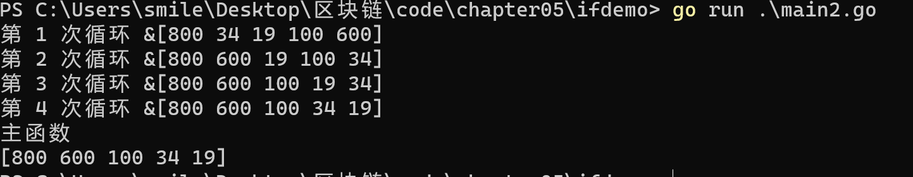
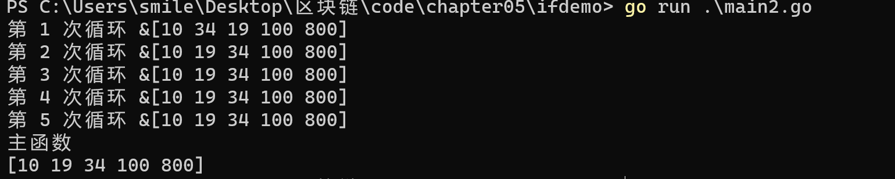
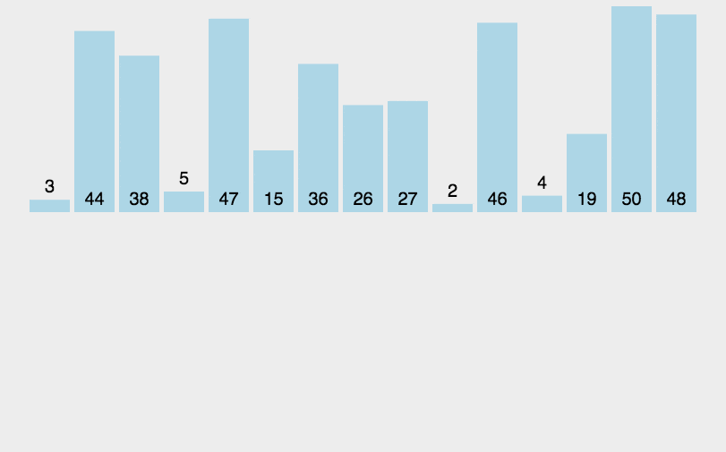
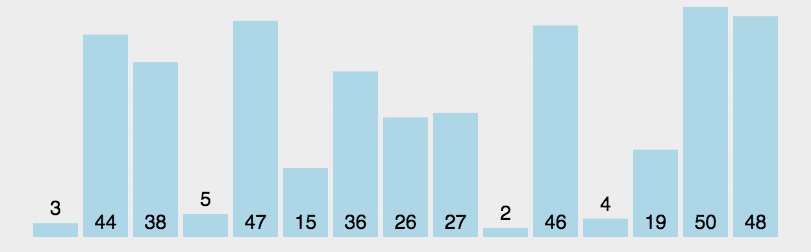

# 排序算法

[[otc]]

[TOC]

😶‍🌫️go语言官方编程指南：[https://golang.org/#](https://golang.org/#)  

> go语言的官方文档学习笔记很全，推荐去官网学习

😶‍🌫️我的学习笔记：github: [https://github.com/3293172751/golang-rearn](https://github.com/3293172751/golang-rearn)

------

**区块链技术（也称之为分布式账本技术）**，是一种互联网数据库技术，其特点是去中心化，公开透明，让每一个人均可参与的数据库记录

> ❤️💕💕关于区块链技术，可以关注我，共同学习更多的区块链技术。博客[http://cubxxw.com](http://cubxxw.com)

 ::: tip 前往冒泡排序学习
**[冒泡排序是最基础的排序，也是时间复杂度最高的排序方法](go语言的的排序和查找.md)**


## 选择排序

**从小到大，层层解析排序**

```go
package main

import (
	"fmt"
)

//排序算法  -- 选择排序
func SelectSort(arr *[5]int) {
	//数组默认是值传递，要想改变数组的值，就必须要指针引用传递
	arr[0] = 600 //Go语言底层优化
	//此时进行下面的排序 -- 先完成找到最小的值和arr[0]交换
	var min int
	/*第一次排序如下：
	min = arr[0]
	minIndx := 0 //存放最小值的下标
	for i, v := range arr {
		if min > v {
			//假设最大值交换
			min = v //找到最小值
			minIndx = i
		}
	}

	//交换
	if minIndx != 0 {
		arr[0], arr[minIndx] = arr[minIndx], arr[0]
		//相当于交换，Go语言底层使用了中间变量进行处理
	}
	//第二次
		min = arr[1]
	minIndx := 1 //存放最小值的下标
	for i, v := range arr {
		if min > v {
			//假设最大值交换
			min = v //找到最小值
			minIndx = i
		}
	}

	//交换
	if minIndx != 1 {
		arr[1], arr[minIndx] = arr[minIndx], arr[1]
		//相当于交换，Go语言底层使用了中间变量进行处理
	}
	*/
	//对上面代码进行循环处理
	for j := 0; j < len(arr)-1; j++ {
		min = arr[j]
		minIndx := j //存放最小值的下标
		for i := j + 1; i < len(arr); i++ {
			if min > arr[i] {
				//假设最大值交换
				min = arr[i] //找到最小值
				minIndx = i
			}
		}

		//交换
		if minIndx != j {
			arr[j], arr[minIndx] = arr[minIndx], arr[j]
			//相当于交换，Go语言底层使用了中间变量进行处理
		}
		fmt.Println("第", j+1, "次循环", arr)
	}

}


func main() {
	//定义一个数组  -- 从小到大排序
	arr := [5]int{10, 34, 19, 100, 800}
	SelectSort(&arr)

	fmt.Println("主函数")
	fmt.Println(arr)
}

```

🚀 编译结果如下：



**从大到小，使用Go - range 和sort包排序**

```go
package main

import (
	"fmt"
)

//排序算法  -- 选择排序
func SelectSort(arr *[5]int) {
	var max int
	for j, _ := range arr {
		max = arr[j]
		minIndx := j //存放最小值的下标
		for i := j + 1; i < len(arr); i++ {
			if max > arr[i] {
				//假设最大值交换
				max = arr[i] //找到最小值
				minIndx = i
			}
		}

		//交换
		if minIndx != j {
			arr[j], arr[minIndx] = arr[minIndx], arr[j]
			//相当于交换，Go语言底层使用了中间变量进行处理
		}
		fmt.Println("第", j+1, "次循环", arr)
	}
}

func main() {
	//定义一个数组  -- 从小到大排序
	arr := [5]int{10, 34, 19, 100, 800}
	SelectSort(&arr)

	fmt.Println("主函数")
	fmt.Println(arr)
}


```



**使用sort包**

```go
package main

import (
	"fmt"
	"sort"
)

func main() {
	// Sorting a slice of Strings
	strs := []string{"quick", "brown", "fox", "jumps"}
	sort.Strings(strs)
	fmt.Println("Sors strings: ", strs)

	// Sorting a slice of Integers
	ints := []int{56, 19, 78, 67, 14, 25}
	ints2 := ints[:]
	sort.Ints(ints)
	fmt.Println("ints = : ", ints)
	fmt.Printf("数据类型为%T", ints)

	//反转打印方法
	sort.Sort(sort.Reverse(sort.IntSlice(ints2)))
	fmt.Println("反转打印:", ints2)
	fmt.Printf("数据类型为%T", ints2)

	// Sorting a slice of Floats
	floats := []float64{176.8, 19.5, 20.8, 57.4}
	sort.Float64s(floats)
	fmt.Println("Sorted floats: ", floats)
	fmt.Printf("数据类型为%T", floats)
}
```

**编译：**

```
PS C:\Users\smile\Desktop\区块链\code\chapter05\ifdemo> go run .\main2.go
Sors strings:  [brown fox jumps quick]
ints = :  [14 19 25 56 67 78]
数据类型为[]int
反转打印: [78 67 56 25 19 14]
数据类型为[]int
Sorted floats:  [19.5 20.8 57.4 176.8]
数据类型为[]float64
PS C:\Users\smile\Desk
```


## 插入排序

插入排序的代码实现虽然没有冒泡排序和选择排序那么简单粗暴，但它的原理应该是最容易理解的了，因为只要打过扑克牌的人都应该能够秒懂。插入排序是一种最简单直观的排序算法，它的工作原理是通过构建有序序列，对于未排序数据，在已排序序列中从后向前扫描，找到相应位置并插入。

插入排序和冒泡排序一样，也有一种优化算法，叫做拆半插入。

### 1. 算法步骤

将第一待排序序列第一个元素看做一个有序序列，把第二个元素到最后一个元素当成是未排序序列。

从头到尾依次扫描未排序序列，将扫描到的每个元素插入有序序列的适当位置。（如果待插入的元素与有序序列中的某个元素相等，则将待插入元素插入到相等元素的后面。）

### 2. 动图演示



**代码实现**

```go
package main

import (
	"fmt"
)

func swich(arr []int) {

	/*
		//完成第一次，给第二个元素进行插入
		insertVal := arr[1]  //存放第二个元素的值
		insertIndex := 1 - 1 //下标

		for insertIndex >= 0 && arr[insertIndex] < insertVal {
			//如果插入的大，不断地后移
			arr[insertIndex+1] = arr[insertIndex] //数据后移
			insertIndex--
		}
		//插入
		if insertIndex+1 != 1 {
			arr[insertIndex+1] = insertVal
		}
	*/
	//第n次
	for i := 1; i < len(arr); i++ {
		insertVal := arr[i]  //存放第二个元素的值
		insertIndex := i - 1 //下标

		for insertIndex >= 0 && arr[insertIndex] < insertVal {
			//如果插入的大，不断地后移
			arr[insertIndex+1] = arr[insertIndex] //数据后移
			insertIndex--
		}
		//插入
		if insertIndex+1 != i {
			arr[insertIndex+1] = insertVal
		}
		fmt.Println("第", i, "次插入后的数组为：", arr)
	}
	fmt.Println("arr = ", arr)
}
func main() {
	arr := [...]int{23, 34, 23, 12, 2, 3, 45, 6, 576}
	arr1 := arr[:]
	fmt.Println("arr1的值为：", arr1)
	swich(arr1)
	fmt.Println("arr 中main的值为：", arr1)
}

```

🚀 编译结果如下：

```
[Running] go run "c:\Users\smile\Desktop\区块链\code\chapter04\demo03\main.go"
arr1的值为： [23 34 23 12 2 3 45 6 576]
第 1 次插入后的数组为： [34 23 23 12 2 3 45 6 576]
第 2 次插入后的数组为： [34 23 23 12 2 3 45 6 576]
第 3 次插入后的数组为： [34 23 23 12 2 3 45 6 576]
第 4 次插入后的数组为： [34 23 23 12 2 3 45 6 576]
第 5 次插入后的数组为： [34 23 23 12 3 2 45 6 576]
第 6 次插入后的数组为： [45 34 23 23 12 3 2 6 576]
第 7 次插入后的数组为： [45 34 23 23 12 6 3 2 576]
第 8 次插入后的数组为： [576 45 34 23 23 12 6 3 2]
arr =  [576 45 34 23 23 12 6 3 2]
arr 中main的值为： [576 45 34 23 23 12 6 3 2]
```


## 快速排序

快速排序使用分治法（Divide and conquer）策略来把一个序列（list）分为较小和较大的2个子序列，然后递归地排序两个子序列。

步骤为：

- 挑选基准值：从数列中挑出一个元素，称为"基准"（pivot）;
- 分割：重新排序数列，所有比基准值小的元素摆放在基准前面，所有比基准值大的元素摆在基准后面（与基准值相等的数可以到任何一边）。在这个分割结束之后，对基准值的排序就已经完成;
- 递归排序子序列：递归地将小于基准值元素的子序列和大于基准值元素的子序列排序。

递归到最底部的判断条件是数列的大小是零或一，此时该数列显然已经有序。

选取基准值有数种具体方法，此选取方法对排序的时间性能有决定性影响。




**代码实现**

```go
package main
import "fmt"
// 快速排序入口函数
func quickSort(nums []int, p int, r int) {
    // 递归终止条件
    if p >= r {
        return
    }
    // 获取分区位置
    q := partition(nums, p, r)
    // 递归分区（排序是在定位 pivot 的过程中实现的）
    quickSort(nums, p, q - 1)
    quickSort(nums, q + 1, r)
}
// 定位 pivot
func partition(nums []int, p int, r int) int {
    // 以当前数据序列最后一个元素作为初始 pivot
    pivot := nums[r]
    // 初始化 i、j 下标
    i := p
    // 后移 j 下标的遍历过程
    for j := p; j < r; j++ {
        // 将比 pivot 小的数丢到 [p...i-1] 中，剩下的 [i...j] 区间都是比 pivot 大的
        if nums[j] < pivot {
            // 互换 i、j 下标对应数据
            nums[i], nums[j] = nums[j], nums[i]
            // 将 i 下标后移一位
            i++
        }
    }
    // 最后将 pivot 与 i 下标对应数据值互换
    // 这样一来，pivot 就位于当前数据序列中间，i 也就是 pivot 值对应的下标
    nums[i], nums[r] = pivot, nums[i]
    // 返回 i 作为 pivot 分区位置
    return i
}
func main() {
    nums := []int{4, 5, 6, 7, 8, 3, 2, 1}
    quickSort(nums, 0, len(nums) - 1)
    fmt.Println(nums)
}
```


## END 链接

<ul><li><div><a href = '29.md' style='float:left'>⬆️上一节🔗</a><a href = '并发.md' style='float: right'>⬇️下一节🔗</a></div></li></ul>

+ [Ⓜ️回到目录🏠](../README.md)

+ [**🫵参与贡献💞❤️‍🔥💖**](https://cubxxw.com/archives/contributors))

+ ✴️版权声明 &copy; :本书所有内容遵循[CC-BY-SA 3.0协议（署名-相同方式共享）&copy;](http://zh.wikipedia.org/wiki/Wikipedia:CC-by-sa-3.0协议文本) 

