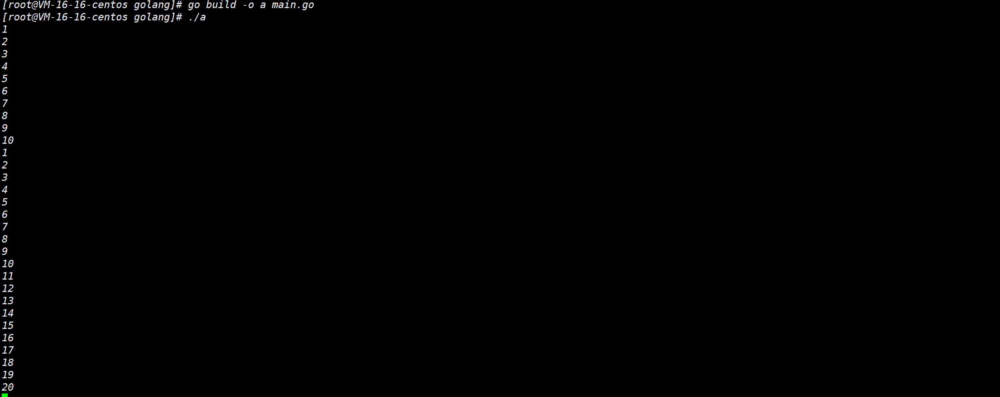

# 函数、闭包，错误处理

[[toc]]

[toc]

😶‍🌫️go语言官方编程指南：[https://pkg.go.dev/std](https://pkg.go.dev/std)

>   go语言的官方文档学习笔记很全，推荐去官网学习

😶‍🌫️我的学习笔记：github: [https://github.com/3293172751/golang-rearn](https://github.com/3293172751/golang-rearn)

---

**区块链技术（也称之为分布式账本技术）**，是一种互联网数据库技术，其特点是去中心化，公开透明，让每一个人均可参与的数据库记录

>   ❤️💕💕关于区块链技术，可以关注我，共同学习更多的区块链技术。博客[http://nsddd.top](http://nsddd.top)

## 匿名函数

::: details 快速上手：匿名函数
**Go 语言支持匿名函数，可作为闭包。匿名函数是一个"内联"语句或表达式。匿名函数的优越性在于可以直接使用函数内的变量，不必申明。**

以下实例中，我们创建了函数 `getSequence()` ，返回另外一个函数。该函数的目的是在闭包中递增 `i` 变量，代码如下：

💡简单的一个案例如下：

```go
package main

import "fmt"

func getSequence() func() int {
  //定义匿名函数 getSequence() 返回类型int
  i:=0
  return func() int {
  i+=1
  return i 
  }
}

func main(){
  /* nextNumber 为一个函数，函数 i 为 0 */
  nextNumber := getSequence() 

  /* 调用 nextNumber 函数，i 变量自增 1 并返回 */
  fmt.Println(nextNumber())
  fmt.Println(nextNumber())
  fmt.Println(nextNumber())

  /* 创建新的函数 nextNumber1，并查看结果 */
  nextNumber1 := getSequence() 
  fmt.Println(nextNumber1())
  fmt.Println(nextNumber1())
}


```

以上代码执行结果为：

```
1
2
3
1
2
```

:::


::: tip 什么是匿名函数

**匿名函数望文生意，就是没有名字的函数，如果我们希望某个函数只使用一次，那么可以使用匿名函数，但也可以多次使用**

:::


### 一次性匿名函数

**在定义匿名函数的时候就调用，此时匿名函数就只能使用一次**

```go
fun main(){
	//定义即调用
    func(n1 int,n2 int)int{
        return n1 + n2
    }(10,20)
	//此时在定义的时候同时调用
}
```

🚀 编译结果如下：

```
30
```


### 给变量调用

**这种方式的匿名函数可以多次调用，之前我们说过函数也是一种数据类型，那么将这个函数直接定义一个变量然后赋值**

```go
fun main(){
	//定义即调用
    a := func(n1 int,n2 int)int{
        return n1 - n2
    }
	//此时在定义的时候同时调用
    res := a(30,20)
    fmt.Println("res="res)
    res2 := a(30,40)
    fmt.Println("res3=",res3)
}
```

```
res= 10
res3= -10
```


### 全局匿名函数

```go
var(
	Fun1 = func(n1 int,n2 int)int{
		return n1 * n2
		}
	)          //定义全局匿名函数'F'要大写

//调用
func main(){
    a := Fun1(10,100)
    fmt.Println("a=",a)
}
```

🚀 编译结果如下：

```
a=1000
```


### 匿名总结实战

```go
package main

import (
	"fmt"
)
//全局匿名函数
var(
  t = func(a int, b int) int {
    return a + b 
  }
)
var t3 = func(a int, b int) int {
    return a * b 
  }(123,123)

func main() {
  fmt.Println("Hello, World!")
  a := 1
  b := (^a+1)  //取反
  fmt.Println(b)
  fmt.Println("*t = ",t) //这个地方是它的地址
  fmt.Println("func t = ",t(10,26))
  fmt.Println("func t3= ",t3)
  
  //一次性匿名
  t2 := func(a int, b int) int {
    return a + b 
  }(12,312)
  fmt.Println("func t2 = ",t2)

  func(a int, b int) int {
    return a * b 
  }(12,312)
  
  //多次使用的匿名
  t5:= func(a int, b int) int {
  return a + b 
  }
  fmt.Println("func t5 = ",t5(234,123421))
}

```


## 闭包

::: tip 闭包的理解：

**闭包就是一个函数与相关的引用环境组成的一个整体（实体）**

Go 语言支持匿名函数，可作为闭包。匿名函数是一个"内联"语句或表达式。匿名函数的优越性在于可以直接使用函数内的变量，不必申明。

> 在本质上，闭包是函数内部和函数外部连接起来的桥梁，或者说是函数和其引用环境的组合体

**我们针对全局变量和局部变量的特点：**

> 我们开始在想：有些时候不排除某些变量什么时候会使用，我们或许会使用全局变量（因为它即使没有赋值也不会报错）

💡 **全局变量**：

+ 常驻内存
+ 污染全局

💡 **局部变量**：

+ 不常驻内存
+ 不污染全局


🔥 闭包的解决：

+ 可以让一个变量常驻内存
+ 可以让一个变量不污染全局

:::


### 定义一个闭包理解

**写法：函数里面嵌套一个函数，最后返回里面的函数。**

::: warning 我们需要返回一个方法
**定义一个方法`addr()`，我们返回一个方法（不接受参数）**

💡简单的一个案例如下：

```go
/*
 * @Description:闭包的解决方法
 * @Author: xiongxinwei 3293172751nss@gmail.com
 * @Date: 2022-10-04 21:37:41
 * @LastEditTime: 2022-10-24 12:15:22
 * @FilePath: \code\go-super\8-main.go
 * @Github_Address: https://github.com/3293172751/cs-awesome-Block_Chain
 * Copyright (c) 2022 by xiongxinwei 3293172751nss@gmail.com, All Rights Reserved. @blog: http://nsddd.top
 */
package main

import "fmt"

func adder() func(int) int {
	//func(int) int 代表这个函数接收一个int类型的参数，返回一个int类型的值
	var x int = 10
	return func(y int) int {
		x += y
		return x
	}
}

func adder2() func() int {
	var x int = 10
	return func() int {
		return x
	}
}

func main() {
	//定义一个闭包，作用是返回一个函数，这个函数可以累加，每次累加的值是上次累加的值加上本次传入的值

	var add = func(x, y int) int {
		return x + y
	}
	//调用闭包
	var result = add(1, 2)
	println(result)

	//调用adder函数，返回一个闭包
	fmt.Println("调用adder函数，返回一个闭包")
	var f = adder()   //注意这里表示执行方法~
    fmt.Println(f(1)) //10 + 1 = 11
	fmt.Println(f(2)) //11 + 2 = 13
	fmt.Println(f(3)) //13 + 3 = 16

	//调用adder2函数，返回一个闭包
	fmt.Println("调用adder2函数，返回一个闭包")
	var f2 = adder2()
	fmt.Println(f2()) //10
	fmt.Println(f2()) //10
	fmt.Println(f2()) //10
}
```

**🚀 编译结果如下：**

```bash
3
调用adder函数，返回一个闭包
11
13
16
调用adder2函数，返回一个闭包
10
10
10
```

**📜 对上面的解释：**

> **`var x int = 10`可以常驻内存而且不会污染全局。**

:::

>   以下实例中，我们创建了函数 `getSequence()` ，返回另外一个函数。该函数的目的是在闭包中递增 i 变量。

💡简单的一个案例如下：

```go
package main

import "fmt"

func getSequence() func() int {
    i:=0               //func()是一个匿名函数
    //getSequence()是一个函数，返回的数据类型是func()int
   return func() int {
     i+=1 
     return i 
   }
}

func main(){
   /* nextNumber 为一个函数，函数 i 为 0 */
   nextNumber := getSequence()  //将函数给变量Nex,相当于匿名函数

   /* 调用 nextNumber 函数，i 变量自增 1 并返回 */
   fmt.Println(nextNumber())
   fmt.Println(nextNumber())
   fmt.Println(nextNumber())

   /* 创建新的函数 nextNumber1，并查看结果 */
   nextNumber1 := getSequence()  
   fmt.Println(nextNumber1())
   fmt.Println(nextNumber1())
}
```

**以上代码执行结果为：**

```
1
2
3
1
2
```

### 闭包的说明

```go
func getSequence() func() int {   //getSequence()是一个函数，返回的数据类型是func()int
	i:=0               //func()是一个匿名函数
	 
    return func() int {
     i+=1 
     return i  
 }
```

**返回的是一个匿名函数，同时这个匿名函数引用到函数外的i，因此这个匿名函数和i形成一个整体，构成 闭包**

>   可以这样理解：闭包是一个类class，而i是字段，函数是一个操作，而函数和这个i构成闭包

**当我们反复的调用f函数，因为i只是初始化一次，因此每调用此一次就累加一次**

**关键：就是返回的函数引用到哪些变量，函数与哪些变量构成闭包**

💡简单的一个案例如下：


::: danger 注意参数的规范性：
我们为了规范性，建议不使用参数的定义

`func(y int) int` ➡️  `func(int)`

```go
func adder() func(int) int {
	//func(int) int 代表这个函数接收一个int类型的参数，返回一个int类型的值
	var x int = 10
	return func(y int) int {
		x += y
		return x
	}
}
```

:::


## 闭包的花样玩法

+ [参考一篇写的非常棒的文章](https://zhuanlan.zhihu.com/p/92634505)

::: tip 
a **closure** is a record storing **a function** together with **an environment**.
**闭包**是由**函数**和与其相关的引用**环境**组合而成的实体 。
:::


定义`foo1()`到`foo7()`一共7个函数，看看有何不同~

**case 1：**

```go
package main

import "fmt"

func main() {
	val := 3 // val is a local variable
	for i := 0; i < 3; i++ {
		foo1(&val)()
	}
	foo1(&val) // 注意这里没有括号
}

func foo1(x *int) func() {
	return func() {
		*x = *x + 1
		fmt.Printf("foo1 val = %d\n", *x)
	}
}
```

🚀 编译结果如下：

```
foo1 val = 4
foo1 val = 5
foo1 val = 6
```


**case 2：**

```go
func main() {
    val := 3
	for i := 0; i < 3; i++ {
		foo2(val)()
	}
	foo2(val) // 注意这里没有括号
}

func foo2(x int) func() {
  return func() {
    x = x + 1
    fmt.Printf("foo2 val = %d\n", x)
  }
}
```

🚀 编译结果如下：

```
foo2 val = 4
foo2 val = 4
foo2 val = 4
```


**case 3：**

```go
package main

import "fmt"

func main() {
	foo3()
	foo3()()
}

func foo3() func() {
	values := []int{1, 2, 3}
	for _, val := range values {
		fmt.Printf("foo3 val = %d\n", val)
	}
	return func() {
		fmt.Println("return func() foo3")
	}
}
```

🚀 编译结果如下：

```bash
foo3 val = 1
foo3 val = 2
foo3 val = 3
foo3 val = 1
foo3 val = 2
foo3 val = 3
return func() foo3
```


**case 4：**

```go
func main() {
	foo4()

}

func show(v interface{}) {
	fmt.Printf("foo4 val = %v\n", v)
}

func foo4() {
	values := []int{1, 2, 3, 5}
	for _, val := range values {
		go show(val)
	}
	for {
	}
}
```

🚀 编译结果如下：

```
foo4 val = 2
foo4 val = 1
foo4 val = 3
foo4 val = 5
```


**case 5：**

```go
func foo5() {
  values := []int{1, 2, 3, 5}
  for _, val := range values {
    go func() {
      fmt.Printf("foo5 val = %v\n", val)
    }()
  }
}

//🚀 编译结果为 `空的~`
```


**case 6：**

```go
var foo6Chan = make(chan int, 10)
func foo6() {
  for val := range foo6Chan {
    go func() {
      fmt.Printf("foo6 val = %d\n", val)
    }()
  }
}
//err
```


**case 7：**

```go
package main

import (
	"fmt"
)

func main() {
	fmt.Println(foo7(12))
	fmt.Println(foo7(13))
	// 遍历
	for i := 0; i < 3; i++ {
		foo7(12)[i]()
	}
}

func foo7(x int) (fs []func()) {
	values := []int{1, 2, 3}

	for _, val := range values {
		fs = append(fs, func() { //添加一个匿名函数到fs中
			fmt.Printf("foo7 val = %d\n", x+val)
		})
	}

	return
}

```

🚀 编译结果如下：

```
[0x45ff60 0x45ff60 0x45ff60]
[0x45ff60 0x45ff60 0x45ff60]
foo7 val = 15
foo7 val = 15
foo7 val = 15
```

::: warning 📜 对上面的解释（**闭包延迟绑定**）
what？

为什么打印的都是一样的~ what，what

不是说**闭包**是一段**函数**和**相关的引用环境**的实体。case7的问题中，函数是打印变量`val`的值，引用环境是变量`val`。仅仅是这样的话，遍历到val=1的时候，记录的不应该是val=1的环境吗？

上文在闭包解释最后，还有一句话：闭包保存/记录了它**产生**时的外部函数的所有环境。如同普通变量/函数的**定义**和实际**赋值/调用或者说执行**，是两个阶段。闭包也是一样，for-loop内部仅仅是声明了一个闭包，`foo7()`返回的也仅仅是一段闭包的函数定义，只有在外部执行了`f7()`时才真正执行了闭包，此时才闭包内部的变量才会进行赋值的操作。哎，如果这么说的话，岂不是应该抛出异常吗？因为`val`是一个比`foo7()`生命周期更短的变量啊？

这就是闭包的神奇之处，它会保存相关引用的环境，也就是说，`val`这个变量在闭包内的生命周期得到了保证。因此在执行这个闭包的时候，会去外部环境寻找最新的数值！你是不是不相信？来来来，我们马上写个临时的case执行下分分钟就明白了：

```go
package main

import (
	"fmt"
)

func main() {
	foo0()()
	foo0()()
}

func foo0() func() {
	x := 1
	f := func() {
		fmt.Printf("foo0 val = %d\n", x)
	}
	x = 11
	return f
}

```

🚀 编译结果如下：

```
foo0 val = 11
foo0 val = 11
```

:::


::: tip 
究竟是如何取出最近的值的：

```go
package main

import (
	"fmt"
)

func main() {
	// Q1第一组实验
	x := 133
	f1 := foo1(&x)
	f2 := foo2(x)
	f1()
	f2()
	f1()
	f2()
	fmt.Println("--------------------------------")
	// Q1第二组
	x = 233
	f1()
	f2()
	f1()
	f2()
	fmt.Println("--------------------------------")
	// Q1第三组
	foo1(&x)()
	foo2(x)()
	foo1(&x)()
	foo2(x)()
	foo2(x)()

	fmt.Println("--------------------------------")
	foo2(x)()
	foo3(x)()
	foo1(&x)()
	foo3(x)()

}

func foo1(x *int) func() {
	return func() {
		*x = *x + 1
		fmt.Printf("foo1 val = %d\n", *x)
	}
}
func foo2(x int) func() {
	return func() {
		x = x + 1
		fmt.Printf("foo1 val = %d\n", x)
	}
}

func foo3(x int) func() {
	return func() {
		x = x + 1
		fmt.Printf("foo2 val = %d\n", x)
	}
}

```

:::


## for & 匿名函数（闭包？）

如果我将 匿名函数 放在 `for range` 中，我很好奇会发生什么样的事情？

```go
func foo5() {
    values := []int{1, 2, 3, 5}
    for _, val := range values {
        go func() {
            fmt.Printf("foo5 val = %v\n", val)
        }()
    }
}
​
foo5()
//foo3 val = 5
//foo3 val = 5
//foo3 val = 5
//foo3 val = 5
```

可以看到最终打印的都是 5 ，这样就很奇怪了，1，2，3，4 去哪里了？？？？

**Go Routine的延迟绑定**：

其实这个问题的本质同**闭包的延迟绑定**，或者说，这段匿名函数的对象就是**闭包**。在我们调用`go func() { xxx }()`的时候，只要没有真正开始执行这段代码，那它还只是一段函数声明。而在这段匿名函数被执行的时候，才是内部变量寻找真正赋值的时候。

在**case5**中，for-loop的遍历几乎是“瞬时”完成的，4个Go Routine真正被执行在其后。**矛盾是不是产生了？**这个时候for-loop结束了呀，`val`生命周期早已结束了，程序应该报错才对呀？

回忆上一章，是不是一个相同的情境？是的，这个匿名函数可不就是一个闭包吗？一切就解释通了：**闭包**真正被执行的时候，for-loop结束了，但是`val`的生命周期在闭包内部被延长了且被赋值到最新的数值5。


**如果将匿名函数换成函数调用，这样就很不一样了：**

```go
func show(v interface{}) {
    fmt.Printf("foo4 val = %v\n", v)
}
func foo4() {
    values := []int{1, 2, 3, 5}
    for _, val := range values {
        go show(val)
    }
}
​
foo4()
//foo3 val = 2
//foo3 val = 3
//foo3 val = 1
//foo3 val = 5
```


::: warning 所以说
**Go Routine的匿名函数的延迟绑定本质就是闭包，实际生成中注意下这种写法~**

> 最后，闭包是个常见的玩意儿，但是实际代码中不太建议使用，一不小心写了个内存泄漏查都查不到。特别是不要为了炫技故意写个闭包，实在没有必要。

:::


## 函数defer

**在函数中，通常选用创建资源（比如：数据库连接，文件等），为了在函数执行完毕后，即使的释放资源，Go提供了defer（延时机制）** —>  `栈`

```go
package main
import "fmt"

func sum(n1 int, n2 int) int{
	defer fmt.Println("ok1 n1=",n1)		//1
	defer fmt.Println("ok1 n2=",n2)		//2
	res := n1 + n2 
	fmt.Println("ok1 res=",res)			//3
	return res
}

func main(){
	res := sum(10,20)
	fmt.Println("res=",res)				//4
}
```

🚀 编译结果如下：


::: details 扩展程序

```go
/*
 * @Description:defer
 * @Author: xiongxinwei 3293172751nss@gmail.com
 * @Date: 2022-10-04 21:37:41
 * @LastEditTime: 2022-10-24 16:13:14
 * @FilePath: \code\go-super\11-main.go
 * @Github_Address: https://github.com/3293172751/cs-awesome-Block_Chain
 * Copyright (c) 2022 by xiongxinwei 3293172751nss@gmail.com, All Rights Reserved. @blog: http://nsddd.top
 */
package main

import "fmt"

func f1() int {
	defer func() {
		fmt.Println("f1 defer")
	}()

	fmt.Println("f1")
	return 1
}

func f2() (r int) {
	t := 5
	defer func() {
		t = t + 5
	}()
	return t
}

func f3() (r int) {
	defer func(r int) {
		r = r + 5
	}(r)
	return 1
}

func f4() (r int) {
	t := 5
	defer func() {
		t = t + 5
	}()
	return t
}

func main() {
	fmt.Println("Hello World!")	 
	fmt.Println(f1()) //f1 f1 defer 1
	fmt.Println(f2()) //5
	fmt.Println(f3()) //1
	fmt.Println(f4()) //5
	fmt.Println("main end") //main end

}

```

🚀 编译结果如下：

```go
[Running] go run "d:\文档\最近的\awesome-golang\docs\code\go-super\11-main.go"
Hello World!
f1
f1 defer
1
5
1
5
main end
```

:::


::: danger ⚠️ 注意：
**提醒你：**

1.   当执行到`defer`时候，系统会将`defer`语句压入到一个独立的栈中（`defer`栈），暂时不执行
2.   当函数执行完毕后再从`defer`中按照**先入后出**的方式出栈，然后执行
3.   函数中的`res` 最先执行，输出`30`
4.   最后执行`main`中的语句
5.   在`defer`语句入栈的时候，也会将相关的值同时放入到栈

>   我大概认为就跟C++中的构造函数 和析构函数`~`类似

**即defer作用是在函数执行完毕后，可以及时的释放函数创建的资源**

```go
//文件操作
defer file Close()

//数据库操作
defer connect.close()       //connect是数据库的游标
```

:::


## 字符串常用的系统函数

```go
package utils
import (
	"fmt"
	"strconv"
	"strings"
)

var str string = "学golang使我快乐！"

// 关于string的常用函数

// 1. len(str) 内建函数，返回字符串长度，按字节，1个汉字3字节，1字母1字节
//这个函数是内建函数（和printf一样）  //只需要`fmt`包
func F1(){
    fmt.Println(len(str))
}

// 2. range []rune(str)  字符串遍历，处理中文问题 转成rune切片
func F2() {
	for _,value := range []rune(str) {
		fmt.Printf("%c \n",value)
	}
}

// 3. string转整数 strconv.Atoi(str) 这个函数是 strconv.ParseInt(s string, base int, bitSize int) (i int64 err error)的简化版
func F3() {
	num, _ := strconv.Atoi("666")
	fmt.Printf("num type is %T,value is %v", num, num) 
    // num type is int,value is 666

}

// 4. 整数转string strconv.Itoa(666) 是strconv.FormatInt(i int64, base int) string的简化版

// 5. string to []byte  b := []byte(str)
func F5(){
	 b := []byte(str)
	 fmt.Printf("%T %v\n", b, b) // type of b is []uint8
}

// 6. []byte to string   s := string([]byte{77,88,99})
func F6(){
	 s := string([]byte{77,88,99})
	 fmt.Printf("%T %v\n", s, s) // string MXc
}

// 7. 十进制数转2 8 16进制字符串  strconv.FormatInt(i int64, base int) string  base->2,8,16

// 8. 判断字符串s是否包含子串substr strings.Contains(s, substr string) bool

// 9. 统计子串出现次数 strings.Count(s, sep string) int
func F9() {
	s := "A man who helps you when you are in trouble and who leaves you when you are successful is a real friend."

	fmt.Println(strings.Count(s,"you")) // 4

	s = "lv"
	fmt.Println(strings.Count(s,"")) // 3

}

// 10. 判断连个字符串是否相等 str1 == str2 区分大小写， 不区分大小写方式strings.EqualFold(s, t string) bool

// 11. 子串sep在字符串s中第一次/最后一次出现的位置，不存在则返回-1  Index(s, sep string) int/LastIndex(s, sep string) int

// 12. 将n个old子串替换为new字符串，n<0会替换所有old子串 strings.Replace(s, old, new string, n int) string

// 13. 大小写转换 strings.ToUpper  /ToLower

// 14. 按sep拆分字符串，返回一个slice  strings.Split(s, sep string) []string

// 15. 将字符串slice以sep为分隔符组合成一个字符串 strings.Join(a []string, sep string) string

// 16. Trim系列 Trim(s string, cutset string) string 去除左右两边指定字符串  TrimRight/TrimLeft
// 	TrimSpace(s string) string 去除左右两边空白
//  TrimPrefix(s, prefix string) string /TrimSuffix(s, suffix string) string 去除前/后缀

// 17. 判断s是否有前缀/后缀字符串prefix   HasPrefix(s, prefix string) bool  / HasSuffix
func main(){
    
}
```


## 日期和时间相关函数

1.   时间和日期相关的函数需要导入time包[https://pkg.go.dev/time@go1.17.6](https://pkg.go.dev/time@go1.17.6)

2.   time.Time 类型，用于表示时间

     ```go
     package main
     import(
     	"fmt"
     	"time"
     )
     func main(){
         now := time.Time()
         fmt.Printf("now=%v now type=%T",now,now)
     
         fmt.Println(now.Year())      //获取到年
         fmt.Println(int(now.Month()))      //获取到月
         fmt.Println(now.Day())      //获取到日
         fmt.Println(now.Hour())      //获取到时
         fmt.Println(now.Minute())      //获取到分
         fmt.Println(now.Second())      //获取到秒
     }
     ```

     🚀 编译结果如下：
     
     


### 时间常量

**常量就是在程序中可用于获取指定时间单位的时间**

```go
const (
	Nanosecond  Duration = 1
	Microsecond          = 1000 * Nanosecond
	Millisecond          = 1000 * Microsecond
	Second               = 1000 * Millisecond
	Minute               = 60 * Second
	Hour                 = 60 * Minute
)
```

>   比如想拿到100毫秒

```
100 * time.Millisecond
```

**如果我们想要休眠一段时间，必须要使用到时间常量**


### 结合sleep来使用时间常量

>   需求：每隔一秒钟打印一个数字，打印到10时就退出
>
>   每隔0.1秒打印一个数字，打印5秒退出**（不可以使用`time.Second * 0.1`,编译不能通过，只能用`millisecond(毫秒) * 100`)**

```go
package main
import (
    "fmt"
    "time"
)

func main(){
i := 0
j := 0
 for{
     i++
     fmt.Println(i)  //打印
     time.Sleep(time.Second)   //休眠，每秒钟执行一次
     if i == 10{
         break
     }
 }
    for{
        j++
        fmt.Println(j)
        time.Sleep(time.Millisecond * 100)
        if i == 20{
            break
        }
    }
}
```




### unix时间戳和unixnano时间戳

**作用是：获取随机数字**

>   **unix :获取秒数随机**
>
>   **unixnano:获取纳秒随即数**

```
now = time.Now()
fmt.Printf("unix时间戳为=%v \n unixnano时间搓=%v",now.unix(),now.unixnano())
```


⚠️ func (Time) Unix

```
func (t Time) Unix() int64
```

Unix returns t as a Unix time, the number of seconds elapsed since January 1, 1970 UTC. The result does not depend on the location associated with t. Unix-like operating systems often record time as a 32-bit count of seconds, but since the method here returns a 64-bit value it is valid for billions of years into the past or future.

```go
package main

import (
	"fmt"
	"time"
)

func main() {
	// 1 billion seconds of Unix, three ways.
	fmt.Println(time.Unix(1e9, 0).UTC())     // 1e9 seconds
	fmt.Println(time.Unix(0, 1e18).UTC())    // 1e18 nanoseconds
	fmt.Println(time.Unix(2e9, -1e18).UTC()) // 2e9 seconds - 1e18 nanoseconds

    t := time.Date(2001, time.September, 9, 1, 46, 40, 0, time.UTC)
    fmt.Println(t.Unix())     // seconds since 1970
    fmt.Println(t.UnixNano()) // nanoseconds since 1970
}
```


### 用法

⚠️func (Time) UnixMicro added in go1.17

```
func (t Time) UnixMicro() int64
```

UnixMicro returns t as a Unix time, the number of microseconds elapsed since January 1, 1970 UTC. The result is undefined if the Unix time in microseconds cannot be represented by an int64 (a date before year -290307 or after year 294246). The result does not depend on the location associated with t.

⚠️func (Time) UnixMilli added in go1.17

```
func (t Time) UnixMilli() int64
```

UnixMilli returns t as a Unix time, the number of milliseconds elapsed since January 1, 1970 UTC. The result is undefined if the Unix time in milliseconds cannot be represented by an int64 (a date more than 292 million years before or after 1970). The result does not depend on the location associated with t.

⚠️func (Time) UnixNano 

```
func (t Time) UnixNano() int64
```

UnixNano returns t as a Unix time, the number of nanoseconds elapsed since January 1, 1970 UTC. The result is undefined if the Unix time in nanoseconds cannot be represented by an int64 (a date before the year 1678 or after 2262). Note that this means the result of calling UnixNano on the zero Time is undefined. The result does not depend on the location associated with t.


### 统计代码执行时间

>   编写一个代码来统计函数`test`执行的时间

```go
package main

import (
	"fmt"
	"time"
    "strconv"         //用来转换
)
func test(){
    str := ""
    for i :=0;i < 1000; i++{
        str += "hello" + strconv.Itoa(i)
        fmt.Println(str)
    }
}
func main() {
    start := time.Now().Unix()
    test()
    end := time.Now().Unix()
    fmt.Println("执行test消耗的时间为(s)：",end - start)
}    
```

🚀 编译结果如下：


## Golang内置函数

Golang地址：https://pkg.go.dev/builtin@go1.17.6

⚠️ func new 

```
func new(Type) *Type
```

The new built-in function allocates memory. The first argument is a type, not a value, and the value returned is a pointer to a newly allocated zero value of that type.

>   **`new` 主要用来分配内存，主要是用来分配值类型,本身是一个地址，默认是存放`0`这个数据空间的地址,地址是由系统分配的**

```go
package main
import "fmt"
func main(){
	num1 := 100
	fmt.Printf("num1的类型为:%T,\n num1的值为:%v,\n num1的地址为:%v\n",num1,num1,&num1)
    
    var num2 *int		//注意：使用new分配值类型需要是指针类型
    num2 = new(int)
    fmt.Printf("num2的类型为:%T,\n num2的值为:%v,\n num2的地址为:%v\n",num2,num2,&num2)  	
    /*int类型值为指向空间的地址 本省的地址为指针的地址 */
}
```

🚀 编译结果如下：

```bash
[root@VM-4-6-centos c]# go run b.go 
 num1的类型为:int,
 num1的值为:100,
 num1的地址为:0xc0000a6000
 num2的类型为:*int,
 num2的值为:0xc0000a6008,
 num2的地址为:0xc0000a0020

```


**怎么将num2的值取出？ -- `*`取地址的值**

```go
fmt.Printf("num2的值为:%v",*num2)    
//num2的值为：0   

//修改
*num2 = 100
```

📜 对上面的解释：

> **Go语言的mark和new区别：**
>
> 在go语言中，`make`和`new`都是内存的分配（堆上），但是`make`只用于`slice`、`map`以及`channel`的初始化（非零值）；而`new`用于类型的内存分配，并且内存置为零。`make`返回的是引用类型本身；而new返回的是指向类型的指针。


## Golang错误处理机制

**处理方式：`defer`，`panic`，`recover`**   ，**让程序更加健壮**

**Go中可以抛出一个`panic`的异常，然后在`defer`中通过`recover`捕获这个异常，然后正常处理**

使用`defer`和`recover`来处理异常。

 ⚠️func panic 

**`panic`内置函数接受一个`interface{}`类型的值作为参数,可以接收`error`类型变量，输出错误信息，并退出程序**

```go
func panic(v interface{})
```

::: details  💡简单的一个案例如下：
**程序遇到`panic`函数就会终止执行而且抛出异常**

```go
/*
 * @Description:异常处理
 * @Author: xiongxinwei 3293172751nss@gmail.com
 * @Date: 2022-10-04 21:37:41
 * @LastEditTime: 2022-10-24 16:24:23
 * @FilePath: \code\go-super\12-main.go
 * @Github_Address: https://github.com/3293172751/cs-awesome-Block_Chain
 * Copyright (c) 2022 by xiongxinwei 3293172751nss@gmail.com, All Rights Reserved. @blog: http://nsddd.top
 */
package main

import "fmt"

func fn1() {
	fmt.Println("fn1")
}

func fn2() {
	panic("fn2")
}

func main() {
	fn1()
	fn2()
	fmt.Println("end	main")
}
```

🚀 编译结果如下：

```
[Running] go run "d:\文档\最近的\awesome-golang\docs\code\go-super\12-main.go"
fn1
panic: fn2

goroutine 1 [running]:
main.fn2(...)
	d:/文档/最近的/awesome-golang/docs/code/go-super/12-main.go:19
main.main()
	d:/文档/最近的/awesome-golang/docs/code/go-super/12-main.go:24 +0x66
exit status 2
```

:::


::: details 让程序继续执行使用recover
**注意：`recover`**只有在`defer`调用的函数中有效

```go
/*
 * @Description:异常处理
 * @Author: xiongxinwei 3293172751nss@gmail.com
 * @Date: 2022-10-04 21:37:41
 * @LastEditTime: 2022-10-24 16:29:01
 * @FilePath: \code\go-super\12-main.go
 * @Github_Address: https://github.com/3293172751/cs-awesome-Block_Chain
 * Copyright (c) 2022 by xiongxinwei 3293172751nss@gmail.com, All Rights Reserved. @blog: http://nsddd.top
 */
package main

import "fmt"

func fn1() {
	fmt.Println("fn1")
}

func fn2() {
	defer func() {
		if err := recover(); err != nil {
			fmt.Println("有错误 err", err)
		}
	}()
	panic("fn2")
}

func main() {
	fn1()
	fn2()
	fmt.Println("end	main")
}
```

🚀 编译结果如下：

```bash
[Running] go run "d:\文档\最近的\awesome-golang\docs\code\go-super\12-main.go"
fn1
有错误 err fn2
end	main
```

:::


::: tip 异常有什么用？
比如一个很明显的：编译型语言的错误（解释型语言可能允许）  10/0

💡简单的一个 **报错** 案例如下：

```go
package main

import "fmt"

func fn1(a int, b int) int {
	return a / b
}

func main() {
	fmt.Println(fn1(10, 0))
}

```


💡简单的一个的使用异常处理案例如下：

```go
package main

import "fmt"

func fn1(a int, b int) int {
	defer func() {
		if err := recover(); err != nil {
			fmt.Println("有错误 err", err)
		}
	}()
	return a / b
}

func main() {
	fmt.Println(fn1(10, 0))
	fmt.Println("end	main")
}
```

🚀 编译结果如下：

```bash
[Running] go run "d:\文档\最近的\awesome-golang\docs\code\go-super\13-main.go"
有错误 err runtime error: integer divide by zero
0
end	main
```

:::


> **The panic built-in function stops normal execution of the current goroutine.** When a function F calls panic, normal execution of F stops immediately. Any functions whose execution was deferred by F are run in the usual way, and then F returns to its caller. To the caller G, the invocation of F then behaves like a call to panic, terminating G's execution and running any deferred functions. This continues until all functions in the executing goroutine have stopped, in reverse order. At that point, the program is terminated with a non-zero exit code. This termination sequence is called panicking and can be controlled by the built-in function recover.

```go
defer func(){
	/*匿名函数*/ 
	err := recover()   //内置函数，可以捕获到异常
    if err != ni{//说明捕获到异常
        fmt.Println("err=",err) 
        fmt.Println("发送邮件给3293172751@qq,com")
    }         		//这里可以将错误发送给管理员
}()     	  		//匿名函数的调用
num := 10/0         //错误代码
```


### 自定义错误

```
errors.New("错误类型")    //返回一个error类型的值，表示一个错误
```

>   函数读取`init.config`信息，如果文件名传入不正确，返回一个自定义错误

```go
/*
 * @Description: 自定义错误
 * @Author: xiongxinwei 3293172751nss@gmail.com
 * @Date: 2022-10-04 21:37:41
 * @LastEditTime: 2022-10-24 16:45:55
 * @FilePath: \code\go-super\14-main.go
 * @Github_Address: https://github.com/3293172751/cs-awesome-Block_Chain
 * Copyright (c) 2022 by xiongxinwei 3293172751nss@gmail.com, All Rights Reserved. @blog: http://nsddd.top
 */
package main

import (
	"errors"
	"fmt"
)

func readConf(name string) (err error) {
	if name == "config.ini" {
		//"读取"
		return nil
	} else {
		//返回一个自定义错误
		return errors.New("读取文件错误")
	}
	fmt.Println(name)
	return
}

func test02() {
	err := readConf("config.ini")
	if err != nil {
		//如果发生错误，就输出错误并且终止程序，此时使用panic
		panic(err)
	}
	//不发生错误
	fmt.Println("test02()继续执行...")
}
func mian() {
	//测试
	test02()
}
```


## END 链接

<ul><li><div><a href = '5.md' style='float:left'>⬆️上一节🔗</a><a href = '7.md' style='float: right'>⬇️下一节🔗</a></div></li></ul>

+ [Ⓜ️回到目录🏠](../README.md)

+ [**🫵参与贡献💞❤️‍🔥💖**](https://nsddd.top/archives/contributors))

+ ✴️版权声明 &copy; :本书所有内容遵循[CC-BY-SA 3.0协议（署名-相同方式共享）&copy;](http://zh.wikipedia.org/wiki/Wikipedia:CC-by-sa-3.0协议文本) 

