# Golang的多维数组和map集合

[[toc]]

[toc]

😶‍🌫️go语言官方编程指南：[https://pkg.go.dev/std](https://pkg.go.dev/std)

>   go语言的官方文档学习笔记很全，推荐去官网学习

😶‍🌫️我的学习笔记：github: [https://github.com/3293172751/golang-rearn](https://github.com/3293172751/golang-rearn)

---

**区块链技术（也称之为分布式账本技术）**，是一种互联网数据库技术，其特点是去中心化，公开透明，让每一个人均可参与的数据库记录

>   ❤️💕💕关于区块链技术，可以关注我，共同学习更多的区块链技术。博客[http://cubxxw.com](http://cubxxw.com)

---

**Go 语言支持多维数组，以下为常用的多维数组声明方式：**

```go
var variable_name [SIZE1][SIZE2]...[SIZEN] variable_type
```

+   variable_type : 数据类型

**以下实例声明了三维的整型数组：**

```go
var threedim [5][10][4]int
```


## 二维数组

二维数组是最简单的多维数组，**二维数组本质上是由一维数组组成的**。二维数组定义方式如下：

```go
var arrayName [ x ][ y ] variable_type
```

variable_type 为 Go 语言的数据类型，arrayName 为数组名，二维数组可认为是一个表格，x 为行，y 为列，下图演示了一个二维数组 a 为三行四列：

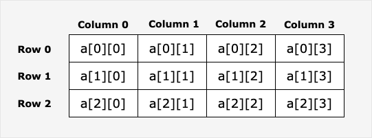

二维数组中的元素可通过 **a[ i ][ j ]** 来访问。


### 二维数组在内存中的布局

```go
var arr [2][3]int
```

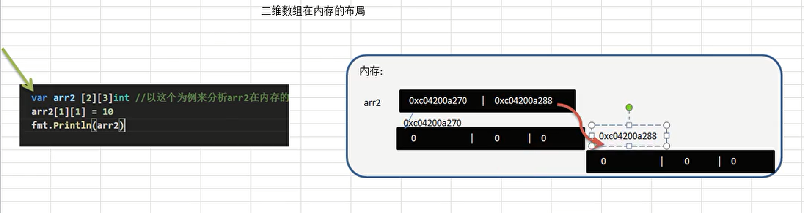

>   由此可见，这个二维数组是占两个空间，中间隔24个字节，这是因为int占8个字节，然而占三个数据，所以是`3*8`个字节


#### 实例

```go
实例
package main

import "fmt"

func main() {
    // Step 1: 创建数组
    values := [][]int{}

    // Step 2: 使用 appped() 函数向空的二维数组添加两行一维数组
    row1 := []int{1, 2, 3}
    row2 := []int{4, 5, 6}
    values = append(values, row1)
    values = append(values, row2)

    // Step 3: 显示两行数据
    fmt.Println("Row 1")
    fmt.Println(values[0])
    fmt.Println("Row 2")
    fmt.Println(values[1])

    // Step 4: 访问第一个元素
    fmt.Println("第一个元素为：")
    fmt.Println(values[0][0])
}
```

以上实例运行输出结果为：

```
Row 1
[1 2 3]
Row 2
[4 5 6]
第一个元素为：
1
```


### 初始化二维数组

多维数组可通过大括号来初始值。以下实例为一个 3 行 4 列的二维数组：

```go
a := [3][4]int{  
 {0, 1, 2, 3} ,    /*  第一行索引为 0 */
 {4, 5, 6, 7} ,    /*  第二行索引为 1 */
 {8, 9, 10, 11},   /* 第三行索引为 2 */
}
```

**注意：** 以上代码中倒数第二行的 `}` 必须要有逗号，因为最后一行的 `}` 不能单独一行，也可以写成这样：

```go
a := [3][4]int{  
 {0, 1, 2, 3} ,   /*  第一行索引为 0 */
 {4, 5, 6, 7} ,   /*  第二行索引为 1 */
 {8, 9, 10, 11}}   /* 第三行索引为 2 */
```

以下实例初始化一个 2 行 2 列 的二维数组：

```go
package main

import "fmt"

func main() {
    // 创建二维数组
    sites := [2][2]string{}

    // 向二维数组添加元素
    sites[0][0] = "Google"
    sites[0][1] = "Runoob"
    sites[1][0] = "Taobao"
    sites[1][1] = "Weibo"

    // 显示结果
    fmt.Println(sites)
}
```

以上实例运行输出结果为：

```
[[Google Runoob] [Taobao Weibo]]
```


------

### 遍历二维数组

二维数组通过指定坐标来访问。如数组中的行索引与列索引，例如：

```go
val := a[2][3]
或
var value int = a[2][3]
```

以上实例访问了二维数组 val 第三行的第四个元素。

二维数组可以使用循环嵌套来输出元素：

**注意统计二维数组的个数的时候，`j<len(a[i])`统计的是一维数组每一次循环有多少个，如下：**

```go
package main

import "fmt"

func main() {
   /* 数组 - 5 行 2 列*/
   a := [5][]int{ {0,0}, {1,2}, {2,4,3,4}, {3,6},{4,8}}
   fmt.Println("i=",len(a))          //5
   fmt.Println()
   for i:=0;i<len(a);i++{
   		fmt.Println("j=",len(a[i]))
   }
 }                                                      
```

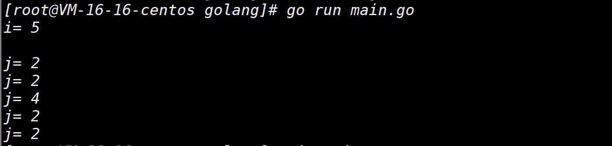

```go
package main

import "fmt"

func main() {
   /* 数组 - 5 行 2 列*/
   var a = [5][2]int{ {0,0}, {1,2}, {2,4}, {3,6},{4,8}}
   var i, j int

   /* 输出数组元素 */
    for  i = 0; i < 5; i++ {     //i<len(a)
        for j = 0; j < 2; j++ {  //j<len(a[i])
         fmt.Printf("a[%d][%d] = %d\n", i,j, a[i][j] )
      }
   }
    
    /*for -range遍历 */
    for  i,v := range arr3 {     //i<len(a)
        for j,v2 := range v { 	 //j<len(a[i])
         fmt.Printf("arr3[%v][%v] = %v \t", i,j, v2 )
      }
        fmt.Println()
   }   
```

以上实例运行输出结果为：

```go
a[0][0] = 0
a[0][1] = 0
a[1][0] = 1
a[1][1] = 2
a[2][0] = 2
a[2][1] = 4
a[3][0] = 3
a[3][1] = 6
a[4][0] = 4
a[4][1] = 8
```


### 创建各个维度元素数量不一致的多维数组

```go
package main

import "fmt"

func main() {
    // 创建空的二维数组
    animals := [][]string{}

    // 创建三一维数组，各数组长度不同
    row1 := []string{"fish", "shark", "eel"}
    row2 := []string{"bird"}
    row3 := []string{"lizard", "salamander"}

    // 使用 append() 函数将一维数组添加到二维数组中
    animals = append(animals, row1)
    animals = append(animals, row2)
    animals = append(animals, row3)

    // 循环输出
    for i := range animals {
        fmt.Printf("Row: %v\n", i)
        fmt.Println(animals[i])
    }
}
```

以上实例运行输出结果为：

```go
Row: 0
[fish shark eel]
Row: 1
[bird]
Row: 2
[lizard salamander]
```

---


## Go语言map（集合）

::: danger Go语言map介绍
Map⚡

Map 是一种无**序的键值对的集合**。Map 最重要的一点是通过 key 来快速检索数据，key 类似于索引，指向数据的值。**类似于python中的字典 -- key - value数据结构**

Map 是一种集合，所以我们可以像迭代数组和切片那样迭代它。不过，**Map 是无序的，我们无法决定它的返回顺序，这是因为 Map 是使用 hash 表来实现的。**

**通常来说，key数据类型为==int、string==**,但也支持其他的数据类型，**注意的是：slice，map和function不可以做key，没法用==判断**

:::


### 定义 Map

可以使用内建函数 make 也可以使用 map 关键字来定义 Map:

```go
/* 声明变量，默认 map 是 nil */
var map_variable map[key_data_type]value_data_type

/* 使用 make 函数 */
map_variable := make(map[key_data_type]value_data_type)
```


**注意(四点）：**

**1. 如果不初始化 map，那么就会创建一个 nil map。nil map 不能用来存放键值对**

**2. map声明是不会分配内存的，初始化需要make,分配内存后才可以赋值与使用**

```go
package main
import "fmt"
func main() {
    var a map[string]string    //key为string，值为string
    //fmt.Println(a)  -- 错误，刚声明没有空间，不能使用 ，需要空间
    a = make(map[string]string,10)     //分配10空间
    a["no1"]="宋江"    //ok
    fmt.Println(a)
} 
```

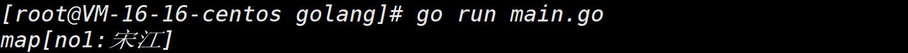

**3. key是不可以冲突重复的，但是value是可以重复的**

**4. key输出的是无序的，如果需要有序，需要进行排序**

+   ✍️✍️✍️==但是现在的版本和python一样，新的版本key输出都是有序的了==

```go
 package main                                                            
 import "fmt"
 func main() {
     var a map[string]string    //类型为string，值为string
     //fmt.Println(a)  -- 错误，刚声明没有空间，不能使用 ，需要空间
     a = make(map[string]string,10)     //分配10空间
     a["no1"]="宋江"    //ok
     a["no0"]="hello"
 
     a["no4"]="hello4"
     a["no3"]="hello3"
     a["no5"]="hello5"
     a["no2"]="hello2"
     fmt.Println(a)
 }
```

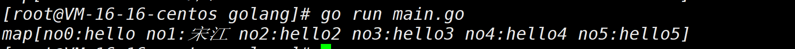


💡简单的一个案例如下：

```go
package main

import "fmt"

func main() {
    var countryCapitalMap map[string]string /*创建集合 */
    countryCapitalMap = make(map[string]string)  //可省略空间
    /*或countryCapitalMap := make(map[string]string) */
//声明且定义一个集合
    /* map插入key - value对,各个国家对应的首都 */
    countryCapitalMap [ "France" ] = "巴黎"
    countryCapitalMap [ "Italy" ] = "罗马"
    countryCapitalMap [ "Japan" ] = "东京"
    countryCapitalMap [ "India " ] = "新德里"

/*还有一种方式在声明的同时赋值，方便简洁*/
    countryCapitalMap2 := map[string]string{
        "France"  : "巴黎",
        "Italy"  : "罗马",
        "Japan"  : "东京",
        "India " : "新德里"
 }
    fmt.Println("countryCapitalMap2=",countryCapitalMap2)
    /*使用键输出地图值 */
    for country := range countryCapitalMap {
        fmt.Println(country, "首都是", countryCapitalMap [country])
    }

    /*查看元素在集合中是否存在 */
    capital, ok := countryCapitalMap [ "American" ] /*如果确定是真实的,则存在,否则不存在 */
    /*fmt.Println(capital) */
    /*fmt.Println(ok) */
    if (ok) {
        fmt.Println("American 的首都是", capital)
    } else {
        fmt.Println("American 的首都不存在")
    }
}
```

**以上实例运行结果为：**

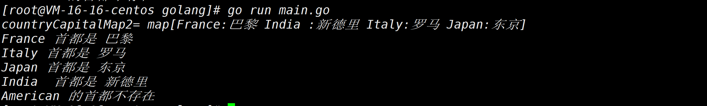

**由此可见，使用map直接赋值是最简洁的，使用make定义是最常见的**

```go
countryCapitalMap := make(map[string]string)
countryCapitalMap [ "France" ] = "巴黎"
countryCapitalMap [ "Italy" ] = "罗马"
countryCapitalMap [ "Japan" ] = "东京"
countryCapitalMap [ "India " ] = "新德里"
```

```go
countryCapitalMap2 := map[string]string{
        "France"  : "巴黎",
        "Italy"  : "罗马",
        "Japan"  : "东京",
        "India " : "新德里"
 }
```

🤖 第二种注意中间是用`:`,每句话结尾都需要用`,`分隔。


### map的增删改查操作

#### 修改方法

**✍️ 因为key是唯一的，所以 可以直接修改和增加**

```go
key_1["a"] = "北京"  //增加
key_1["a"] = "上海"  //修改
```


#### 删除使用delete函数

```go
delete(key_1,"a")     //删除
```

✍️ **要注意的是当key不存在的时候，不会操作，也不会报错**


#### map删除方法

1.   遍历，逐个删除
2.   make一个新的map，让之前的map回收

```go
key_1 := map[string]string{
	"a" : "32",
}
key_1 = make(map[string]string)
//注意 不是：= ,不能使用不同类型
```


#### map查找方法（如上）

```go
val,ok := key_1["a"]
if ok{
	fmt.Printf("有a的值为%v\n",val)
}else{
    fmt,Printf("没有a这个数")
}
```


### map遍历

 ✍️**map遍历一般使用for-range遍历，因为map一般是字符串**

```go
package main
import "fmt"

func main(){
    countryCapitalMap := make(map[string]string)
    countryCapitalMap [ "France" ] = "巴黎"
    countryCapitalMap [ "Italy" ] = "罗马"
    countryCapitalMap [ "Japan" ] = "东京"
    countryCapitalMap [ "India " ] = "新德里"
for k,v := range countryCapitalMap{
	fmt.Printf("k=%v,v=%v\n",k,v)
	} 
}                          
```

编译如下：

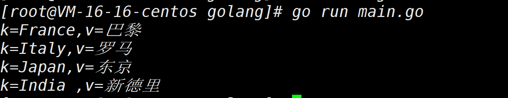

**由此可见不可以使用for循环，for循环下标都是由数字开始，而key不一定**


#### 双重遍历

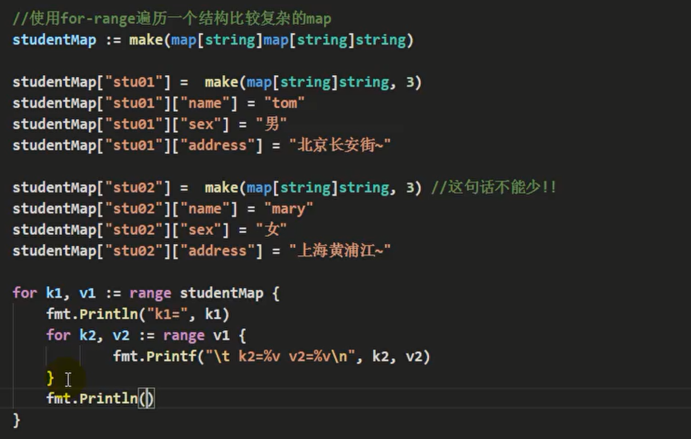

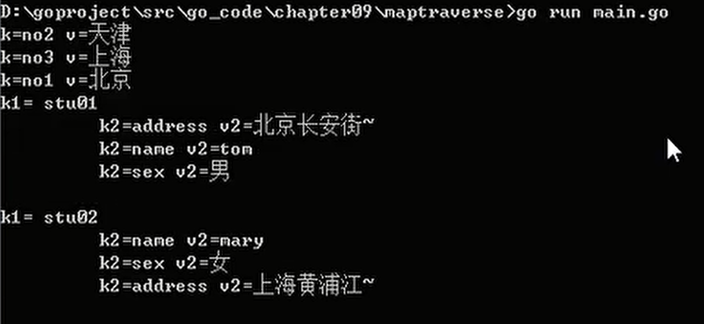

**由此可见使用了双层`for-range`**


### map长度

**✍️我们在统计数组长度的时候，使用了LEN，同样的可以使用在map上，统计有多少对key-value**

```go
len(countryCapitalMap)
```


::: details 💡简单的一个案例如下：

```go
/*
 * @Description: map数组
 * @Author: xiongxinwei 3293172751nss@gmail.com
 * @Date: 2022-10-04 21:37:41
 * @LastEditTime: 2022-10-24 16:55:17
 * @FilePath: \code\go-super\15-main.go
 * @Github_Address: https://github.com/cubxxw/awesome-cs-cloudnative-blockchain
 * Copyright (c) 2022 by xiongxinwei 3293172751nss@gmail.com, All Rights Reserved. @blog: http://cubxxw.com
 */
package main

import "fmt"

func main() {
	//元素为map类型切片
	var userinfo = make([]map[string]string, 3, 10)
	fmt.Println("userinfo=", userinfo)
	fmt.Println("userinfo[0]=", userinfo[0])
	//长度
	fmt.Println("len(userinfo)=", len(userinfo))
	//容量
	fmt.Println("cap(userinfo)=", cap(userinfo))
}

```

🚀 编译结果如下：

```
[Running] go run "d:\文档\最近的\awesome-golang\docs\code\go-super\15-main.go"
userinfo= [map[] map[] map[]]
userinfo[0]= map[]
len(userinfo)= 3
cap(userinfo)= 10
```

:::


::: details 💡map+数组 的 简单的一个案例如下：

```go
/*
 * @Description: map数组
 * @Author: xiongxinwei 3293172751nss@gmail.com
 * @Date: 2022-10-04 21:37:41
 * @LastEditTime: 2022-10-24 17:26:08
 * @FilePath: \code\go-super\15-main.go
 * @Github_Address: https://github.com/cubxxw/awesome-cs-cloudnative-blockchain
 * Copyright (c) 2022 by xiongxinwei 3293172751nss@gmail.com, All Rights Reserved. @blog: http://cubxxw.com
 */
package main

import "fmt"

func main() {
	//元素为map类型切片
	var userinfo = make([]map[string]string, 3, 10)
	fmt.Println("userinfo=", userinfo)
	fmt.Println("userinfo[0]=", userinfo[0])
	//长度
	fmt.Println("len(userinfo)=", len(userinfo))
	//容量
	fmt.Println("cap(userinfo)=", cap(userinfo))

	//赋值
	if userinfo[0] == nil { //判断是否为nil
		userinfo[0] = make(map[string]string, 10)
		userinfo[0]["username"] = "admin"
		userinfo[0]["password"] = "123456"
	}
	fmt.Println("userinfo[0]=", userinfo[0])
	fmt.Println("userinfo=", userinfo)

	if userinfo[1] == nil { //判断是否为nil
		userinfo[1] = make(map[string]string, 10)
		userinfo[1]["username"] = "admin1"
		userinfo[1]["password"] = "1234561"

	}
	fmt.Println("userinfo[1]=", userinfo[1])
	fmt.Println("userinfo=", userinfo)

	if userinfo[2] == nil { //判断是否为nil
		userinfo[2] = make(map[string]string, 10)
		userinfo[2]["username"] = "admin2"
		userinfo[2]["password"] = "1234562"
	}
	fmt.Println("userinfo[2]=", userinfo[2])
	fmt.Println("userinfo=", userinfo)
}

```

🚀 编译结果如下：

```bash
[Running] go run "d:\文档\最近的\awesome-golang\docs\code\go-super\15-main.go"
userinfo= [map[] map[] map[]]
userinfo[0]= map[]
len(userinfo)= 3
cap(userinfo)= 10
userinfo[0]= map[password:123456 username:admin]
userinfo= [map[password:123456 username:admin] map[] map[]]
userinfo[1]= map[password:1234561 username:admin1]
userinfo= [map[password:123456 username:admin] map[password:1234561 username:admin1] map[]]
userinfo[2]= map[password:1234562 username:admin2]
userinfo= [map[password:123456 username:admin] map[password:1234561 username:admin1] map[password:1234562 username:admin2]]
```


**map排序补充：**

```go
//切片遍历
for k, v := range userinfo {
	fmt.Println(k, v)
}
```

🚀 编译结果如下：

```
0 map[password:123456 username:admin]
1 map[password:1234561 username:admin1]
2 map[password:1234562 username:admin2]
```

:::


### map切片

**切片的数据类型如果是map，则我们称之为slice of map切片**

使用`map`来记录monster的信息name和age，也就是说一个monster对应一个map，并且妖怪的个数可以动态增加。

```go
package main
import "fmt"

func main(){
    //定义声明一个map切片
    var monster []map[string]string
    monster = make([]map[string]string,2)
    //增加一个妖怪的信息
    if monster[0] == nil{
        monster[0] = make(map[string]string,2)
        monster[0]["name"] = "牛魔王"
        monster[0]["age"] = "500"
        monster[0]["home"] = "wuhan"
    }
    fmt.Println(monster)
}
```

🚀 编译结果如下：

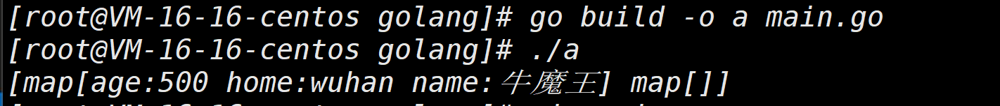


::: warning 注意

**注意：上面make了两次，第一次是切片的本身make一次，第二次是切片对应的数据类型也需要make**

:::


**继续添加妖怪信息**

```go
package main
import "fmt"

func main(){
    //定义声明一个map切片
    var monster []map[string]string
    monster = make([]map[string]string,2)
    //增加一个妖怪的信息
    if monster[0] == nil{
        monster[0] = make(map[string]string,2)
        monster[0]["name"] = "牛魔王"
        monster[0]["age"] = "500"
        monster[0]["home"] = "wuhan"
    }
     if monster[1] == nil{
        monster[1] = make(map[string]string,2)
        monster[1]["name"] = "白骨精"
        monster[1]["age"] = "400"
        monster[1]["home"] = "北京"
    }
     if monster[2] == nil{
        monster[2] = make(map[string]string,2)
        monster[2]["name"] = "张三"
        monster[2]["age"] = "600"
        monster[2]["home"] = "曹县"
    }
    fmt.Println(monster)
}
```

🚀 编译结果如下：

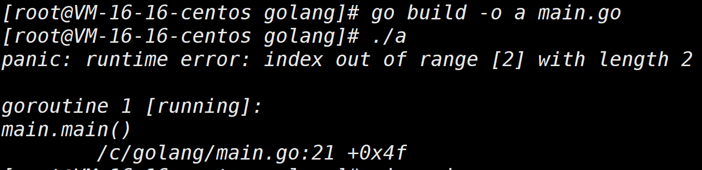

编译出错，`monster = make([]map[string]string,2)`越界，该为3即可，那有没有办法可以让map动态呢

**这时候需要使用到切片的append函数，可以动态的增加，就不需要给界限**

```go
package main
import "fmt"

func main(){
    //定义声明一个map切片
    var monster []map[string]string
    monster = make([]map[string]string,2)
    //增加一个妖怪的信息
    if monster[0] == nil{
        monster[0] = make(map[string]string,2)
        monster[0]["name"] = "牛魔王"
        monster[0]["age"] = "500"
        monster[0]["home"] = "wuhan"
    }
     if monster[1] == nil{
        monster[1] = make(map[string]string,2)
        monster[1]["name"] = "白骨精"
        monster[1]["age"] = "400"
        monster[1]["home"] = "北京"
    }
	newMonster := map[string]string{
		"name" : "张三",
    	"age" : "600",
    	"home" : "曹县",
		}
    monster = append(monster,newMonster)
    fmt.Println(monster)
}
```

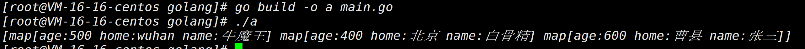

🐶 添加成功！


### map排序

::: details map是无序的~~
💡简单的一个案例如下：

```go
/*
 * @Description:map
 * @Author: xiongxinwei 3293172751nss@gmail.com
 * @Date: 2022-10-04 21:37:41
 * @LastEditTime: 2022-10-25 17:41:04
 * @FilePath: \code\go-super\43-main.go
 * @Github_Address: https://github.com/cubxxw/awesome-cs-cloudnative-blockchain
 * Copyright (c) 2022 by xiongxinwei 3293172751nss@gmail.com, All Rights Reserved. @blog: http://cubxxw.com
 */
package main

import (
	"fmt"
	"sort"
)

func main() {
	//定义一个map
	var myMap map[int]string
	//初始化map
	myMap = make(map[int]string, 10)
	//赋值
	myMap[1] = "北京"
	myMap[2] = "上海"
	myMap[3] = "广州"
	myMap[4] = "深圳"
	myMap[5] = "杭州"
	myMap[6] = "成都"
	myMap[7] = "重庆"
	myMap[8] = "武汉"
	myMap[9] = "西安"
	myMap[10] = "南京"
	myMap[11] = "苏州"
	myMap[12] = "天津"

	//遍历map   -- 这个是无序的~
	for k, v := range myMap {
		fmt.Println(k, v)
	}

	//有序遍历map
	//定义一个切片，用来存放map的key
	var keys []int
	//遍历map，将key存放到切片中
	for k := range myMap {
		keys = append(keys, k)
	}
	//对切片进行排序
	sort.Ints(keys)
	//遍历切片，按照key的顺序遍历map
	for _, k := range keys {
		fmt.Println(k, myMap[k])
	}
}

```

🚀 编译结果如下：

```bash
[Running] go run "d:\文档\最近的\awesome-golang\docs\code\go-super\43-main.go"
12 天津
4 深圳
6 成都
10 南京
5 杭州
7 重庆
8 武汉
9 西安
11 苏州
1 北京
2 上海
3 广州
1 北京
2 上海
3 广州
4 深圳
5 杭州
6 成都
7 重庆
8 武汉
9 西安
10 南京
11 苏州
12 天津
```

:::


```go
package main
import "fmt"

func main(){
    map1 := make(map[int]int，4)
    map1[10] = 100
    map1[2] = 1543
    map1[5] = 456
    map1[8] = 90
    fmt.Println(map1)
}
```

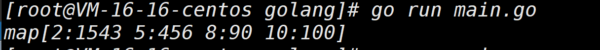

现在的map是有序的，是按照key的大小来进行排序的


**fun Ints包**

```go
func Ints(a []int)
```

Ints函数将a排序为递增排序

```go
import "sort"
import "fmt"
func main(){
	sort.Init(keys)        //将keys排序
	fmt.Println(key)
    
}
```


### map的使用细节

1.   **map是引用类型(数组是值类型）**，遵守类型传递机制，在一个函数中接收map，修改后，会直接修改原来的map

2.   map的容量达到后，再想map添加元素，会自动扩容，并不会发生panic，也就是map能动态增长键值对

3.   map的value也经常使用**struct类型**，跟适合管理复杂的数据

     >   1.   map的key为学生的学号，是唯一的
     >   2.   map的value为结构体，包含学生的名字，年龄，地址
     >   3.   创建两个学生  -- 在结构体Student{**信息**}

```go
 /*************************************************************************   
     > File Name: aaaa.go
     > Mail: 3293172751nss@gmail.com 
     > Created Time: Wed 12 Jan 2022 02:44:06 PM CST
  ************************************************************************/
  package main
 import "fmt"
 
 //定义一个学生结构体
 type Student struct{
     Name string
     Age int
     Addre string
 }
 func main(){
     stu := make(map[string]Student)
     //创建两个学生  -- 在结构体Student{信息}
     s1 := Student{"tom",19,"北京"}  
     stu["n01"] = s1
     s2 := Student{"bot",29,"上海"}
     stu["n01"] = s2
     fmt.Println(s1,s2)
 }

```

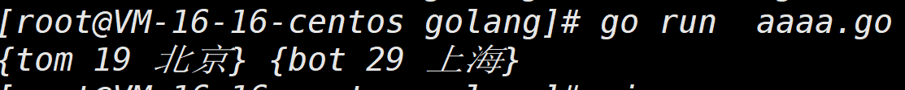


**遍历每个学生的信息**

```go
for k,v := range stu{   //k是key，v是value
	fmt.Printf("学生的编号是%v \n",k)
    fmt.Printf("学生的姓名是%v \n",v.Age)
    fmt.Printf("学生的年龄是%v \n",v.Age)
    fmt.Printf("学生的地址是%v \n",v.Addre)
}
```


----

#### 综合案例

>   1)使用 map[string]map[string]sting 的map类型
>   2)key: 表示用户名，是唯一的，不可以重复
>   3)如果某个用户名存在，就将其密码修改"888888"，如果不存在就增加这个用户信息,
>   （包括昵称nickname 和 密码pwd）。
>   4)编写一个函数 modifyUser(users map[string]map[string]sting, name string) 完成上述功能

```go
package main
import (
	"fmt"
)

func modifyUser(users map[string]map[string]string, name string) {

	//判断users中是否有name,前面有说判断方法
	//v , ok := users[name]
	if users[name] != nil {   
		//有这个用户
		users[name]["pwd"] = "888888"
	} else {
		//没有这个用户   ---  创建用户
      	/*注意，创建用户的时候需要再make一次*/
		users[name] = make(map[string]string, 2)
		users[name]["pwd"] = "888888"
        users[name]["nickname"] = "name:" + name 
	}
}

func main() {
	users := make(map[string]map[string]string, 10)
    /*key为string类型，value为map[string]string类型*/
	//先添加一个用户smith   要先map
    users["smith"] = make(map[string]string, 2)
	users["smith"]["pwd"] = "999999"
	users["smith"]["name"] = "小花猫"

	modifyUser(users, "tom")
	modifyUser(users, "mary")
	modifyUser(users, "smith")

	fmt.Println(users)

}
```

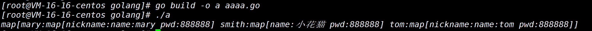


## 封装排序的方法

::: tip 
对排序进行封装起来，然后对切片进行排序操作

💡简单的一个案例如下：


:::


## END 链接

<ul><li><div><a href = '7.md' style='float:left'>⬆️上一节🔗</a><a href = '9.md' style='float: right'>⬇️下一节🔗</a></div></li></ul>

+ [Ⓜ️回到目录🏠](../README.md)

+ [**🫵参与贡献💞❤️‍🔥💖**](https://cubxxw.com/archives/contributors))

+ ✴️版权声明 &copy; :本书所有内容遵循[CC-BY-SA 3.0协议（署名-相同方式共享）&copy;](http://zh.wikipedia.org/wiki/Wikipedia:CC-by-sa-3.0协议文本) 
