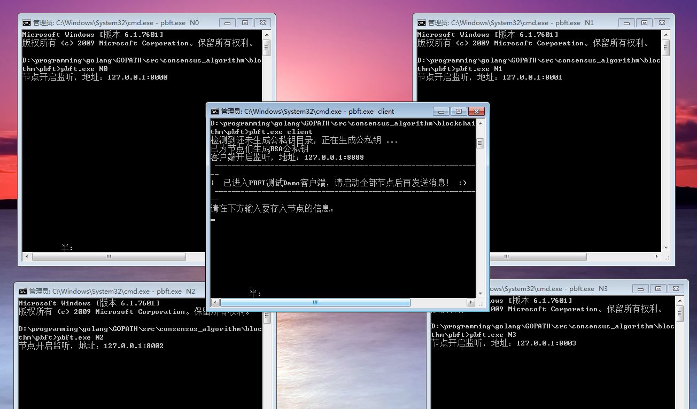
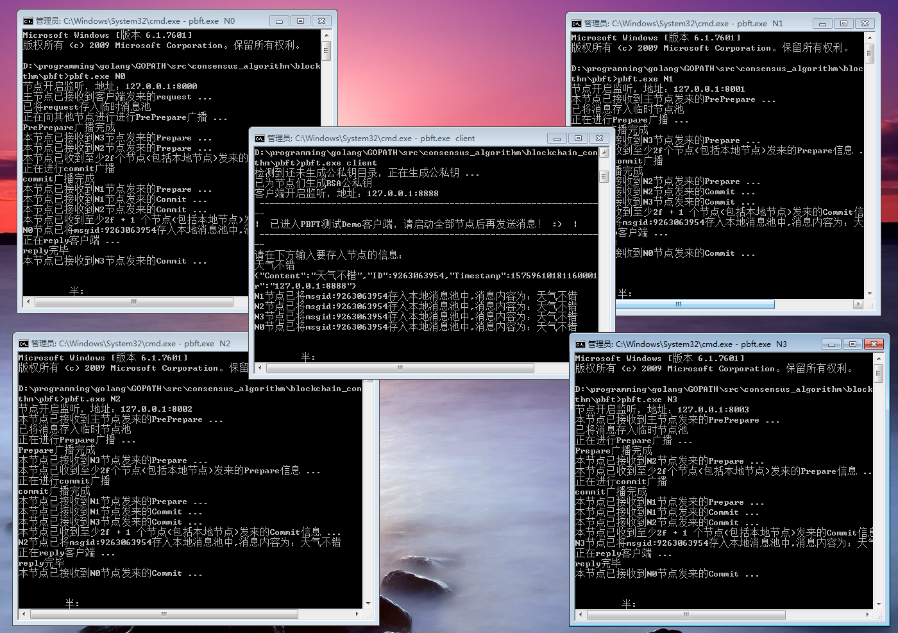
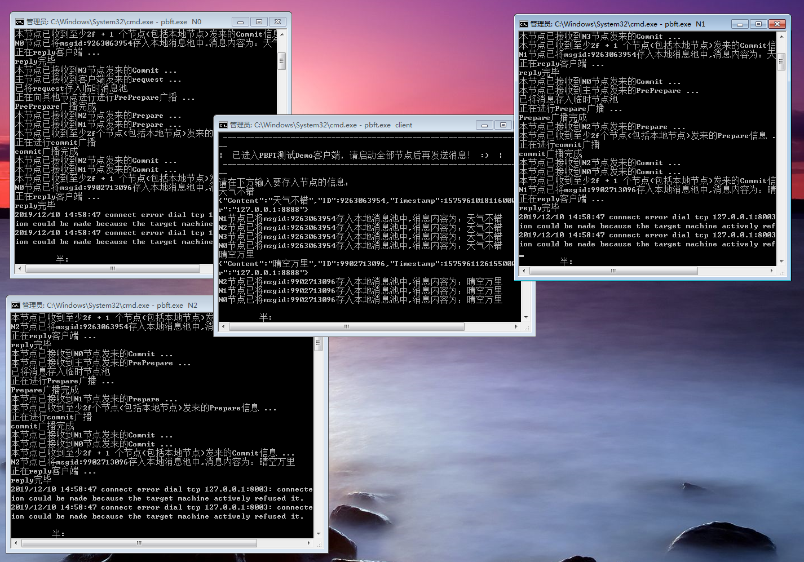
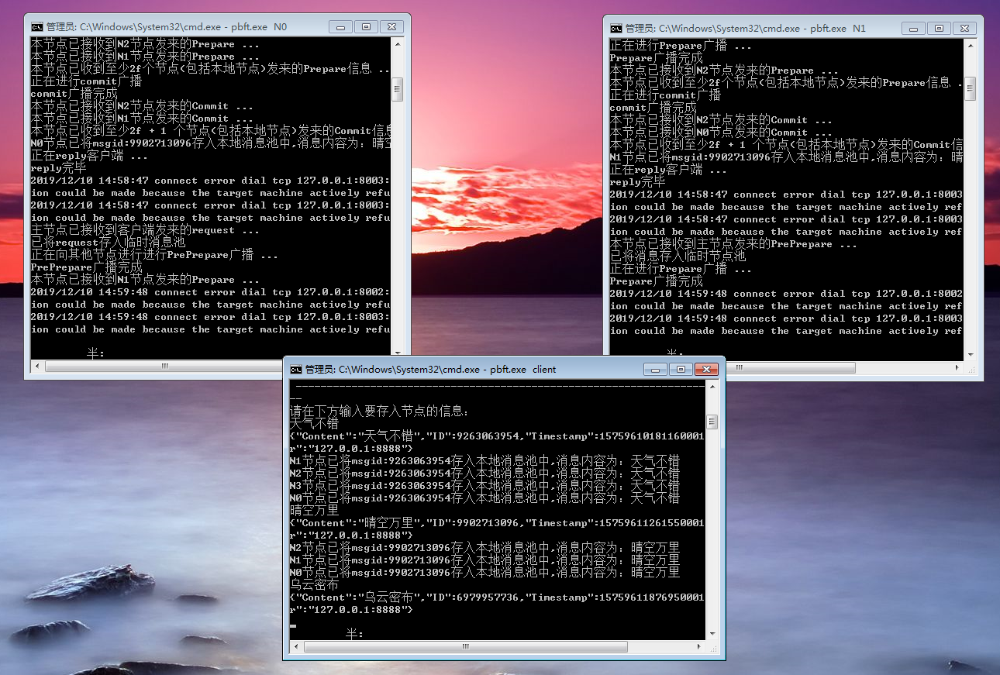

>参考资料：
> - https://www.jianshu.com/p/fb5edf031afd
> -  https://www.cnblogs.com/gexin/p/10242161.html

<br>

本demo为pbft共识算法的代码实现，如果想了解pbft的详细信息请自行浏览参考资料
本demo展示了pbft的部分功能（没有写主节点轮循机制），写的并不严谨，仅作为对pbft的了解用途

<br>

### 共识算法按照容错类型很分类

+ 非拜占庭容错（CFT）：paxos、raft

  只能保证分布式系统中结点发生宕机（dang)等错误时分布式系统的可靠性（用于私有链和企业内部）

+ 拜占庭容错（BFT）：PBFT、PBFT-Smart…

  分布式系统中结点发生了任意类型（**宕机、篡改、重放…**)的错误，只要发生错误的结点少于一定比例，都能保证系统的可靠性（用于联盟链，各结点缺少信任）


**目的：好节点不知道哪些是坏结点，哪些是好结点，而PBFT就是让好结点达成一致**


> 结点0是主结点，结点3是拜占庭结点（恶意结点），C是客户端，主结点传播后其他结点验证是否是被篡改，验证通过后发出pre-prepace准备包，广播的过程就是收集到2*f+1个签名包，广播commit包，说明发布的包一直，需要commit提交（因为结点0不知道其他结点状态，只有每个结点都拿到其他结点的包，说明达到共识


#### 三个阶段：

**pre-prepare: 发送原本的消息m，让每个节点都获取原始消息，主结点广播给大家执行命令A（包括视图、序号）**

+ 对request排序
+ 可以在viewChange v+1阶段中证明，远leader在视图v把request编号为n

**prepare: 准备阶段，用Digest(m)去发送，我把我收到的命令发给你们，你们也把你们收到的发给我，看看是不是一样。如果一个节点收到2f+1个prepare消息，就认为“prepared”，说明已经有大部分节点认同了这个m，可以进行下一步提交，但是无法保证其他节点也达到共识阶段。**

**commit: 从结点告诉其他节点：表示自己已经收到了和大多数结点一致的主节点命令，我可以在本地提交；广播给大家，搜集够2f+1个后，说明大多数都已经在自己的本地提交了，区块落盘。至少f+1个可信结点对本地要==提交的请求序号==取得共识，==这些请求在每一个结点可能是不同的视图号中提交的==**

**用Digest(m)去发送，如果一个节点收到2f+1个commit，那么就可以认为，就说明已经有大多数节点“执行”了这些m，这个阶段主要是为了View Change服务。**


**prepare和commit阶段为何都要2f+1个节点反馈确认?（这2f+1并不一定是相同的）**

对于prepare和commit来说，节点需要在2f+1个状态复制机的沟通内就要做出决定，这是刚好可以保证一致性的，考虑最坏的情况：我们假设收到的有f个是正常节点发过来的，也有f个是恶意节点发过来的，那么，第2f+1个只可能是正常节点发过来的。（因为我们限制了最多只有f个恶意节点）由此可知，“大多数”正常的节点还是可以让系统工作下去的。所以2f+1这个参数和n>3f+1的要求是逻辑自洽的。


**主结点宕机或者是拜占庭结点怎么办？**

+ 宕机（不接受request、不发送pre-prepare)
+ 作恶（篡改信息）

**此时需要视图切换-1-2-3**

1. 从结点广播viewchange信息
2. 新主节点收到2*f+1个viewchange后，广播NewView(收到意愿)
3. 结点接收到newView信息后，校验签名，v和0中的信息是否合法，验证通过，主结点和副本都进入视图v+1

> 如果新的结点是恶意节点，请求不通过，发送新的包


**检查点协议：压缩日志**

> 节点收到消息都会保存下来，此时检查带来协议就是为了处理数据值，之前的消息都可以删除

**作用：**

+ 每100个操作数创建一次检查点

+ 删除本地序号小于等于n的消息
+ 创建water mark(水线、基准线)


## 实现功能：

>pbft公式：  n>=3f + 1  其中n为全网总节点数量，f为最多允许的作恶、故障节点


  数据从客户端输入，到接收到节点们的回复共分为5步

 1. 客户端向主节点发送请求信息
 2. 主节点N0接收到客户端请求后将请求数据里的主要信息提出，并向其余节点进行preprepare发送
 3. 从节点们接收到来自主节点的preprepare，首先利用主节点的公钥进行签名认证，其次将消息进行散列（消息摘要，以便缩小信息在网络中的传输大小）后，向其他节点广播prepare
 4. 节点接收到2f个prepare信息（包含自己）,并全部签名验证通过，则可以进行到commit步骤，向全网其他节点广播commit
 5. 节点接收到2f+1个commit信息（包含自己），并全部签名验证通过，则可以把消息存入到本地，并向客户端返回reply消息

<br>

## 运行步骤：

<br>

##### 1.下载/编译

```shell
 git clone https://github.com/corgi-kx/blockchain_consensus_algorithm.git
```
```shell
 cd blockchain_consensus_algorithm/pbft
```
```go
 go build -o pbft.exe
```

##### 2.开启五个端口（一个客户端，四个节点）

客户端执行pbft.exe client  
其他四个节点依次执行 pbft.exe N0  pbft.exe N1  pbft.exe N2  pbft.exe N3


##### 3.输入一段信息，看看节点之间的同步过程

##### 4.关闭一个节点（代表作恶、故障节点），再次输入信息，看看是否还会接收到reply
可以看到，客户端依然会接收到reply，因为根据公式 n >= 3f+1  ，就算宕机一个节点，系统依然能顺利运行


##### 4.关闭两个节点（代表作恶、故障节点），再次输入信息，看看是否还会接收到reply
可以看到，关闭两个节点后，故障节点已经超出了pbft的允许数量，消息进行到Prepare阶段由于接收不到满足数量的信息，固系统不再进行commit确认,客户端也接收不到reply


