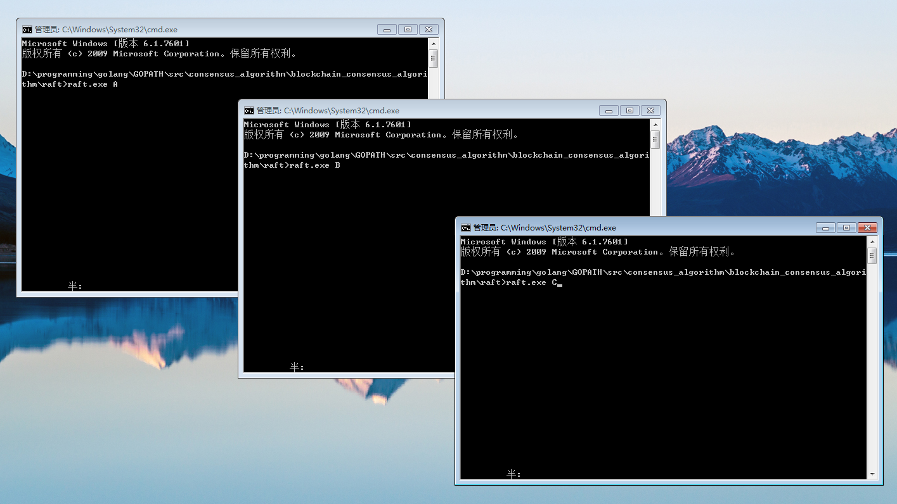
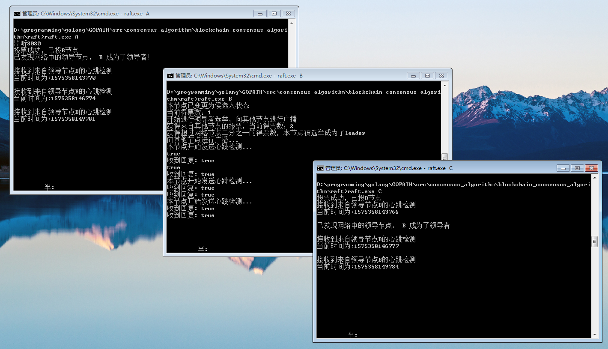
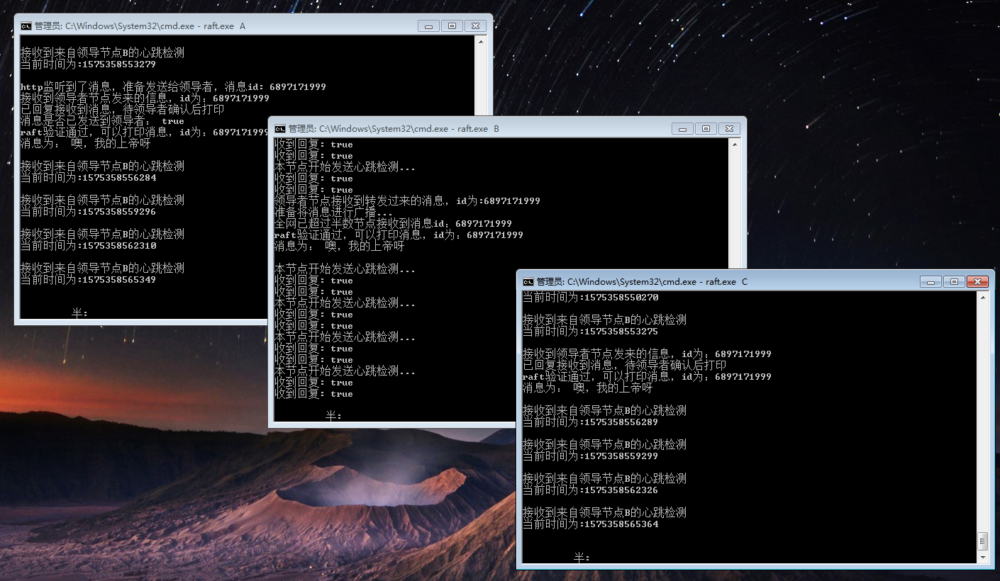
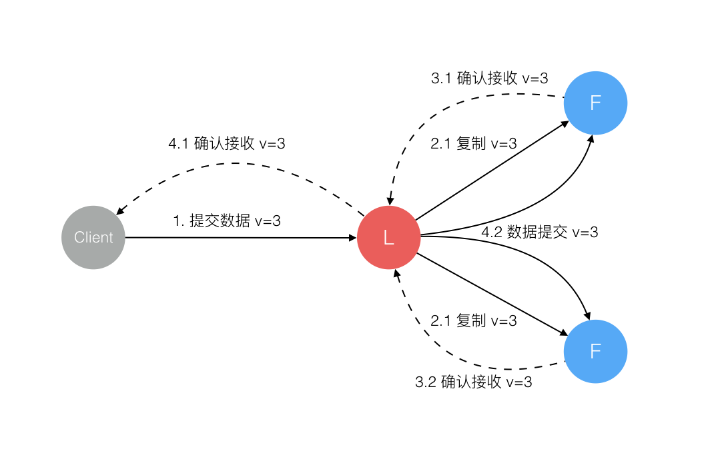
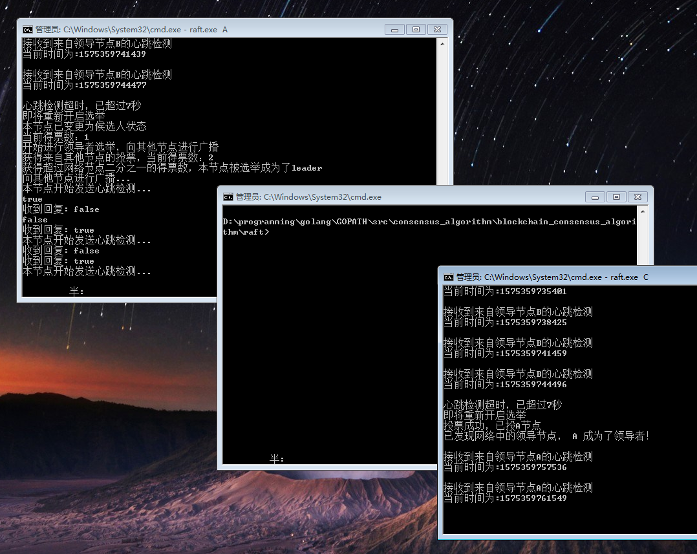
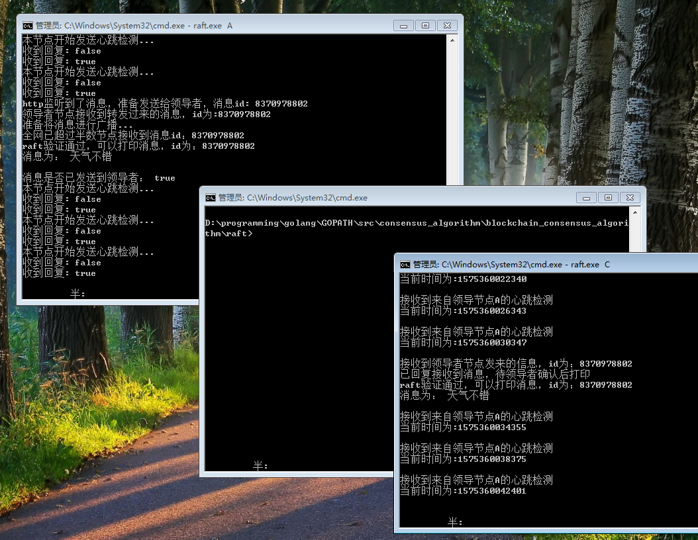
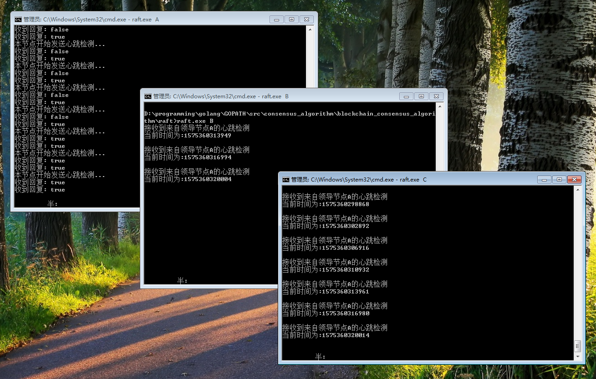

# raft

[toc]

## Raft 算法详解

[Paxos 算法详解](https://zhuanlan.zhihu.com/p/31780743)一文讲述了晦涩难懂的 Paxos 算法，以可理解性和易于实现为目标的 Raft 算法极大的帮助了我们的理解，推动了分布式一致性算法的工程应用，本文试图以通俗易懂的语言讲述 Raft 算法。

## 一、Raft 算法概述

### [分布式共识快速学习🖱️ ](http://thesecretlivesofdata.com/raft/)

不同于 Paxos 算法直接从分布式一致性问题出发推导出来，Raft 算法则是从多副本状态机的角度提出，用于管理多副本状态机的日志复制。Raft 实现了和 Paxos 相同的功能，它将一致性分解为多个子问题：Leader 选举（Leader election）、日志同步（Log replication）、安全性（Safety）、日志压缩（Log compaction）、成员变更（Membership change）等。同时，Raft 算法使用了更强的假设来减少了需要考虑的状态，使之变的易于理解和实现。

Raft 将系统中的角色分为领导者（Leader）、跟从者（Follower）和候选人（Candidate）：

- **Leader**：接受客户端请求，并向 Follower 同步请求日志，当日志同步到大多数节点上后告诉 Follower 提交日志。
- **Follower**：接受并持久化 Leader 同步的日志，在 Leader 告之日志可以提交之后，提交日志。
- **Candidate**：Leader 选举过程中的临时角色。


Raft 要求系统在任意时刻最多只有一个 Leader，正常工作期间只有 Leader 和 Followers。

Raft 算法角色状态转换如下：


Follower 只响应其他服务器的请求。如果 Follower 超时没有收到 Leader 的消息，它会成为一个 Candidate 并且开始一次 Leader 选举。收到大多数服务器投票的 Candidate 会成为新的 Leader。Leader 在宕机之前会一直保持 Leader 的状态。


Raft 算法将时间分为一个个的任期（term），每一个 term 的开始都是 Leader 选举。在成功选举 Leader 之后，Leader 会在整个 term 内管理整个集群。如果 Leader 选举失败，该 term 就会因为没有 Leader 而结束。

## 二、Leader 选举

Raft 使用心跳（heartbeat）触发 Leader 选举。当服务器启动时，初始化为 Follower。Leader 向所有 Followers 周期性发送 heartbeat。如果 Follower 在选举超时时间内没有收到 Leader 的 heartbeat，就会等待一段随机的时间后发起一次 Leader 选举。

Follower 将其当前 term 加一然后转换为 Candidate。它首先给自己投票并且给集群中的其他服务器发送 RequestVote RPC （RPC 细节参见八、Raft 算法总结）。结果有以下三种情况：

- 赢得了多数的选票，成功选举为 Leader；
- 收到了 Leader 的消息，表示有其它服务器已经抢先当选了 Leader；
- 没有服务器赢得多数的选票，Leader 选举失败，等待选举时间超时后发起下一次选举。


选举出 Leader 后，Leader 通过定期向所有 Followers 发送心跳信息维持其统治。若 Follower 一段时间未收到 Leader 的心跳则认为 Leader 可能已经挂了，再次发起 Leader 选举过程。

Raft 保证选举出的 Leader 上一定具有最新的已提交的日志，这一点将在四、安全性中说明。

## 三、日志同步

Leader 选出后，就开始接收客户端的请求。Leader 把请求作为日志条目（Log entries）加入到它的日志中，然后并行的向其他服务器发起 AppendEntries RPC （RPC 细节参见八、Raft 算法总结）复制日志条目。当这条日志被复制到大多数服务器上，Leader 将这条日志应用到它的状态机并向客户端返回执行结果。


某些 Followers 可能没有成功的复制日志，Leader 会无限的重试 AppendEntries RPC 直到所有的 Followers 最终存储了所有的日志条目。

日志由有序编号（log index）的日志条目组成。每个日志条目包含它被创建时的任期号（term），和用于状态机执行的命令。如果一个日志条目被复制到大多数服务器上，就被认为可以提交（commit）了。


Raft 日志同步保证如下两点：

- 如果不同日志中的两个条目有着相同的索引和任期号，则它们所存储的命令是相同的。
- 如果不同日志中的两个条目有着相同的索引和任期号，则它们之前的所有条目都是完全一样的。

第一条特性源于 Leader 在一个 term 内在给定的一个 log index 最多创建一条日志条目，同时该条目在日志中的位置也从来不会改变。

第二条特性源于 AppendEntries 的一个简单的一致性检查。当发送一个 AppendEntries RPC 时，Leader 会把新日志条目紧接着之前的条目的 log index 和 term 都包含在里面。如果 Follower 没有在它的日志中找到 log index 和 term 都相同的日志，它就会拒绝新的日志条目。

一般情况下，Leader 和 Followers 的日志保持一致，因此 AppendEntries 一致性检查通常不会失败。然而，Leader 崩溃可能会导致日志不一致：旧的 Leader 可能没有完全复制完日志中的所有条目。


上图阐述了一些 Followers 可能和新的 Leader 日志不同的情况。一个 Follower 可能会丢失掉 Leader 上的一些条目，也有可能包含一些 Leader 没有的条目，也有可能两者都会发生。丢失的或者多出来的条目可能会持续多个任期。

Leader 通过强制 Followers 复制它的日志来处理日志的不一致，Followers 上的不一致的日志会被 Leader 的日志覆盖。

Leader 为了使 Followers 的日志同自己的一致，Leader 需要找到 Followers 同它的日志一致的地方，然后覆盖 Followers 在该位置之后的条目。

Leader 会从后往前试，每次 AppendEntries 失败后尝试前一个日志条目，直到成功找到每个 Follower 的日志一致位点，然后向后逐条覆盖 Followers 在该位置之后的条目。

## 四、安全性

Raft 增加了如下两条限制以保证安全性：

- 拥有最新的已提交的 log entry 的 Follower 才有资格成为 Leader。

这个保证是在 RequestVote RPC 中做的，Candidate 在发送 RequestVote RPC 时，要带上自己的最后一条日志的 term 和 log index，其他节点收到消息时，如果发现自己的日志比请求中携带的更新，则拒绝投票。日志比较的原则是，如果本地的最后一条 log entry 的 term 更大，则 term 大的更新，如果 term 一样大，则 log index 更大的更新。

- Leader 只能推进 commit index 来提交当前 term 的已经复制到大多数服务器上的日志，旧 term 日志的提交要等到提交当前 term 的日志来间接提交（log index 小于 commit index 的日志被间接提交）。

之所以要这样，是因为可能会出现已提交的日志又被覆盖的情况：


在阶段 a，term 为 2，S1 是 Leader，且 S1 写入日志（term, index）为 (2, 2)，并且日志被同步写入了 S2；

在阶段 b，S1 离线，触发一次新的选主，此时 S5 被选为新的 Leader，此时系统 term 为 3，且写入了日志（term, index）为（3， 2）;

S5 尚未将日志推送到 Followers 就离线了，进而触发了一次新的选主，而之前离线的 S1 经过重新上线后被选中变成 Leader，此时系统 term 为 4，此时 S1 会将自己的日志同步到 Followers，按照上图就是将日志（2， 2）同步到了 S3，而此时由于该日志已经被同步到了多数节点（S1, S2, S3），因此，此时日志（2，2）可以被提交了。；

在阶段 d，S1 又下线了，触发一次选主，而 S5 有可能被选为新的 Leader（这是因为 S5 可以满足作为主的一切条件：1. term = 5 > 4，2. 最新的日志为（3，2），比大多数节点（如 S2/S3/S4 的日志都新），然后 S5 会将自己的日志更新到 Followers，于是 S2、S3 中已经被提交的日志（2，2）被截断了。

增加上述限制后，即使日志（2，2）已经被大多数节点（S1、S2、S3）确认了，但是它不能被提交，因为它是来自之前 term（2）的日志，直到 S1 在当前 term（4）产生的日志（4， 4）被大多数 Followers 确认，S1 方可提交日志（4，4）这条日志，当然，根据 Raft 定义，（4，4）之前的所有日志也会被提交。此时即使 S1 再下线，重新选主时 S5 不可能成为 Leader，因为它没有包含大多数节点已经拥有的日志（4，4）。

## 五、日志压缩

在实际的系统中，不能让日志无限增长，否则系统重启时需要花很长的时间进行回放，从而影响可用性。Raft 采用对整个系统进行 snapshot 来解决，snapshot 之前的日志都可以丢弃。

每个副本独立的对自己的系统状态进行 snapshot，并且只能对已经提交的日志记录进行 snapshot。

Snapshot 中包含以下内容：

- 日志元数据。最后一条已提交的 log entry 的 log index 和 term。这两个值在 snapshot 之后的第一条 log entry 的 AppendEntries RPC 的完整性检查的时候会被用上。
- 系统当前状态。

当 Leader 要发给某个日志落后太多的 Follower 的 log entry 被丢弃，Leader 会将 snapshot 发给 Follower。或者当新加进一台机器时，也会发送 snapshot 给它。发送 snapshot 使用 InstalledSnapshot RPC（RPC 细节参见八、Raft 算法总结）。

做 snapshot 既不要做的太频繁，否则消耗磁盘带宽， 也不要做的太不频繁，否则一旦节点重启需要回放大量日志，影响可用性。推荐当日志达到某个固定的大小做一次 snapshot。

做一次 snapshot 可能耗时过长，会影响正常日志同步。可以通过使用 copy-on-write 技术避免 snapshot 过程影响正常日志同步。

## 六、成员变更

成员变更是在集群运行过程中副本发生变化，如增加 / 减少副本数、节点替换等。

成员变更也是一个分布式一致性问题，既所有服务器对新成员达成一致。但是成员变更又有其特殊性，因为在成员变更的一致性达成的过程中，参与投票的进程会发生变化。

如果将成员变更当成一般的一致性问题，直接向 Leader 发送成员变更请求，Leader 复制成员变更日志，达成多数派之后提交，各服务器提交成员变更日志后从旧成员配置（Cold）切换到新成员配置（Cnew）。

因为各个服务器提交成员变更日志的时刻可能不同，造成各个服务器从旧成员配置（Cold）切换到新成员配置（Cnew）的时刻不同。

成员变更不能影响服务的可用性，但是成员变更过程的某一时刻，可能出现在 Cold 和 Cnew 中同时存在两个不相交的多数派，进而可能选出两个 Leader，形成不同的决议，破坏安全性。


由于成员变更的这一特殊性，成员变更不能当成一般的一致性问题去解决。

为了解决这一问题，Raft 提出了两阶段的成员变更方法。集群先从旧成员配置 Cold 切换到一个过渡成员配置，称为共同一致（joint consensus），共同一致是旧成员配置 Cold 和新成员配置 Cnew 的组合 Cold U Cnew，一旦共同一致 Cold U Cnew 被提交，系统再切换到新成员配置 Cnew。


Raft 两阶段成员变更过程如下：

1. Leader 收到成员变更请求从 Cold 切成 Cold,new；
2. Leader 在本地生成一个新的 log entry，其内容是 Cold∪Cnew，代表当前时刻新旧成员配置共存，写入本地日志，同时将该 log entry 复制至 Cold∪Cnew 中的所有副本。在此之后新的日志同步需要保证得到 Cold 和 Cnew 两个多数派的确认；
3. Follower 收到 Cold∪Cnew 的 log entry 后更新本地日志，并且此时就以该配置作为自己的成员配置；
4. 如果 Cold 和 Cnew 中的两个多数派确认了 Cold U Cnew 这条日志，Leader 就提交这条 log entry 并切换到 Cnew；
5. 接下来 Leader 生成一条新的 log entry，其内容是新成员配置 Cnew，同样将该 log entry 写入本地日志，同时复制到 Follower 上；
6. Follower 收到新成员配置 Cnew 后，将其写入日志，并且从此刻起，就以该配置作为自己的成员配置，并且如果发现自己不在 Cnew 这个成员配置中会自动退出；
7. Leader 收到 Cnew 的多数派确认后，表示成员变更成功，后续的日志只要得到 Cnew 多数派确认即可。Leader 给客户端回复成员变更执行成功。

异常分析：

- 如果 Leader 的 Cold U Cnew 尚未推送到 Follower，Leader 就挂了，此后选出的新 Leader 并不包含这条日志，此时新 Leader 依然使用 Cold 作为自己的成员配置。
- 如果 Leader 的 Cold U Cnew 推送到大部分的 Follower 后就挂了，此后选出的新 Leader 可能是 Cold 也可能是 Cnew 中的某个 Follower。
- 如果 Leader 在推送 Cnew 配置的过程中挂了，那么同样，新选出来的 Leader 可能是 Cold 也可能是 Cnew 中的某一个，此后客户端继续执行一次改变配置的命令即可。
- 如果大多数的 Follower 确认了 Cnew 这个消息后，那么接下来即使 Leader 挂了，新选出来的 Leader 肯定位于 Cnew 中。

两阶段成员变更比较通用且容易理解，但是实现比较复杂，同时两阶段的变更协议也会在一定程度上影响变更过程中的服务可用性，因此我们期望增强成员变更的限制，以简化操作流程。

两阶段成员变更，之所以分为两个阶段，是因为对 Cold 与 Cnew 的关系没有做任何假设，为了避免 Cold 和 Cnew 各自形成不相交的多数派选出两个 Leader，才引入了两阶段方案。

如果增强成员变更的限制，假设 Cold 与 Cnew 任意的多数派交集不为空，这两个成员配置就无法各自形成多数派，那么成员变更方案就可能简化为一阶段。

那么如何限制 Cold 与 Cnew，使之任意的多数派交集不为空呢？方法就是每次成员变更只允许增加或删除一个成员。

可从数学上严格证明，只要每次只允许增加或删除一个成员，Cold 与 Cnew 不可能形成两个不相交的多数派。

一阶段成员变更：

- 成员变更限制每次只能增加或删除一个成员（如果要变更多个成员，连续变更多次）。
- 成员变更由 Leader 发起，Cnew 得到多数派确认后，返回客户端成员变更成功。
- 一次成员变更成功前不允许开始下一次成员变更，因此新任 Leader 在开始提供服务前要将自己本地保存的最新成员配置重新投票形成多数派确认。
- Leader 只要开始同步新成员配置，即可开始使用新的成员配置进行日志同步。

## 七、Raft 与 Multi-Paxos 的异同

Raft 与 Multi-Paxos 都是基于领导者的一致性算法，乍一看有很多地方相同，下面总结一下 Raft 与 Multi-Paxos 的异同。

Raft 与 Multi-Paxos 中相似的概念：


Raft 与 Multi-Paxos 的不同：


## 八、Raft 算法总结

Raft 算法各节点维护的状态：


Leader 选举：


日志同步：


Raft 状态机：


安装 snapshot：


## 实现功能：

 - 节点状态分为Leader（领导者）、Follower（追随者）、Candidate（候选人）
 - 节点间随机成为candidate状态并选举出Leader，且同时仅存在一个Leader
 - Leader节点定时发送心跳检测至其他Follower节点
 - Follower节点们超过一定时间未收到心跳检测，则Follower节点们重新开启选举
 - 客户端通过http发送消息到节点A，如果A不是Leader则转发至Leader节点
 - Leader收到客户端的消息后向Follower节点进行广播
 - Follower节点收到消息，反馈给Leader，等待Leader确认
 - Leader收到全网超过二分之一的反馈后，本地进行打印，然后将确认收到反馈的信息提交到Follower节点
 - Follower节点收到确认提交信息后，打印消息

<br>

## 运行步骤：
<br>

##### 1.下载/编译
```shell
 git clone https://github.com/corgi-kx/blockchain_consensus_algorithm.git
```
```shell
 cd blockchain_consensus_algorithm/raft
```
```go
 go build -o raft.exe
```

##### 2.开启三个端口，并分别执行raft.exe A 、raft.exe B 、 raft.exe C，代表开启三个节点（初始状态为追随者）



##### 3.三个节点会随机选举出领导者（其中A节点默认监听来自http的访问）,成功的节点会发送心跳检测到其他两个节点

##### 4.此时打开浏览器用http访问本地节点8080端口，带上节点需要同步打印的消息，比如：
`http://localhost:8080/req?message=噢，我的上帝呀`

可以看到三个节点同时打印了消息，本段数据同步步骤可以用下图进行理解（不过缺少了4.1步骤）


##### 5.如果领导者节点宕机了怎么办呢，我们尝试关闭领导者节点B

可以发现关闭领导者B后，节点间有个超时机制，如果超过一定时间没有收到心跳检测，则会自动开始重新进行选举，此时A当选了新的领导者

##### 6.再次打开浏览器用http访问本地节点8080端口，带上节点需要同步打印的消息，看看还能同步打印吗
`http://localhost:8080/req?message=天气不错`

结果发现可以打印的，因为新的领导者A、追随者C并没有宕机，A收到了C的回馈(2>3/2)超过了全网一半的节点，所以是可以进行打印数据的

##### 7.重新启动节点B，B自动变为追随者状态，并接收来自新的领导者A的心跳检测

<hr>

>参考资料：
> - http://thesecretlivesofdata.com/raft/
> - https://www.cnblogs.com/mindwind/p/5231986.html
> - https://blog.csdn.net/s15738841819/article/details/84286276
