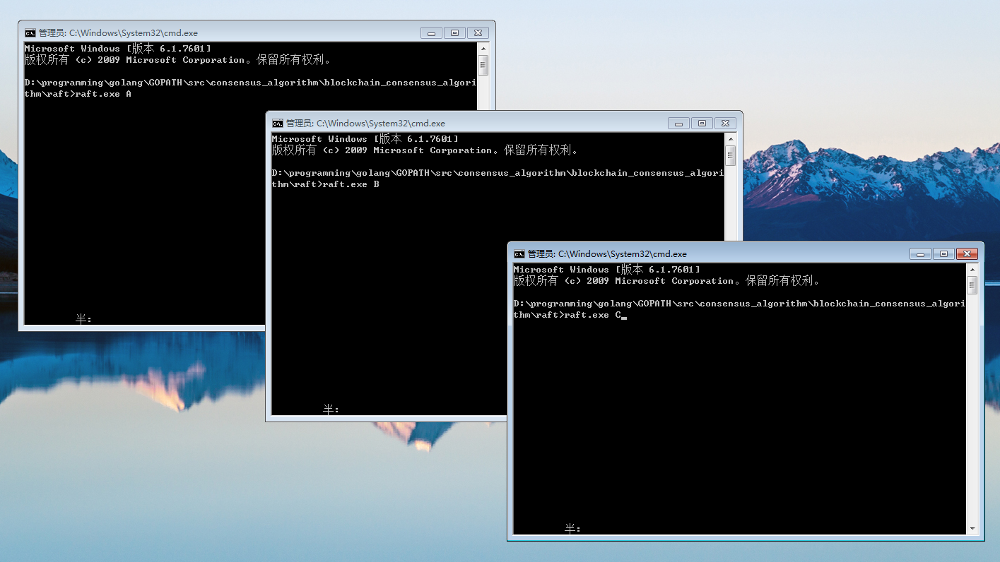
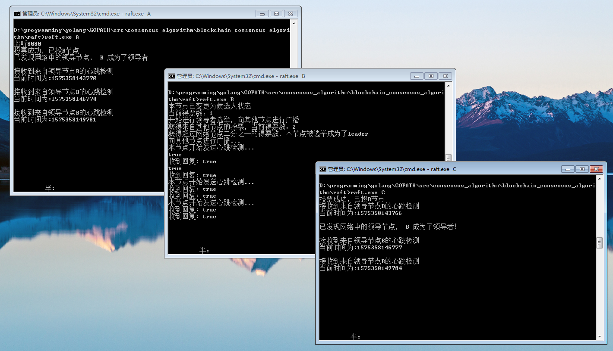
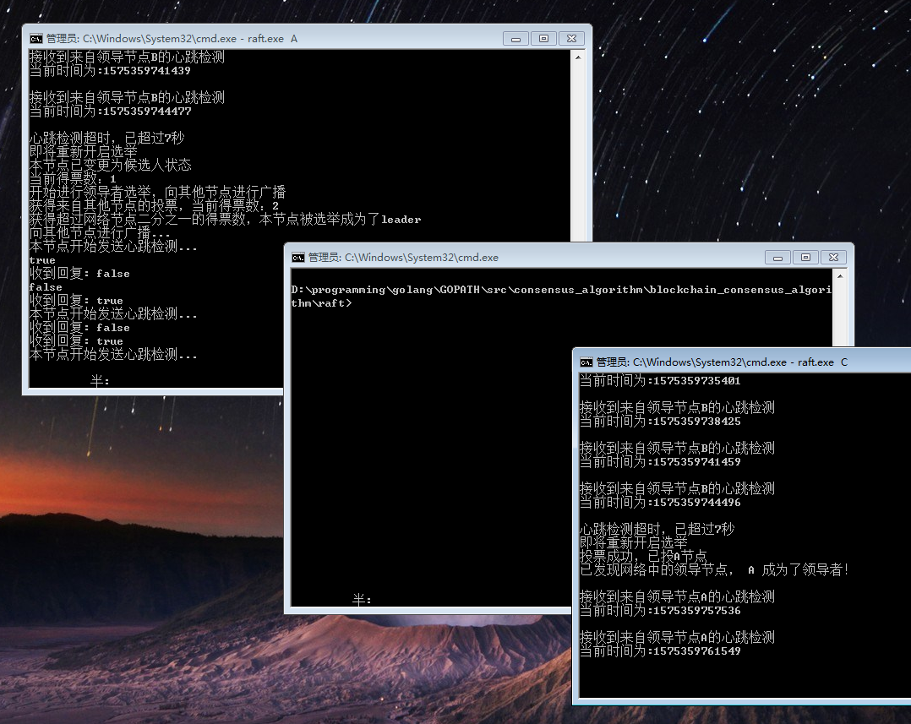

>**&ensp;&ensp;&ensp;邮箱:mikesen1994@gmail.com   &ensp;&ensp;&ensp;&ensp;  &ensp;&ensp; &ensp;&ensp; vx:965952482**

<hr>


本demo为raft的代码实现，如果想了解raft的详细信息请自行浏览参考资料<br>
本demo展示了raft的部分功能，写的并不严谨，仅作为对raft的了解用途
<br>

## 实现功能：

 - 节点状态分为Leader（领导者）、Follower（追随者）、Candidate（候选人）
 - 节点间随机成为candidate状态并选举出Leader，且同时仅存在一个Leader
 - Leader节点定时发送心跳检测至其他Follower节点
 - Follower节点们超过一定时间未收到心跳检测，则Follower节点们重新开启选举
 - 客户端通过http发送消息到节点A，如果A不是Leader则转发至Leader节点
 - Leader收到客户端的消息后向Follower节点进行广播
 - Follower节点收到消息，反馈给Leader，等待Leader确认
 - Leader收到全网超过二分之一的反馈后，本地进行打印，然后将确认收到反馈的信息提交到Follower节点
 - Follower节点收到确认提交信息后，打印消息

<br>

## 运行步骤：
<br>

##### 1.下载/编译
```shell
 git clone https://github.com/corgi-kx/blockchain_consensus_algorithm.git
```
```shell
 cd blockchain_consensus_algorithm/raft
```
```go
 go build -o raft.exe
```

##### 2.开启三个端口，并分别执行raft.exe A 、raft.exe B 、 raft.exe C，代表开启三个节点（初始状态为追随者）


##### 3.三个节点会随机选举出领导者（其中A节点默认监听来自http的访问）,成功的节点会发送心跳检测到其他两个节点

##### 4.此时打开浏览器用http访问本地节点8080端口，带上节点需要同步打印的消息，比如：
`http://localhost:8080/req?message=噢，我的上帝呀`

可以看到三个节点同时打印了消息，本段数据同步步骤可以用下图进行理解（不过缺少了4.1步骤）

##### 5.如果领导者节点宕机了怎么办呢，我们尝试关闭领导者节点B

可以发现关闭领导者B后，节点间有个超时机制，如果超过一定时间没有收到心跳检测，则会自动开始重新进行选举，此时A当选了新的领导者

##### 6.再次打开浏览器用http访问本地节点8080端口，带上节点需要同步打印的消息，看看还能同步打印吗
`http://localhost:8080/req?message=天气不错`

结果发现可以打印的，因为新的领导者A、追随者C并没有宕机，A收到了C的回馈(2>3/2)超过了全网一半的节点，所以是可以进行打印数据的

##### 7.重新启动节点B，B自动变为追随者状态，并接收来自新的领导者A的心跳检测

<hr>

>参考资料：
> - http://thesecretlivesofdata.com/raft/
> - https://www.cnblogs.com/mindwind/p/5231986.html
> - https://blog.csdn.net/s15738841819/article/details/84286276
