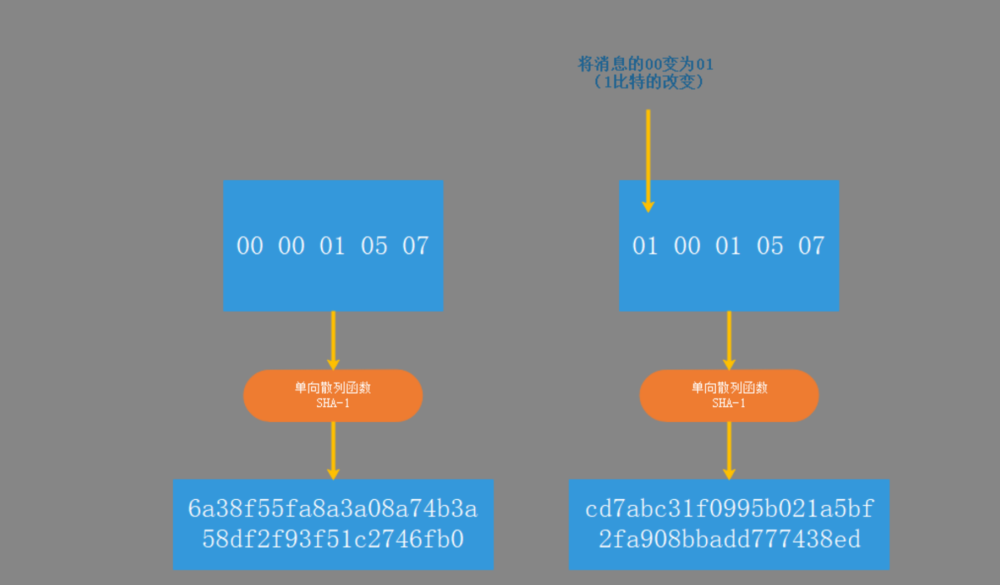
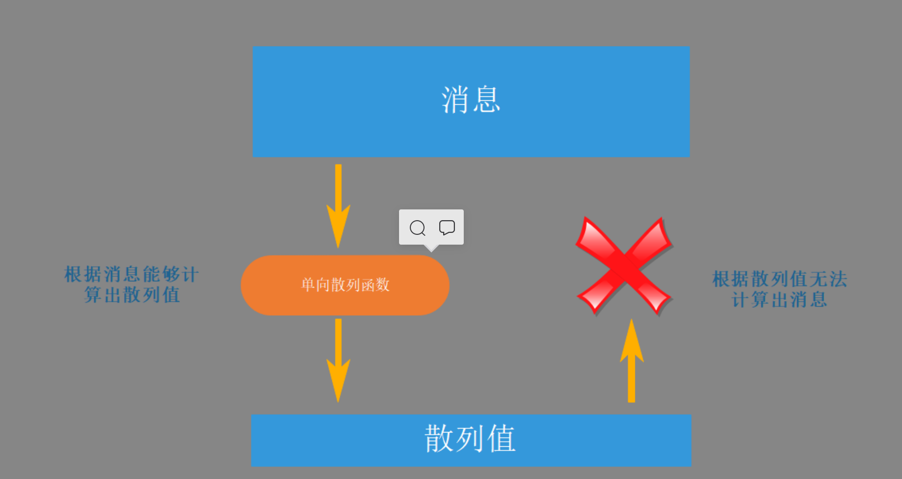

# 单向散列函数

**单项散列函数  —  获取信息的指纹**

## 单向散列

**单向散列函数（one-wayftnction)有一个输入和一个输出，其中输入称为信息（message），输出称为散列值（hashvalue）。单向散列函数可以根据信息的内容计算出散列值，而散列值就可以被用作检验信息的完整性。**

Hash函数主要用于完整性[校验和](https://baike.baidu.com/item/校验和)提高[数字签名](https://baike.baidu.com/item/数字签名)的有效性，已有很多方案。这些算法都是伪随机函数，任何杂凑值都是等可能的。输出并不以可辨别的方式依赖于输入;在任何输入串中单个比特的变化,将会导致输出比特串中大约一半的比特发生变化。

### 常见单向散列函数(Hash函数)

[MD5](https://baike.baidu.com/item/MD5)（Message Digest Algorithm 5）：是RSA[数据安全](https://baike.baidu.com/item/数据安全)公司开发的一种[单向散列算法](https://baike.baidu.com/item/单向散列算法)，MD5被广泛使用，可以用来把不同长度的[数据块](https://baike.baidu.com/item/数据块)进行暗码运算成一个128位的数值。

[SHA](https://baike.baidu.com/item/SHA)（Secure Hash Algorithm）这是一种较新的散列算法，可以对任意长度的数据运算生成一个160位的数值。

[MAC](https://baike.baidu.com/item/MAC/329741)（Message Authentication Code）：[消息认证](https://baike.baidu.com/item/消息认证)代码，是一种使用[密钥](https://baike.baidu.com/item/密钥)的单向函数，可以用它们在系统上或用户之间认证文件或消息。HMAC（用于消息认证的密钥散列法）就是这种函数的一个例子。

CRC（Cyclic Redundancy Check）：循环冗余校验码，[CRC校验](https://baike.baidu.com/item/CRC校验/3439037)由于实现简单，检错能力强，被广泛使用在各种[数据校验](https://baike.baidu.com/item/数据校验)应用中。占用系统资源少，用软硬件均能实现，是进行数据传输差错检测地一种很好的手段（CRC 并不是严格意义上的散列算法，但它的作用与散列算法大致相同，所以归于此类）。

> 散列值的长度和信息的长度无关，单向散列函数都会计算出**固定的散列值**。

**单向散列函数也成为信息摘要函数、哈希函数或杂凑函数。**

+ 输出单向散列函数的散列值也称之为**原像**
+ 单向散列函数输出的散列值也称之为**信息摘要或者指纹**
+ **完整性**也称之为一致性

**难以发生碰撞的性质称为抗碰撞性**。密码技术中所使用的单向散列函数，都要具备抗碰撞性。

### 单向散列函数的性质

**通过单向散列函数，即使是确认几百MB大小的文件完整性，也只要对比很短的散列值就可以了。**

+ 根据任意长度的信息计算出固定长度的散列值
+ 能够快速计算出散列值
+ 消息不通过散列值也不同
+ 具有单向性

**单向散列函数必须具备单向性，所以说其实本质上来说单向散列函数并不是输入非对称加密，单向性是指无法通过散列值反过来计算信息的本质，根据信息计算散列值很容易，无法反向。**

