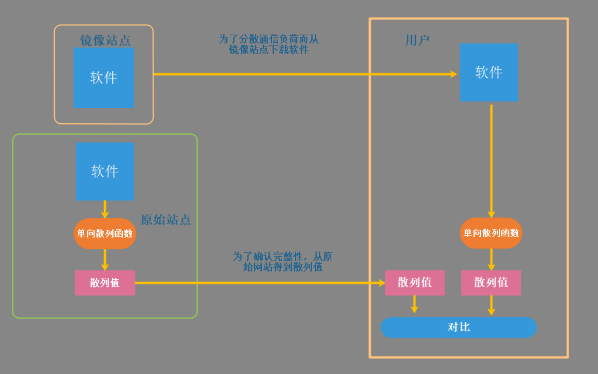

# 单向散列函数的实际应用

[toc]

## 哈希存储密码

1. 明文存储：无安全防护
2. 哈希存储：[Rinbow table attack 彩虹表攻击](https://cmd5.com/)
3. (盐+哈希)存储 彩虹表攻击 失效

## 检测软件是否被篡改

> 我们可以使用单向散列函数来确认自己下载的软件是否被篡改。
>
> 安全相关的软件都会通过单向散列函数计算出散列值并公布到官网上。

## 消息认证码

使用单向散列函数可以构造消息认证码

消息认证码是将"发送者和接收者之间的共享密钥"和"消息",进行混合计算后得到的散列值。使用消息认证码可以检测并防止通信过程中的错误，篡改以及伪装。

消息认证码在SSL/TLS中也有使用

## 数字签名

在进行数字签名时会使用单向散列函数。
数字签名是现实社会中的签名（sign)和盖章这样的行为在电脑世界的实现。数字签名的过程非常耗时，因此一般不会对整个消息内容直接施加数字签名，而是先通过单向散列函数计算出消息的散列值，然后在对这个散列值施加数字签名。

## 伪随机生成器

使用单向散列函数可以构造伪随机数生成器。

密码技术中所使用的随机数需要具备"事实上不可能根据过去的随机数列预测未来的随机数列"这样的性质。为了保证不可预测性，可以利用单向散列函数的单向性。

## 一次性口令

使用单向散列函数可以构造一次性口令(one-time password)

一次性口令经常被用于服务器对客户端的合法性认证。在这种方式中，通过使用单向散列函数可以保证口令在通信链路上传送一次(one-time)，因此即使窃听者窃取了口令，也无法使用

