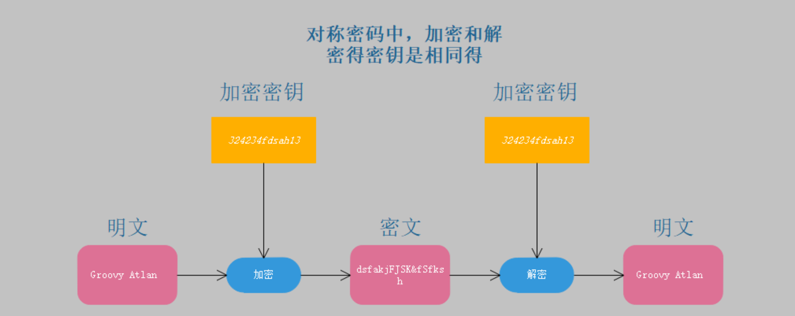

# 对称加密算法

**对称加密算法使用同一对密钥进行加密和解密。**

+ 传统密码加密
+ 私钥算法加密

**优势：加密速度快，密文都是紧凑的，安全**

**缺点：密钥分发、密钥存储和管理。缺乏对数字签名/不可否认的支持。**

## 著名的对称加密算法

+ 对称加密的密钥长度从40bit到168bit

#### 著名的加密算法

+ **DES  3DES**
+ **AES**
+ **RC系列（RC2、RC4、RC5）**
+ IDEA
+ CAST
+ Blowfilsh

