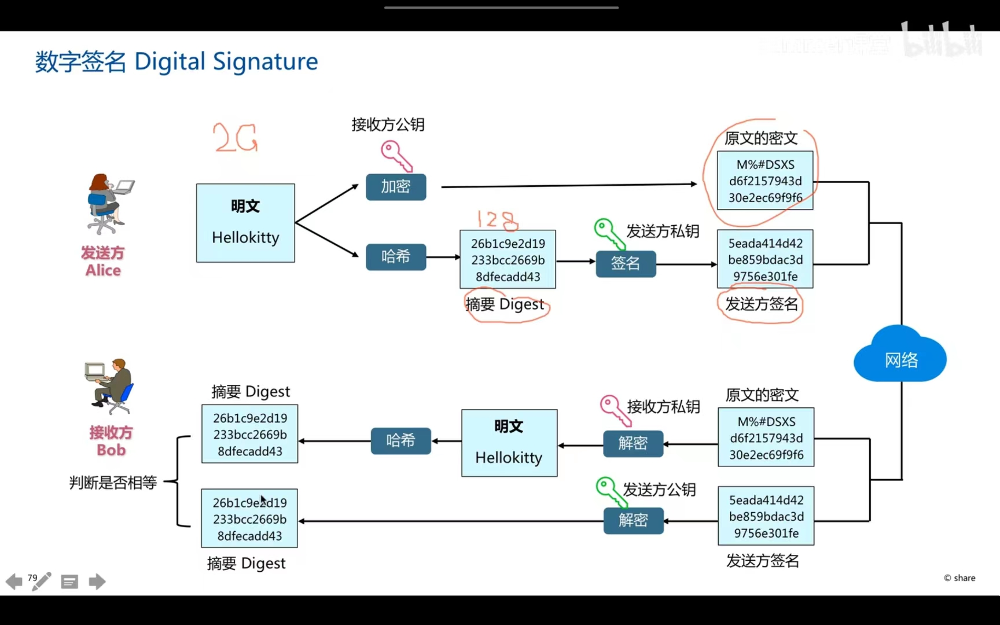

#  数字签名

**非对称加密算法RSA能提供给认证和抗抵赖（私钥签名）**

**注意的是：我们不是用明文信息直接进行签名，而是对明文去散列后的摘要digest进行签名，因为明文信息太大，如果直接签名的话太消耗时间周期。**

**发送方同时发送的是数字签名和原文的密文**

+ 密文通过接收方私钥或者公钥进行解密
+ **验证该信息是否由发送方发送用数字签名，需要用到发送方的公钥或者私钥进行解密**

**即数字签名保证该数据没有被篡改，而且发送的人也是正确的**