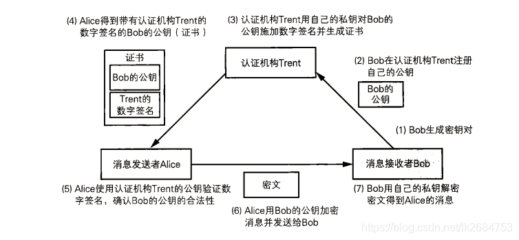

# 数字证书与CA

+ 数字签名（digital certificate):类似于身份证的作用
+ CA（certificate Authority）：电子商务认证授权机构

###  证书规范

> 前使用最广泛的标准为ITU和ISO联合制定的X.509的 v3版本规范 (RFC5280）, 其中定义了如下证书信息域：
>
> 版本号(Version Number）：规范的版本号，目前为版本3，值为0x2；
>
> 序列号（Serial Number）：由CA维护的为它所发的每个证书分配的一的列号，用来追踪和撤销证书。只要拥有签发者信息和序列号，就可以唯一标识一个证书，最大不能过20个字节；
>
> 签名算法（Signature Algorithm）：数字签名所采用的算法，如：
>
> sha256-with-RSA-Encryption
> ccdsa-with-SHA2S6；
> 颁发者（Issuer）：发证书单位的标识信息，如 ” C=CN，ST=Beijing, L=Beijing, O=org.example.com，CN=ca.org。example.com ”；
>
> 有效期(Validity): 证书的有效期很，包括起止时间。
>
> 主体(Subject) : 证书拥有者的标识信息（Distinguished Name），如：" C=CN，ST=Beijing, L=Beijing, CN=person.org.example.com”；
>
> 主体的公钥信息(SubJect Public Key Info）：所保护的公钥相关的信息：
>
> 公钥算法 (Public Key Algorithm）公钥采用的算法；
> 主体公钥（Subject Unique Identifier）：公钥的内容。
> 颁发者唯一号（Issuer Unique Identifier）：代表颁发者的唯一信息，仅2、3版本支持，可选；
>
> 主体唯一号（Subject Unique Identifier）：代表拥有证书实体的唯一信息，仅2，3版本支持，可选：
>
> 扩展（Extensions，可选）: 可选的一些扩展。中可能包括：
>
> Subject Key Identifier：实体的秘钥标识符，区分实体的多对秘钥；
> Basic Constraints：一指明是否属于CA;
> Authority Key Identifier：证书颁发者的公钥标识符；
> CRL Distribution Points: 撤销文件的颁发地址；
> Key Usage：证书的用途或功能信息。
> 此外，证书的颁发者还需要对证书内容利用自己的私钥添加签名， 以防止别人对证书的内容进行篡改。

### CA证书

证书是用来证明某某东西确实是某某东西的东西（是不是像绕口令？）。通俗地说，证书就好比上文里面的公章。通过公章，可以证明对应的证件的真实性。

理论上，人人都可以找个证书工具，自己做一个证书。那如何防止坏人自己制作证书出来骗人捏？请看后续 CA 的介绍。

CA是Certificate Authority的缩写，也叫“证书授权中心”。

它是负责管理和签发证书的第三方机构, 好比一个可信任的中介公司。一般来说，CA必须是所有行业和所有公众都信任的、认可的。因此它必须具有足够的权威性。就好比A、B两公司都必须信任C公司，才会找 C 公司作为公章的中介。

### 证书有啥用

**验证网站是否可信（针对HTTPS）**

> 通常，我们如果访问某些敏感的网页（比如用户登录的页面），其协议都会使用 HTTPS 而不是 HTTP。因为 HTTP 协议是明文的，一旦有坏人在偷窥你的网络通讯，他/她就可以看到网络通讯的内容（比如你的密码、银行帐号、等）；而 HTTPS 是加密的协议，可以保证你的传输过程中，坏蛋无法偷窥。
>
> 但是，千万不要以为，HTTPS 协议有了加密，就可高枕无忧了。俺再举一个例子来说明，光有加密是不够滴。假设有一个坏人，搞了一个假的网银的站点，然后诱骗你上这个站点。假设你又比较单纯，一不留神，就把你的帐号，口令都输入进去了。那这个坏蛋的阴谋就得逞鸟。
>
> 为了防止坏人这么干，HTTPS 协议除了有加密的机制，还有一套证书的机制。通过证书来确保，某个站点确实就是某个站点。
>
> 有了证书之后，当你的浏览器在访问某个 HTTPS 网站时，会验证该站点上的 CA 证书（类似于验证介绍信的公章）。如果浏览器发现该证书没有问题（证书被某个根证书信任、证书上绑定的域名和该网站的域名一致、证书没有过期），那么页面就直接打开；否则的话，浏览器会给出一个警告，告诉你该网站的证书存在某某问题，是否继续访问该站点？下面给出 IE 和 Firefox 的抓图：

