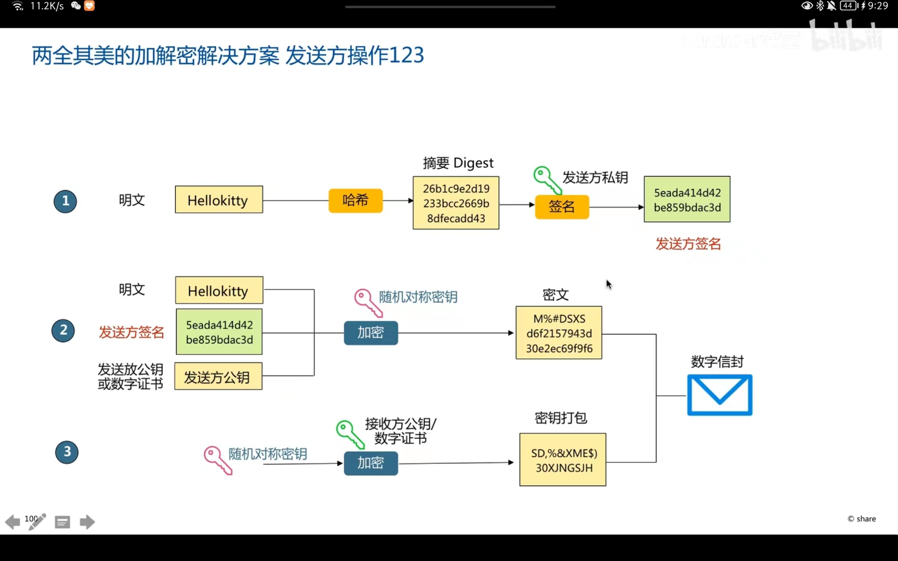
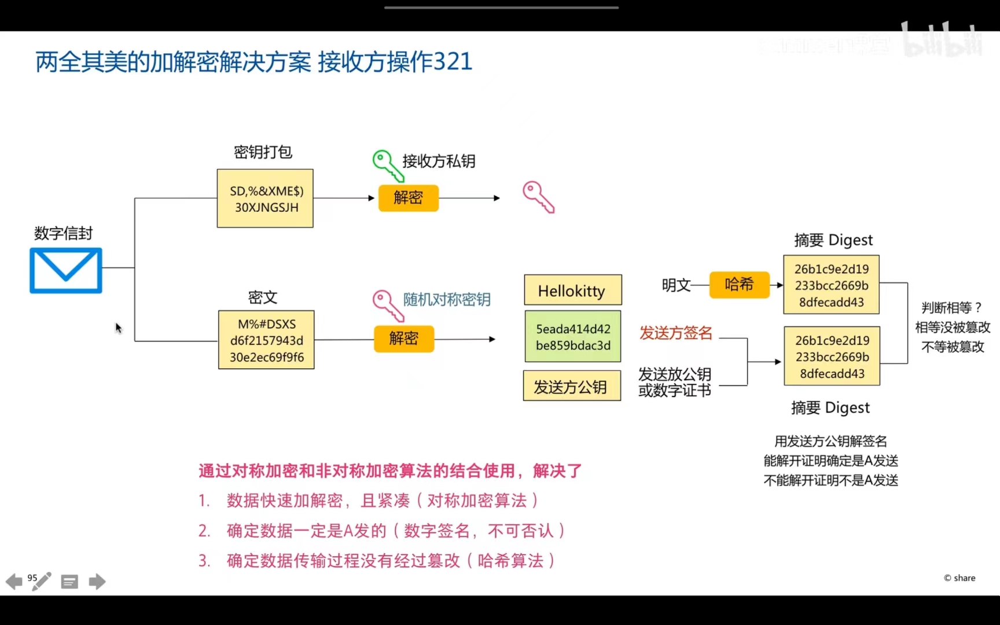

# 对称加密和非对称加密的完美融合

[toc]

+ [B站视频讲解](https://www.bilibili.com/video/BV1zY4y1J7Tc?spm_id_from=333.1007.top_right_bar_window_default_collection.content.click)

### 对称加密的问题

+ 密钥分发困难
+ 密钥存储和管理困难
+ 缺乏对数字签名的支持

### 非对称加密的问题

+ 加密速度慢，密文非常凑
+ 内容太多不适合用非对称加密

**由此可见，非对称加密的缺点和优点可以和对称加密完美融合**

### 采用策略

#### 发送方

**对称加密对大文件进行加密，非对称加密算法对密钥加密**

+ 第一步使用散列单向加密形成摘要，然后用自己的私钥进行非对称加密进行签名
+ 使用明文和签名以及数字证书（或者公钥）进行对称加密，密钥用的是随机对称密钥：速度更快，密文更紧凑
+ 第三步对密钥进行加秘密，使用的是接收方的公钥进行加密，这样的话必须要用对方的私钥进行解密
+ 最后形成的是数字信封

**这个设计的很巧妙，注意的是对称加密密钥发送后对方也是需要用自己的私钥进行解密，很符合非对称加密传输密钥，对称加密加密文档。**

#### 接收方

