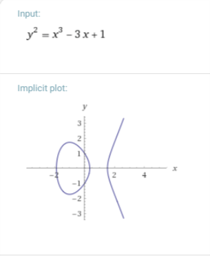
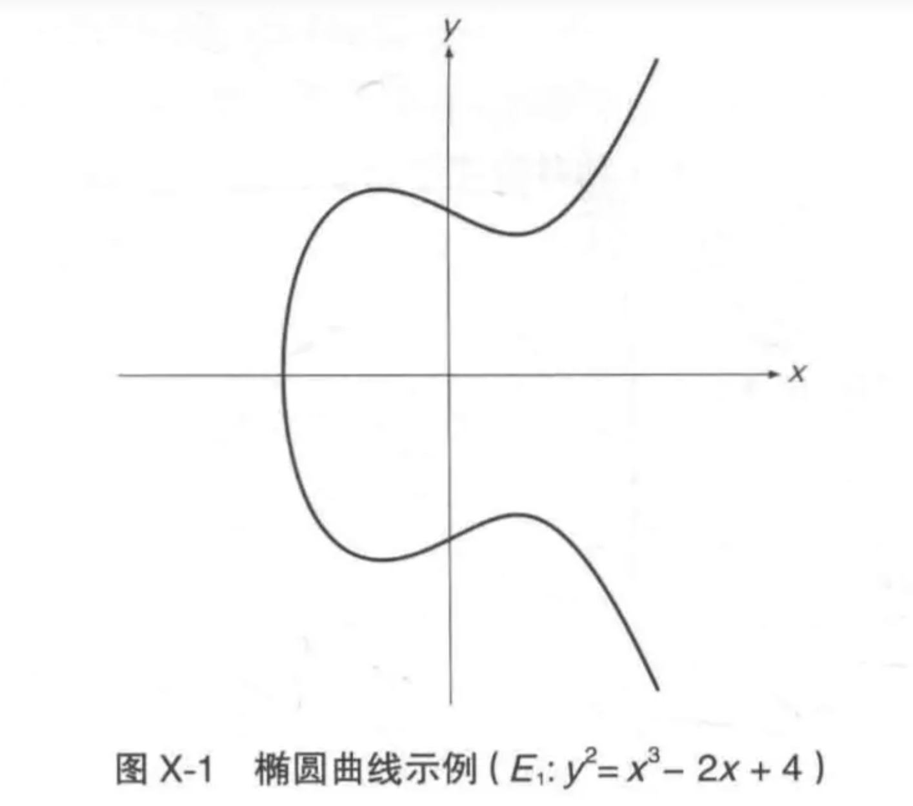
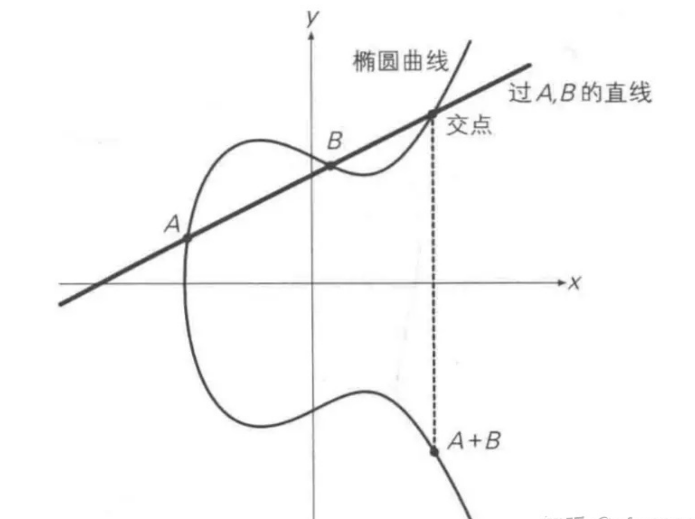
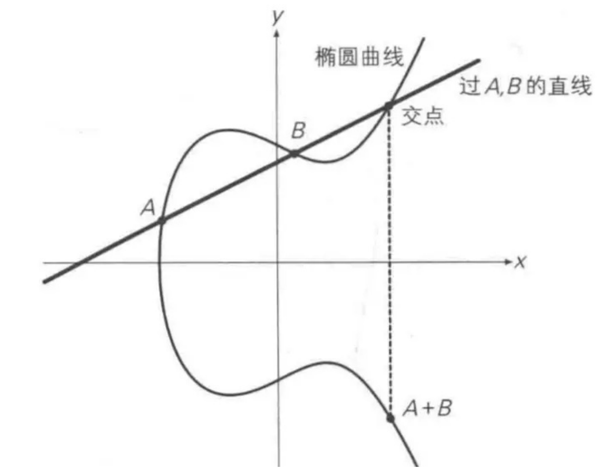
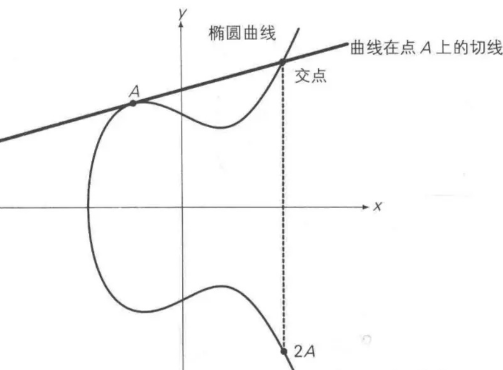
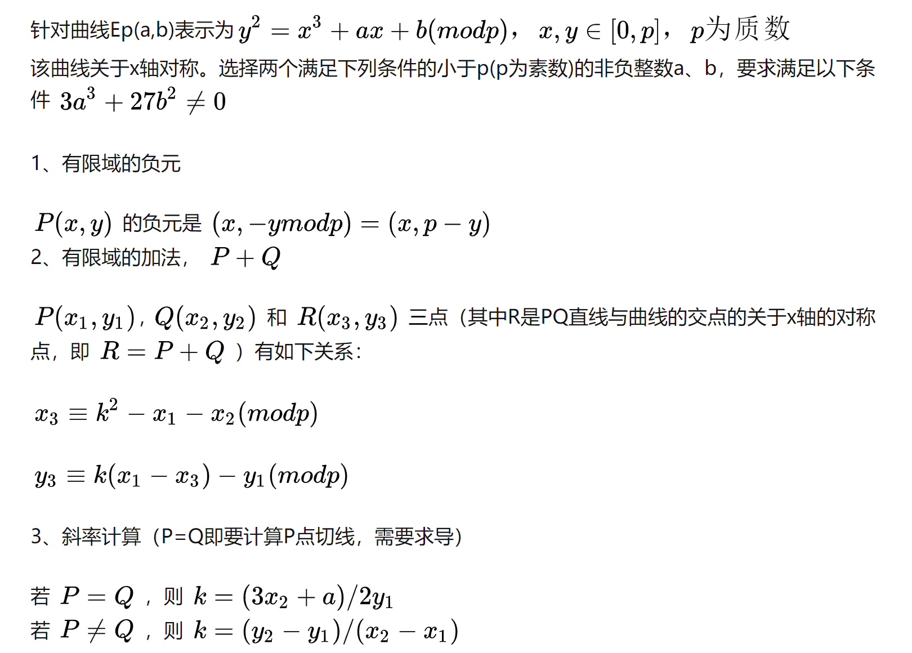

# 椭圆曲线加密

[toc]

# ECC

**椭圆曲线加密算法，简称ECC，是基于椭圆曲线数学理论实现的一种非对称加密算法。**相比RSA，ECC优势是可以使用更短的密钥，来实现与RSA相当或更高的安全，RSA加密算法也是一种非对称加密算法，在公开密钥加密和电子商业中RSA被广泛使用。据研究，160位ECC加密安全性相当于1024位RSA加密，210位ECC加密安全性相当于2048位RSA加密（有待考证）。

> 比特币Bitcoin使用了 secp256k1这条特殊的椭圆曲线：

$$
y^2 = x^3 +7
$$

> 在数字货币加密中，私钥是通过随机非对称加密算法求出来的2^256^,公钥是在私钥的基础上，通过算法**ECDSA（椭圆曲线数字签名算法）来实现的**
> $$
> y^2 = x^3 +ax +6
> \qquad \color{red}[-16(4a^3+27b^2 \not = 0)]
> $$

**根据系数a,b取值的不同，函数的图像大致为：**

<center class = "half">
    
    


---

**利用上面的曲线来加密叫做椭圆曲线密码学，简称ECC**


### 加密实现

**我们随机在椭圆曲线中选取一个点`(x,y)`，然后把我的私钥`k`分别和`(x,y)`相乘，得到`kx`和`ky`**

**我们将上面的`kx`和`ky`通过方法拼接在一起，得到的结果就是公钥。**

+ 对`kx`和`ky`进行拼接，我们使用到的乘法是新定义的乘法
  $$
  kA = A + A + A+\cdots+A (\cdots = K)
  $$

+ **`kA`是`k`个`A`相加，那我我们就需要先定义点与点的加法了（定义一个阿贝尔群）**

  > 最后求得的结果就是公钥，所以公钥就是特定的椭圆曲线上的坐标点。

+ 重复了K次，计算机能很快的给出结果嘛，可以的。

+ 最终得到的公钥只是一个点，至于点的来源可以有很多。


## 一、阿贝尔群

椭圆曲线也可以有运算，像实数的加减乘除一样，这就需要使用到加群。19世纪挪威的尼尔斯·阿贝尔抽象出了加群（又叫阿贝尔群或交换群）。数学中的群是一个集合，我们为它定义了一个“加法”，并用符号`+`表示。假定群用 表示，则`加法`必须遵循以下四个特性：

- 封闭性：如果a和b都是 的成员，那么a+b也是 的成员；
- 结合律：(a + b) + c = a + (b + c);
- 单位元：a+0=0+a=a，0就是单位元；
- 逆元：对于任意值a必定存在b，使得a+b=0。

如果再增加一个条件，交换律：a + b = b + a，则称这个群为阿贝尔群，根据这个定义整数集是个阿贝尔群。





## 二、椭圆曲线的加法

过曲线上的两点A、B画一条直线，找到直线与椭圆曲线的交点，交点关于x轴对称位置的点，定义为A+B，即为加法。如下图所示：A + B = C



##  三、椭圆曲线的二倍运算

上述方法无法解释A + A，即两点重合的情况，因此在这种情况下，将椭圆曲线在A点的切线，与椭圆曲线的交点，交点关于x轴对称位置的点，定义为A + A，即2A，即为二倍运算。



## 四、同余运算

同余就是有相同的余数，两个整数 a、 b，若它们除以正整数 m所得的余数相等，则称 a， b对于模m同余。
$$
a \equiv b (mod m) 
$$


## 五、有限域

椭圆曲线是连续的，并不适合用于加密；所以必须把椭圆曲线变成离散的点，要把椭圆曲线定义在有限域上。而椭圆曲线密码所使用的椭圆曲线是定义在有限域内，有限域最常见的例子是有限域GF(p)，指给定某质数p，由0,1,2...p-1共p个元素组成的整数集合中加法、二倍运算。

+ P越大越好，越安全。

例如GF(233)就是
$$
y = (x ^3 + 7) (mod223)
$$
**我们回想以前学的非对称加密**

**Alice:**
$$
k_a \, P_a \rightarrow \;k_a \, P_b = k_a\cdot(k_b\cdot G)
$$
**Bob:**
$$
k_b \, P_b  \rightarrow \;k_b \, P_a = k_b\cdot(k_a\cdot G)
$$
**去掉括号**
$$
k_a\cdot(k_b\cdot G) =k_b\cdot(k_a\cdot G)
$$


## 六、乘法逆元

在模7乘法中：

- 1的逆元为1 (1*1)%7=1
- 2的逆元为4 (2*4)%7=1
- 3的逆元为5 (3*5)%7=1
- 4的逆元为2 (4*2)%7=1
- 5的逆元为3 (5*3)%7=1
- 6的逆元为6 (6*6)%7=1


## 七、数学解释

并不是所有的椭圆曲线都适合加密，**y^3^ = x^3^+x+b**是一类可以用来加密的椭圆曲线，也是最为简单的一类。



该公式可以自己推导，为了方便理解，可以套用以上公式，解决以下例题。


## 八、椭圆曲线加解密算法原理

设私钥、公钥分别为d、Q，即Q = dG，其中G为基点，椭圆曲线上的已知G和dG，求d是非常困难的，也就是说已知公钥和基点，想要算出私钥是非常困难的。
**公钥加密：**选择随机数r，将消息M生成密文C，该密文是一个点对，C = {rG, M+rQ}，其中Q为公钥。
**私钥解密**：M + rQ - d(rG) = M + r(dG) - d(rG) = M，其中d、Q分别为私钥、公钥。


## 九、椭圆曲线签名算法原理

椭圆曲线签名算法(ECDSA)。设私钥、公钥分别为d、Q，即Q = dG，其中G为基点。

私钥签名：

- 选择随机数r，计算点rG(x, y)。
- 根据随机数r、消息M的哈希h、私钥d，计算s = (h + dx)/r。　　
- 将消息M、和签名{rG, s}发给接收方。

公钥验证签名：　　

- 接收方收到消息M、以及签名{rG=(x,y), s}。　　
- 根据消息求哈希h。　　
- 使用发送方公钥Q计算：hG/s + xQ/s，并与rG比较，如相等即验签成功。
  原理：hG/s + xQ/s = hG/s + x(dG)/s = (h+xd)G/s = r(h+xd)G / (h+dx) = rG


## 10、签名过程

假设要签名的消息是一个字符串：“Hello World!”。DSA签名的第一个步骤是对待签名的消息生成一个消息摘要，不同的签名算法使用不同的消息摘要算法，而ECDSA256使用SHA256生成256比特的摘要。

摘要生成结束后，应用签名算法对摘要进行签名：

- 产生一个随机数k
- 利用随机数k，计算出两个大数r和s。将r和s拼在一起就构成了对消息摘要的签名。
  这里需要注意的是，因为随机数k的存在，对于同一条消息，使用同一个算法，产生的签名是不一样的。从函数的角度来理解，签名函数对同样的输入会产生不同的输出。因为函数内部会将随机值混入签名的过程。


## 11、验证过程

关于验证过程，这里不讨论它的算法细节。从宏观上看，消息的接收方从签名中分离出r和s，然后利用公开的密钥信息和s计算出r。如果计算出的r和接收到的r值相同，则表示验证成功，否则，表示验证失败。


## 12、数值计算Demo实现

```python
# -*- coding:utf-8 -*-


def get_inverse(value, p):
    """
    求逆元
    :param value: 待求逆元的值
    :param p: 模数
    """
    for i in range(1, p):
        if (i * value) % p == 1:
            return i
    return -1


def get_gcd(value1, value2):
    """
    辗转相除法求最大公约数
    :param value1:
    :param value2:
    """
    if value2 == 0:
        return value1
    else:
        return get_gcd(value2, value1 % value2)


def get_PaddQ(x1, y1, x2, y2, a, p):
    """
    计算P+Q
    :param x1: P点横坐标
    :param y1: P点纵坐标
    :param x2: Q点横坐标
    :param y2: Q点纵坐标
    :param a: 曲线参数
    :param p: 曲线模数
    """
    flag = 1  # 定义符号位(+/-)

    # 如果P=Q，斜率k=(3x^2+a)/2y mod p
    if x1 == x2 and y1 == y2:
        member = 3 * (x1 ** 2) + a  # 分子
        denominator = 2 * y1  # 分母

    # 如果P≠Q， 斜率k=(y2-y1)/(x2-x1) mod p
    else:
        member = y2 - y1
        denominator = x2 - x1

        if member * denominator < 0:
            flag = 0  # 表示负数
            member = abs(member)
            denominator = abs(denominator)

    # 化简分子分母
    gcd = get_gcd(member, denominator)  # 最大公约数
    member = member // gcd
    denominator = denominator // gcd
    # 求分母的逆元
    inverse_deno = get_inverse(denominator, p)
    # 求斜率
    k = (member * inverse_deno)
    if flag == 0:
        k = -k
    k = k % p

    # 计算P+Q=(x3,y3)
    x3 = (k ** 2 - x1 - x2) % p
    y3 = (k * (x1 - x3) - y1) % p

    return x3, y3


def get_order(x0, y0, a, b, p):
    """
    计算椭圆曲线的阶
    """
    x1 = x0  # -P的横坐标
    y1 = (-1 * y0) % p  # -P的纵坐标
    temp_x = x0
    temp_y = y0
    n = 1
    while True:
        n += 1
        # 累加P,得到n*P=0∞
        xp, yp = get_PaddQ(temp_x, temp_y, x0, y0, a, p)
        # 如果(xp,yp)==-P，即(xp,yp)+P=0∞，此时n+1为阶数
        if xp == x1 and yp == y1:
            return n + 1
        temp_x = xp
        temp_y = yp


def get_dot(x0, a, b, p):
    """
    计算P和-P
    """
    y0 = -1
    for i in range(p):
        # 满足适合加密的椭圆曲线条件，Ep(a,b)，p为质数，x,y∈[0,p-1]
        if i ** 2 % p == (x0 ** 3 + a * x0 + b) % p:
            y0 = i
            break
    # 如果找不到合适的y0返回False
    if y0 == -1:
        return False
    # 计算-y
    x1 = x0
    y1 = (-1 * y0) % p
    return x0, y0, x1, y1


def get_graph(a, b, p):
    """
    画出椭圆曲线散点图
    """
    xy = []
    # 初始化二维数组
    for i in range(p):
        xy.append(['-' for i in range(p)])

    for i in range(p):
        value = get_dot(i, a, b, p)
        if value is not False:
            x0, y0, x1, y1 = value
            xy[x0][y0] = 1
            xy[x1][y1] = 1

    print('椭圆曲线散点图：')
    for i in range(p):
        temp = p - 1 - i
        if temp >= 10:
            print(temp, end='')
        else:
            print(temp, end='')

        # 输出具体坐标值
        for j in range(p):
            print(xy[j][temp], end='')
        print()

    print(' ', end='')
    for i in range(p):
        if i >= 10:
            print(i, end='')
        else:
            print(i, end='')

    print()


def get_nG(xG, yG, priv_key, a, p):
    """
    计算nG
    """
    temp_x = xG
    temp_y = yG
    while priv_key != 1:
        temp_x, temp_y = get_PaddQ(temp_x, temp_y, xG, yG, a, p)
        priv_key -= 1
    return temp_x, temp_y


def get_KEY():
    """
    生成公钥私钥
    """
    # 选择曲线方程
    while True:
        a = int(input('输入椭圆曲线参数a（a>0）的值：'))
        b = int(input('输入椭圆曲线参数b（b>0）的值：'))
        p = int(input('输入椭圆曲线参数p（p为素数）的值：'))

        # 满足曲线判别式
        if (4 * (a ** 3) + 27 * (b ** 2)) % p == 0:
            print('输入的参数有误，请重新输入！\n')
        else:
            break

    # 输出曲线散点图
    get_graph(a, b, p)

    # 选择基点G
    print('在上图坐标系中选择基点G的坐标')
    xG = int(input('横坐标xG：'))
    yG = int(input('纵坐标yG：'))

    # 获取曲线的阶
    n = get_order(xG, yG, a, b, p)

    # 生成私钥key，且key<n
    priv_key = int(input('输入私钥key(<%d)：' % n))
    # 生成公钥KEY
    xK, yK = get_nG(xG, yG, priv_key, a, p)
    return xK, yK, priv_key, a, b, p, n, xG, yG


def encrypt(xG, yG, xK, yK, priv_key, a, p, n):
    """
    加密
    """
    k = int(input('输入一个整数k(<%d)用于计算kG和kQ：' % n))
    kGx, kGy = get_nG(xG, yG, priv_key, a, p)  # kG
    kQx, kQy = get_nG(xK, yK, priv_key, a, p)  # kQ
    plain = input('输入需要加密的字符串：')
    plain = plain.strip()
    c = []
    print('密文为：', end='')
    for char in plain:
        intchar = ord(char)
        cipher = intchar * kQx
        c.append([kGx, kGy, cipher])
        print('(%d,%d),%d' % (kGx, kGy, cipher), end=' ')

    print()
    return c


def decrypt(c, priv_key, a, p):
    """
    解密
    """
    for charArr in c:
        kQx, kQy = get_nG(charArr[0], charArr[1], priv_key, a, p)
        print(chr(charArr[2] // kQx), end='')
    print()


if __name__ == '__main__':
    xK, yK, priv_key, a, b, p, n, xG, yG = get_KEY()
    c = encrypt(xG, yG, xK, yK, priv_key, a, p, n)
    decrypt(c, priv_key, a, p)
```