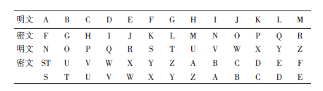
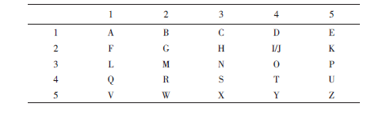

# 古典密码在古代各国的使用

古代中国:从古到今,军队历来是使用密码最频繁的地方,因为保护己方秘密并洞悉敌方秘密是克敌制胜的重要条件。正如中国古代军事著作《孙子兵法》中所说:知己知彼,百战不殆;不知彼而知己,一胜一负;不知彼不知己,每战必败。中国古代有着丰富的军事实践和发达的军事理论,其中不乏巧妙、规范和系统的保密通信和身份认证方法。

中国古代兵书《六韬》中的阴符和阴书:《六韬》又称《太公六韬》或《太公兵法》,据说是由西周的开国功臣太公望(又名吕尚或姜子牙,约公元前1128—公元前1015)所著。书中以周文王和周武王与太公问答的形式阐述军事理论,其中《龙韬•阴符》篇和《龙韬•阴书》篇,讲述了君主如何在战争中与在外的将领进行保密通信。

以下是关于“阴符”使用方法对话的译文。

武王问太公说:领兵深入敌国境内,军队突然遇到紧急情况,战事或有利,或失利。我要与各军远近相通,内外相应,保持密切的联系,以便及时应对战场上军队的需求,应该怎么办呢?

太公回答说:国君与主将之间用阴符秘密联络。阴符共有八种:一种长一尺,表示大获全胜,摧毁敌人;一种长九寸,表示攻破敌军,杀敌主将;一种长八寸,表示守城的敌人已投降,我军已占领该城;一种长七寸,表示敌军已败退,远传捷报;一种长六寸,表示我军将誓死坚守城邑;一种长五寸,表示请拨运军粮,增派援军;一种长四寸,表示军队战败,主将阵亡;一种长三寸,表示战事失利,全军伤亡惨重。如奉命传递阴符的使者延误传递,则处死;如阴符的秘密被泄露,则无论无意泄密者或有意传告者也处死。只有国君和主将知道这八种阴符的秘密。这就是不会泄露朝廷与军队之间相互联系内容的秘密通信语言。敌人再聪明也不能识破它。

以下是关于“阴书”使用方法对话的译文。

武王问太公说:领兵深入敌国境内,君主和将帅各率一军,要使两支军队配合作战,实施变化无穷的作战方法,谋取敌人意想不到的胜利。但需要联络的事情很多,使用阴符难以说明,而两军之间又距离遥远,言语不能通达,应该怎么办呢?

太公回答说:如果有军机大事需要联络,应该用书信而不用符。君主通过书信向主将指示,主将则通过书信向君主请示。书信都要拆分成三部分,并分派三人发出,每人拿一部分。只有这三部分合在一起才能读懂信的内容。这就是所谓的阴书(机密信),敌人再聪明,也看不懂这种书信。

中国宋代兵书《武经总要》是北宋仁宗时期官修的一部兵书,成书于1040年—1044年,作者是天章阁待制曾公亮和工部侍郎丁度。该书前集第15卷中有“符契”、“信牌”和“字验”三节,专门讲述军队中秘密通信和身份验证的方法。

“符契”是《六韬》中“阴符”方法的改进。其中的“符”是皇帝派人向军队调兵的凭证,共有5种符,各种符的组合表示调用兵力的多少,每符分左右两段,右段留京师,左段由各路军队的主将收掌。使者将带着皇帝的命令和由枢密院封印的相应的右符,前往军队调兵;主将听完使者宣读皇帝的命令后,须启封使者带来的右符,并与所藏的左符验合,才能接受命令;然后用本将军的印重封右符,交由使者带回京师。

“契”是主将派人向镇守各方的下属调兵的凭证,共有三种契,每契都是鱼形,可分为上下两段。上段留主将收掌,下段交各处下属收掌,使用方法类似于上述的符。

“信牌”是两军阵前交战时,派人传送紧急命令的信物和文件。北宋初期使用的信物是一分两半的铜钱,后来改用木牌,上面可以写字。

“字验”则是秘密传送军情的一套方法。先约定40种不同的军情,然后用一首含有40个不同字的诗,令其中每一个字对应一种军情。传送军情时,写一封普通的书信或文件,在其中的关键字旁加印记。军使在送信途中,不怕被敌方截获并破解信中内容。将军们收到信后,找出其中加印记的关键字,然后根据约定的40字诗来查出该字所告知的情况,还可以在这些字上再加印记,以表示对有关情况的处理,并令军使带回。

我们看到,宋代的“字验”方法与近代以来军队、外交官和间谍们常用的借助密码字典进行秘密通信和联络的原理相同。

古代中国的君王常以虎符作为调用军队的凭证。如在春秋战国时期,就有魏信陵君使如姬窃取魏王的虎符,并以此夺取大将晋鄙的兵权,然后率兵大破秦军,以解赵国之围的故事。虎符一般由铜、银等金属制成,背面刻有铭文,以示级别、身份、调用军队的对象和范围等;虎符分为两半,一半放在朝廷,另一半由在外的将帅保管。朝廷派来的使者,需携虎符验合,才可调兵遣将。

顺便解释“符”字:其本义是指古代朝廷下命令的凭证;部首的“竹”表明最早的“符”是用竹子做的;“符”通常做成两部分,使用时一分为二,验证时合二为一;只有同一符的两部分才能完美地合在一起;这就是常用词“符合”的来历。近代间谍史上,常有人把纸币钞票一撕为二,作为接头联络的工具,其原理同“符”。现代密码学中,运用公钥—私钥体系进行身份认证的方法也与“符”相通。

我国明末清初著名的军事理论家揭暄(1613—1695)所著的《兵经百言》用100个字条系统阐述了中国古代的军事理论。其中的“传”字诀则是古代军队通信方法的总结,其解释如下:

军队分开行动后,如相互之间不能通信,就要打败仗;如果能通信但不保密,则也要被敌人暗算。所以除了用锣鼓、旌旗、骑马送信、燃火、烽烟等联系外,两军相遇,还要对暗号(口令)。当军队分开有千里之远时,宜用机密信(素书)进行通信。机密信分为三种:改变字的通常书写或阅读方式(“不成字”,如传统密码学的文字替换或移位方法);隐写术(“无形文”,用含有某种化学物质的液体来书写,收信者用特殊方法使文字显现出来,如矾书);不是把书信写在常用的纸上(“非纸简”),而是写在特殊的、不引人注意的载体上(如服饰,甚至人体上等)。这些通信方式连送信的使者都不知道信中的内容,但收信人却可以接收到信息。

古埃及:公元前2000年人类文明刚刚形成,大约就在那个时候古埃及就拥有了密码。贵族克努姆霍特普二世的墓碑上记载了在阿梅连希第二法老王朝供职期间它所建立的功勋。上面的象形文字与我们已知的埃及象形文字有所不同,那是由一位擅长书写的人对普通象形文字经过处理之后刻录的,但是具体的方法尚未可知。民众们推测这可能是庄严和权威的象征。

古印度:印度公元前三百年写成的《经济论》旨在描述当时密探充斥全国时特务机关的官员用密写的方式给密探下达任务。

古希腊:大约在公元前700年,古希腊军队用一种叫做Scytale的圆木棍来进行保密通信。其使用方法是:把长带子状羊皮纸缠绕在圆木棍上,然后在上面写字;解下羊皮纸后,上面只有杂乱无章的字符,只有再次以同样的方式缠绕到同样粗细的棍子上,才能看出所写的内容。

这种Scytale圆木棍也许是人类最早使用的文字加密解密工具,据说主要是古希腊城邦中的斯巴达人(Sparta)在使用它,所以又被叫做“斯巴达棒”。

斯巴达棒的加密原理属于密码学中的“换位法”(Transition)加密,因为它通过改变文本中字母的阅读顺序来达到加密的目的。

# 二、古典密码中简单的密码体制

**1.Caesar密码**

凯撒(Caesar)密码是公元前一世纪在高卢战争时被使用的,它是将英文字母向前移动k位。从而生成字母替代的密表,如k=5,则密文字母与明文与如下对应关系:

k就是最早的文字密钥。

**2.Polybius密码**

公元前2世纪,一个叫Polybius的希腊人设计了一种将字母编码成符号对的方法,他使用了一个称为Polybius的校验表,这个表中包含许多后来在加密系统中非常常见的成分。Polybius校验表由一个5行5列的网格组成,网格中包含26个英文字母,其中I和J在同一格中。相应字母用数对表示。在古代,这种棋盘密码被广泛使用。Polybius校验表如表2所示。

**3.多表代替密码**

1466年末1467年初,利昂•巴蒂斯塔•艾伯蒂第一个提出多表代替密码的概念,后来多表代替又被许多人逐步发展成当今大多数密码体制所属的一种密码类型;修道院院长约翰内斯•特里特米乌斯在1508年初从事写作一本专讲密码学的书,使多表代替又向前跨出了一大步,书名为《多种写法》,此书在他死后一年半才得以出版,《多种写法》是密码学第一本印刷书籍;在此之后,乔瓦尼•巴蒂斯塔•波他将艾伯蒂乱序密表与特里特米乌斯和贝拉索的见解融合在一起,使之成为现代多表代替的概念,他还首先阐明了密码分析技术的第二个主要方式——可能字猜译法。

**4.“不可破译”的维吉尼亚密码**

法国外交官维吉尼亚BlaisedeVigenere(1523-1596)在1585年写成了《论密码》一文,在该文中他集中了当时密码学的很多精华(密码分析除外),对贝拉索密码,他采用自身密钥体制,即以一个共同约定的字母为起始密钥,以之对第一个密文脱密,得到第一个明文,以第一个明文为密钥对第二个密文脱密,以此类推,如此不会重复使用密钥,然而他的自身密钥体制被后世遗忘,而他着力改进的原来的贝拉索密码却被人当作他的发明,于是贝拉索密码被称为维吉尼亚密码。