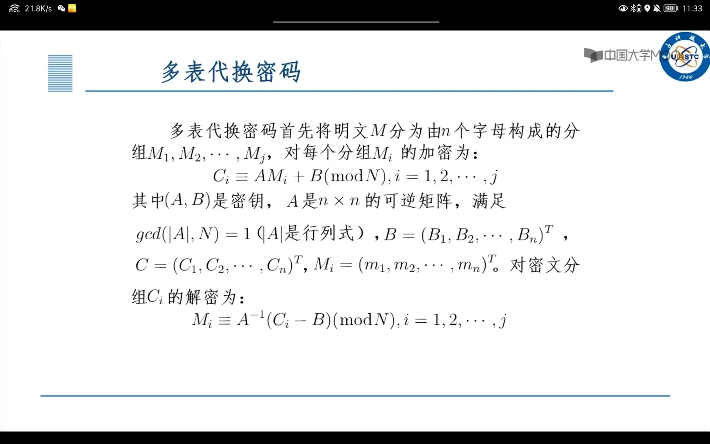
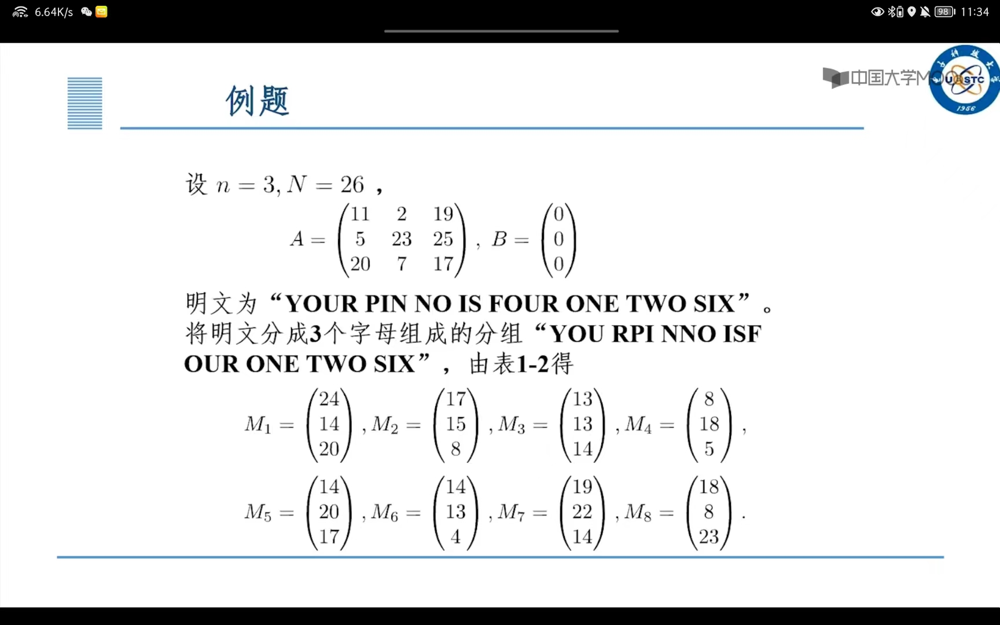
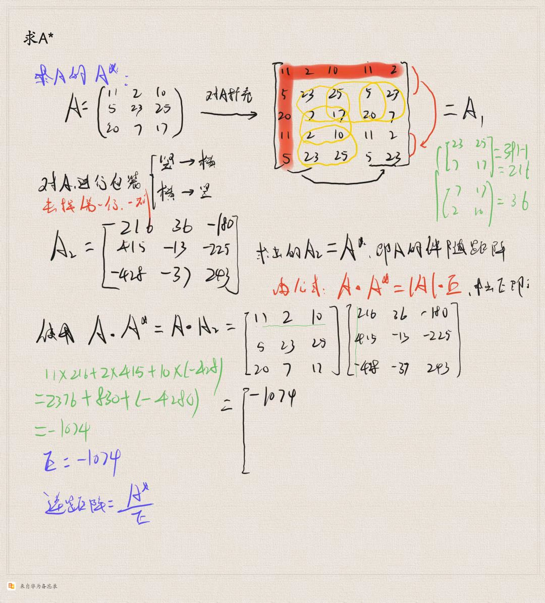

# 古典密码算法

[toc]

## 置换算法

**置换permutation顾名思义**

+ 对明文字符组进行位置移动的密码
+ 明文的字母保持相同，但是顺序被打乱了


## 代替密码

**代替substitution密码构造一个或者多个名文字母表，然后用密文字表中的字母或者字母组来代替明文子目录或者字母组。字母的相对位置不变，但是本身的值改变了。**

---

### 单表代替密码算法

+ 加法密码
+ 乘法密码
+ 仿射密码


#### 加法密码

$$
y = x + k(mod 26)
$$

明文：x

密文：y

密钥：k

解密：`x=y -k(mod26)`

> casear密码就是一种加法密码（k=3)，将字母表循环移动了3位，但是**相对位置不变**。


#### 乘法密码

$$
y = kx(mod26)
$$

**解密函数：** x = k^-1^ y(mod26)

**条件：（k,26) = 1**

> 关键在于计算k^-1^


#### 仿射密码

+ 加密函数
  $$
  y = ax + b(mod 26)
  $$

+ 密钥：a,b

+ 解密函数
  $$
  \frac{1}{a}(y-b)(mod 26)
  $$

+ 条件：(a,26) = 1

> 仿射密码是乘法密码和加法密码的结合。


---

### 多表代替密码算法

**多表代换密码首先将明文M分为由n个字母构成的分组M~1~,M~2~…..,M~j~**



**对于每一个分组的M~j~的加密：**



设 n = 3, N = 26,
$$
A = \left|\begin{matrix}
    11 & 2 & 19 \\
    5 & 23 & 25 \\
    20 & 7 & 17
   \end{matrix} \right|
   , B= \left|\begin{matrix}
    0 \\
    0 \\
    0
   \end{matrix} \right|
$$

1. 求A的可逆矩阵，使用的方法为：初等行变换

   


#### 一、多表代换

多表代换密码跟单表代换密码的区别，主要是，多表代换的代换表有多个。对于加密，交替使用不同的代换表。注意，加密和解密要同步，也就是，加密和解密所用的代换表顺序要一致，不然，解密会出错。
多表代换跟单表代换相比，其主要优点是，多表代换增大了密钥空间，打乱了整体上的统计特性。
举一个简单的例子：
假设明文字符集为{1，2，3，4}；
代换表1为{1：2，2：4，3：3，4：1}；
代换表2为{1：4，2：1，3：2，4：3}。
代换表1和代换表2交替使用。
现在加密123112。

| 1    | 2    | 3    | 1    | 1    | 2    |      |
| ---- | ---- | ---- | ---- | ---- | ---- | ---- |
| 表1  | 2    | –    | 3    | –    | 2    | –    |
| 表2  | –    | 1    | –    | 4    | –    | 1    |

密文为213421。
同一明文字符最多出现了3次，而密文中则为2次。其统计特性发生了变化。
多表代换的密钥不仅仅是代换表，还有代换表的使用顺序和代换表的个数（也叫做周期）。
如果上述加密先使用代换表2，则结果为：

| 1    | 2    | 3    | 1    | 1    | 2    |      |
| ---- | ---- | ---- | ---- | ---- | ---- | ---- |
| 表1  | –    | 4    | –    | 2    | –    | 4    |
| 表2  | 4    | –    | 2    | –    | 4    | –    |

这样，明文字符出现了4个，而密文中只有两种字符。

#### 二、维吉尼亚密码

维吉尼亚密码是最简单的多表代换密码，由多个凯撒移位密码组成。其明文字符集为a~z，26个英文字母。将字母按顺序循环移位k个，形成一个代换表。
下面是一个简单的实现：

```
include<iostream>

include<vector>

using namespace std;
//encrypt
string encrypt(string message,vector<int> &key){
	for(int i=0;i<message.size();i++){
		message[i]=(message[i]-'a'+key[i%key.size()])%26+'a';
	}
	return message;
}
//decipher
string decipher(string cipher,vector<int> &key){
	vector<int> k1=key;
	for(int i=0;i<key.size();i++){
		k1[i]=26-key[i];
	}
	return encrypt(cipher,k1);
}
int main(){
	vector<int> key={3,7,2};
	string message,cipher;
	cout<<"Please enter the message:";
	cin>>message;
	cipher=encrypt(message,key);
	cout<<"The ciphertext is:"<<cipher<<endl;
	cout<<"After decipher:"<<decipher(cipher,key)<<endl;
}
```

测试样例：

```
Please enter the message:iloveyou
The ciphertext is:lsqylarb
After decipher:iloveyou
```


