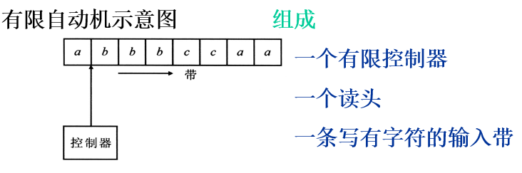
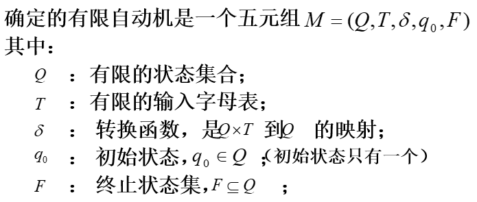
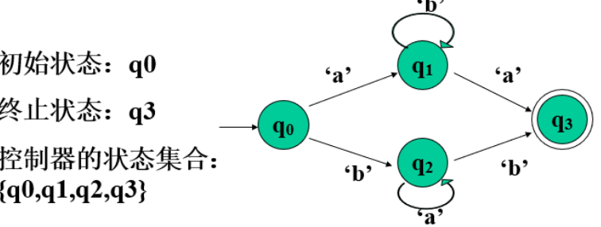
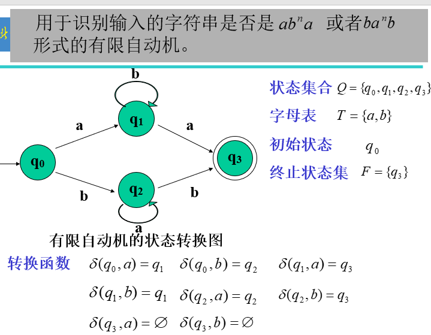

# 有限状态自动机

[toc]

## 有限状态自动机的模型

**有限状态自动机是一个具有离散输入和输出的一种数学模型**

> 什么是有限状态自动机

- 是一种具有离散输入 / 输出系统的数学模型，简称 有限自动机。这一系统具有任意有限数量的内部 “状态”。

- 状态: 一个标识，能区分自动机在不同时刻的状况。有限状态系统具有任意有限数目的内部 “状态”

- 自动机接受一定的输入，执行一定的动作，产生一定的结果。

- 自动机的本质: 根据状态、输入和规则决定下一个状态

  - `状态 +输入(激励)+规则 -> 状态迁移`
  - 可能的状态、运行的规则都是事先确定的。一旦开始运行，就按照实现确定的规则工作，因此叫 "自动机"。使用状态迁移描述整个工作过程

- 有限自动机示意图:

  

  

  

  工作原理: 读头在输入带上从左向右移动，每当读头从带上读到一个字符时，便引起控制器状态的改变，同时读头右移一个符号的位置。

  - 控制器:

    - 控制器包括有限个状态，状态与状态之间存在着某种转换关系。每当在某一状态下读入一个字符时，便使状态发生改变（称为状态转换）。

    - 状态转换包括以下几种情况:

      - 转换到自身–保持当前状态不变
      - 转换的后继状态只有一个
      - 转换的后继状态有若干个

    - 如果一个有限自动机每次转换的后继状态都是唯一的，称为**确定的有限自动机**`DFA`

      反之，称为**不确定的有限自动机**`NFA`

    - 通常把有限自动机开始工作的状态称为 “初始状态”，把结束工作的状态称为“终止状态” 或“接受状态”.

  - 确定的有限自动机的形式化定义：

    

    

    

    状态转换图:

    

    

    

    

    

    

