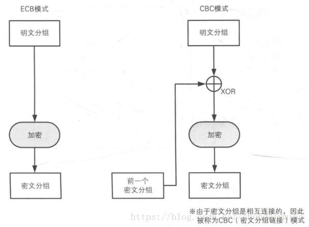

# 分组密码

[toc]

分组密码(block cipher)的数学模型是将明文消息编码表示后的数字（简称明文数字）序列，划分成长度为n的组（可看成长度为n的矢量），每组分别在密钥的控制下变换成等长的输出数字（简称密文数字）序列。

分组加密包含两个成对的算法：加密算法*E*和解密算法*D*，两者互为[反函数](https://zh.wikipedia.org/wiki/反函數)。每个算法有两个输入：长度为*n* [位](https://zh.wikipedia.org/wiki/位元)的组，和长度为*k*位的密钥；两组输入均生成*n*位输出。将两个算法看作函数，*K*表示长度为*k*的密钥（密钥长度），*P*表示长度为*n*的分组，*P*也被表示为[明文](https://zh.wikipedia.org/wiki/明文)，*C*表示[密文](https://zh.wikipedia.org/wiki/密文)，则满足：

对于任意密钥*K*，*EK(P)*是输入的组的一个[置换函数](https://zh.wikipedia.org/wiki/双射)，且可逆地落在 {0,1}*n* 区间。*E*的反函数（解密算法）定义为：

### ECB模式

 ECB（电子密本方式）其实非常简单，就是将数据按照8个字节一段进行DES加密或解密得到一段段的8个字节的密文或者明文，最后一段不足8个字节（一般补0或者F），按照需求补足8个字节进行计算（并行计算），之后按照顺序将计算所得的数据连在一起即可，各段数据之间互不影响。

**优点：**

- 简单；
- 有利于并行计算；
- 误差不会被传递；

**缺点：**

- 不能隐藏明文的模式；

- 可能对明文进行主动攻击；

### CBC模式：

> CBC模式是分组密码中使用频率最多的一种模式

**优点：**

不容易主动攻击，安全性好于ECB，是SSL、IPSec的标准；

**缺点：**

不利于并行计算；
误差传递；
需要初始化向量IV；
 CBC（密文分组链接方式）有点麻烦，它的实现机制使加密的各段数据之间有了联系。其实现的机理如下：

**加密步骤如下：**

首先将数据按照8个字节一组进行分组得到D1D2…Dn（若数据不是8的整数倍，用指定的PADDING数据补位）
第一组数据D1与初始化向量I异或后的结果进行DES加密得到第一组密文C1（初始化向量I为全零）
第二组数据D2与第一组的加密结果C1异或以后的结果进行DES加密，得到第二组密文C2
之后的数据以此类推，得到Cn
按顺序连为C1C2C3…Cn即为加密结果。

### 区别

