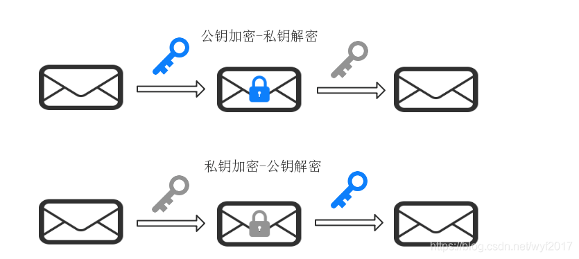
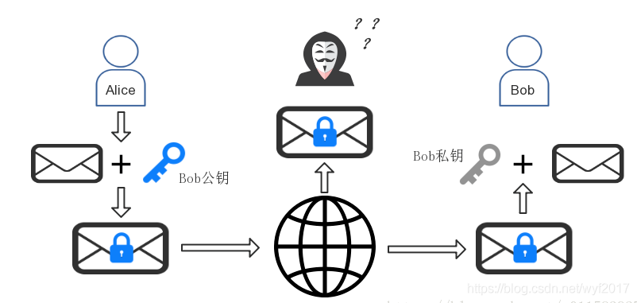

# 非对称加密

[toc]

## 非对称加密原理

> 在区块链中，使用较多的是非对称加密技术。
>
> 对称加密中存在密钥分发困难的问题，但是对于非对称加密来说，不存在密钥分发困难问题。

**非对称加密密钥由公钥和私钥组成，称之为==密钥对==**

+ 私钥：需要保护好，不能泄露
+ 公钥：可以公开的
+ **公钥是由私钥进行生成的，私钥可以推导出公钥，但是公钥无法推导出私钥**

### 加解密过程

- **如果使用公钥加密，必须使用私钥解密**
- **如果使用私钥加密，必须使用私钥解密**

在p2p网络中，使用非对称加密技术能很好地解决信息安全。

### 非对称加密的缺点

> 在非对称加密中可以直接将密钥分发给对方，因为密钥是成对出现的

+ 非对称加密加密效率低
+ 非对称加密密钥分发简单
+ 非对称加密安全级别比非对称加密安全级别要高

> 对于多个用户，让重要的那个数据拿私钥，其他人拿公钥

### 密钥分发过程

如果 Bob 想利用非对称加密算法私密的接收他人向他发送的信息，步骤是这样的。

1. 首先 Bob 需要使用具体约定的算法（例如 RSA）生成密钥和公钥，密钥自己保留，公钥对外公布。

2. Alice 拿到 Bob 的公钥后，便可以对想要发送的消息  “Alice 已向 Bob 转账 1BTC，请查收。” 进行加密

3. 然后 Alice 将密文（例如是 “FH39ggJ+shi3djifg35”）发送给 Bob。

4. Bob 收到消息后，用自己的私钥进行解密，还原出消息原文 “Alice 已向 Bob 转账 1BTC，请查收。”

用图来表示便是下面的过程：

由于使用 Bob 公钥加密的消息只能用 Bob 的私钥解密（Bob 的公钥也是不行的），而私钥只有 Bob 拥有，因此**即使消息被第三方劫持，他也无法还原出消息明文。**

> 我们提供一个假设，在Bob给Alice发送的信息过程中，Alice修改信息后重新发送给Bob,存在黑客拦截信息，拦截可以是在Bob给Alice发送的信息过程中也可以是Alice修改信息后重新发送给Bob。
>
> Bob给Alice发送的信息过程中： 此时黑客有公钥，可以看到信息，也可以修改信息，但是修改后只能Bob用私钥可以看到。
>
> Alice修改信息后重新发送给Bob中：此时黑客有公钥，没办法拦截到Alice的公钥加密出的信息。

**由上面的问题，存在一个Bob给Alice发送的信息过程中，如果黑客拦截后而且Alice没有看到信息，此时如果黑客修改后发送给Bob怎么办？**

**数字签名，证书**

****

