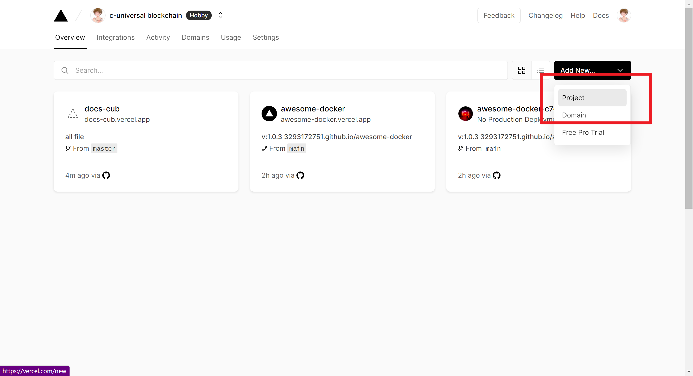
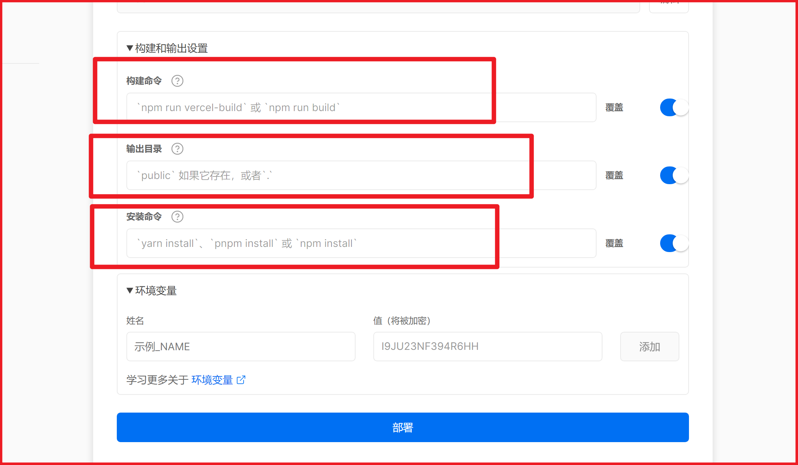
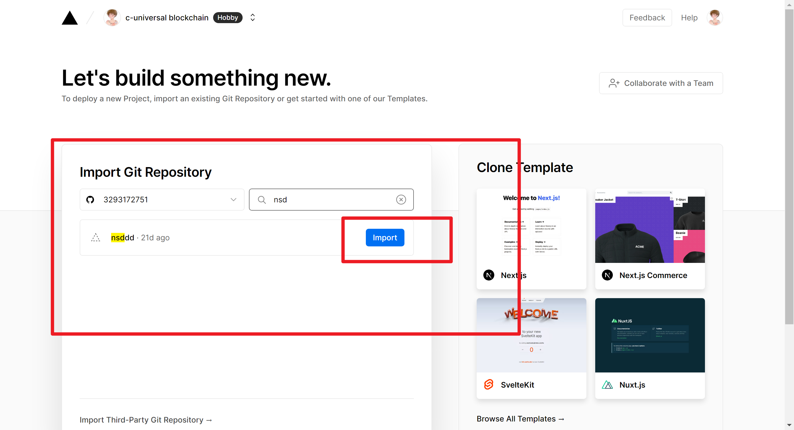
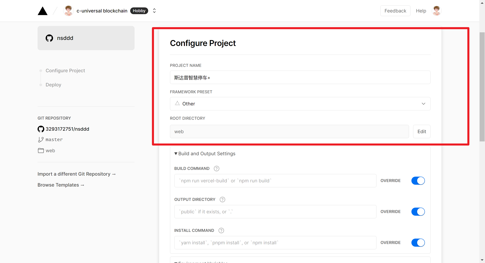
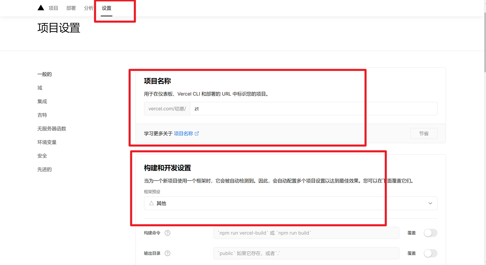
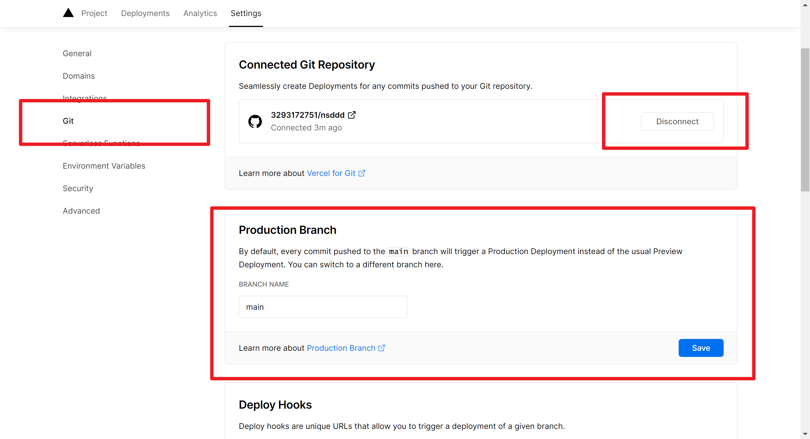
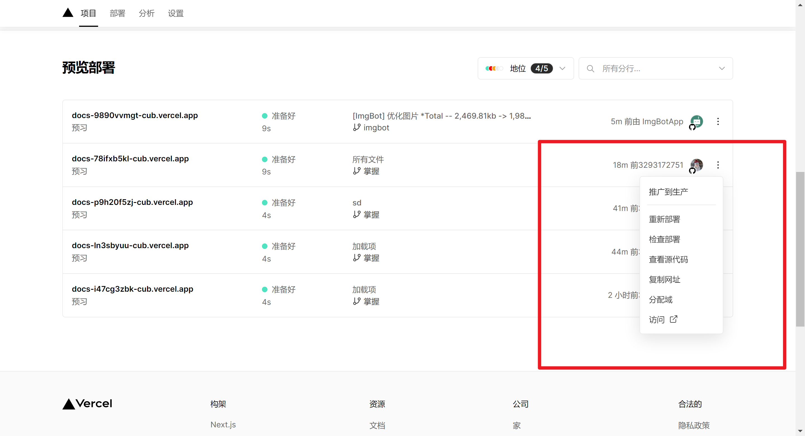
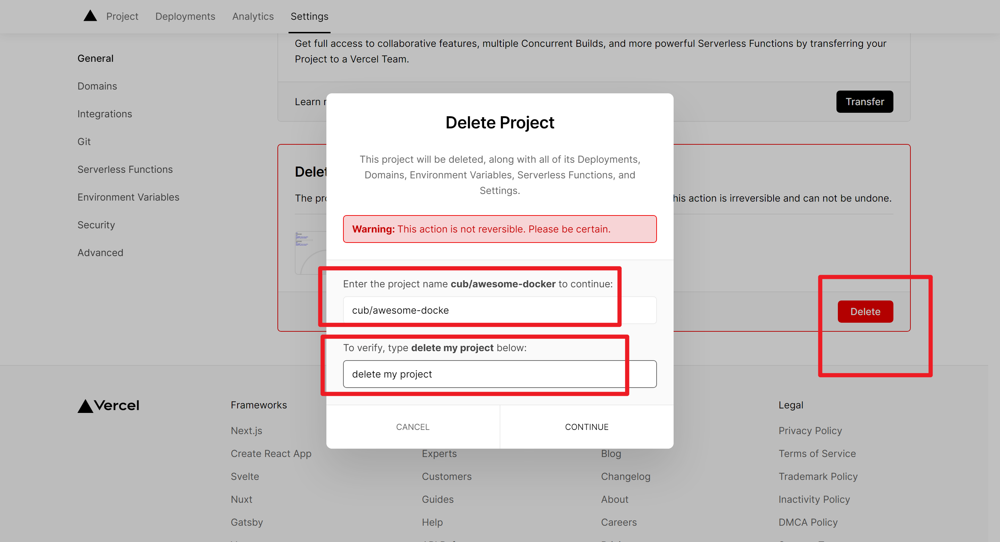
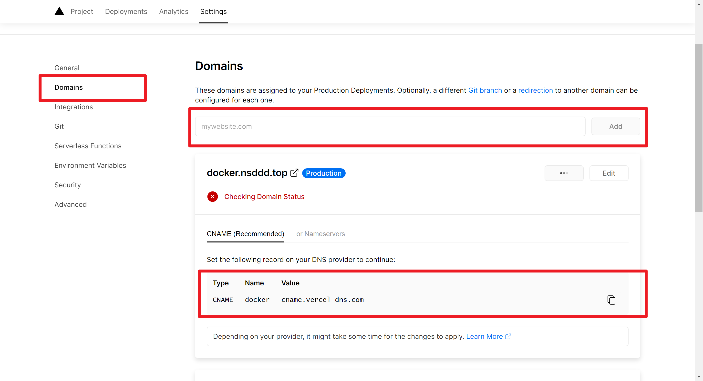
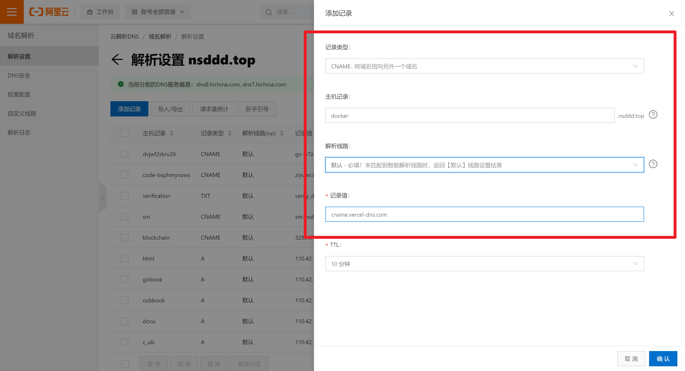

+ [author(Github)](https://github.com)

# 第28节 Vercel替代Pages服务

+ [回到目录](../README.md)
+ [回到项目首页](../../README.md)
+ [上一节](27.md)
> ❤️💕💕CS自学指南,大学教育无论是深度还是广度都没有办法支撑我们的职业素养,这个板块算是自己在CS学习中额外补充和记录的。个人博客:[http://nsddd.top](http://nsddd.top/)
---
[TOC]

## 为什么选择vercel

⚠️ GitHub pages服务不够完善，网络很卡。gitee pages服务虽然网速很快，但是需要实名认证。我认证了五六次还是没有通过，上面限制手持图片大小不超过`200k`，而且还必须人像清晰……离谱

 Gitee Pages 对仓库内容非常敏感，每次部署前都会对仓库内容进行检查，部署博客的话会经常遇到部署失败的情况，而且内容校验规则也会发生变化

⬇️这个时候就发现了一个符合我心中预期的托管服务：`vurcel`

## vurcel

**简介**：一个开箱即用的网站托管服务，全球都拥有 CDN 节点，支持自定义域名和自动部署，前身叫 ZEIT。

**优点**：国内访问速度比 Github Pages 和 Cloudflare Pages 要快，支持自定义域名和自动部署。

**缺点**：构建次数和构建时长有限制，每月带宽限制 100G。

**个人观点**：博客托管的最终选择，国内访问速度是除了 Gitee Pages 外目前使用过最快的，[个人博客](http://www.nsddd.com/)现已托管到 Vercel 上。

👉 [前往官网](https://vercel.com/)

## Cloudflare Pages

> 如果你不考虑网速问题，那么你可以放弃`vurcel`考虑`Cloudflare Pages`，这是`Cloudflare`推出的全新网页托管平台。

**简介**：Cloudflare 推出的全新网页托管服务。

**优点**：不限站点数、请求数和带宽，全球都拥有 CDN 节点，支持自定义域名和自动部署。

**缺点**：国内访问速度和稳定性一般，每月构建次数、文件数量和大小都有限制。

**个人观点**：放弃 Gitee Pages 和 GitHub Pages 后的一个选择，稳定性不好，经常超时，不过有时候挺快的。

👉 [前往官网](https://pages.cloudflare.com/)

##  vercel使用

### 点击创建项目，导入github或者其它平台的git仓库

### 选择你自己将要做静

态网站的仓库

### 设置项目的地址还有名称

📜 对上面的解释：

> 注意：项目名称最多只能包含 100 个字母数字小写字符和连字符。`zt`

### 根据条件配置~

### 部署并访问

+ [x] [测试地址https://zt-gold.vercel.app/](https://zt-gold.vercel.app/)

## 后期的修改分支名等基本信息

 ⚠️创建的时候是默认指定`main`主分支名称的，如果需要修改则进容器内部设置修改

### git细节

**你可以修改分支名称、可以决定是否更新这个分支**

> 注意：每一次你推送到GitHub上面，`vercel`会自动获取上游的信息，如果你不想再收到信息，你可以点击下面的`disconnect`断开。

### 选择是否更新上游

怎么同步更新，这个很简单，你只需要点击你自己的项目，获取到的上游信息你可以选择推广到生产，注意你的每一次`commit -m`信息都相当于`tag`，你需要识别自己的`tag`。

### 删除这个仓库

如果这个仓库我们没用了，最好删除掉，不浪费资源（免费的资源有限）

## 自定义域名

点击你刚弄好的镜像仓库，setting -> domains

阿里云添加对应记录

## 样例

+ [x] [Go - awesome](https://go.nsddd.top)
+ [x] [rust - awesome](rust.nsddd.top)
+ [x] [docker - awesome](https://nsddd.top) 
+ [x] [智慧停车](zt.nsddd.top) 

## END 链接

+ [回到目录](../README.md)
+ [上一节](27.md)
+ [下一节](29.md)
---
+ [参与贡献❤️💕💕](https://github.com/3293172751/Block_Chain/blob/master/Git/git-contributor.md)