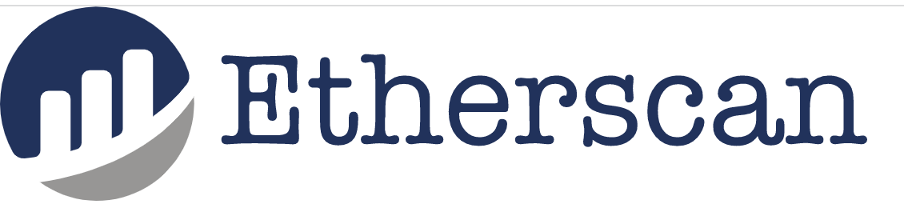
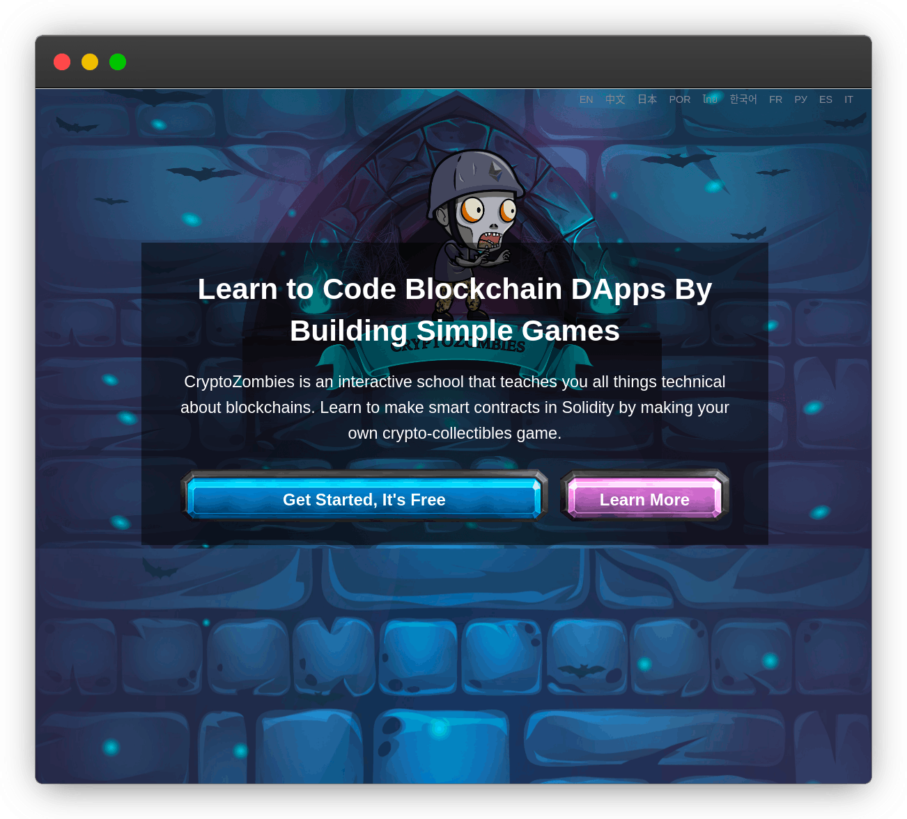
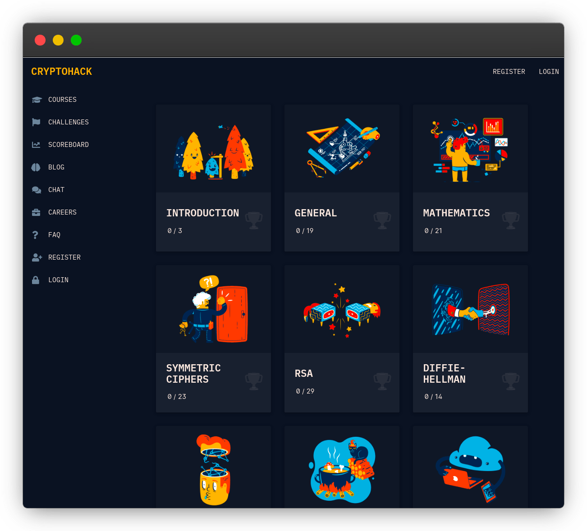
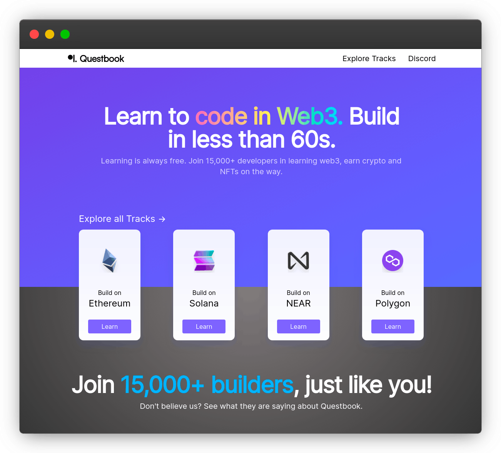
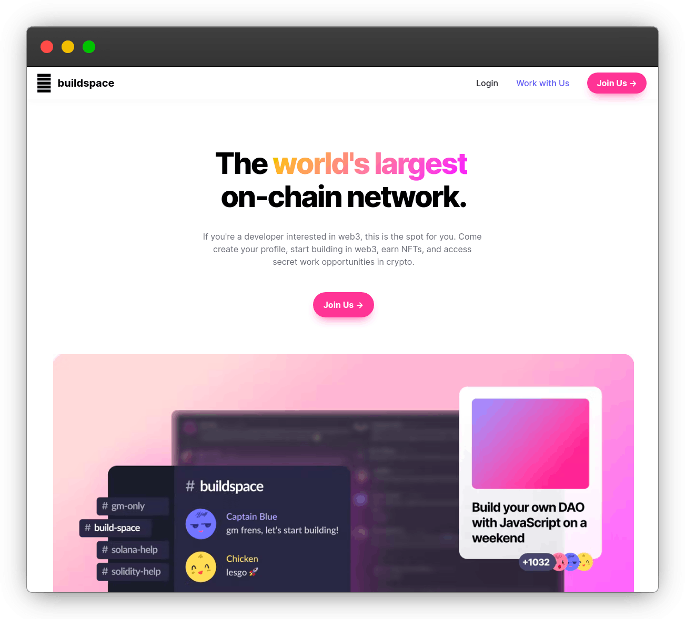
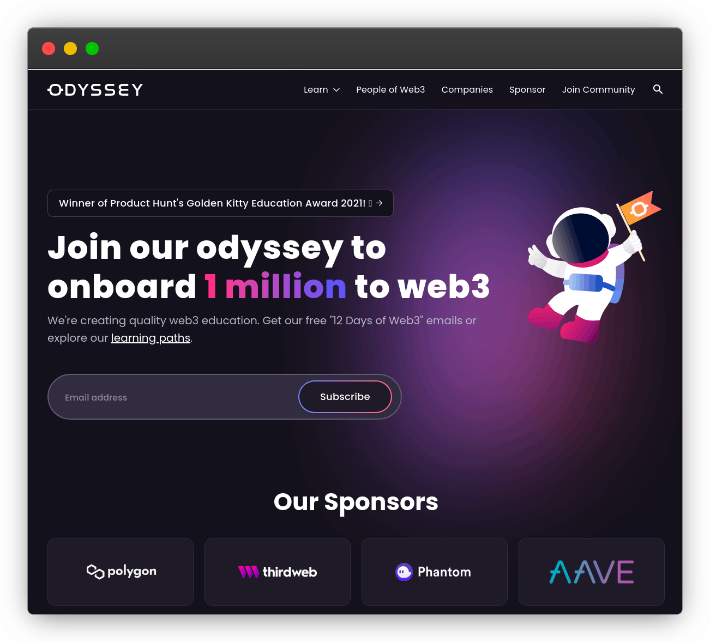
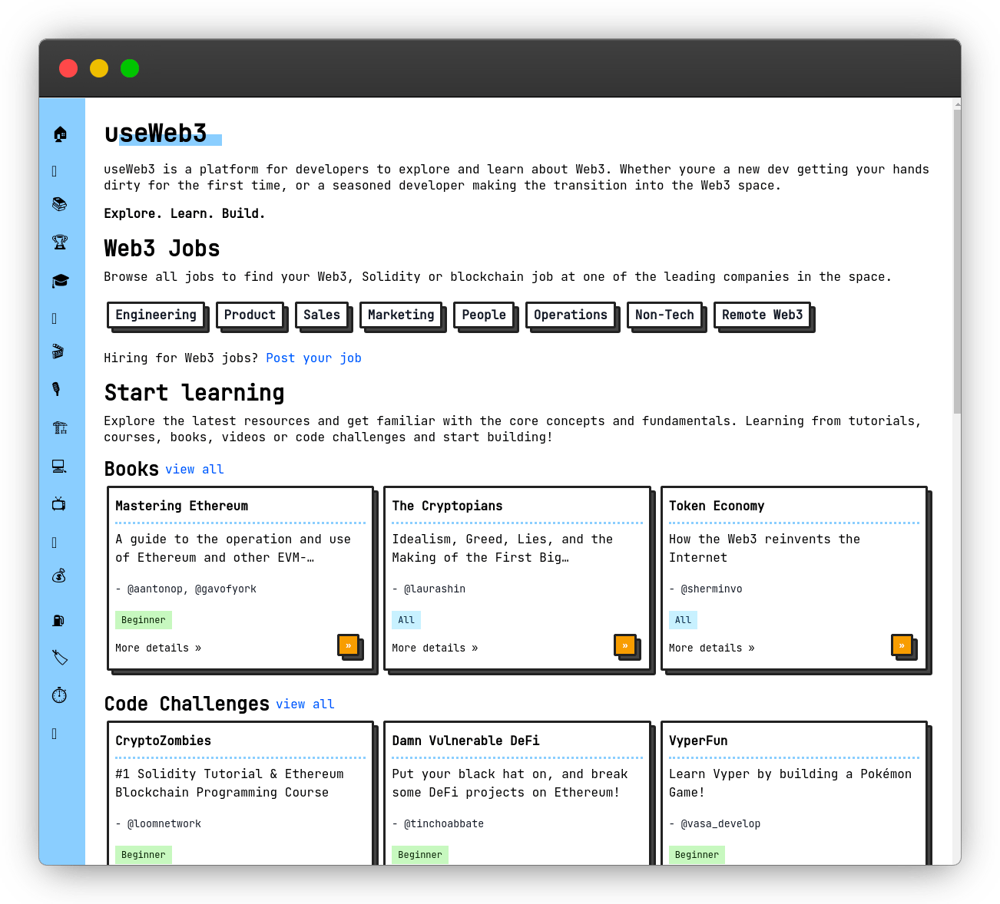
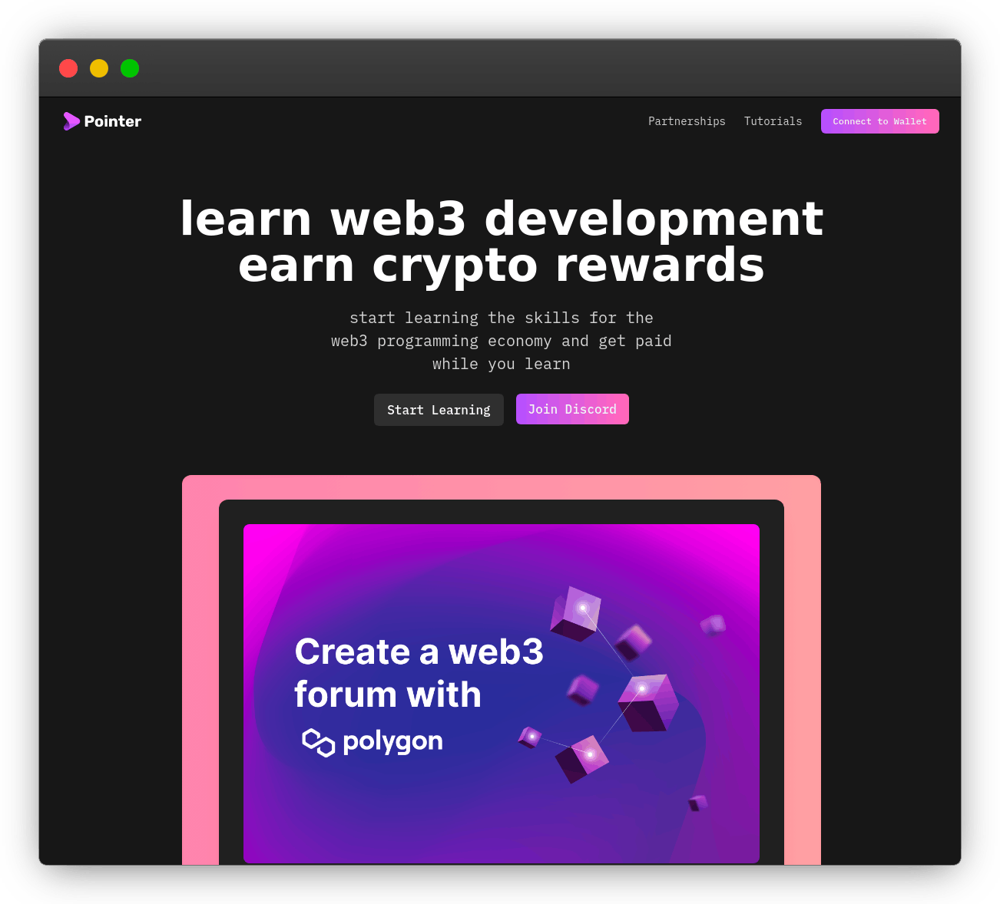
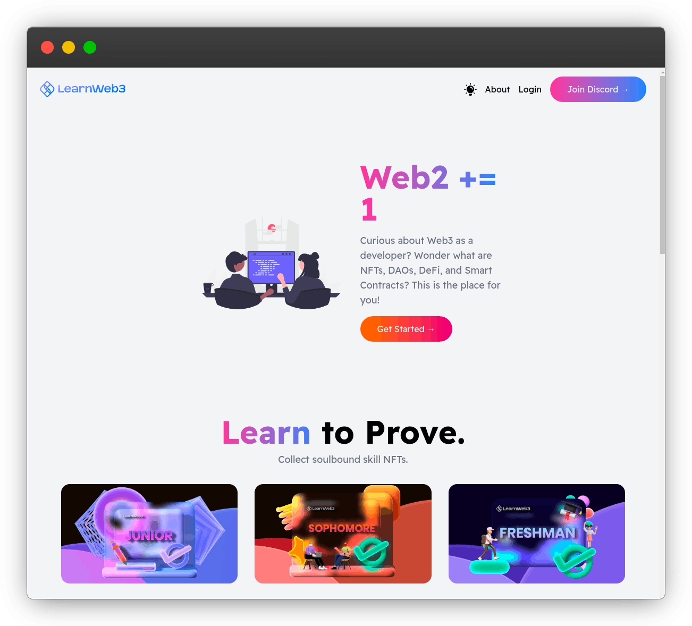

# 🧷web3

[toc]

## 前言

>   纵使荆棘布满,我何曾退却一步

**区块链技术（也称之为分布式账本技术）**，是一种互联网数据库技术，其特点是去中心化，公开透明，让每一个人均可参与的数据库记录

>   ❤️💕💕关于区块链技术，可以关注我，共同学习更多的区块链技术。[个人博客http://nsddd.top](http://nsddd.top)

## web3

> 或许web3将会是下一个科技的高潮

::: wanging 加入我们C-ub社区
区块链处于爆发期，该行业现在迫切需要工程师。这不仅是一个有利可图的领域，而且也是一个令人着迷的领域。 如果你想成为其中的一员并开启你作为 Web 3.0 开发人员的职业生涯，你将需要专注于技能的学习。

如果你有志向来改变这个世界，欢迎你加入[c-ub](https://github.com/c-ub)，我们将打造web3的学习平台

[😶‍🌫️需要联系我联系我🖱️](xxw@nsddd.top)

:::

::: tip 课程代码
地址

:::

## 📚 目录

### 目录

- [x] [😎 第1节 区块链3.0的三种类比：操作系统、网站与云服务](./markdown/1.md)

- [x] [😎 第2节 以太坊开发](./markdown/2.md)

- [x] [😎 第3节 以太坊区块](./markdown/3.md)

- [x] [😎 第4节 以太坊幽灵协议（GHOST）](./markdown/4.md)

- [x] [😎 第5节 以太坊GIS](./markdown/5.md)

- [x] [😎 第6节 以太坊remix](./markdown/6.md)

- [x] [😎 第7节 以太坊节点](./markdown/7.md)

- [x] [😎 第8节 以太坊节点](./markdown/8.md)

- [x] [😎 第9节 Geth(Go - ethreum)](./markdown/9.md)

- [x] [😎 第10节 以太坊核心概念](./markdown/10.md)

- [x] [😎 第11节 solidity语言](./markdown/11.md)

- [x] [😎 第12节 go用来做以太坊开发](./markdown/12.md)

- [x] [😎 第13节 solidity用法总结](./markdown/13.md)

- [x] [😎 第14节 web3.js](./markdown/14.md)

- [x] [😎 第15节 solidity进阶](./markdown/15.md)

- [x] [😎🔑](./markdown/16.md)

- [x] [😎🔑](./markdown/17.md)

- [x] [😎🔑](./markdown/18.md)

- [x] [😎🔑](./markdown/19.md)

- [x] [😎🔑](./markdown/20.md)

- [x] [😎🔑](./markdown/21.md)

- [x] [😎🔑](./markdown/22.md)

- [x] [😎🔑](./markdown/23.md)

- [x] [😎🔑](./markdown/24.md)

- [x] [😎🔑](./markdown/25.md)

- [x] [😎🔑](./markdown/26.md)

- [x] [😎🔑](./markdown/27.md)

- [x] [😎🔑](./markdown/28.md)

- [x] [😎🔑](./markdown/29.md)

- [x] [😎🔑](./markdown/30.md)

- [x] [😎🔑](./markdown/31.md)

- [x] [😎🔑](./markdown/32.md)

- [x] [😎🔑](./markdown/33.md)

- [x] [😎🔑](./markdown/34.md)

- [x] [😎🔑](./markdown/35.md)

- [x] [😎🔑](./markdown/36.md)

- [x] [😎🔑](./markdown/37.md)

- [x] [😎🔑](./markdown/38.md)

- [x] [😎🔑](./markdown/39.md)

- [x] [😎🔑](./markdown/40.md)

- [x] [😎🔑](./markdown/41.md)

- [x] [😎🔑](./markdown/42.md)

- [x] [😎🔑](./markdown/43.md)

- [x] [😎🔑](./markdown/44.md)

- [x] [😎🔑](./markdown/45.md)

- [x] [😎🔑](./markdown/46.md)

- [x] [😎🔑](./markdown/47.md)

- [x] [😎🔑](./markdown/48.md)

- [x] [😎🔑](./markdown/49.md)

- [x] [😎🔑](./markdown/50.md)

## web3 的一些学习平台

### 加密僵尸

> CryptoZombies 是最受欢迎的交互式Solidity 教程，它将帮助您通过使用 Zombies 构建自己的有趣游戏来学习以太坊上的区块链编程 — 使用 Web3、Infura、Metamask 和以太坊智能合约掌握区块链开发，并在创纪录的时间内成为区块链开发者！

*访问*👉 https: [cryptozombies.io](https://cryptozombies.io/)

### 加密黑客

> 从 RSA、Diffie-Hellman、椭圆曲线密码学和块密码等多种类别中进行选择，立即开始学习密码学！

*访问*👉 [cryptohack.org/challenges](https://cryptohack.org/challenges/)

### Proto School

> 他们独立的智能教学练习旨在让您熟悉分散的网络理念、约定和设备。在适合您的配置中选择您的主题并随时关注您的开发。 在您的互联网浏览器中直接完成 JavaScript 代码难题，或者在没有代码洞察力的情况下坚持我们基于文本或不同决策的指导练习。

*访问*👉 [https://proto.school]( https://proto.school)

### EthBuild

> 用于制作 Web3 原型的教育沙箱。通过拖放式编程直观地学习以太坊。

[*访问*👉 https://eth.build](https://eth.build/)

### OpenQuest

学习在 Web3 中编码。

学习总是免费的。加入由 15,000 多名开发人员组成的社区，学习 web3，一路赚取加密货币和 NFT。

*访问*👉 https: [openquest.xyz](https://openquest.xyz/)

## BuildSpace

全球最大的链上网络。

> 如果您是对 web3 感兴趣的开发人员，那么这里就是您的最佳选择。快来创建您的个人资料，开始在 web3 中构建，赚取 NFT，并获得加密的秘密工作机会。

*访问*👉 https: [buildspace.so](https://buildspace.so/)

### Odyssey

> Odyssey DAO 是一个 Web3 学习社区，帮助 100 万人加入 Web3 经济。了解 web3、区块链、加密、智能合约、NFT、DAO、DeFi（去中心化金融）、闯入 Web3、web3 工作机会等等！

*访问*👉 [odysseydao.com](https://www.odysseydao.com/)

### useWeb3

> useWeb3 是一个供开发者探索和了解 Web3 的平台。无论您是第一次动手的新开发人员，还是正在过渡到 Web3 领域的经验丰富的开发人员。

*访问*👉 https: [useweb3.xyz](https://www.useweb3.xyz/)

### Pointer

> 学习 web3 开发，获得加密奖励 开始学习 web3 编程经济的技能并在学习的同时获得报酬

*访问*👉 https: [pointer.gg](https://www.pointer.gg/)

### LearnWeb3

> LearnWeb3 是最好的、发展最快的、完全免费的 web3 教育平台，适用于新的和有经验的 web2 开发人员。

*访问*👉 https: [learnweb3.io](https://www.learnweb3.io/)

## 参与贡献

**要求：**

+ [**你需要学会使用markdown🖱️**](https://github.com/3293172751/CS_COURSE/blob/master/markdown/README.md)
+ [符合Google代码规范](https://zh-google-styleguide.readthedocs.io/en/latest/google-cpp-styleguide/)

#### 参与贡献❤️❤️[💕💕](https://github.com/3293172751/CS_COURSE/blob/master/Git/git-contributor.md/)

如果你也想对本项目做出贡献，那么你可以先把该项目进行 `fork` 或者 `git clone` 到本地，然后自己建立一个分支 `your-branch`，然后上传资料到 对应目录 下，图片信息可以上传到` /images`，然后更新 `README`。 

## 版权声明

本书所有内容遵循 [CC-BY-SA 3.0协议（署名-相同方式共享）

