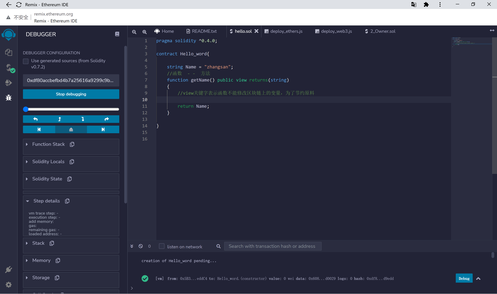
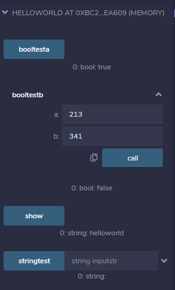
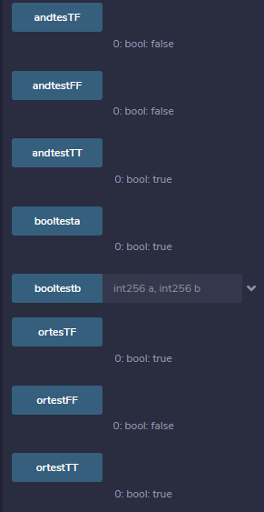
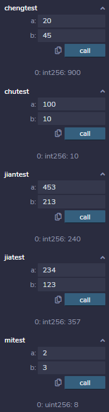
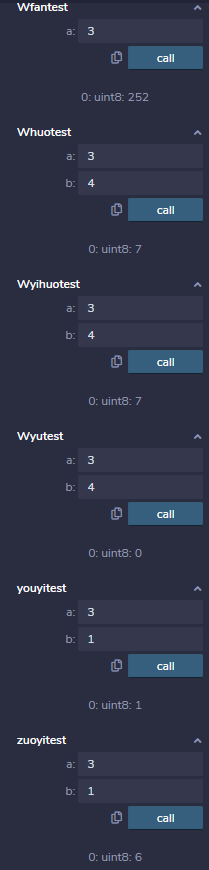
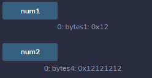
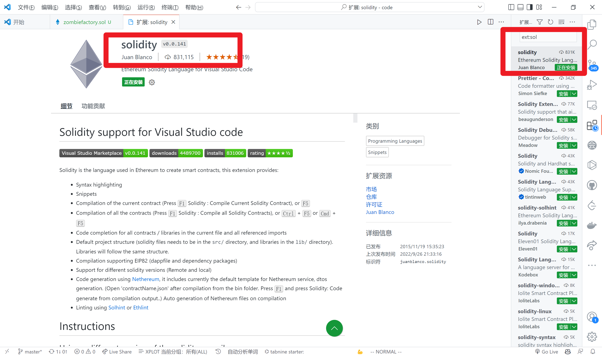

+ [author](http://cubxxw.com)

# 第11节 solidity语言

<div><a href = '10.md' style='float:left'>⬆️上一节🔗</a><a href = '12.md' style='float: right'>⬇️下一节🔗</a></div>
<br>

> ❤️💕💕欢迎来到web3的教程，在这里，将会学习到智能合约，区块链底层原理，eth和btc学习，web3或将会颠覆世界😍~Myblog:[http://cubxxw.com](http://cubxxw.com/)

---
[TOC]


## solidity语言

**solidity基于javascipt，是目前以太坊最常用的开发智能合约语言**

**solidity是一个智能合约高级语言，运行在Ethereum虚拟机上**

```solidity
pragma solidity ^0.4.0;

contract Hello_word{

    string Name = "zhangsan";
    //函数  - -  方法
    function getName() public view returns(string)
    {
        //view关键字表示函数不能修改区块链上的变量，为了节约原料
        
        return Name;
    }

}
```




**编译完成后这是完成第一步，此时我们就可以部署**


### solidity

**1.solidity的四种可见度/访问权限**

> public：任何人都可以调用该函数，包括DApp的使用者。
> private：只有合约本身可以调用该函数（在另一个函数中）。
> internal：只有这份合同以及由此产生的所有合同才能称之为合同。
> external：只有外部可以调用该函数，而合约内部不能调用。


**2.solidity的三种修饰符**

> view: 可以自由调用，因为它只是“查看”区块链的状态而不改变它
> pure: 也可以自由调用，既不读取也不写入区块链
> payable:常常用于将代币发送给合约地址。


###  布尔类型

```solidity
pragma solidity ^0.4.0;

contract helloworld {
    bool boola=true; //声明一个布尔类型的值，只用一个等号
    function booltesta() public view returns(bool){
        return boola;
    }
    
    function booltestb(int a,int b) public view returns(bool){
        return a==b;
    }
}
```

测试结果  


### 与，或

即 &&，||

```solidity
pragma solidity ^0.4.0;

contract helloworld {
    function andtestTT() public view returns(bool){
        return true&&true;
    }
    function andtesTF() public view returns(bool){
        return true&&false;
    }
    function andtestFF() public view  returns(bool){
        return false&&false;
    }
    function ortestTT() public view returns(bool){
        return true||true;
    }
    function ortesTF() public view  returns(bool){
        return true||false;
    }
    function ortestFF() public view  returns(bool){
        return false||false;
    }
}
```

测试结果  


### 通常运算符

即 +，-，*，/，% 以及特殊的符号 ** 代表 x 的 x 次幂

```solidity
pragma solidity ^0.4.0;

contract helloworld {
     function jiatest(int a,int b) public view  returns(int){
        return a+b;
    }
    function jiantest(int a,int b)  public view returns(int){
        return a-b;
    }
    function chengtest(int a,int b) public view  returns(int){
        return a*b;
    }
    function chutest(int a,int b)  public view returns(int){
        return a/b;
    }
    function quyutest(int a,int b)  public view returns(int){
        return a%b;
    }
    function mitest(uint a,uint b)  public view returns(uint){
        return a**b; //此处必须为uint，直接写int256会报错
    }
}
```

测试结果  


### 位运算符

1. `&` 操作数之间转换成二进制之后每位进行与运算操作（同 1 取 1）  
2. `|` 操作数之间转换成二进制之后每位进行或运算操作（有 1 取 1）  
3. `~` 操作数转换成二进制之后每位进行取反操作（直接相反）  
4. `^` 操作数之间转换成二进制之后每位进行异或操作（不同取 1）  
5. `<<` 操作数转换成二进制之后每位向左移动 x 位的操作  
6. `>>` 操作数转换成二进制之后每位向右移动 x 位的操作


💡简单的一个案例如下：

```solidity
pragma solidity ^0.4.0;

contract helloworld {
    function Wyutest(uint8 a,uint8 b)  public view returns(uint8){
        return a&b;
    }
    function Whuotest(uint8 a,uint8 b)  public view returns(uint8){
        return a|b;
    }
    function Wfantest(uint8 a)  public view returns(uint8){
        return ~a;
    }
    function Wyihuotest(uint8 a,uint8 b)  public view returns(uint8){
        return a^b;
    }
    function zuoyitest(uint8 a,uint8 b)  public view returns(uint8){
        return a<<b;
    }
    function youyitest(uint8 a,uint8 b)  public view returns(uint8){
        return a>>b;
    }
}
```

运行结果  


### solidity 中赋值

solidity 是先将赋值语句之中所有的都计算出来之后再进行赋值操作的  

💡简单的一个案例如下：

```solidity
pragma solidity ^0.4.0;

contract helloworld {
    function setvaluetest() public view returns(uint8){
        return 9999999999999999999-9999999999999999998;
    }
}
```

测试结果  


### 固定长度字节数组 byte

一个 byte=8 个位（XXXX XXXX）X 为 0 或 1，二进制表示  

byte 数组为 `bytes1，bytes2，。。。，bytes32`，以八个位递增，即是对**位的封装**  

💡简单的一个案例如下：

```solidity
bytes1=uint8  0
bytes2=unit16  
bytes32=unit256
```


##### 使用 byte 数组的理由：

1. bytesX 可以更好地显示 16 进制  

举例：`bytes1=0x6A，bytes1=（XXXX XXXX）`正好四个表示一个 16 进制，以此类推  

2. bytes 数据声明时加入 public 可以自动生成调用长度的函数，见下

```solidity
pragma solidity ^0.4.0;

contract helloworld {
    bytes1 public num1 = 0x12;  
    bytes4 public num2 = 0x12121212;
}
```




3. bytes 内部**自带 length** 长度函数，而且**长度固定**，而且**长度不可以被修改**。见下

```solidity
pragma solidity ^0.4.0;

contract helloworld {
    bytes1 public num1 = 0x12;  
    bytes4 public num2 = 0x12121212;
    function getlength1() public view returns(uint8){
        return num1.length;
    }
    function getlength2() public view returns(uint8){
        return num2.length;
}
```


4. 字节数组可以进行大小比较

```solidity
pragma solidity ^0.4.0;

contract helloworld {
    bytes1 public num1 = 0x12;  
    bytes4 public num2 = 0x12121212;
    uint8 num3 = 0x12;
    uint8 num4 = 12;
    function compare1() public view returns(bool){
        return num1<num2;
    }
    function compare2() public view returns(bool){
        return num1>num2;
    }
    function compare3() public view returns(bool){
        //return num1>num3;不管是16进制还是二进制，编译器都会报错，
        //return num1>num4;说明无法进行byte和int之间的比较
    }
}
```

### 可变长度 byte 数组

声明方法  

```
ytes arr = new bytes(length);  
```

💡简单的一个案例如下：

```solidity
pragma solidity ^0.4.0;

contract helloworld {
    
     bytes arr1 = new bytes(3);
    function initarr() public view{
        arr1[0]=0x12;
        arr1[1]=0x34;
    }
    function getarrlength() public view returns(uint){
        return arr1.length;
    }
     function arrchange() public {
        arr1[0]=0x11; //
    }
    
     function arrlengthchange(uint a) public {
        arr1.length=a; //
    }
    
    function pushtest() public {
        arr1.push(0x56);
    }
}
```

**其他注意：注意操作时不要出现位溢出的情况，如 uint8 中的数值超过 255 或者为负。还有除数为 0 等等常见错误**

本文所有代码见下

```solidity
pragma solidity ^0.4.0;

contract helloworld {
    
    function stringtest(string inputstr) public view returns(string){
        return inputstr;
    }
    bool boola=true; //声明一个布尔类型的值，只用一个等号
    function booltesta() public view returns(bool){
        return boola;
    }
    
    function booltestb(int a,int b) public view returns(bool){
        return a==b;
    }
    function andtestTT() public view returns(bool){
        return true&&true;
    }
    function andtesTF() public view returns(bool){
        return true&&false;
    }
    function andtestFF() public view  returns(bool){
        return false&&false;
    }
    function ortestTT() public view returns(bool){
        return true||true;
    }
    function ortesTF() public view  returns(bool){
        return true||false;
    }
    function ortestFF() public view  returns(bool){
        return false||false;
    }
     function jiatest(int a,int b) public view  returns(int){
        return a+b;
    }
    function jiantest(int a,int b)  public view returns(int){
        return a-b;
    }
    function chengtest(int a,int b) public view  returns(int){
        return a*b;
    }
    function chutest(int a,int b)  public view returns(int){
        return a/b;
    }
    function quyutest(int a,int b)  public view returns(int){
        return a%b;
    }
    function mitest(uint a,uint b)  public view returns(uint){
        return a**b; //此处必须为uint，直接写int256会报错
    }
    function Wyutest(uint8 a,uint8 b)  public view returns(uint8){
        return a&b;
    }
    function Whuotest(uint8 a,uint8 b)  public view returns(uint8){
        return a|b;
    }
    function Wfantest(uint8 a)  public view returns(uint8){
        return ~a;
    }
    function Wyihuotest(uint8 a,uint8 b)  public view returns(uint8){
        return a^b;
    }
    function zuoyitest(uint8 a,uint8 b)  public view returns(uint8){
        return a<<b;
    }
    function youyitest(uint8 a,uint8 b)  public view returns(uint8){
        return a>>b;
    }
    
    function setvaluetest() public view returns(uint8){
        return 9999999999999999999-9999999999999999998;
    }
    
    bytes1 public num1 = 0x12;  
    bytes4 public num2 = 0x12121212;
    uint8 num3 = 0x12;
    uint8 num4 = 12;
    function getlength1() public view returns(uint8){
        return num1.length;
    }
    function getlength2() public view returns(uint8){
        return num2.length;
    }
    function compare1() public view returns(bool){
        return num1<num2;
    }
    function compare2() public view returns(bool){
        return num1>num2;
    }
    function compare3() public view returns(bool){
        //return num1>num3;
        //return num1>num4;
    }
    
    
    bytes arr1 = new bytes(3);
    function initarr() public view{
        arr1[0]=0x12;
        arr1[1]=0x34;
    }
    function getarrlength() public view returns(uint){
        return arr1.length;
    }
     function arrchange() public {
        arr1[0]=0x11; //
    }
    
     function arrlengthchange(uint a) public {
        arr1.length=a; //
    }
    
    function pushtest() public {
        arr1.push(0x56);
    }
}
```


## solidity的vscode编程

> 对于万能的vscode来说，对付`solidity`岂不是一个小意思
>
> 


## END 链接

<ul><li><div><a href = '10.md' style='float:left'>⬆️上一节🔗</a><a href = '12.md' style='float: right'>⬇️下一节🔗</a></div></li></ul>

+ [Ⓜ️回到目录🏠](../README.md)

+ [**🫵参与贡献💞❤️‍🔥💖**](https://cubxxw.com/archives/contributors))

+ ✴️版权声明 &copy; :本书所有内容遵循[CC-BY-SA 3.0协议（署名-相同方式共享）&copy;](http://zh.wikipedia.org/wiki/Wikipedia:CC-by-sa-3.0协议文本) 

