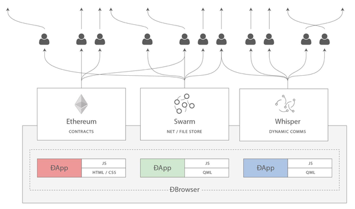

+ [author](http://nsddd.top)

# 第12节 go用来做以太坊开发

<a href = '11.md' style='float:left'>⬆️上一节🔗</a><a href = '13.md' style='float: right'>⬇️下一节🔗</a>

 

> ❤️💕💕欢迎来到web3的教程，在这里，将会学习到智能合约，区块链底层原理，eth和btc学习，web3或将会颠覆世界😍~Myblog:[http://nsddd.top](http://nsddd.top/)

---
[TOC]

## 正片开始

我们可以对之前的知识总结了

### Solidity

> Solidity是一种用于编写智能合约的图灵完备编程语言。Solidity被编译成以太坊虚拟机可执行的字节码。

### go-ethereum

> 我们将使用Go的官方以太坊实现[go-ethereum](https://github.com/ethereum/go-ethereum)来和以太坊区块链进行交互。Go-ethereum，也被简称为Geth，是最流行的以太坊客户端。因为它是用Go开发的，当使用Golang开发应用程序时，Geth提供了读写区块链的一切功能。

### Block Explorers

> [Etherscan](https://etherscan.io/)是一个用于查看和深入研究区块链上数据的网站。这些类型的网站被称为*区块浏览器*，因为它们允许您查看区块（包含交易）的内容。区块是区块链的基础构成要素。区块包含在已分配的出块时间内开采出的所有交易数据。区块浏览器也允许您查看智能合约执行期间释放的事件以及诸如支付的gas和交易的以太币数量等。

### Swarm and Whisper

> 我们还将深入研究蜂群(Swarm)和耳语(Whisper)，分别是一个文件存储协议和一个点对点的消息传递协议，它们是实现完全去中心化和分布式应用程序需要的另外两个核心。

## END 链接
<ul><li>
<a href = '11.md' style='float:left'>⬆️上一节🔗</a><a href = '13.md' style='float: right'>⬇️下一节🔗</a>
</li></ul>

+ [Ⓜ️回到目录🏠](../README.md)

+ [**🫵参与贡献💞❤️‍🔥💖**](https://nsddd.top/archives/contributors))

+ ✴️版权声明 &copy; :本书所有内容遵循[CC-BY-SA 3.0协议（署名-相同方式共享）&copy;](http://zh.wikipedia.org/wiki/Wikipedia:CC-by-sa-3.0协议文本) 

