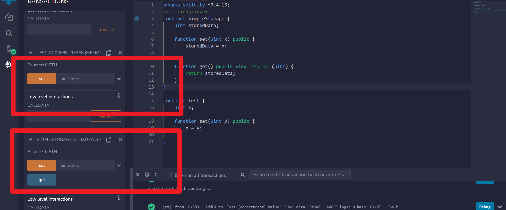

+ [author](http://cubxxw.com)

# 第13节 solidity用法总结

<div><a href = '12.md' style='float:left'>⬆️上一节🔗</a><a href = '14.md' style='float: right'>⬇️下一节🔗</a></div>
<br>

> ❤️💕💕欢迎来到web3的教程，在这里，将会学习到智能合约，区块链底层原理，eth和btc学习，web3或将会颠覆世界😍~Myblog:[http://cubxxw.com](http://cubxxw.com/)

---
[TOC]

## 第一个智能合约

**进入remix，新创建一个测试类`text.sol`**

💡简单的一个案例如下：

```solidity
pragma solidity ^0.4.16;
// a:xiongxinwei
contract SimpleStorage {
    uint storedData;

    function set(uint x) public {
        storedData = x;
    }

    function get() public view returns (uint) {
        return storedData;
    }
}

contract Test {
    uint x;

    function set(uint y) public {
        x = y;
    }
}
```

🚀 编译结果如下（点击deploy部署）：

```js
Type the library name to see available commands.
creation of Test pending...
[vm]from: 0x5B3...eddC4to: Test.(constructor)value: 0 weidata: 0x608...a0029logs: 0hash: 0x00d...aa588
status	true Transaction mined and execution succeed
transaction hash	0x00dbcd1224671698040b07e1d1483ac7aaf44beffff400075a0c0bd8501aa588
from	0x5B38Da6a701c568545dCfcB03FcB875f56beddC4
to	Test.(constructor)
gas	101788 gas
transaction cost	88511 gas 
execution cost	88511 gas 
input	0x608...a0029
decoded input	{}
decoded output	 - 
logs	[]
val	0 wei
```

**方法：**




## 智能合约的作用是什么

智能合约不能做复杂的检索，做复杂检索必须要写复杂的语句，所以说智能合约不可以当作数据库。

> 智能合约包含了有关交易的所有信息，只有在满足要求后才会执行结果操作。智能合约和传统纸质合约的区别在于智能合约是由计算机生成的。因此，代码本身解释了参与方的相关义务。
>
> 事实上，智能合约的参与方通常是互联网上的陌生人，受制于有约束力的数字化协议。本质上，智能合约是一个数字合约，除非满足要求，否则不会产生结果。


## solidity定义函数

在 Solidity 中函数定义的句法如下:

```solidity
function eatHamburgers(string _name, uint _amount) {

}
```

这是一个名为 `eatHamburgers` 的函数，它接受两个参数：一个 `string`类型的 和 一个 `uint`类型的。现在函数内部还是空的。

> 注：: 习惯上函数里的变量都是以(`_`)开头 (但不是硬性规定) 以区别全局变量。我们整个教程都会沿用这个习惯。

我们的函数定义如下:

```solidity
eatHamburgers("vitalik", 100);
```


💡简单的一个案例如下：

```solidity
pragma solidity ^0.4.19;

contract ZombieFactory {

    uint dnaDigits = 16;
    uint dnaModulus = 10 ** dnaDigits;

    struct Zombie {
        string name;
        uint dna;
    }

    Zombie[] public zombies;

    function createZombie(string _name, uint _dna) {

    }

}
```


## 使用结构体和数组

还记得上个例子中的 `Person` 结构吗？

```solidity
struct Person {
  uint age;
  string name;
}

Person[] public people;
```

现在我们学习创建新的 `Person` 结构，然后把它加入到名为 `people` 的数组中.

```solidity
// 创建一个新的Person:
Person satoshi = Person(172, "Satoshi");

// 将新创建的satoshi添加进people数组:
people.push(satoshi);
```

你也可以两步并一步，用一行代码更简洁:

```
people.push(Person(16, "Vitalik"));
```

> 注：`array.push()` 在数组的 **尾部** 加入新元素 ，所以元素在数组中的顺序就是我们添加的顺序， 如:

```
uint[] numbers;
numbers.push(5);
numbers.push(10);
numbers.push(15);
// numbers is now equal to [5, 10, 15]
```


💡简单的一个案例如下：

让我们创建名为createZombie的函数来做点儿什么吧。

1. 在函数体里新创建一个 `Zombie`， 然后把它加入 `zombies` 数组中。 新创建的僵尸的 `name` 和 `dna`，来自于函数的参数。
2. 让我们用一行代码简洁地完成它。


🚀 编译结果如下：

```solidity
pragma solidity ^0.4.19;

contract ZombieFactory {

    uint dnaDigits = 16;
    uint dnaModulus = 10 ** dnaDigits;

    struct Zombie {
        string name;
        uint dna;
    }

    Zombie[] public zombies;

    function createZombie(string _name, uint _dna) {
        // 这里开始
        zombies.push(Zombie(_name,_dna));
    }

}
```


## 私有、公共函数

Solidity 定义的函数的属性默认为`公共`。 这就意味着任何一方 (或其它合约) 都可以调用你合约里的函数。

显然，不是什么时候都需要这样，而且这样的合约易于受到攻击。 所以将自己的函数定义为`私有`是一个好的编程习惯，只有当你需要外部世界调用它时才将它设置为`公共`。

如何定义一个私有的函数呢？

```solidity
uint[] numbers;

function _addToArray(uint _number) private {
  numbers.push(_number);
}
```

这意味着只有我们合约中的其它函数才能够调用这个函数，给 `numbers` 数组添加新成员。

可以看到，在函数名字后面使用关键字 `private` 即可。和函数的参数类似，私有函数的名字用(`_`)起始。


## 函数的更多属性

### 返回值

要想函数返回一个数值，按如下定义：

```solidity
string greeting = "What's up dog";

function sayHello() public returns (string) {
  return greeting;
}
```

Solidity 里，函数的定义里可包含返回值的数据类型

### 函数的修饰符

上面的函数实际上没有改变 Solidity 里的状态，即，它没有改变任何值或者写任何东西。

这种情况下我们可以把函数定义为 *view*, 意味着它只能读取数据不能更改数据:

```solidity
function sayHello() public view returns (string) {
```

Solidity 还支持 ***pure*** 函数, 表明这个函数甚至都不访问应用里的数据，例如：

```solidity
function _multiply(uint a, uint b) private pure returns (uint) {
  return a * b;
}
```

这个函数甚至都不读取应用里的状态 — 它的返回值完全取决于它的输入参数，在这种情况下我们把函数定义为 *pure*.

> 注：可能很难记住何时把函数标记为 pure/view。 幸运的是， Solidity 编辑器会给出提示，提醒你使用这些修饰符。


## Keccak256 和 类型转换

Ethereum 内部有一个散列函数`keccak256`，它用了`SHA3`版本。一个散列函数基本上就是把一个字符串转换为一个256位的16进制数字。字符串的一个微小变化会引起散列数据极大变化。

```bash
//6e91ec6b618bb462a4a6ee5aa2cb0e9cf30f7a052bb467b0ba58b8748c00d2e5
keccak256("aaaab");
//b1f078126895a1424524de5321b339ab00408010b7cf0e6ed451514981e58aa9
keccak256("aaaac");
```

> *注: 在区块链中安全地产生一个随机数是一个很难的问题， 本例的方法不安全，但是在我们的Zombie DNA算法里不是那么重要，已经很好地满足我们的需要了。*

显而易见，输入字符串只改变了一个字母，输出就已经天壤之别了。

> 注: 在区块链中**安全地**产生一个随机数是一个很难的问题， 本例的方法不安全，但是在我们的Zombie DNA算法里不是那么重要，已经很好地满足我们的需要了。

### 类型转换

有时你需要变换数据类型。例如:

```
uint8 a = 5;
uint b = 6;
// 将会抛出错误，因为 a * b 返回 uint, 而不是 uint8:
uint8 c = a * b;
// 我们需要将 b 转换为 uint8:
uint8 c = a * uint8(b);
```

上面, `a * b` 返回类型是 `uint`, 但是当我们尝试用 `uint8` 类型接收时, 就会造成潜在的错误。如果把它的数据类型转换为 `uint8`, 就可以了，编译器也不会出错。


### 案例

💡简单的一个案例如下：

给 `_generateRandomDna` 函数添加代码! 它应该完成如下功能:

1. 第一行代码取 `_str` 的 `keccak256` 散列值生成一个伪随机十六进制数，类型转换为 `uint`, 最后保存在类型为 `uint` 名为 `rand` 的变量中。
2. 我们只想让我们的DNA的长度为16位 (还记得 `dnaModulus`?)。所以第二行代码应该 `return` 上面计算的数值对 `dnaModulus` 求余数(`%`)。

🚀 编译结果如下：

```go
pragma solidity ^0.4.19;

contract ZombieFactory {

    uint dnaDigits = 16;
    uint dnaModulus = 10 ** dnaDigits;

    struct Zombie {
        string name;
        uint dna;
    }

    Zombie[] public zombies;

    function _createZombie(string _name, uint _dna) private {
        zombies.push(Zombie(_name, _dna));
    }

    function _generateRandomDna(string _str) private view returns (uint) {
        // 这里开始
        uint rand = uint(keccak256(_str));
        return rand % dnaModulus;
    }
}
```


## 事件

**事件** 是合约和区块链通讯的一种机制。你的前端应用“监听”某些事件，并做出反应。

💡简单的一个案例如下：

```solidity
// 这里建立事件
event IntegersAdded(uint x, uint y, uint result);

function add(uint _x, uint _y) public {
  uint result = _x + _y;
  //触发事件，通知app
  IntegersAdded(_x, _y, result);
  return result;
}
```

你的 app 前端可以监听这个事件。JavaScript 实现如下:

```solidity
YourContract.IntegersAdded(function(error, result) {
  // 干些事
})
```

### 实战演习

我们想每当一个僵尸创造出来时，我们的前端都能监听到这个事件，并将它显示出来。

1。 定义一个 `事件` 叫做 `NewZombie`。 它有3个参数: `zombieId` (`uint`)， `name` (`string`)， 和 `dna` (`uint`)。

2。 修改 `_createZombie` 函数使得当新僵尸造出来并加入 `zombies`数组后，生成事件`NewZombie`。

3。 需要定义僵尸`id`。 `array.push()` 返回数组的长度类型是`uint` - 因为数组的第一个元素的索引是 0， `array.push() - 1` 将是我们加入的僵尸的索引。 `zombies.push() - 1` 就是 `id`，数据类型是 `uint`。在下一行中你可以把它用到 `NewZombie` 事件中。

💡简单的一个案例如下：

```solidity
pragma solidity ^0.4.19;

contract ZombieFactory {

    event NewZombie(uint zombieId, string name, uint dna);

    uint dnaDigits = 16;
    uint dnaModulus = 10 ** dnaDigits;

    struct Zombie {
        string name;
        uint dna;
    }

    Zombie[] public zombies;

    function _createZombie(string _name, uint _dna) private {
        uint id = zombies.push(Zombie(_name, _dna)) - 1;
        NewZombie(id, _name, _dna);
    }

    function _generateRandomDna(string _str) private view returns (uint) {
        uint rand = uint(keccak256(_str));
        return rand % dnaModulus;
    }

    function createRandomZombie(string _name) public {
        uint randDna = _generateRandomDna(_name);
        _createZombie(_name, randDna);
    }

}

```


## END 链接

<ul><li><div><a href = '12.md' style='float:left'>⬆️上一节🔗</a><a href = '14.md' style='float: right'>⬇️下一节🔗</a></div></li></ul>

+ [Ⓜ️回到目录🏠](../README.md)

+ [**🫵参与贡献💞❤️‍🔥💖**](https://cubxxw.com/archives/contributors))

+ ✴️版权声明 &copy; :本书所有内容遵循[CC-BY-SA 3.0协议（署名-相同方式共享）&copy;](http://zh.wikipedia.org/wiki/Wikipedia:CC-by-sa-3.0协议文本) 

