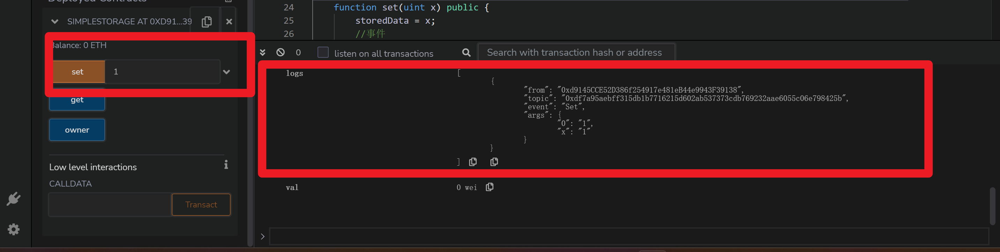
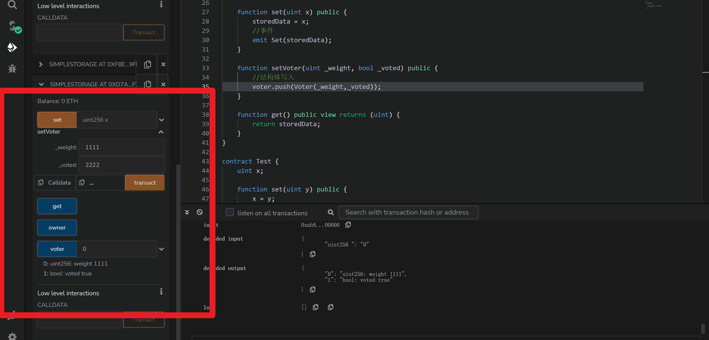

+ [author](http://nsddd.top)

# 第16节 高级solidity理论

<div><a href = '15.md' style='float:left'>⬆️上一节🔗</a><a href = '17.md' style='float: right'>⬇️下一节🔗</a></div>
<br>

> ❤️💕💕欢迎来到web3的教程，在这里，将会学习到智能合约，区块链底层原理，eth和btc学习，web3或将会颠覆世界😍~Myblog:[http://nsddd.top](http://nsddd.top/)

---
[TOC]

## 智能协议的永固性

> 接下来我们将会正式用`remix`ide来编写程序。

到现在为止，我们讲的 Solidity 和其他语言没有质的区别，它长得也很像 JavaScript。

但是，在有几点以太坊上的 DApp 跟普通的应用程序有着天壤之别。

第一个例子，在你把智能协议传上以太坊之后，它就变得***不可更改***, 这种永固性意味着你的代码永远不能被调整或更新。

> 这个也算是用到了区块链的上链后的不可篡改性质

你编译的程序会一直，永久的，不可更改的，存在以太坊上。这就是 Solidity 代码的安全性如此重要的一个原因。如果你的智能协议有任何漏洞，即使你发现了也无法补救。你只能让你的用户们放弃这个智能协议，然后转移到一个新的修复后的合约上。

但这恰好也是智能合约的一大优势。代码说明一切。如果你去读智能合约的代码，并验证它，你会发现，一旦函数被定义下来，每一次的运行，程序都会严格遵照函数中原有的代码逻辑一丝不苟地执行，完全不用担心函数被人篡改而得到意外的结果。


## 事件Event

事件是能方便地调用以太坊虚拟机日志功能的接口。

```solidity
pragma solidity >=0.4.21 <0.9.0;
contract TinyAuction {
    event HighestBidIncreased(address bidder, uint amount); // 事件

    function bid() public payable {
        // ...
        emit HighestBidIncreased(msg.sender, msg.value); // 触发事件
    }
}
```


**💡简单的一个案例如下：**

```solidity
pragma solidity ^0.4.16;
// a:xiongxinwei
contract SimpleStorage {
    uint storedData;

    //定义一个事件
    event Set(uint x);

    ///定义一个结构体
    struct Voter {
        uint weight;
        bool voted;
    }

    // 我的地址 -- 设置为公有 
    address public owner = 0x5B38Da6a701c568545dCfcB03FcB875f56beddC4;
    

    modifier onlyOwner() {
        require(owner == msg.sender, "only owner can call this function");
        _;
    }

    function set(uint x) public {
        storedData = x;
        //事件
        emit Set(storedData);
    }

    function get() public view returns (uint) {
        return storedData;
    }
}

contract Test {
    uint x;

    function set(uint y) public {
        x = y;
    }
}
```

**🚀 编译结果如下：**




## 结构体

> 定义一个投票的结构体

**💡简单的一个案例如下：**

```solidity
pragma solidity ^0.4.16;
// a:xiongxinwei
contract SimpleStorage {
    uint storedData;

    //定义一个事件
    event Set(uint x);

    ///定义一个结构体
    struct Voter {
        uint weight;
        bool voted;
    }

    //用结构体定义数组
    Voter[] public voter;

    // 我的地址 -- 设置为公有 
    address public owner = 0x5B38Da6a701c568545dCfcB03FcB875f56beddC4;
    

    modifier onlyOwner() {
        require(owner == msg.sender, "only owner can call this function");
        _;
    }

    function set(uint x) public {
        storedData = x;
        //事件
        emit Set(storedData);
    }

    function setVoter(uint _weight, bool _voted) public {
        //结构体写入
        voter.push(Voter(_weight,_voted));
    }

    function get() public view returns (uint) {
        return storedData;
    }
}

contract Test {
    uint x;

    function set(uint y) public {
        x = y;
    }
}
```


**🚀 编译结果如下：**




## 枚举类型

枚举可用来创建由一定数量的“常量值”构成的自定义类型（参阅类型章节中的 [枚举类型](https://learnblockchain.cn/docs/solidity/types.html#enums)）。

```solidity
pragma solidity >=0.4.0 <0.9.0;

contract Upchain {
    enum State { Created, Locked, InValid } // 枚举
}
```


### 区块和交易属性

+ `blockhash(uint blockNumber) returns (bytes32)`：指定区块的区块哈希 —— 仅可用于最新的 256 个区块且不包括当前区块，否则返回 0 。
+ `block.basefee` (`uint`): 当前区块的基础费用，参考： ([EIP-3198](https://eips.ethereum.org/EIPS/eip-3198) 和 [EIP-1559](https://eips.ethereum.org/EIPS/eip-1559))
+ `block.chainid` (`uint`): 当前链 id
+ `block.coinbase` ( `address` ): 挖出当前区块的矿工地址
+ `block.difficulty` ( `uint` ): 当前区块难度
+ `block.gaslimit` ( `uint` ): 当前区块 gas 限额
+ `block.number` ( `uint` ): 当前区块号
+ `block.timestamp` ( `uint`): 自 unix epoch 起始当前区块以秒计的时间戳
+ `gasleft() returns (uint256)` ：剩余的 `gas`
+ `msg.data` ( `bytes` ): 完整的 `calldata`
+ `msg.sender` ( `address` ): 消息发送者（当前调用）
+ `msg.sig` ( `bytes4` ): `calldata` 的前 `4` 字节（也就是函数标识符）
+ `msg.value` ( `uint` ): 随消息发送的 w·ei 的数量
+ `tx.gasprice` (`uint`): 交易的 `gas` 价格
+ `tx.origin` ( `address` ): 交易发起者（完全的调用链）


📜 对上面的解释：

对于每一个**外部函数**调用，包括 `msg.sender` 和 `msg.value` 在内所有 `msg` 成员的值都会变化。这里包括对库函数的调用。

当合约在链下被评估，而不是在一个区块所包含的交易的背景下被评估时，你不应该假定 `block.*` 和 `tx.*` 是指任何特定区块或交易。这些值是由执行合约的EVM实现提供的，可以是任意的。

不要依赖 `block.timestamp` 和 `blockhash` 产生随机数，除非你明确知道自己做的用意。

时间戳和区块哈希在一定程度上都可能受到挖矿矿工影响。例如，挖矿社区中的恶意矿工可以用某个给定的哈希来运行赌场合约的 payout 函数，而如果他们没收到钱，还可以用一个不同的哈希重新尝试。

当前区块的时间戳必须严格大于最后一个区块的时间戳，但这里能确保也需要它是在权威链上的两个连续区块。

基于可扩展因素，区块哈希不是对所有区块都有效。你仅仅可以访问最近 256 个区块的哈希，其余的哈希均为零。

`blockhash` 函数之前是使用 `block.blockhash`， `block.blockhash` 在 0.4.22 开始不推荐使用，在 0.5.0 已经移除了。

`gasleft` 函数之前是使用 `msg.gas`, `msg.gas` 在 0.4.21 开始不推荐使用，在 0.5.0 已经移除了。

在 0.7.0, `now` ( `block.timestamp` 的别名) 被移除了。


## END 链接

<ul><li><div><a href = '15.md' style='float:left'>⬆️上一节🔗</a><a href = '17.md' style='float: right'>⬇️下一节🔗</a></div></li></ul>

+ [Ⓜ️回到目录🏠](../README.md)

+ [**🫵参与贡献💞❤️‍🔥💖**](https://nsddd.top/archives/contributors))

+ ✴️版权声明 &copy; :本书所有内容遵循[CC-BY-SA 3.0协议（署名-相同方式共享）&copy;](http://zh.wikipedia.org/wiki/Wikipedia:CC-by-sa-3.0协议文本) 

