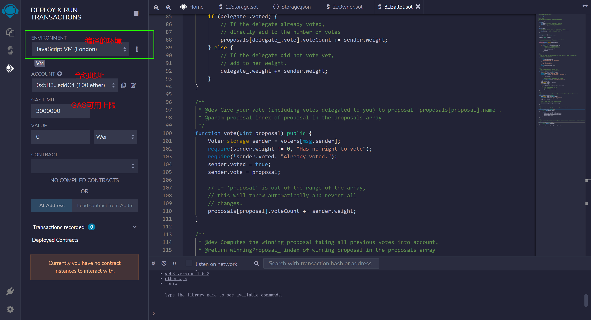
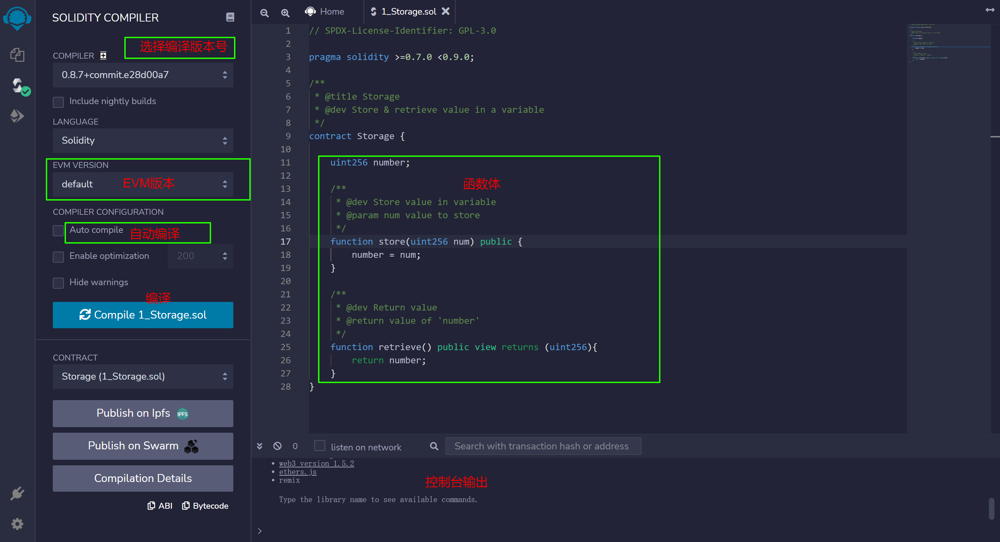

+ [author](http://nsddd.top)

# 第6节 以太坊remix

<div><a href = '5.md' style='float:left'>⬆️上一节🔗</a><a href = '7.md' style='float: right'>⬇️下一节🔗</a></div>
<br>

> ❤️💕💕欢迎来到web3的教程，在这里，将会学习到智能合约，区块链底层原理，eth和btc学习，web3或将会颠覆世界😍~Myblog:[http://nsddd.top](http://nsddd.top/)

---
[TOC]


## 使用remix

我们打开看看

```solidity
// SPDX-License-Identifier: GPL-3.0

pragma solidity >=0.7.0 <0.9.0;  //这个是支持的版本号

/**
 * @title Storage
 * @dev Store & retrieve value in a variable
 */
contract Storage {           //代码结构
//contract是合约类型，Storage s
    uint256 number;

    /**
     * @dev Store value in variable
     * @param num value to store
     */
    function store(uint256 num) public {            //定义一个方法或函数
        //uint256类型，uint是无符号整型 num是参数变量名 public是公有公共可见的
        number = num;
    }

    /**
     * @dev Return value 
     * @return value of 'number'
     */
    function retrieve() public view returns (uint256){
        return number;           //返回值
    }
}
```

**编译版本号建议不要选择太新的，不然可能会因为版本报错**

```
function () pubilc payable{}
```

**可能很容易想到这个是一个匿名函数，但其实不是的，这个在script上面是回退函数，表示的是最后一步，如果前面的方法没有调用，就会用它，前面如果调用了，就不会用它**

**payable{}表示可支付的**


## 编译环境






## 水龙头合约

```solidity
pragma solidity ^0.4.0;
//定义一个编译器版本
contract Faucet{
    //合约体
    //功能是一个水龙头的功能，点击就可以发一个币
    function withdraw() public {
        //函数体
        //功能是发送一个货币
        require(amout > 1000000000000000000)
        msg.sender.transfer(amout);    //一个以太币
        //指定合约调用者的地址
    }
}
```


## END 链接
<ul><li><div><a href = '5.md' style='float:left'>⬆️上一节🔗</a><a href = '7.md' style='float: right'>⬇️下一节🔗</a></div></li></ul>

+ [Ⓜ️回到目录🏠](../README.md)

+ [**🫵参与贡献💞❤️‍🔥💖**](https://nsddd.top/archives/contributors))

+ ✴️版权声明 &copy; :本书所有内容遵循[CC-BY-SA 3.0协议（署名-相同方式共享）&copy;](http://zh.wikipedia.org/wiki/Wikipedia:CC-by-sa-3.0协议文本) 

