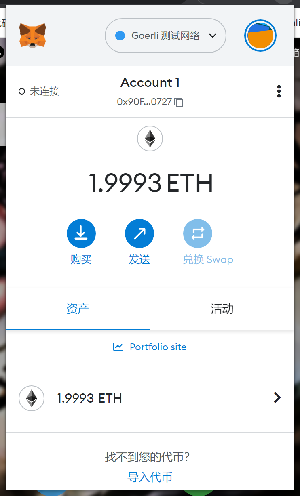
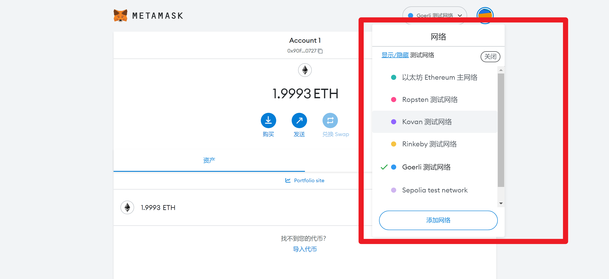

+ [author](http://nsddd.top)

# 第7节 主网络和测试网络

<a href = '6.md' style='float:left'>⬆️上一节🔗</a><a href = '8.md' style='float: right'>⬇️下一节🔗</a>

 

> ❤️💕💕欢迎来到web3的教程，在这里，将会学习到智能合约，区块链底层原理，eth和btc学习，web3或将会颠覆世界😍~Myblog:[http://nsddd.top](http://nsddd.top/)

---
[TOC]

## 助记词

对于助记词来说，助记词很重要的，一定要备份两个，放在两个安全位置，放在保险箱中

> 助记词是明文私钥的另一种表现形式，最早是由`BIP-39`提出，目的是帮助用户记忆复杂的密钥（256位）

## 切换网络

+ `main`：主网络，公共的以太坊区块链也是真正的ETH

+ `Ropsten`：以太坊公共的测试区块链和网络，使用工作量证明共识，该账户上的ETH没有任何价值

+ `Kovan`：以太坊公共的测试区块链和网络，使用`AURA`协议进行权威证明POA共识，该账户上的ETH没有任何价值

+ `localhost 8545` ：链接到与浏览器在同一个计算机运行的节点，该节点可以是任何公共区块链的一部分

  

## END 链接

<ul><li>
<a href = '6.md' style='float:left'>⬆️上一节🔗</a><a href = '8.md' style='float: right'>⬇️下一节🔗</a>
</li></ul>

+ [Ⓜ️回到目录🏠](../README.md)

+ [**🫵参与贡献💞❤️‍🔥💖**](https://nsddd.top/archives/contributors))

+ ✴️版权声明 &copy; :本书所有内容遵循[CC-BY-SA 3.0协议（署名-相同方式共享）&copy;](http://zh.wikipedia.org/wiki/Wikipedia:CC-by-sa-3.0协议文本) 

