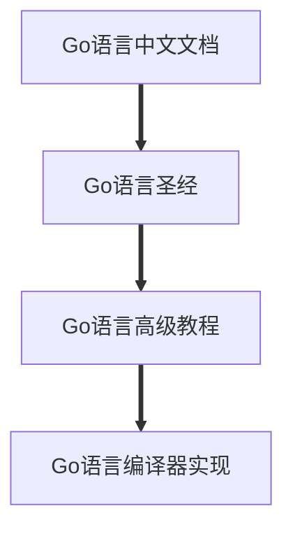

## 路线图（补充2023）

---

## 资源

### 看书路线

+ ##### [Go语言中文文档](https://www.topgoer.com/)

+ ##### [Go语言圣经](https://github.com/gopl-zh/gopl-zh.github.com)

+ ##### Go程序设计语言黑皮书

  ​	**其他路线：**

  + https://docs.hacknode.org/gopl-zh/

  + https://books.studygolang.com/gopl-zh/

  + https://wizardforcel.gitbooks.io/gopl-zh/

  + https://docs.hundan.org/gopl-zh/

  + https://book.itsfun.top/gopl-zh/          #每夜自动构建

    ⏬ 

+ ##### Go[语言高级编程](https://github.com/chai2010/advanced-go-programming-book)

  ​	**其他路线：**

  + [SUMMARY.md](https://github.com/chai2010/advanced-go-programming-book/blob/master/SUMMARY.md)
  + https://chai2010.cn/advanced-go-programming-book/
  + https://www.gitbook.com/book/chai2010/advanced-go-programming-book/

  ---

  ### github上面一些好的Go项目
  
  ####  插件
  
  - QQ、微信（WeChat）、支付宝（AliPay）的Go版本SDK http://github.com/go-pay/gopay
  - 发送邮件库 https://github.com/go-gomail/gomail
  - 读写Microsoft Excel https://github.com/360EntSecGroup-Skylar/excelize [详细资料](https://pan.baidu.com/s/1fBUBE2nmE0NNa066mcp4nw)
  - 生成uuid https://github.com/satori/go.uuid
  - 开源，分布式，简单高效的搜索引擎 https://github.com/go-ego/riot
  - 基于 Go 的高性能 MySQL Proxy https://github.com/flike/kingshard
  - yaml对Go语言的支持 https://github.com/go-yaml/yaml/tree/v2.2.7
  - Codis是一个分布式Redis解决方案数据库代理 https://github.com/CodisLabs/codis
  - 用Go语言编写的markdown解析器 https://github.com/yuin/goldmark
  
  #### 项目
  
  - 基于beego框架的接口在线文档管理系统 https://github.com/lifei6671/mindoc
  - 开源文库系统 https://github.com/truthhun/DocHub
  - Go常用规范定义案例 https://github.com/zc2638/go-standard
  - 开源监控度量的看板系统 https://github.com/zc2638/go-standard
  - go应用开发的调试工具 https://github.com/derekparker/delve
  - 高并发、重量级爬虫软件 https://github.com/henrylee2cn/pholcus
  - Web分析 https://github.com/matomo-org/matomo
  
  ----
  
  
  
  ### 最新2023后端路线
  
  Go 语言学习线路图（青训营）
  
  + 入门
  
    + 青训营课程 - Go 语言上手-基础语法
  
    + 官方课程
      + Go语言圣经（中文版） https://books.studygolang.com/gopl-zh/
  
    + by example
      + Go by Example 中文 http://books.studygolang.com/gobyexample/maps/
  
    + by test
      + Learn Go with tests https://github.com/geektutu/high-performance-go
  
    + 必读
      + Effective Go 中文版本 https://github.com/bingohuang/effective-go-zh-en
  
    + 标准库
  
      + Go语言标准库书籍 http://books.studygolang.com/The-Golang-Standard-Library-by-Example/  
  
      + 官方文档  https://pkg.go.dev/std   
  
      + 官方文档翻译 https://studygolang.com/pkgdoc
  
    + 其它
  
      + Go 学习笔记 https://github.com/qyuhen/book
  
      + The Way to Go 中文版本 https://github.com/unknwon/the-way-to-go_ZH_CN/blob/master/eBook/directory.md
  
      + Go语言101 https://gfw.go101.org/article/101.html
  
      + Go语言入门教程 http://c.biancheng.net/golang/
  
      + GO 命令教程 https://github.com/hyper0x/go_command_tutorial
  
      + Go并发编程实战 https://www.ituring.com.cn/book/1525
  
      + Golang - 100天从新手到大师 https://github.com/rubyhan1314/Golang-100-Days
  
    + 新功能 （部分资料比较老旧，不包含下面这些新功能，额外列出）
  
      + Go mod
  
      + 泛型
  
  + 进阶
  
    + 工程实践
      + 青训营课程 - Go 语言上手-工程实践
  
    + by example
      + 7天用Go从零实现系列 https://github.com/geektutu/7days-golang
  
    + WEB RPC 生态
  
      + Go Web 编程 https://learnku.com/docs/build-web-application-with-golang
  
      + Go RPC 开发指南 http://books.studygolang.com/go-rpc-programming-guide/
  
      + Go Web Examples https://github.com/gowebexamples/gowebexamples
  
    + DB / ORM
      + 青训营课程 - 设计模式之 Database/SQL 与 GORM 实践
  
    + 高性能
  
      + 青训营课程 - 高质量编程与性能调优实战
  
      + Go 语言高性能编程 https://github.com/geektutu/high-performance-go
  
    + 原理、设计实现
  
      + 青训营课程 - 高性能 Go 语言发行版优化与落地实践 
  
      + Go 语言设计与实现 https://draveness.me/golang/
  
      + Go 语言原本 https://golang.design/under-the-hood/
  
      + Go 语言高级编程(Advanced Go Programming) https://books.studygolang.com/advanced-go-programming-book/
  
      + Go 专家编程 https://github.com/RainbowMango/GoExpertProgramming
  
      + 深入解析Go https://tiancaiamao.gitbooks.io/go-internals/content/zh/index.html
  
      + Go Assembly 示例 https://colobu.com/goasm/
  
  + 社区
  
    + Golang 中国 http://www.golangtc.com/
  
    + Study Golang https://studygolang.com/
  
  + 资料索引
  
    + Go - IT技术知识开源图谱 https://codechina.gitcode.host/developer-roadmap/go/intro/junior/
  
    + Go 语言优秀资源整理 https://github.com/shockerli/go-awesome
  
    + Go 语言学习资料与社区索引 https://github.com/Unknwon/go-study-index
  
    + Go 知识图谱 https://www.processon.com/view/link/5a9ba4c8e4b0a9d22eb3bdf0#map
  
    + go-awesome https://github.com/shockerli/go-awesome
  
    + awesome-go https://github.com/avelino/awesome-go
  
    + Go进阶训练营 课程大纲 https://u.geekbang.org/subject/go/100060710
  
  + 学习建议：
  
    + 选择一本入门书籍，系统了解语法
  
    + 快速过一遍标准库，知道常见标准库的用法
  
    + 过一遍各种资料索引、 awesome list，了解 Go 语言各个领域生态
  
    + 跟着一些实践课程，基于主流框架试着做一些小型项目
  
  
  
  
  
  ### 开发路线

1. **先决条件**
   - [Go](https://golangbot.com/)
   - [Go Modules](https://blog.golang.org/using-go-modules)
   - [SQL](https://www.w3schools.com/sql/default.asp)
2. **通用开发技能**
   - 学习 GIT，在 GitHub 上建立一些仓库，与其它人分享你的代码
   - 了解 HTTP(S) 协议，request 方法（GET, POST, PUT, PATCH, DELETE, OPTIONS）
   - 不要害怕使用 Google，[Google 搜索的力量](http://www.powersearchingwithgoogle.com/)
   - 看一些和数据结构以及算法有关的书籍
   - 学习关于认证的基础实现
   - 面向对象原则等等
3. **命令行工具**
   1. [cobra](https://github.com/spf13/cobra)
   2. [urfave/cli](https://github.com/urfave/cli)
4. **网页框架 + 路由**
   1. [Echo](https://github.com/labstack/echo)
   2. [Beego](https://github.com/astaxie/beego)
   3. [Gin](https://github.com/gin-gonic/gin)
   4. [Revel](https://github.com/revel/revel)
   5. [Chi](https://github.com/go-chi/chi)
5. **数据库**
   1. 关系型
      1. [SQL Server](https://www.microsoft.com/en-us/sql-server/sql-server-2017)
      2. [PostgreSQL](https://www.postgresql.org/)
      3. [MariaDB](https://mariadb.org/)
      4. [MySQL](https://www.mysql.com/)
      5. [CockroachDB](https://www.cockroachlabs.com/)
   2. **云数据库**
      - [CosmosDB](https://docs.microsoft.com/en-us/azure/cosmos-db)
      - [DynamoDB](https://aws.amazon.com/dynamodb/)
   3. **搜索引擎**
      - [ElasticSearch](https://www.elastic.co/)
      - [Solr](http://lucene.apache.org/solr/)
      - [Sphinx](http://sphinxsearch.com/)
   4. **NoSQL**
      - [MongoDB](https://www.mongodb.com/)
      - [Redis](https://redis.io/)
      - [Apache Cassandra](http://cassandra.apache.org/)
      - [LiteDB](https://github.com/mbdavid/LiteDB)
      - [RavenDB](https://github.com/ravendb/ravendb)
      - [CouchDB](http://couchdb.apache.org/)
6. **对象关系映射框架**
   1. [Gorm](https://github.com/jinzhu/gorm)
   2. [Xorm](https://github.com/go-xorm/xorm)
7. **高速缓存**
   1. [GCache](https://github.com/bluele/gcache)
   2. 分布式缓存
      1. [Go-Redis](https://github.com/go-redis/redis)
      2. [GoMemcached](https://github.com/bradfitz/gomemcache)
8. **日志**
   1. 日志框架
      - [Zap](https://github.com/uber-go/zap)
      - [ZeroLog](https://github.com/rs/zerolog)
      - [Logrus](https://github.com/sirupsen/logrus)
   2. 日志管理系统
      - [Sentry.io](http://sentry.io)
      - [Loggly.com](https://loggly.com)
9. **实时通讯**
   1. [Socket.IO](https://socket.io/)
10. **API 客户端**
    1. REST
       - [Gentleman](https://github.com/h2non/gentleman)
       - [GRequests](https://github.com/kennethreitz/grequests)
       - [heimdall](https://github.com/heimdal/heimdal)
    2. [GraphQL](https://graphql.org/)
       - [gqlgen](https://github.com/99designs/gqlgen)
       - [graphql-go](https://github.com/graph-gophers/graphql-go)
11. **最好知道**
    - [Validator](https://github.com/chriso/validator.js/)
    - [Glow](https://github.com/pytorch/glow)
    - [GJson](https://github.com/tidwall/gjson)
    - [Authboss](https://github.com/volatiletech/authboss)
    - [Go-Underscore](https://github.com/ahl5esoft/golang-underscore)
12. **测试**
    1. 单元，行为，集成测试
       1. [GoMock](https://github.com/golang/mock)
       2. [Testify](https://github.com/stretchr/testify)
       3. [GinkGo](https://github.com/onsi/ginkgo)
       4. [GoMega](https://github.com/onsi/gomega)
       5. [GoCheck](https://github.com/go-check/check)
       6. [GoDog](https://github.com/DATA-DOG/godog)
       7. [GoConvey](https://github.com/smartystreets/goconvey)
    2. 端对端测试
       - [Selenium](https://github.com/tebeka/selenium)
       - [Endly](https://github.com/viant/endly)
13. **任务调度**
    - [Gron](https://github.com/roylee0704/gron)
    - [JobRunner](https://github.com/bamzi/jobrunner)
14. **微服务**
    1. 消息代理
       - [RabbitMQ](https://www.rabbitmq.com/tutorials/tutorial-one-go.html)
       - [Apache Kafka](https://kafka.apache.org/)
       - [ActiveMQ](https://github.com/apache/activemq)
       - [Azure Service Bus](https://docs.microsoft.com/en-us/azure/service-bus-messaging/service-bus-messaging-overview)
    2. 消息总线
       - [Message-Bus](https://github.com/vardius/message-bus)
    3. 框架
       - [GoKit](https://github.com/go-kit/kit)
       - [Micro](https://github.com/micro/go-micro)
       - [rpcx](https://github.com/smallnest/rpcx)
       - [istio](https://github.com/istio/istio)
    4. RPC
       - [Protocol Buffers](https://github.com/protocolbuffers/protobuf)
       - [gRPC-Go](https://github.com/grpc/grpc-go)
       - [gRPC-Gateway](https://github.com/grpc-ecosystem/grpc-gateway)
       - [Twirp](https://github.com/twitchtv/twirp)
15. **[Go-模式](https://github.com/tmrts/go-patterns)**

