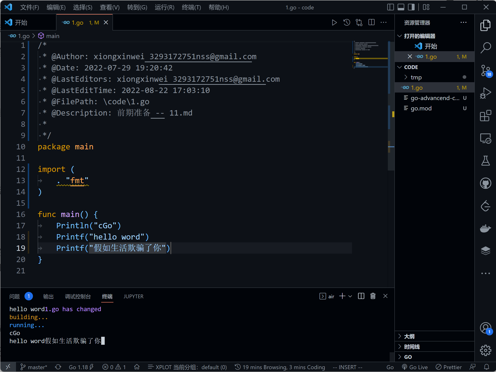
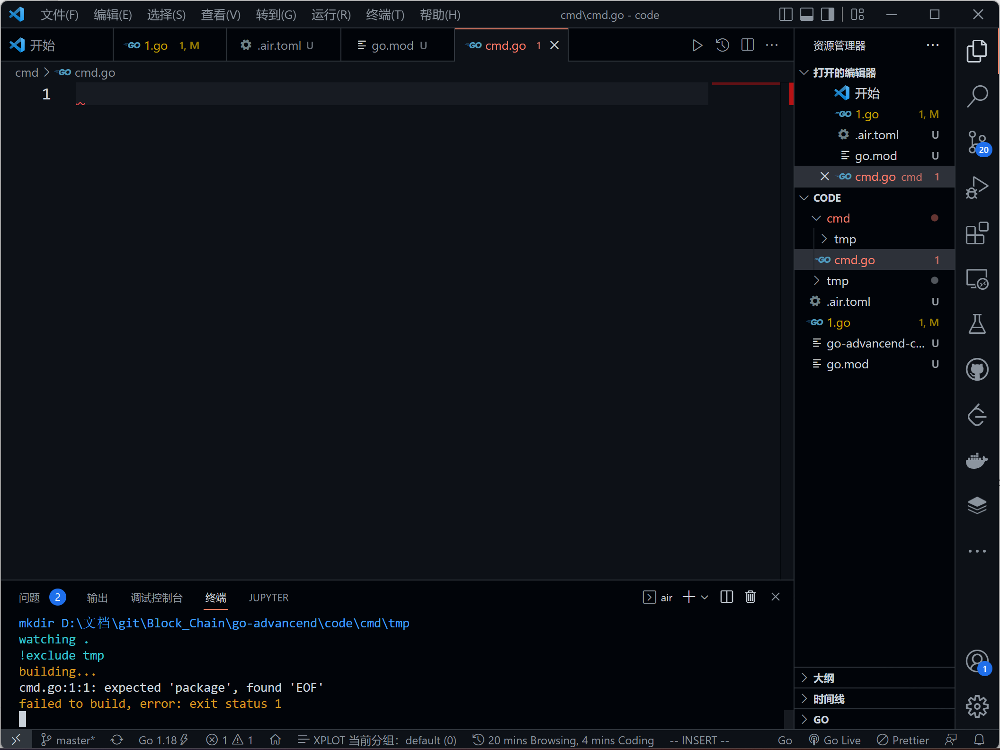

+ [author](https://github.com/3293172751)

# 第10节 go air实现项目热加载

+ [回到目录](../README.md)
+ [上一节](9.md)
> ❤️💕💕Go语言高级篇章,在此之前建议您先了解基础和进阶篇。Myblog:[http://nsddd.top](http://nsddd.top/)
###  **[Go语言基础篇](https://github.com/3293172751/Block_Chain/blob/master/TOC.md)**
###  **[Go语言100篇进阶](https://github.com/3293172751/Block_Chain/blob/master/Gomd_super/README.md)**
---
[TOC]

## 开始准备

**使用window的cmd终端，我们直接使用命令`code .`打开当前文件的vscode**

> 使用`Start .`可以打开文件资源管理器


### Windows安装go air实现项目热加载

Air 是为 Go 应用开发设计的另外一个热重载的命令行工具。只需在你的项目根目录下输入 `air`，然后把它放在一边，专注于你的代码即可。

+ [x] [仓库地址](https://github.com/cosmtrek/air)

**安装air**

```
go get -u github.com/cosmtrek/air
```


## 安装

### 推荐使用 install.sh

```
# binary 文件会是在 $(go env GOPATH)/bin/air
curl -sSfL https://raw.githubusercontent.com/cosmtrek/air/master/install.sh | sh -s -- -b $(go env GOPATH)/bin

# 或者把它安装在 ./bin/ 路径下
curl -sSfL https://raw.githubusercontent.com/cosmtrek/air/master/install.sh | sh -s

air -v
```

P.S. 非常感谢 mattn 的 [PR](https://github.com/cosmtrek/air/pull/1)，使得 Air 支持 Windows 平台。

### 使用 `go install`

使用 Go 的版本为 1.16 或更高:

```
go install github.com/cosmtrek/air@latest
```


### Docker

请拉取这个 Docker 镜像 [cosmtrek/air](https://hub.docker.com/r/cosmtrek/air).

```
docker run -it --rm \
    -w "<PROJECT>" \
    -e "air_wd=<PROJECT>" \
    -v $(pwd):<PROJECT> \
    -p <PORT>:<APP SERVER PORT> \
    cosmtrek/air
    -c <CONF>
```

例如，我的项目之一是在 Docker 上运行的：

```
docker run -it --rm \
    -w "/go/src/github.com/cosmtrek/hub" \
    -v $(pwd):/go/src/github.com/cosmtrek/hub \
    -p 9090:9090 \
    cosmtrek/air
```




## 使用方法

您可以添加 `alias air='~/.air'` 到您的 `.bashrc` 或 `.zshrc` 后缀的文件.

首先，进入你的项目文件夹

```
cd /path/to/your_project
```

最简单的方法是执行

```
# 优先在当前路径查找 `.air.toml` 后缀的文件，如果没有找到，则使用默认的
air -c .air.toml
```

您可以运行以下命令初始化，把默认配置添加到当前路径下的`.air.toml` 文件。

```
air init
```

> 唯一需要讲的地方是在配置文件`.air.toml`中：
>
> ```
>   cmd = "go build -o ./tmp/main.exe ."
> ```
>
> **cmd是可以执行air的目录，即使你`go mod init ”name"` 初始化了，但是也是要加入相对路径的，比如说加入项目根目录下的cmd文件**
>
> ```
>   cmd = "go build -o ./tmp/main.exe ./cmd"
> ```
>
> 

在这之后，你只需执行 `air` 命令，无需添加额外的变量，它就能使用 `.air.toml` 文件中的配置了。

```
air
```

如欲修改配置信息，请参考 [air_example.toml](https://github.com/cosmtrek/air/blob/master/air_example.toml) 文件.


### 运行时参数

您可以通过把变量添加在 air 命令之后来传递参数。

```
# 会执行 ./tmp/main bench
air bench

# 会执行 ./tmp/main server --port 8080
air server --port 8080
```

You can separate the arguments passed for the air command and the built binary with `--` argument.

```
# 会运行 ./tmp/main -h
air -- -h

# 会使用个性化配置来运行 air，然后把 -h 后的变量和值添加到运行的参数中
air -c .air.toml -- -h
```

### Docker-compose

```
services:
  my-project-with-air:
    image: cosmtrek/air
    # working_dir value has to be the same of mapped volume
    working_dir: /project-package
    ports:
      - <any>:<any>
    environment:
      - ENV_A=${ENV_A}
      - ENV_B=${ENV_B}
      - ENV_C=${ENV_C}
    volumes:
      - ./project-relative-path/:/project-package/
```

### 调试

运行 `air -d` 命令能打印所有日志。

## Q&A

### 遇到 "command not found: air" 或 "No such file or directory" 该怎么办？

```
export GOPATH=$HOME/xxxxx
export PATH=$PATH:$GOROOT/bin:$GOPATH/bin
export PATH=$PATH:$(go env GOPATH)/bin <---- 请确认这行在您的配置信息中！！！
```

## 部署

请注意：这需要 Go 1.16+ ，因为我使用 `go mod` 来管理依赖。

```
# 1. 首先复刻（fork）这个项目

# 2. 其次克隆（clone）它
mkdir -p $GOPATH/src/github.com/cosmtrek
cd $GOPATH/src/github.com/cosmtrek
git clone git@github.com:<YOUR USERNAME>/air.git

# 3. 再次安装依赖
cd air
make ci

# 4. 这样就可以快乐地探索和玩耍啦！
make install
```

顺便说一句: 欢迎 PR~

### 发布新版本

```
# 1. checkout 到 master 分支
git checkout master

# 2. 添加需要发布的版本号
git tag v1.xx.x

# 3. 推送到远程
git push origin v1.xx.x

ci 会加工和处理，然后会发布新版本。等待大约五分钟，你就能获取到新版本了。
```


## END 链接
+ [回到目录](../README.md)
+ [上一节](9.md)
+ [下一节](11.md)
---
+ [参与贡献❤️💕💕](https://github.com/3293172751/Block_Chain/blob/master/Git/git-contributor.md)