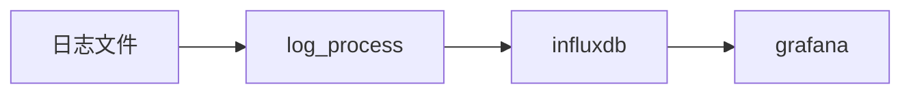

+ [author](https://github.com/3293172751)

# 第2节 Go并发编程–日志分析系统介绍

+ [回到目录](../README.md)
+ [上一节](1.md)
> ❤️💕💕Go语言高级篇章,在此之前建议您先了解基础和进阶篇。Myblog:[http://nsddd.top](http://nsddd.top/)
>
> ###  **[Go语言基础篇](https://github.com/3293172751/Block_Chain/blob/master/TOC.md)**
>
> ###  **[Go语言100篇进阶](https://github.com/3293172751/Block_Chain/blob/master/Gomd_super/README.md)**
---
[TOC]

> 到这里默认你满足了高级篇的学习条件，如果你还没有满足，可以移步到基础篇
>
> 如果你一定要学习，又没有安装Go语言环境，[可以来这里](https://tour.golang.org/welcome/1)

---

### 参考链接

+ [并发学习](https://github.com/3293172751/Block_Chain/blob/master/markdown/%E5%B9%B6%E5%8F%91.md)
+ [操作系统学习](https://github.com/3293172751/os)

**项目会完整发布到GitHub仓库，有需要的可以在GitHub上面⭐收藏，fock进行贡献**

+ [GitHub项目地址](https://github.com/3293172751/log-monitoring)

---

Golang是一门简单高效的编程语言，我在编写学习的过程中也被其特性所吸引，日志监控系统是生产环境中必备的功能系统，它的作用可以说仅次于核心系统 而Golang的协程实现可以很好的帮我们完成这一核心功能，通过模拟读取nginx输出的日志文件，使用log_proccess.go进行实时读取解析写入到influxdb存储， 再由grafana进行实时展现。mock_data.go是我用于模拟日志输出的一个应用程序。

**下面是我们的开发流程图**



> Golang的并发实现可以通过goroutine执行，而多个goroutine间的数据同步与通信则是channel，且多个channel可以选择数据的读取与写入。 这里需要认真理解下并发与并行。并发：指同一时刻，系统通过调度，来回切换交替的运行多个任务，“看起来”是同时进行；并行：指同一时刻， 两个任务“真正的”同时进行；


### 日志分析系统实战

**1、系统架构设计**

**2、读取模块的实现**

+ 打开文件

+ 从文件末尾开始逐行读取

+ 写入Read Channel

**3、解析模块的实现**

+ 从Read Channel中读取每行日志数据

+ 正则提取所需的监控数据（path、status、method等）

+ 写入Write Channel

**4、写入模块的实现**

+ 初始化influxdb client

+ 从Write Channel中读取监控数据

+ 构造数据并写入influxdb

**5、绘制监控图**

+ 用grafana

**6、监控模块的实现**

+ 总处理日志行数

+ 系统吞出量

+ read channel长度

+ write channel长度

+ 运行总时间


### 常见的并发模型

+ 进程&线程（Apache)    —C10k
+ 异步非阻塞（Nginx，libevent，NodeJS)    —复杂度高
+ 协程（**Golang**，Erlang，Lua)    —比线程更轻量、更高效


### Golang并发实现

+ **程序并发执行（goroutine)**
+ **多个goroutine之间的数据同步和通信（channels)**
+ **多个channel选择数据读取或者写入（select）**


#### 1. goroutine

```
foo()  	//执行函数foo，程序等待函数foo返回
go foo()   //执行函数foo  @2
bar()  //不用等待foo返回（协程）并发执行--不会阻塞
```

**此时引入了一个问题，在@2中程序是怎么在多个goroutine之间通信的呢？**


#### 2. channels

```go
c := make(chan string)   //创建一个channel
go func(){
    time.Sleep(1*time.Second)
    c <- "message from closure"   //发送数据到channel中
}()
msg := <-c   //阻塞直到接收到数据
```


#### 3. Select

**select从多个channel中读取或者写入数据**

```go
select {
case v := <- c1:  //if c1 has date 
    println("channel 1 sends",v)
case v:= <- c2:
    println("channel 2 sends",v)
default:
    println("neither channel was ready")
}
```


### Influxdb简介

Influxdb是一个开源的时序性的数据库，使用Go语言编写，被广泛应用于存储系统的监控数据，IoT行业的实时数据等场景。有以下特性：

+ 部署简单，无外部依赖

+ 内置http支持，使用http读写

+ 类sql的灵活查询（max，min，sum等）


## END 链接

+ [回到目录](../README.md)
+ [上一节](1.md)
+ [下一节](3.md)
---
+ [参与贡献❤️💕💕](https://github.com/3293172751/Block_Chain/blob/master/Git/git-contributor.md)