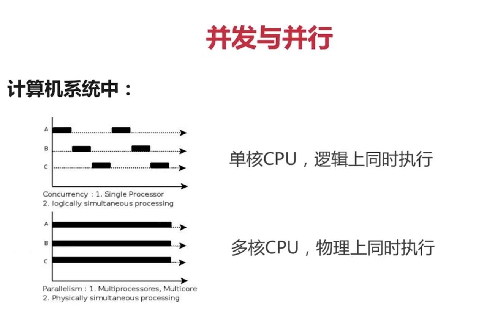

+ [author](https://github.com/3293172751)

# 第3节 并发与并行

+ [回到目录](../README.md)
+ [上一节](2.md)
> ❤️💕💕Go语言高级篇章,在此之前建议您先了解基础和进阶篇。Myblog:[http://nsddd.top](http://nsddd.top/)
> ###  **[Go语言基础篇](https://github.com/3293172751/Block_Chain/blob/master/TOC.md)**
>
> ###  **[Go语言100篇进阶](https://github.com/3293172751/Block_Chain/blob/master/Gomd_super/README.md)**
---
[TOC]

+ [并发介绍](https://github.com/3293172751/Block_Chain/blob/master/markdown/%E5%B9%B6%E5%8F%91.md)

### 并发和并行关系

**1. 多线程程序在单核上运行，就是并发**

- 从微观上看，一个时间段只有一个程序在执行

**2. 多线程程序在多核上运行，就是并行**

- Go语言支持并行，因为并行的速度更快，在多个CPU上同时进行

**在我们的日志监控系统中，对于log_process是可以把每一个模块都独立出来的**

+ 实时读取
+ 解析
+ 写入

**我们的goroutine是并发的执行呢，还是并行的执行呢~**

goroutinue，本质上就是协程。但也存在两点不同：

+ goroutine可以实现并行，也就是说，多个协程可以在多个处理器上跑。而协程同一时刻只能在一个处理器上跑（把宿主语言想象成单线程就好了）。

+ goroutine之间通信是通过channel，而协程通信时通过yield和resume()操作。

**每个进程中的内存：**

1. 地址空间
2. 全局变量
3. 打开文件
4. 子进程
5. 即将发生的定时器
6. 信号与信号处理程序
7. 账户信息

**每个线程中的内容：**

1. 程序计数器（记录要执行的哪条指令）
2. 寄存器 （保存线程当前的工作变量）
3. 堆栈（唯一堆栈，来记录执行历史）
4. 状态

**由于线程具有进程的某些性质，所以有时被称为轻量级线程，多线程**

##### 线程与进程的区别可以归纳为以下4点：

1. 地址空间和其它资源（如打开文件）：进程间相互独立，同一进程的各线程间共享。某进程内的线程在其它进程不可见。 

2. 通信：进程间通信IPC，线程间可以直接读写进程数据段（如全局变量）来进行通信——需要进程同步和互斥手段的辅助，以保证数据的一致性。 

3. 调度和切换：线程上下文切换比进程上下文切换要快得多。 

4. 在多线程OS中，进程不是一个可执行的实体。

## END 链接

+ [回到目录](../README.md)
+ [上一节](2.md)
+ [下一节](4.md)
---
+ [参与贡献❤️💕💕](https://github.com/3293172751/Block_Chain/blob/master/Git/git-contributor.md)