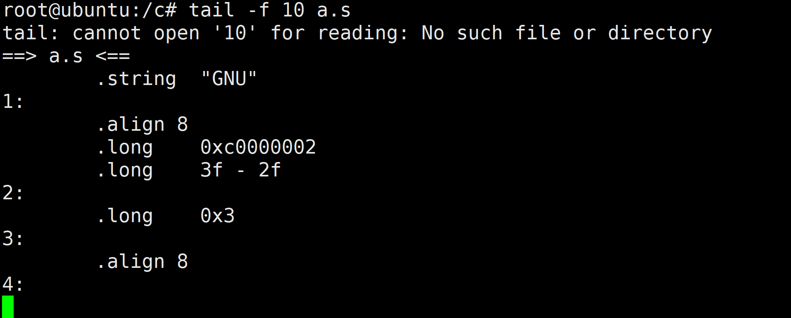
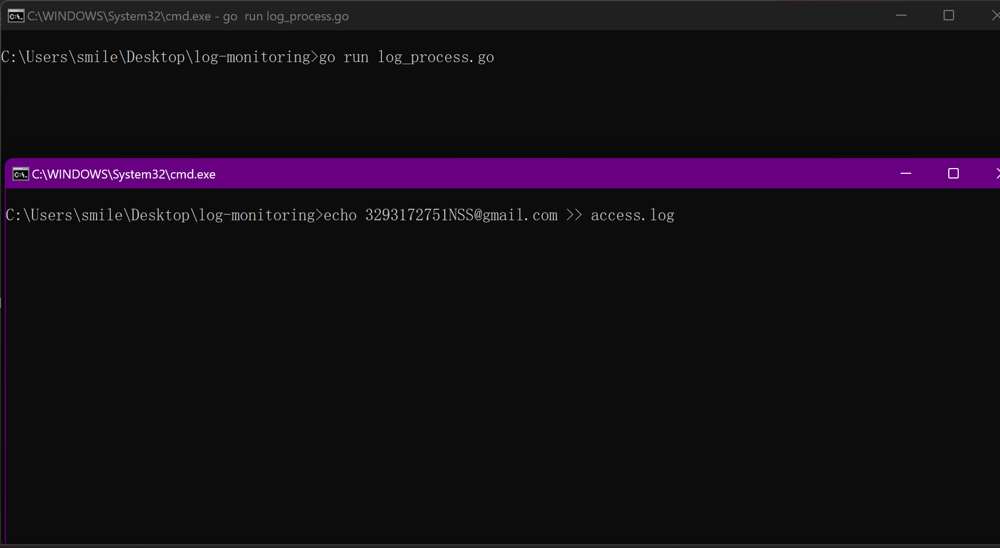
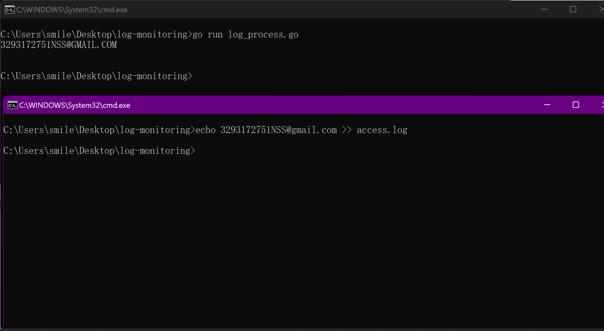
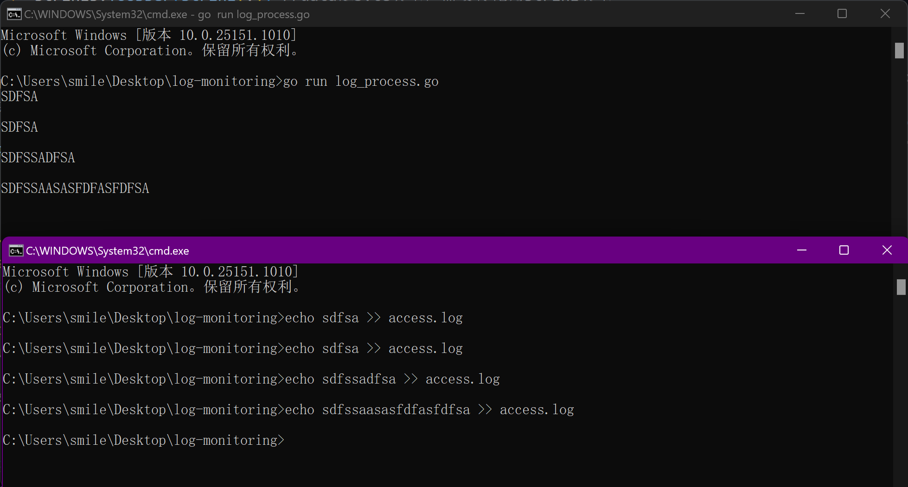

+ [author](https://github.com/3293172751)

# 第5节 读取模块的构建

+ [回到目录](../README.md)
+ [上一节](4.md)
> ❤️💕💕Go语言高级篇章,在此之前建议您先了解基础和进阶篇。Myblog:[http://nsddd.top](http://nsddd.top/)
###  **[Go语言基础篇](https://github.com/3293172751/Block_Chain/blob/master/TOC.md)**
###  **[Go语言100篇进阶](https://github.com/3293172751/Block_Chain/blob/master/Gomd_super/README.md)**
---
[TOC]

### 读取模块的实现

1. 打开文件
2. 从文件的末尾开始逐行读取
3. 写入Read channel

**可以想象Linux中我们常用的命令**

```
tail -f 10 a.s 
```




### 读取模块测试



**往文件中输入内容**



**在模块中，使用循环不断地进行输出和解析的时候，可以用range直接读取的方法**

```
for v := range l.rc {
	l.wc <- strings.ToUpper(string(v)) //data是byte类型，需要转化为string类型
}
```



**去掉最后的换行符**

```
rc <- line[:len(line)-1] //数据的流向
```

+ 去掉最后的换行符，此时我们可以用切片，从前往后，最后一位换行符-1去掉就好了


## END 链接

+ [回到目录](../README.md)
+ [上一节](4.md)
+ [下一节](6.md)
---
+ [参与贡献❤️💕💕](https://github.com/3293172751/Block_Chain/blob/master/Git/git-contributor.md)