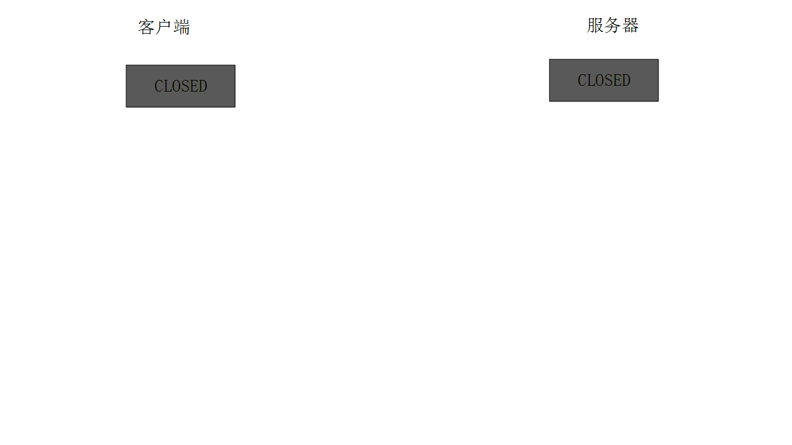

+ [author](https://github.com/3293172751)

# 第12节 TCP通信流程

+ [回到目录](../README.md)
+ [回到项目首页](../../README.md)
+ [上一节](11.md)
> ❤️💕💕计算机网络--TCP/IP 学习。Myblog:[http://nsddd.top](http://nsddd.top/)
---
[TOC]

## TCP通信流程

TCP 是一个面向连接的，安全的，流式传输协议，这个协议是一个传输层协议。

- 面向连接：是一个双向连接，通过三次握手完成，断开连接需要通过四次挥手完成。
- 安全：tcp 通信过程中，**会对发送的每一数据包都会进行校验**，如果发现数据丢失，会自动重传
- 流式传输：发送端和接收端处理数据的速度，数据的量都可以不一致

**三次握手：通信时必须先启动服务器**


**四次挥手断开连接，客户端和服务器谁先断开都一样的。**

**动图：**




## 服务器端通信流程

1. 创建用于监听的套接字，这个套接字是一个文件描述符

   ```
   int lfd = socket();
   ```

2. 将得到的监听的文件描述符和本地的 IP 端口进行绑定

   ```
   bind();
   ```

3. 设置监听 (成功之后开始监听，监听的是客户端的连接)

   ```
   listen();
   ```

4. 等待并接受客户端的连接请求，建立新的连接，会得到一个新的文件描述符 (通信的)，`没有新连接请求就阻塞`

   + 默认情况下没有新的连接是阻塞的
   + 有连接后就会接触阻塞，并且建立一个新的连接，每次只能建立一次连接
   + 如果要建立多个客户端的连接，就需要写多次（放到`for`循环里面，每次循环建立一次新的连接）

   ```
   int cfd = accept();
   ```

5. 通信，读写操作默认都是阻塞的

   ```c
   //接收数据
   read(); / recv();
   
   //发送数据
   write(); / send();
   ```

6. 断开连接，关闭套接字（四次挥手，谁先调用`close()`函数谁先进行前两次挥手）

   ```
   close();
   ```


### 文件描述符

在 tcp 的服务器端，有两类文件描述符

- 监听的文件描述符
  - 只需要有一个
  - 不负责和客户端通信，负责检测客户端的连接请求，检测到之后调用 `accept` 就可以建立新的连接
- 通信的文件描述符
  - 负责和建立连接的客户端通信
  - 如果有 N 个客户端和服务器建立了新的连接，通信的文件描述符就有 N 个，每个客户端和服务器都对应一个通信的文件描述符


- 文件描述符对应的内存结构：
  - 一个文件文件描述符对应两块内存, 一块内存是读缓冲区, 一块内存是写缓冲区
  - 读数据: `通过文件描述符将内存中的数据读出, 这块内存称之为读缓冲区`
  - 写数据: `通过文件描述符将数据写入到某块内存中, 这块内存称之为写缓冲区`
- 监听的文件描述符:
  - 客户端的连接请求会发送到服务器端监听的文件描述符的读缓冲区中
  - 读缓冲区中有数据，说明有新的客户端连接
  - 调用 `accept ()` 函数，这个函数会检测监听文件描述符的读缓冲区
    - 检测不到数据，该函数阻塞
    - 如果检测到数据，解除阻塞，新的连接建立

- 通信的文件描述符:
  - 客户端和服务器端都有通信的文件描述符
  - 发送数据：调用函数 write () /send ()，数据会传送到写缓冲区中，内核检测到写缓冲区有数据，就自动将数据发送给对方。数据进入到内核中
    - 数据并没有被发送出去，而是将数据写入到了通信的文件描述符对应的写缓冲区中
    - 内核检测到通信的文件描述符写缓冲区中有数据，内核会将数据发送到网络中
  - 接收数据：调用的函数 read () /recv (), 从内核读数据
    - 数据如何进入到内核程序猿不需要处理，数据进入到通信的文件描述符的读缓冲区中
    - 数据进入到内核，必须使用通信的文件描述符，将数据从读缓冲区中读出即可

基于 tcp 的服务器端通信代码:

```c
#include <stdio.h>
#include <stdlib.h>
#include <unistd.h>
#include <string.h>
#include <arpa/inet.h>

int main()
{
    //1. 创建监听的套接字
    int fd = socket(AF_INET, SOCK_STREAM, 0);
    if(fd == -1)
    {
        perror("socket");
        exit(0);
        //return -1;
    }
    
    //2. 绑定本地的IP,port
    struct sockaddr_in addr;
    addr.sin_family = AF_INET;
    addr.sin_port = htons(10000);   //转化为大端 -- 后面是指定的端口（不能被占用一般5000以上）
    
    addr.sin_addr.s_addr = INADDR_ANY;  //宏对应ip0：0.0.0.0可以绑定本地任意一个地址

    int ret = bind(lfd, (struct sockaddr*)&addr, sizeof(addr));
    if(ret == -1)
    {
        perror("bind");
        exit(0);
    }

    //3. 设置监听
    ret = listen(lfd, 128);
    if(ret == -1)
    {
        perror("listen");
        exit(0);
    }

    
    struct sockaddr_in cliaddr;
    int clilen = sizeof(cliaddr);
    int cfd = accept(lfd, (struct sockaddr*)&cliaddr, &clilen);
    if(cfd == -1)
    {
        perror("accept");
        exit(0);
    }
    
    char ip[24] = {0};
    printf("客户端的IP地址: %s, 端口: %d\n",
           inet_ntop(AF_INET, &cliaddr.sin_addr.s_addr, ip, sizeof(ip)),
           ntohs(cliaddr.sin_port));

    
    while(1)
    {
        
        char buf[1024];
        memset(buf, 0, sizeof(buf));
        int len = read(cfd, buf, sizeof(buf));
        if(len > 0)
        {
            printf("客户端say: %s\n", buf);
            write(cfd, buf, len);
        }
        else if(len  == 0)
        {
            printf("客户端断开了连接...\n");
            break;
        }
        else
        {
            perror("read");
            break;
        }
    }

    close(cfd);
    close(lfd);

    return 0;
}
```


## 客户端的通信流程

在单线程的情况下客户端通信的文件描述符有一个，没有监听的文件描述符

1. 创建一个通信的套接字

   > 不管是客户端或者服务器端，都需要创建套接字

   ```
   int cfd = socket();
   ```

2. 连接服务器，**需要知道服务器绑定的 IP 和端口**

   ```
   connect();
   ```

3. 通信

   ```c
   read(); / recv();
   
   write(); / send();
   ```

4. 断开连接，关闭文件描述符 (套接字)

   ```
   close();
   ```


**在客户端中使用connect之前不需要使用到bind绑定端口，这是因为服务器端先启动，需要绑定一个固定的IP和端口发送请求,而在客户端则是随即绑定的端口和客户端IP**

+ 如果要指定客户端固定的端口，则需要在套接字上进行绑定（一般情况不需要手动绑定–服务器不需要主动连接客户端）


基于 tcp 通信的客户端通信代码:

```c
#include <stdio.h>
#include <stdlib.h>
#include <unistd.h>
#include <string.h>
#include <arpa/inet.h>

int main()
{
    
    int fd = socket(AF_INET, SOCK_STREAM, 0);
    if(fd == -1)
    {
        perror("socket");
        exit(0);
    }

    
    struct sockaddr_in addr;
    addr.sin_family = AF_INET;
    addr.sin_port = htons(10000);   
    inet_pton(AF_INET, "192.168.237.131", &addr.sin_addr.s_addr);

    int ret = connect(fd, (struct sockaddr*)&addr, sizeof(addr));
    if(ret == -1)
    {
        perror("connect");
        exit(0);
    }

    
    int number = 0;
    while(1)
    {
        
        char buf[1024];
        sprintf(buf, "你好, 服务器...%d\n", number++);
        write(fd, buf, strlen(buf)+1);
        
        
        memset(buf, 0, sizeof(buf));
        int len = read(fd, buf, sizeof(buf));
        if(len > 0)
        {
            printf("服务器say: %s\n", buf);
        }
        else if(len  == 0)
        {
            printf("服务器断开了连接...\n");
            break;
        }
        else
        {
            perror("read");
            break;
        }
        sleep(1);   
    }

    close(fd);
    return 0;
}
```

在 Window 中也提供了套接字通信的 API，这些 API 函数与 Linux 平台的 API 函数几乎相同，以至于很多人认为套接字通信的 API 函数库只有一套，下面来看一下这些 Windows 平台的套接字函数：


## API函数

```bash
root@ubuntu:/# man socket
SOCKET(2)         Linux Programmer's Manual         SOCKET(2)

NAME
       socket - create an endpoint for communication

SYNOPSIS
       #include <sys/types.h>          /* See NOTES */
       #include <sys/socket.h>

       int socket(int domain, int type, int protocol);
......
 Name         Purpose                                    Man page
       AF_UNIX      Local communication                        unix(7)
       AF_LOCAL     Synonym for AF_UNIX
       AF_INET      IPv4 Internet protocols                    ip(7)
       AF_AX25      Amateur radio AX.25 protocol               ax25(4)
       AF_IPX       IPX - Novell protocols
       AF_APPLETALK AppleTalk                                  ddp(7)
       AF_X25       ITU-T X.25 / ISO-8208 protocol             x25(7)
       AF_INET6     IPv6 Internet protocols                    ipv6(7)
       AF_DECnet    DECet protocol sockets
       AF_KEY       Key  management protocol, originally de‐
                    veloped for usage with IPsec

```

> 不管是IP还是端口，我们都需要将小端转化为大端保存到结构体中

**连接**

```bash
root@ubuntu:/# man socket
NAME
       socket - create an endpoint for communication
SYNOPSIS
       #include <sys/types.h>          /* See NOTES */
       #include <sys/socket.h>

       int socket(int domain, int type, int protocol);
```


## END 链接

+ [回到目录](../README.md)
+ [上一节](11.md)
+ [下一节](13.md)
---
+ [参与贡献❤️💕💕](https://github.com/3293172751/CS_COURSE/blob/master/Git/git-contributor.md)
