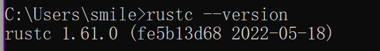

+ [author](https://github.com/3293172751)

# 第1节 环境搭建

+ [回到目录](../README.md)
+ [回到项目首页](../../README.md)
> ❤️💕💕Rust学习篇章。Myblog:[http://nsddd.top](http://nsddd.top/)
---
[TOC]

## window安装rust

# Rust for Windows

Rust 支持主流的操作系统，Linux,Mac和 Windows。

Rust在Windows上的安装和你在windows上安装其它软件一样。

### 1、下载安装包：

[下载地址](https://www.rust-lang.org/zh-CN/other-installers.html)

Rust提供了多个版本和多个平台的安装包，下载对应的即可，此处我们以[1.6.0](https://static.rust-lang.org/dist/rust-1.6.0-x86_64-pc-windows-gnu.msi)的稳定版为例。

### 2、安装：

双击下载到的安装包，如下图所示：


默认，rust将安装到所有用户下，选择“Advanced”，可以指定安装用户和安装路径。然后点击”install”等待几分钟即可（中间可能会有安全提示，点击允许即可，如果你装了360之类的，需要小心360阻止写入注册表）。

### 3.验证安装：

安装完成后，运行windows命令行，然后输入:

```
rustc --version
```



看到 以 **rustc 1.6.0** 开头，说明你安装成功了。

**注意**

中国科学技术大学镜像源包含 [rust-static](http://mirrors.ustc.edu.cn/rust-static/)，梯子暂时出问题的同学可以尝试从这里下载编译器；除此之外。还有 Crates 源，详见[这里的说明](https://servers.ustclug.org/2016/01/mirrors-add-rust-crates/)。


## 版本管理工具–rustup

rustup 是rust官方的版本管理工具。应当作为安装 Rust 的首选。

项目主页是: https://github.com/rust-lang-nursery/rustup.rs


`rustup`在 Windows 上的工作方式与在 Unix 上的工作方式相同，但对于 Windows 上的 Rust 开发人员有一些特殊的考虑。如[Rust 下载页面所述](https://www.rust-lang.org/tools/install?platform_override=win)，Windows 上使用了两种[ABI ： ](https://en.wikipedia.org/wiki/Application_binary_interface)[Visual Studio](https://visualstudio.microsoft.com/visual-cpp-build-tools/)使用的本机 (MSVC) ABI和[GCC 工具链](https://gcc.gnu.org/)使用的 GNU ABI 。您需要哪个版本的 Rust 在很大程度上取决于您想要与之互操作的 C/C++ 库：对于与 Visual Studio 生成的软件的互操作，请使用 Rust 的 MSVC 构建；[要与使用MinGW/MSYS2 工具链](https://msys2.github.io/)构建的 GNU 软件互操作，请使用 GNU 构建。

以 MSVC ABI 为目标时，Rust 还需要[安装 Visual Studio 2013（或更高版本）或 Visual C++ Build Tools 2019](https://visualstudio.microsoft.com/downloads/)，以便 `rustc`使用其链接器和库。Visual C++ 构建工具需要 Visual Studio 许可证（社区版、专业版或企业版）。

对于 Visual Studio，请务必选中“C++ 工具”和“Windows 10 SDK”选项。基本使用 GNU 构建不需要额外的软件安装。

默认情况下，在 Windows 上将 Rust 配置为以 MSVC ABI 为目标，`rustup`即目标三元组`i686-pc-windows-msvc`， 取决于主机 Windows 操作系统的 CPU 架构。除非通过工具链规范另有说明，否则选择安装的工具 [链](https://rust-lang.github.io/rustup/concepts/toolchains.html#toolchain-specification)将被编译为在该目标三重主机上运行，并且默认以该三重主机为目标。`x86_64-pc-windows-msvc``aarch64-pc-windows-msvc``rustup`

`rustup set default-host`您可以在安装过程中或在安装过程中更改此行为。

例如，要显式选择 32 位 MSVC 主机：

```console
$ rustup set default-host i686-pc-windows-msvc
```

或者选择 64 位 GNU 工具链：

```console
$ rustup set default-host x86_64-pc-windows-gnu
```

由于 MSVC ABI 提供与其他 Windows 软件的最佳互操作性，因此建议用于大多数用途。GNU 工具链始终可用，即使您默认不使用它。只需安装它`rustup toolchain install`：

```console
$ rustup toolchain install stable-gnu
```

不过，您不需要切换工具链来支持所有 Windows 目标；单个工具链支持所有四个 x86 Windows 目标：

```console
$ rustup target add x86_64-pc-windows-msvc
$ rustup target add x86_64-pc-windows-gnu
$ rustup target add i686-pc-windows-msvc
$ rustup target add i686-pc-windows-gnu
```

有关使用相同编译器指定不同目标的更多详细信息，请参阅[交叉编译](https://rust-lang.github.io/rustup/cross-compilation.html)一章。


### 安装tustup步骤

> 选择自定义安装

```bash
If you will be targeting the GNU ABI or otherwise know what you are
doing then it is fine to continue installation without the build
tools, but otherwise, install the C++ build tools before proceeding.

Continue? (y/N) y


Welcome to Rust!

This will download and install the official compiler for the Rust
programming language, and its package manager, Cargo.

Rustup metadata and toolchains will be installed into the Rustup
home directory, located at:

  C:\Users\smile\.rustup

This can be modified with the RUSTUP_HOME environment variable.

The Cargo home directory located at:

  C:\Users\smile\.cargo

This can be modified with the CARGO_HOME environment variable.

The cargo, rustc, rustup and other commands will be added to
Cargo's bin directory, located at:

  C:\Users\smile\.cargo\bin

This path will then be added to your PATH environment variable by
modifying the HKEY_CURRENT_USER/Environment/PATH registry key.

You can uninstall at any time with rustup self uninstall and
these changes will be reverted.

Current installation options:


   default host triple: x86_64-pc-windows-msvc
     default toolchain: stable (default)
               profile: default
  modify PATH variable: yes

1) Proceed with installation (default)
2) Customize installation
3) Cancel installation
>2

I'm going to ask you the value of each of these installation options.
You may simply press the Enter key to leave unchanged.

Default host triple? [x86_64-pc-windows-msvc]


Default toolchain? (stable/beta/nightly/none) [stable]
nightly

Profile (which tools and data to install)? (minimal/default/complete) [default]
minimal

Modify PATH variable? (Y/n)
y


Current installation options:


   default host triple: x86_64-pc-windows-msvc
     default toolchain: nightly
               profile: minimal
  modify PATH variable: yes

1) Proceed with installation (default)
2) Customize installation
3) Cancel installation
>1
```


## END 链接

+ [回到目录](../README.md)
+ [下一节](2.md)
---
+ [参与贡献❤️💕💕](https://github.com/3293172751/Block_Chain/blob/master/Git/git-contributor.md)