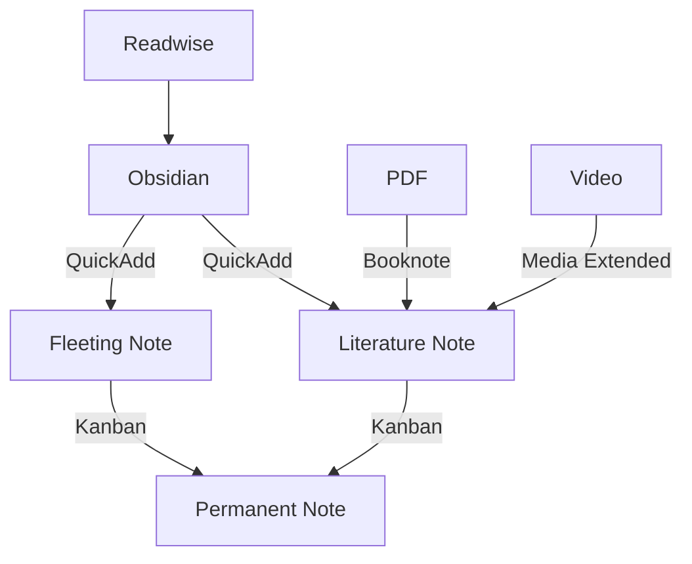

# 引言
欢迎使用这个模板库, 这个库的目的是为了能够给新接触obsidian的用户一个开箱即用的库. 通过这种方式我希望可以能够帮助大家可以减少去筛选插件的过程. 其实有很多的插件是都可以作为核心插件加入到obsidian中的, 但是obsidian的开发者为了不抢占插件开发者的功劳所以没有这样做. 但是这样做的坏处还是一定程度上增大了新手入门obsidian的难度. 所有这个库里面的设计都是为了可以去实践卡片盒笔记法而构造的. 希望这个库可以帮助到更多的人减少入门obsidian的门槛.

# 工作流

# 插件
点击进入下面的插件页面来查看具体的使用方法

## 便捷
- [[QuickAdd]]
- [[Templater]]
- [[Calendar]]

## 多媒体
- [[Booknote]]
- [[Kanban]]
- [[Media Extended]]
- [[MetaEdit]]
- [[Readwise]]

## 美化
- [[Style Setting]]

